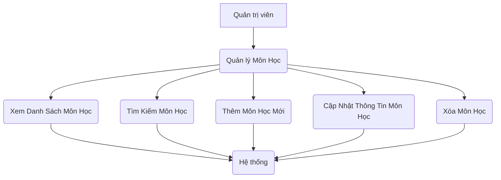

Chào bạn,

Với vai trò là Business Analyst cấp cao của hệ thống ONENET, tôi đã tiếp nhận yêu cầu nghiệp vụ về tính năng "Quản lý Môn Học" và thực hiện phân tích chi tiết. Dưới đây là tài liệu BRD được tạo ra theo đúng các quy tắc và định dạng đã thống nhất.

---

# Business Requirements Document - Quản Lý Môn Học

**Mã Tính năng:** QUAN-20260530-2250
**Tên Tính năng:** Quản Lý Môn Học
**Dự án:** quanlyhocsinh
**Ngày:** 2026-05-30
**Phiên bản:** 1.0
**Tác giả:** BA Cấp cao ONENET

---

## 1. Giới thiệu

Tài liệu này mô tả các yêu cầu nghiệp vụ cho tính năng "Quản lý Môn Học" trong hệ thống `quanlyhocsinh`. Tính năng này cho phép người dùng có quyền quản trị thực hiện các thao tác CRUD (Tạo, Đọc, Cập nhật, Xóa) đối với danh sách các môn học, cùng với chức năng tìm kiếm và phân trang để hỗ trợ quản lý hiệu quả.

Mục tiêu chính là cung cấp một giao diện và bộ API mạnh mẽ, dễ sử dụng để duy trì dữ liệu môn học, đảm bảo tính nhất quán và chính xác của thông tin, phục vụ cho các quy trình nghiệp vụ liên quan đến giáo trình, đăng ký học phần và quản lý điểm số sau này.

## 2. Bối cảnh nghiệp vụ

Hệ thống `quanlyhocsinh` hiện tại cần một module để quản lý thông tin về các môn học được giảng dạy. Việc quản lý môn học là nền tảng quan trọng cho nhiều nghiệp vụ khác của hệ thống như:
*   Định nghĩa danh mục các môn học để sinh viên có thể đăng ký.
*   Thiết lập các môn học tiên quyết, điều kiện tốt nghiệp.
*   Gán môn học vào các lớp học, kỳ học.
*   Quản lý điểm số cho từng môn học của sinh viên.
*   Tạo báo cáo thống kê liên quan đến các môn học.

Tính năng "Quản lý Môn Học" sẽ giải quyết nhu cầu này bằng cách cung cấp một giao diện tập trung để quản lý tất cả các thông tin cần thiết về một môn học.

## 3. Phạm vi

Phạm vi của tính năng "Quản lý Môn Học" bao gồm:
*   **CRUD Môn học:** Tạo mới, xem danh sách, xem chi tiết, chỉnh sửa thông tin và xóa môn học.
*   **Validation:** Kiểm tra hợp lệ dữ liệu đầu vào khi tạo/cập nhật môn học.
*   **Search:** Tìm kiếm môn học theo nhiều tiêu chí.
*   **Pagination:** Hiển thị danh sách môn học theo trang, hỗ trợ quản lý dữ liệu lớn.

**Không bao gồm trong phạm vi này:**
*   Quản lý giáo viên giảng dạy môn học.
*   Phân công môn học cho lớp học/kỳ học.
*   Tính năng đăng ký môn học cho sinh viên.
*   Quản lý điểm số của sinh viên theo môn học.
*   Quản lý tài liệu môn học.

## 4. Các Actor

*   **Quản trị viên (Administrator):** Là người dùng chính thực hiện các thao tác quản lý môn học.
*   **Hệ thống (System):** Là actor thứ cấp, thực hiện các nghiệp vụ như kiểm tra dữ liệu, lưu trữ, truy xuất thông tin, xử lý phân trang, tìm kiếm.

## 5. Các Use Case

### 5.1. Sơ đồ Use Case (Mô tả khái niệm)

Sơ đồ Use Case dưới đây mô tả các tương tác chính giữa Actor "Quản trị viên" và hệ thống liên quan đến tính năng "Quản lý Môn Học".

### 5.2. Mô tả Use Case Chi tiết

#### UC1: Xem Danh Sách Môn Học

*   **Mô tả:** Cho phép Quản trị viên xem danh sách tất cả các môn học hiện có trong hệ thống, kèm theo thông tin cơ bản và hỗ trợ phân trang.
*   **Actor chính:** Quản trị viên
*   **Luồng chính:**
    1.  Quản trị viên truy cập vào chức năng "Quản lý Môn Học".
    2.  Hệ thống hiển thị danh sách các môn học (mã, tên, số tín chỉ, mô tả, trạng thái) trên giao diện.
    3.  Hệ thống áp dụng phân trang, hiển thị một số lượng môn học nhất định trên mỗi trang.
*   **Luồng thay thế:**
    *   **ALT 1.1: Không có môn học nào:** Nếu không có môn học nào trong hệ thống, hệ thống hiển thị thông báo "Không có môn học nào được tìm thấy."
*   **Điều kiện hậu:** Danh sách môn học được hiển thị thành công.

#### UC2: Thêm Môn Học Mới

*   **Mô tả:** Cho phép Quản trị viên thêm một môn học mới vào hệ thống với các thông tin chi tiết.
*   **Actor chính:** Quản trị viên
*   **Điều kiện tiên quyết:** Quản trị viên đã đăng nhập và có quyền thêm môn học.
*   **Luồng chính:**
    1.  Quản trị viên nhấp vào nút "Thêm Mới" hoặc tương đương trên giao diện quản lý môn học.
    2.  Hệ thống hiển thị một form nhập liệu trống.
    3.  Quản trị viên điền các thông tin cần thiết (Mã môn học, Tên môn học, Mô tả, Số tín chỉ, Trạng thái).
    4.  Quản trị viên nhấp vào nút "Lưu".
    5.  Hệ thống thực hiện kiểm tra validation dữ liệu.
    6.  Nếu dữ liệu hợp lệ, hệ thống tạo mới môn học và lưu vào cơ sở dữ liệu.
    7.  Hệ thống hiển thị thông báo "Thêm môn học thành công" và chuyển về trang danh sách môn học đã cập nhật.
*   **Luồng thay thế:**
    *   **ALT 2.1: Dữ liệu không hợp lệ:** Nếu dữ liệu không vượt qua kiểm tra validation (VD: trường bắt buộc bị trống, mã môn học đã tồn tại), hệ thống hiển thị thông báo lỗi tương ứng bên cạnh trường dữ liệu không hợp lệ. Quản trị viên có thể sửa lại hoặc hủy bỏ.
    *   **ALT 2.2: Hủy bỏ thao tác:** Quản trị viên nhấp vào nút "Hủy" tại bất kỳ bước nào trong quá trình nhập liệu. Hệ thống đóng form và quay trở lại trang danh sách môn học mà không lưu thay đổi.
*   **Điều kiện hậu:** Môn học mới được thêm thành công vào hệ thống.

#### UC3: Cập Nhật Thông Tin Môn Học

*   **Mô tả:** Cho phép Quản trị viên chỉnh sửa thông tin của một môn học đã tồn tại trong hệ thống.
*   **Actor chính:** Quản trị viên
*   **Điều kiện tiên quyết:** Quản trị viên đã đăng nhập và có quyền cập nhật môn học.
*   **Luồng chính:**
    1.  Quản trị viên truy cập trang danh sách môn học và chọn một môn học cần chỉnh sửa.
    2.  Quản trị viên nhấp vào nút "Sửa" hoặc biểu tượng chỉnh sửa tương ứng với môn học đó.
    3.  Hệ thống hiển thị form nhập liệu với thông tin hiện tại của môn học được điền sẵn.
    4.  Quản trị viên thực hiện chỉnh sửa các thông tin cần thiết.
    5.  Quản trị viên nhấp vào nút "Lưu".
    6.  Hệ thống thực hiện kiểm tra validation dữ liệu.
    7.  Nếu dữ liệu hợp lệ, hệ thống cập nhật thông tin môn học vào cơ sở dữ liệu.
    8.  Hệ thống hiển thị thông báo "Cập nhật môn học thành công" và chuyển về trang danh sách môn học đã cập nhật.
*   **Luồng thay thế:**
    *   **ALT 3.1: Dữ liệu không hợp lệ:** Tương tự ALT 2.1 của UC Thêm Môn Học Mới.
    *   **ALT 3.2: Hủy bỏ thao tác:** Tương tự ALT 2.2 của UC Thêm Môn Học Mới.
    *   **ALT 3.3: Môn học không tồn tại:** Nếu môn học đã bị xóa bởi người dùng khác hoặc không tồn tại (do lỗi), hệ thống hiển thị thông báo "Môn học không tồn tại hoặc đã bị xóa."
*   **Điều kiện hậu:** Thông tin môn học được cập nhật thành công trong hệ thống.

#### UC4: Xóa Môn Học

*   **Mô tả:** Cho phép Quản trị viên xóa một môn học khỏi hệ thống.
*   **Actor chính:** Quản trị viên
*   **Điều kiện tiên quyết:** Quản trị viên đã đăng nhập và có quyền xóa môn học. Môn học không bị ràng buộc bởi các quy tắc nghiệp vụ (xem BR05).
*   **Luồng chính:**
    1.  Quản trị viên truy cập trang danh sách môn học và chọn một hoặc nhiều môn học cần xóa.
    2.  Quản trị viên nhấp vào nút "Xóa" hoặc biểu tượng xóa tương ứng.
    3.  Hệ thống hiển thị hộp thoại xác nhận "Bạn có chắc chắn muốn xóa môn học này/các môn học này không?".
    4.  Quản trị viên nhấp vào "Xác nhận" (hoặc "Đồng ý").
    5.  Hệ thống thực hiện kiểm tra quy tắc nghiệp vụ (VD: BR05).
    6.  Nếu các quy tắc nghiệp vụ được thỏa mãn, hệ thống xóa môn học khỏi cơ sở dữ liệu.
    7.  Hệ thống hiển thị thông báo "Xóa môn học thành công" và cập nhật lại danh sách môn học.
*   **Luồng thay thế:**
    *   **ALT 4.1: Hủy bỏ thao tác:** Quản trị viên nhấp vào "Hủy" (hoặc "Không") trong hộp thoại xác nhận. Hệ thống đóng hộp thoại và không thực hiện xóa.
    *   **ALT 4.2: Môn học đang được sử dụng:** Nếu môn học vi phạm BR05 (VD: có sinh viên đăng ký), hệ thống từ chối xóa và hiển thị thông báo lỗi "Không thể xóa môn học [Tên Môn Học] vì đang có sinh viên đăng ký."
    *   **ALT 4.3: Môn học không tồn tại:** Tương tự ALT 3.3 của UC Cập Nhật.
*   **Điều kiện hậu:** Môn học được chọn bị xóa thành công khỏi hệ thống.

#### UC5: Tìm Kiếm Môn Học

*   **Mô tả:** Cho phép Quản trị viên tìm kiếm các môn học theo tiêu chí cụ thể.
*   **Actor chính:** Quản trị viên
*   **Luồng chính:**
    1.  Quản trị viên truy cập trang quản lý môn học.
    2.  Quản trị viên nhập từ khóa tìm kiếm vào trường "Tìm kiếm" (VD: theo Mã môn học, Tên môn học).
    3.  Quản trị viên nhấp vào nút "Tìm kiếm".
    4.  Hệ thống xử lý yêu cầu tìm kiếm và hiển thị danh sách các môn học phù hợp với từ khóa đã nhập.
    5.  Hệ thống áp dụng phân trang cho kết quả tìm kiếm.
*   **Luồng thay thế:**
    *   **ALT 5.1: Không tìm thấy kết quả:** Nếu không có môn học nào khớp với từ khóa, hệ thống hiển thị thông báo "Không tìm thấy môn học nào phù hợp."
    *   **ALT 5.2: Xóa từ khóa tìm kiếm:** Quản trị viên xóa từ khóa tìm kiếm (hoặc nhấp vào nút "Đặt lại"). Hệ thống hiển thị lại toàn bộ danh sách môn học.
*   **Điều kiện hậu:** Danh sách môn học được lọc theo tiêu chí tìm kiếm và hiển thị.

## 6. Các Yêu Cầu Chức Năng (Functional Requirements - FRs)

*   **QUAN-20260530-2250-FR01: Hiển thị danh sách môn học.**
    *   **Mô tả:** Hệ thống phải hiển thị danh sách tất cả các môn học hiện có.
    *   **Acceptance Criteria:**
        *   Danh sách phải hiển thị các cột thông tin tối thiểu: "Mã môn học", "Tên môn học", "Mô tả", "Số tín chỉ", "Trạng thái".
        *   Mỗi dòng trong danh sách phải có các hành động "Xem chi tiết", "Sửa", "Xóa".
        *   Danh sách phải được sắp xếp mặc định theo "Tên môn học" (A-Z) hoặc "Mã môn học" (tăng dần).

*   **QUAN-20260530-2250-FR02: Thêm môn học mới.**
    *   **Mô tả:** Hệ thống phải cho phép Quản trị viên thêm một môn học mới.
    *   **Acceptance Criteria:**
        *   Hệ thống phải cung cấp một form nhập liệu với các trường: "Mã môn học" (text input, bắt buộc), "Tên môn học" (text input, bắt buộc), "Mô tả" (textarea, tùy chọn), "Số tín chỉ" (number input, bắt buộc), "Trạng thái" (dropdown: "Đang hoạt động", "Ngừng hoạt động", mặc định "Đang hoạt động").
        *   Khi lưu thành công, hệ thống phải hiển thị thông báo xác nhận và chuyển về trang danh sách.

*   **QUAN-20260530-2250-FR03: Cập nhật thông tin môn học.**
    *   **Mô tả:** Hệ thống phải cho phép Quản trị viên chỉnh sửa thông tin của một môn học đã tồn tại.
    *   **Acceptance Criteria:**
        *   Hệ thống phải hiển thị form chỉnh sửa với dữ liệu hiện tại của môn học được điền sẵn.
        *   Trường "Mã môn học" không được phép chỉnh sửa sau khi môn học đã được tạo.
        *   Các trường còn lại (Tên môn học, Mô tả, Số tín chỉ, Trạng thái) có thể chỉnh sửa.
        *   Khi lưu thành công, hệ thống phải hiển thị thông báo xác nhận và chuyển về trang danh sách.

*   **QUAN-20260530-2250-FR04: Xóa môn học.**
    *   **Mô tả:** Hệ thống phải cho phép Quản trị viên xóa một môn học.
    *   **Acceptance Criteria:**
        *   Trước khi xóa, hệ thống phải hiển thị hộp thoại xác nhận với tùy chọn "Xác nhận" và "Hủy".
        *   Khi xóa thành công, hệ thống phải hiển thị thông báo xác nhận và cập nhật lại danh sách.
        *   Hệ thống phải áp dụng các quy tắc nghiệp vụ về ràng buộc xóa (xem BR05).

*   **QUAN-20260530-2250-FR05: Tìm kiếm môn học.**
    *   **Mô tả:** Hệ thống phải cung cấp chức năng tìm kiếm môn học.
    *   **Acceptance Criteria:**
        *   Cho phép tìm kiếm theo "Mã môn học" và "Tên môn học".
        *   Tìm kiếm phải là tìm kiếm tương đối (chứa chuỗi), không phân biệt chữ hoa/thường.
        *   Hệ thống phải hiển thị kết quả tìm kiếm trên cùng giao diện danh sách, áp dụng phân trang.
        *   Phải có nút "Đặt lại" (Clear Search) để xóa tiêu chí tìm kiếm và hiển thị lại toàn bộ danh sách.

*   **QUAN-20260530-2250-FR06: Phân trang danh sách môn học.**
    *   **Mô tả:** Hệ thống phải hỗ trợ phân trang cho danh sách môn học.
    *   **Acceptance Criteria:**
        *   Mặc định hiển thị 20 môn học trên mỗi trang.
        *   Người dùng có thể thay đổi số lượng mục hiển thị mỗi trang (ví dụ: 10, 20, 50, 100).
        *   Hệ thống phải cung cấp các điều khiển phân trang: "Trang trước", "Trang sau", "Số trang cụ thể", "Trang đầu", "Trang cuối".
        *   Hệ thống phải hiển thị tổng số môn học và số lượng môn học trên trang hiện tại (ví dụ: "Hiển thị 1-20 trên tổng số 150 môn học").

## 7. Các Quy Tắc Nghiệp Vụ (Business Rules - BRs)

*   **QUAN-20260530-2250-BR01: Mã môn học là duy nhất.**
    *   **Mô tả:** Mã môn học phải là duy nhất trong toàn hệ thống. Hệ thống không cho phép tạo hoặc cập nhật môn học với mã đã tồn tại.
    *   **Ví dụ:** Nếu đã có môn học "IT101 - Lập trình cơ bản", người dùng không thể tạo thêm một môn học khác cũng có mã "IT101". Khi cập nhật, một môn học không thể đổi mã thành mã của một môn học khác đang tồn tại.

*   **QUAN-20260530-2250-BR02: Tên môn học không được để trống.**
    *   **Mô tả:** Trường "Tên môn học" là bắt buộc và không được để trống khi tạo mới hoặc cập nhật môn học.
    *   **Ví dụ:** Khi người dùng cố gắng lưu một môn học mà trường "Tên môn học" không có giá trị, hệ thống sẽ hiển thị thông báo lỗi "Tên môn học không được để trống."

*   **QUAN-20260530-2250-BR03: Số tín chỉ phải là số nguyên dương.**
    *   **Mô tả:** Trường "Số tín chỉ" là bắt buộc và phải là một số nguyên dương (>= 1).
    *   **Ví dụ:** Người dùng nhập "0", "-2", "hai" hoặc để trống vào trường "Số tín chỉ", hệ thống sẽ hiển thị thông báo lỗi "Số tín chỉ phải là số nguyên dương."

*   **QUAN-20260530-2250-BR04: Định dạng Mã môn học.**
    *   **Mô tả:** Mã môn học phải là một chuỗi không chứa ký tự đặc biệt, khoảng trắng, và có độ dài tối thiểu 3 ký tự, tối đa 10 ký tự.
    *   **Ví dụ:** Mã "IT101" là hợp lệ. Mã "IT-101" (có dấu gạch ngang), "IT 101" (có khoảng trắng), "IT!" (có ký tự đặc biệt), "I" (quá ngắn), "LapTrinhDiDongNangCao" (quá dài) sẽ bị từ chối.

*   **QUAN-20260530-2250-BR05: Ràng buộc khi xóa môn học.**
    *   **Mô tả:** Không được phép xóa một môn học nếu môn học đó đang được sử dụng trong các nghiệp vụ khác của hệ thống, cụ thể là:
        *   Đang có sinh viên đăng ký môn học đó.
        *   Đã có điểm số được ghi nhận cho môn học đó.
    *   **Ví dụ:** Nếu môn "Toán Cao Cấp 1" đang có 150 sinh viên đã đăng ký học, và 100 sinh viên đã có điểm thi, hệ thống sẽ từ chối yêu cầu xóa môn học này và hiển thị thông báo "Không thể xóa môn học 'Toán Cao Cấp 1' vì đang có sinh viên đăng ký hoặc đã có điểm số."

*   **QUAN-20260530-2250-BR06: Trạng thái mặc định khi thêm mới.**
    *   **Mô tả:** Khi thêm mới một môn học, nếu Quản trị viên không chọn trạng thái cụ thể, hệ thống sẽ tự động gán trạng thái là "Đang hoạt động".
    *   **Ví dụ:** Khi người dùng điền đủ các thông tin khác nhưng bỏ qua lựa chọn "Trạng thái", khi lưu, hệ thống sẽ tạo môn học với trạng thái "Đang hoạt động".

## 8. Các Yêu Cầu Phi Chức Năng (Non-Functional Requirements - NFRs)

*   **Hiệu năng:**
    *   **QUAN-20260530-2250-NFR01:** Tải trang danh sách môn học (với 5000 môn học) phải hoàn thành trong vòng dưới 3 giây.
    *   **QUAN-20260530-2250-NFR02:** Các thao tác thêm, cập nhật, xóa môn học phải phản hồi trong vòng dưới 1 giây.
    *   **QUAN-20260530-2250-NFR03:** Chức năng tìm kiếm phải trả về kết quả trong vòng dưới 1 giây cho 5000 môn học.

*   **Bảo mật:**
    *   **QUAN-20260530-2250-NFR04:** Chỉ những người dùng có vai trò "Quản trị viên" hoặc có quyền được cấp mới có thể truy cập và thực hiện các thao tác CRUD trên module "Quản lý Môn Học".
    *   **QUAN-20260530-2250-NFR05:** Dữ liệu truyền tải giữa client và server (API) phải được mã hóa sử dụng HTTPS.
    *   **QUAN-20260530-2250-NFR06:** Hệ thống phải ghi log các thao tác thêm, sửa, xóa môn học, bao gồm thông tin người thực hiện và thời gian.

*   **Khả năng sử dụng:**
    *   **QUAN-20260530-2250-NFR07:** Giao diện người dùng phải trực quan, dễ hiểu và dễ điều hướng.
    *   **QUAN-20260530-2250-NFR08:** Các thông báo lỗi và thông báo thành công phải rõ ràng, dễ hiểu và hiển thị ở vị trí dễ thấy.

*   **Khả năng mở rộng:**
    *   **QUAN-20260530-2250-NFR09:** Thiết kế hệ thống phải có khả năng mở rộng để hỗ trợ lên đến 10.000 môn học mà không ảnh hưởng đáng kể đến hiệu năng.

## 9. Các Ràng Buộc

*   **Ràng buộc kỹ thuật:**
    *   Phải được xây dựng trên nền tảng công nghệ hiện có của hệ thống `quanlyhocsinh` (ví dụ: .NET, Java, Node.js - tùy theo quyết định kiến trúc của đội DEV).
    *   Sử dụng cơ sở dữ liệu hiện có (ví dụ: SQL Server, MySQL, PostgreSQL).
    *   Tuân thủ các tiêu chuẩn lập trình và bảo mật của ONENET.
*   **Ràng buộc vận hành:**
    *   Tính năng phải hoạt động ổn định trong môi trường máy chủ hiện tại.
*   **Ràng buộc tích hợp:**
    *   Module "Quản lý Môn Học" cần được tích hợp liền mạch vào cấu trúc điều hướng và giao diện tổng thể của hệ thống `quanlyhocsinh`.
    *   API quản lý môn học phải sẵn sàng để các module khác (ví dụ: Quản lý Lớp học, Quản lý Đăng ký) có thể sử dụng.

## 10. Rủi ro

*   **Rủi ro 1: Rủi ro dữ liệu không nhất quán.**
    *   **Mô tả:** Nếu các kiểm tra validation không đủ chặt chẽ, hoặc có lỗi trong quá trình lưu/cập nhật, có thể dẫn đến dữ liệu môn học không chính xác hoặc trùng lặp.
    *   **Biện pháp giảm thiểu:** Thực hiện kiểm tra validation cả ở phía client và server. Đảm bảo các quy tắc nghiệp vụ (BRs) được triển khai đầy đủ và chính xác. Sử dụng transaction trong quá trình lưu trữ dữ liệu.
*   **Rủi ro 2: Hiệu năng kém khi số lượng môn học lớn.**
    *   **Mô tả:** Khi số lượng môn học tăng lên rất lớn (ví dụ: hàng chục nghìn), các thao tác hiển thị danh sách, tìm kiếm, hoặc phân trang có thể chậm.
    *   **Biện pháp giảm thiểu:** Tối ưu hóa truy vấn cơ sở dữ liệu (sử dụng index). Thiết kế cơ chế phân trang hiệu quả. Triển khai cache cho các dữ liệu ít thay đổi.
*   **Rủi ro 3: Xóa nhầm dữ liệu quan trọng.**
    *   **Mô tả:** Người dùng có thể vô tình xóa một môn học đang được sử dụng hoặc có dữ liệu liên quan mà không lường trước hậu quả.
    *   **Biện pháp giảm thiểu:** Triển khai quy tắc nghiệp vụ BR05. Cung cấp hộp thoại xác nhận rõ ràng trước khi xóa. Xem xét việc sử dụng "soft delete" (đánh dấu xóa thay vì xóa vĩnh viễn) thay vì "hard delete" nếu phù hợp với yêu cầu nghiệp vụ dài hạn.

---