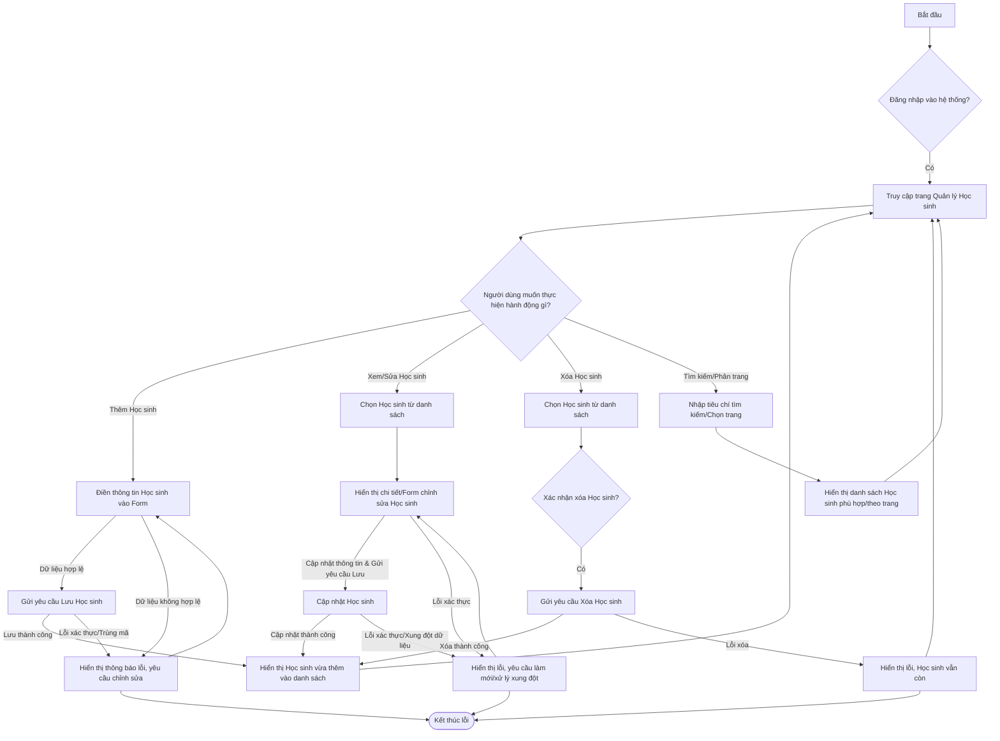

# Business Requirements Document (BRD)

| Metadata | Giá trị |
|----------|---------|
| **Mã tính năng** | `QUAN-20260531-1443` |
| **Tên tính năng** | Test Concurrency ThreadSafe |
| **Dự án** | quanlyhocsinh |
| **Phiên bản** | 1.0 |
| **Ngày tạo** | 2026-05-31 |
| **Tác giả** | BA Agent (ONENET AgentFactory) |

## Tài liệu liên quan

| Mã tính năng | Loại tài liệu | Trạng thái |
|-------------|---------------|------------|
| `QUAN-20260531-1443` | **BRD** (tài liệu này) | ✅ Hiện tại |
| `QUAN-20260531-1443` | SRS/SAD | ⏳ Chờ BA duyệt |
| `QUAN-20260531-1443` | DEV (mã nguồn) | ⏳ Chờ SRS duyệt |
| `QUAN-20260531-1443` | TEST (test cases) | ⏳ Chờ DEV duyệt |

---

## 1. Mục tiêu

### 1.1 Mục tiêu chính
Cung cấp tính năng quản lý thông tin học sinh (CRUD đầy đủ: Tạo, Đọc, Cập nhật, Xóa) trên hệ thống `quanlyhocsinh` với khả năng tìm kiếm, phân trang và đặc biệt là đảm bảo tính toàn vẹn dữ liệu trong môi trường đa luồng (thread-safe) và xử lý đồng thời.

### 1.2 Mục tiêu phụ
- Nâng cao hiệu quả quản lý thông tin học sinh bằng cách cung cấp giao diện người dùng trực quan, dễ sử dụng.
- Đảm bảo dữ liệu học sinh được xác thực chặt chẽ, chính xác và nhất quán.
- Chuẩn bị cơ sở hạ tầng hệ thống để kiểm thử và chứng minh khả năng xử lý đồng thời, giảm thiểu rủi ro xung đột dữ liệu khi nhiều người dùng thao tác cùng lúc.
- Cải thiện trải nghiệm người dùng với các tính năng tìm kiếm và phân trang nhanh chóng, hiệu quả.

---

## 2. Phạm vi, Giả định và Phụ thuộc

### 2.1 In Scope (Trong phạm vi)
- Xây dựng giao diện và luồng nghiệp vụ cho việc tạo mới thông tin học sinh.
- Xây dựng giao diện và luồng nghiệp vụ cho việc xem chi tiết thông tin của một học sinh.
- Xây dựng giao diện và luồng nghiệp vụ cho việc cập nhật thông tin học sinh hiện có.
- Xây dựng giao diện và luồng nghiệp vụ cho việc xóa thông tin một học sinh khỏi hệ thống.
- Triển khai chức năng tìm kiếm học sinh theo các tiêu chí (ví dụ: mã số, họ tên, lớp).
- Triển khai chức năng phân trang cho danh sách kết quả tìm kiếm và danh sách tổng hợp học sinh.
- Áp dụng các quy tắc xác thực dữ liệu đầu vào cho các trường thông tin học sinh.
- Đảm bảo tính thread-safe và cơ chế xử lý xung đột dữ liệu (concurrency control) cho các thao tác tạo, cập nhật, xóa học sinh.

### 2.2 Out of Scope (Ngoài phạm vi)
- Các tính năng quản lý thông tin khác liên quan đến học sinh (ví dụ: điểm số, hạnh kiểm, lịch học).
- Chức năng import/export dữ liệu học sinh hàng loạt.
- Chức năng báo cáo hoặc thống kê liên quan đến học sinh.
- Tích hợp với các hệ thống bên ngoài khác (ví dụ: cổng thông tin phụ huynh, hệ thống thi cử).
- Quản lý các danh mục dữ liệu dùng chung (ví dụ: danh sách lớp học, năm học) - giả định các danh mục này đã có sẵn.

### 2.3 Giả định (Assumptions)
- Người dùng có vai trò "Quản trị viên" hoặc có quyền tương đương để thực hiện các thao tác quản lý học sinh.
- Cấu trúc cơ sở dữ liệu và các trường thông tin cơ bản của học sinh đã được định nghĩa và thống nhất.
- Hệ thống xác thực và phân quyền người dùng đã tồn tại và hoạt động ổn định.
- Môi trường hệ thống (phần cứng, phần mềm) đủ điều kiện để hỗ trợ xử lý đa luồng và tải cao.

### 2.4 Phụ thuộc (Dependencies)
- Module quản lý quyền truy cập và xác thực người dùng.
- Cơ sở dữ liệu và hạ tầng hệ thống đã được triển khai.
- API hoặc dịch vụ cần thiết để tương tác với cơ sở dữ liệu học sinh.

---

## 3. Nhóm người dùng (User Personas)

| # | Persona | Vai trò | Quyền hạn chính | Mục tiêu sử dụng |
|---|---------|-------|-----------------|------------------|
| 1 | Quản trị viên | Quản lý thông tin học sinh | Thêm, Sửa, Xóa, Xem chi tiết, Tìm kiếm, Phân trang danh sách học sinh. | Đảm bảo thông tin học sinh trong hệ thống luôn chính xác, cập nhật và toàn vẹn, phục vụ công tác điều hành và giáo dục. |

---

## 4. User Flow nghiệp vụ (Mermaid Diagram)

> Sơ đồ luồng nghiệp vụ chính cho việc quản lý thông tin học sinh, bao gồm các thao tác CRUD cơ bản và xử lý lỗi xung đột dữ liệu.

---

## 5. Functional Requirements (FR)

> Chuyển đổi yêu cầu thành định dạng User Story: `As a [persona], I want to [action] so that [benefit]`

| Mã FR | Tên FR | User Story | Độ ưu tiên |
|--------|-----|------------|-----------|
| `QUAN-20260531-1443-FR01` | Quản lý: Tạo mới Học sinh | As a Quản trị viên, I want to create a new student record so that I can add new students to the system. | Must |
| `QUAN-20260531-1443-FR02` | Quản lý: Cập nhật thông tin Học sinh | As a Quản trị viên, I want to update an existing student's information so that I can correct or modify their details. | Must |
| `QUAN-20260531-1443-FR03` | Quản lý: Xem chi tiết Học sinh | As a Quản trị viên, I want to view the detailed information of a specific student so that I can review their complete profile. | Must |
| `QUAN-20260531-1443-FR04` | Quản lý: Xóa Học sinh | As a Quản trị viên, I want to delete a student record so that I can remove incorrect or withdrawn students from the system. | Must |
| `QUAN-20260531-1443-FR05` | Tìm kiếm Học sinh | As a Quản trị viên, I want to search for students by various criteria (e.g., name, ID, class) so that I can quickly find specific student records. | Must |
| `QUAN-20260531-1443-FR06` | Phân trang danh sách Học sinh | As a Quản trị viên, I want to view student records in a paginated list so that I can browse through large numbers of students efficiently. | Must |
| `QUAN-20260531-1443-FR07` | Xác thực dữ liệu Học sinh | As a Quản trị viên, I want the system to validate student information during creation and update so that only correct and complete data is stored. | Must |

---

## 6. Non-functional Requirements (NFR)

### 6.1 Performance
- **Thời gian phản hồi:** Các thao tác CRUD (tạo, sửa, xóa, xem chi tiết) phải có thời gian phản hồi không quá 2 giây trong điều kiện tải bình thường (lên đến 50 người dùng đồng thời).
- **Khả năng chịu tải:** Hệ thống phải có khả năng xử lý ít nhất 100 yêu cầu/giây cho các thao tác đọc (tìm kiếm, xem chi tiết) và 20 yêu cầu/giây cho các thao tác ghi (tạo, sửa, xóa) mà vẫn đảm bảo tính toàn vẹn dữ liệu và thời gian phản hồi chấp nhận được.
- **Tốc độ tìm kiếm/phân trang:** Phải hiển thị kết quả tìm kiếm và danh sách phân trang trong vòng 1-2 giây đối với tập dữ liệu lên đến 10,000 học sinh.

### 6.2 Security
- **Xác thực và phân quyền:** Chỉ những người dùng được ủy quyền (có vai trò Quản trị viên) mới có thể truy cập và thực hiện các thao tác CRUD trên dữ liệu học sinh.
- **Bảo mật dữ liệu:** Dữ liệu học sinh nhạy cảm (ví dụ: ngày sinh, địa chỉ) phải được bảo vệ chống truy cập và sửa đổi trái phép.
- **Chống tấn công:** Hệ thống phải có khả năng chống lại các lỗ hổng bảo mật phổ biến như SQL Injection, Cross-Site Scripting (XSS), Cross-Site Request Forgery (CSRF).

### 6.3 Availability
- **Thời gian hoạt động (Uptime):** Hệ thống phải đảm bảo thời gian hoạt động tối thiểu 99.5% trong giờ làm việc (8 giờ/ngày, 5 ngày/tuần).
- **Khả năng phục hồi:** Trong trường hợp xảy ra lỗi, hệ thống phải có khả năng phục hồi nhanh chóng và đảm bảo tính nhất quán của dữ liệu.

---

## 7. Business Rules (BR)

| Mã BR | Quy tắc | Mô tả & Ví dụ |
|--------|---------|---------------|
| `QUAN-20260531-1443-BR01` | Mã Học sinh duy nhất | **Mô tả:** Mỗi học sinh phải có một mã học sinh duy nhất trong toàn hệ thống. Mã này được dùng để định danh duy nhất cho từng học sinh. **VD:** _Đầu vào hợp lệ:_ Tạo Học sinh A với Mã HS: "HS001". _Đầu ra:_ Học sinh A được tạo thành công. _Đầu vào không hợp lệ:_ Cố gắng tạo Học sinh B với Mã HS: "HS001" (đã tồn tại). _Đầu ra:_ Hệ thống báo lỗi "Mã học sinh HS001 đã tồn tại, vui lòng chọn mã khác." |
| `QUAN-20260531-1443-BR02` | Tên Học sinh không được để trống | **Mô tả:** Trường "Tên Học sinh" là thông tin bắt buộc và không được để trống. **VD:** _Đầu vào hợp lệ:_ Tạo Học sinh với Tên: "Nguyễn Văn A". _Đầu ra:_ Yêu cầu được xử lý. _Đầu vào không hợp lệ:_ Tạo Học sinh với Tên: "". _Đầu ra:_ Hệ thống báo lỗi "Tên Học sinh không được để trống." |
| `QUAN-20260531-1443-BR03` | Xử lý cập nhật đồng thời (Concurrency Control) | **Mô tả:** Khi hai hoặc nhiều người dùng cùng chỉnh sửa thông tin của cùng một học sinh và lưu đồng thời, hệ thống phải đảm bảo tính toàn vẹn dữ liệu và thông báo cho người dùng biết về sự xung đột. Cơ chế khóa lạc quan (Optimistic Locking) sẽ được áp dụng. **VD:** _Tình huống:_ Người dùng A và B cùng mở thông tin của Học sinh C (Mã: HS003, Tên: "Lê Văn C", Lớp: "10A1", version: 1). _Người dùng A:_ Thay đổi "Lớp" thành "10A2" và nhấn "Lưu". Yêu cầu của A được xử lý thành công, Học sinh C được cập nhật (Lớp: "10A2", version: 2). _Người dùng B:_ Cùng lúc đó, thay đổi "Tên" thành "Lê Văn D" (trên phiên bản dữ liệu cũ, version: 1) và nhấn "Lưu". _Đầu ra mong muốn:_ Hệ thống báo lỗi cho Người dùng B: "Dữ liệu của Học sinh này đã được cập nhật bởi người dùng khác. Vui lòng làm mới trang để xem thông tin mới nhất và thử lại." Yêu cầu của B không được thực hiện, thông tin Lớp vẫn là "10A2", Tên vẫn là "Lê Văn C". |
| `QUAN-20260531-1443-BR04` | Giới hạn độ dài tên học sinh | **Mô tả:** Tên học sinh không được vượt quá 100 ký tự. **VD:** _Đầu vào hợp lệ:_ Tên học sinh: "Nguyễn Văn An". _Đầu ra:_ Yêu cầu được xử lý. _Đầu vào không hợp lệ:_ Tên học sinh: "Nguyễn Thị Phương Anh Thư..." (dài hơn 100 ký tự). _Đầu ra:_ Hệ thống báo lỗi "Tên học sinh không được vượt quá 100 ký tự." |

---

## 8. Integration Requirements

- Không có yêu cầu tích hợp với hệ thống bên thứ 3 trong phạm vi của tính năng này.

---

## 9. Audit Trail

- Hệ thống phải ghi lại lịch sử thao tác đối với các thay đổi trên thông tin học sinh. Mỗi bản ghi audit trail phải bao gồm:
    - Mã Học sinh bị ảnh hưởng.
    - Người thực hiện thao tác (User ID/Tên đăng nhập).
    - Thời gian thực hiện thao tác.
    - Loại thao tác (CREATE, UPDATE, DELETE).
    - Chi tiết thay đổi dữ liệu (Đối với UPDATE, cần ghi rõ trường nào thay đổi, giá trị cũ và giá trị mới).

---

## 10. KPI & Metrics theo dõi

- **Tỷ lệ tạo/cập nhật/xóa thành công:** Số lượng học sinh được tạo, cập nhật, xóa thành công trên tổng số yêu cầu mỗi ngày.
- **Tỷ lệ lỗi xác thực:** Số lượng yêu cầu bị từ chối do lỗi xác thực dữ liệu trên tổng số yêu cầu tạo/cập nhật.
- **Tỷ lệ xung đột dữ liệu:** Số lượng yêu cầu cập nhật bị từ chối do xung đột dữ dữ liệu (concurrency conflict) trên tổng số yêu cầu cập nhật.
- **Thời gian phản hồi trung bình:** Thời gian phản hồi trung bình cho các thao tác CRUD và tìm kiếm.
- **Số lượng học sinh được tìm kiếm/phân trang:** Tổng số lần người dùng thực hiện tìm kiếm hoặc duyệt qua các trang danh sách học sinh.

---

## 11. Acceptance Criteria (Tiêu chí chấp nhận - BDD)

> Viết tiêu chí chấp nhận cho từng FR theo chuẩn BDD (Given / When / Then).

### Luồng chính (Happy Path)

| Mã FR | Scenario | Given (Đầu vào/Điều kiện) | When (Hành động) | Then (Kết quả mong đợi) |
|-------|----------|---------------------------|------------------|-------------------------|
| `QUAN-20260531-1443-FR01` | Tạo mới Học sinh thành công | Người dùng Quản trị viên đã đăng nhập và truy cập trang tạo Học sinh. Tất cả các trường thông tin Học sinh bắt buộc được điền đầy đủ và hợp lệ (Mã HS: HS001, Tên: Nguyễn Văn A, Lớp: 10A1). | Người dùng nhấn nút "Lưu". | Hệ thống hiển thị thông báo "Tạo mới Học sinh thành công", Học sinh "Nguyễn Văn A" xuất hiện trong danh sách và dữ liệu được lưu vào DB. |
| `QUAN-20260531-1443-FR02` | Cập nhật thông tin Học sinh thành công | Người dùng Quản trị viên đã đăng nhập và truy cập trang chi tiết/chỉnh sửa của Học sinh "Nguyễn Văn A" (Mã HS: HS001, Lớp: 10A1). | Người dùng thay đổi trường "Lớp" từ "10A1" thành "10A2" và nhấn nút "Lưu". | Hệ thống hiển thị thông báo "Cập nhật Học sinh thành công", thông tin Học sinh "Nguyễn Văn A" hiển thị Lớp là "10A2" và dữ liệu được cập nhật trong DB. |
| `QUAN-20260531-1443-FR03` | Xem chi tiết Học sinh thành công | Người dùng Quản trị viên đã đăng nhập và truy cập trang danh sách Học sinh. Học sinh "Nguyễn Văn A" (Mã HS: HS001) có trong danh sách. | Người dùng nhấn vào liên kết hoặc nút "Xem chi tiết" của Học sinh "Nguyễn Văn A". | Hệ thống hiển thị trang chi tiết đầy đủ thông tin của Học sinh "Nguyễn Văn A". |
| `QUAN-20260531-1443-FR04` | Xóa Học sinh thành công | Người dùng Quản trị viên đã đăng nhập và truy cập trang danh sách Học sinh. Học sinh "Trần Thị B" (Mã HS: HS002) có trong danh sách. | Người dùng chọn Học sinh "Trần Thị B", nhấn nút "Xóa" và xác nhận thao tác xóa. | Hệ thống hiển thị thông báo "Xóa Học sinh thành công", Học sinh "Trần Thị B" không còn trong danh sách và dữ liệu đã bị xóa khỏi DB. |
| `QUAN-20260531-1443-FR05` | Tìm kiếm Học sinh theo tên thành công | Người dùng Quản trị viên đã đăng nhập và ở trang danh sách Học sinh. Hệ thống có các học sinh: "Nguyễn Văn A", "Trần Thị B", "Nguyễn Thị C". | Người dùng nhập "Nguyễn" vào ô tìm kiếm theo tên và nhấn nút "Tìm". | Danh sách Học sinh chỉ hiển thị "Nguyễn Văn A" và "Nguyễn Thị C", các kết quả được phân trang (nếu có). |
| `QUAN-20260531-1443-FR06` | Phân trang danh sách Học sinh thành công | Người dùng Quản trị viên đã đăng nhập và ở trang danh sách Học sinh. Hệ thống có hơn 20 học sinh (mặc định hiển thị 10 học sinh mỗi trang). | Người dùng nhấn vào số trang "2" hoặc nút "Trang kế tiếp". | Hệ thống hiển thị 10 học sinh tiếp theo trong danh sách, cập nhật thông tin phân trang (ví dụ: "Hiển thị 11-20 trên tổng số 25 học sinh"). |

### Luồng lỗi (Unhappy Path / Edge Cases)

| Mã FR | Scenario | Given (Đầu vào/Điều kiện) | When (Hành động) | Then (Kết quả mong đợi) |
|-------|----------|---------------------------|------------------|-------------------------|
| `QUAN-20260531-1443-FR01` | Tạo mới Học sinh với Mã HS đã tồn tại | Người dùng Quản trị viên đã đăng nhập. Mã Học sinh "HS001" đã tồn tại trong hệ thống. Người dùng điền Mã HS: "HS001", các trường khác hợp lệ. | Người dùng nhấn nút "Lưu". | Hệ thống hiển thị thông báo lỗi "Mã Học sinh HS001 đã tồn tại, vui lòng chọn mã khác." bên cạnh trường Mã HS, Học sinh không được tạo. |
| `QUAN-20260531-1443-FR02` | Cập nhật Học sinh bị xung đột dữ liệu | Người dùng A và B cùng mở trang chỉnh sửa Học sinh "Lê Văn C" (Mã HS: HS003, Lớp: 10A1, version: 1). Người dùng A thay đổi "Lớp" thành "10A2" và lưu thành công (version: 2). Người dùng B thay đổi "Tên" thành "Lê Văn D" (trên phiên bản dữ liệu cũ là 1). | Người dùng B nhấn nút "Lưu". | Hệ thống hiển thị thông báo lỗi "Dữ liệu của Học sinh này đã được cập nhật bởi người dùng khác. Vui lòng làm mới trang để xem thông tin mới nhất và thử lại." Yêu cầu của B không được thực hiện. |
| `QUAN-20260531-1443-FR04` | Xóa Học sinh không tồn tại | Người dùng Quản trị viên đã đăng nhập. Học sinh có Mã HS: "HS999" không tồn tại trong hệ thống. | Người dùng thực hiện yêu cầu xóa Học sinh với Mã HS: "HS999". | Hệ thống hiển thị thông báo lỗi "Không tìm thấy Học sinh cần xóa" hoặc "Học sinh không tồn tại". |
| `QUAN-20260531-1443-FR07` | Bỏ trống trường Tên Học sinh bắt buộc | Người dùng Quản trị viên đang ở trang tạo/chỉnh sửa Học sinh. Người dùng để trống trường "Tên Học sinh". | Người dùng nhấn nút "Lưu". | Hệ thống hiển thị thông báo lỗi validation "Tên Học sinh không được để trống." ngay dưới trường Tên Học sinh. |
| `QUAN-20260531-1443-FR07` | Tên Học sinh vượt quá giới hạn ký tự | Người dùng Quản trị viên đang ở trang tạo/chỉnh sửa Học sinh. Người dùng nhập tên Học sinh dài hơn 100 ký tự. | Người dùng nhấn nút "Lưu". | Hệ thống hiển thị thông báo lỗi validation "Tên Học sinh không được vượt quá 100 ký tự." ngay dưới trường Tên Học sinh. |

---

_Mã tính năng `QUAN-20260531-1443` — Tài liệu BRD được sinh tự động bởi ONENET AgentFactory._