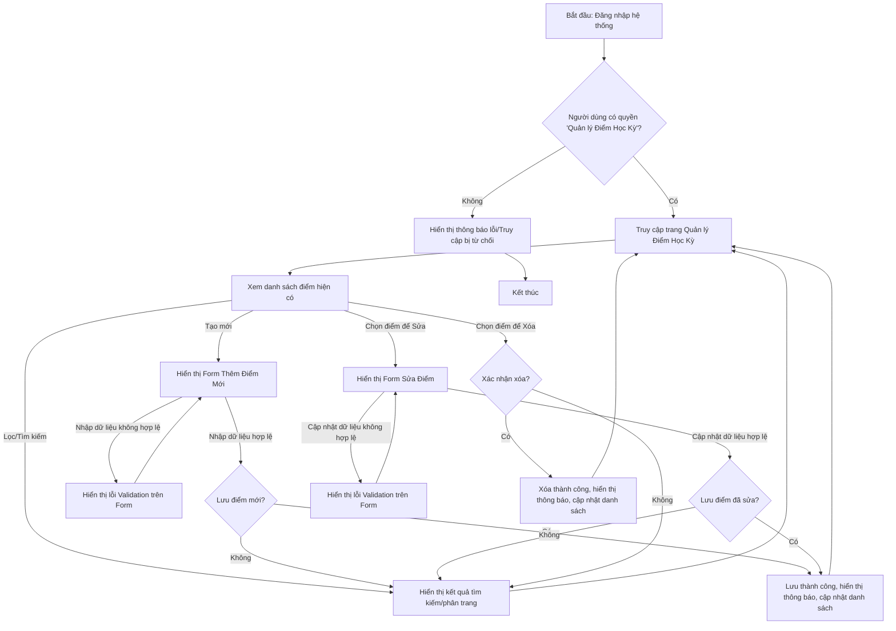

# Business Requirements Document (BRD)

| Metadata | Giá trị |
|----------|---------|
| **Mã tính năng** | `QUAN-20260531-150407` |
| **Tên tính năng** | Quan Ly Diem Hoc Ky |
| **Dự án** | quanlyhocsinh |
| **Phiên bản** | 1.0 |
| **Ngày tạo** | 2026-05-31 |
| **Tác giả** | BA Agent (ONENET AgentFactory) |

## Tài liệu liên quan

| Mã tính năng | Loại tài liệu | Trạng thái |
|-------------|---------------|------------|
| `QUAN-20260531-150407` | **BRD** (tài liệu này) | ✅ Hiện tại |
| `QUAN-20260531-150407` | SRS/SAD | ⏳ Chờ BA duyệt |
| `QUAN-20260531-150407` | DEV (mã nguồn) | ⏳ Chờ SRS duyệt |
| `QUAN-20260531-150407` | TEST (test cases) | ⏳ Chờ DEV duyệt |

---

## 1. Mục tiêu

### 1.1 Mục tiêu chính
Cung cấp một hệ thống quản lý điểm học kỳ tập trung, hiệu quả và chính xác cho các đối tượng người dùng liên quan trong hệ thống `quanlyhocsinh`, bao gồm khả năng tạo, đọc, cập nhật, xóa (CRUD) điểm, cùng với các chức năng tìm kiếm, phân trang và kiểm tra tính hợp lệ dữ liệu.

### 1.2 Mục tiêu phụ
- Đảm bảo tính toàn vẹn và chính xác của dữ liệu điểm học kỳ.
- Giảm thiểu sai sót trong quá trình nhập liệu và quản lý điểm.
- Nâng cao hiệu quả nghiệp vụ cho giáo viên và ban giám hiệu trong việc quản lý và theo dõi kết quả học tập của học sinh.
- Cung cấp khả năng tra cứu điểm nhanh chóng và linh hoạt.
- Thiết lập nền tảng cho các tính năng báo cáo và phân tích kết quả học tập trong tương lai.

---

## 2. Phạm vi, Giả định và Phụ thuộc

### 2.1 In Scope (Trong phạm vi)
- Tạo mới thông tin điểm học kỳ cho từng học sinh, môn học và học kỳ cụ thể.
- Xem danh sách điểm học kỳ theo các tiêu chí khác nhau (ví dụ: theo lớp, theo môn, theo học kỳ, theo học sinh).
- Cập nhật thông tin điểm học kỳ hiện có.
- Xóa bỏ thông tin điểm học kỳ (tuân thủ quy tắc nghiệp vụ về quyền hạn).
- Tìm kiếm điểm học kỳ theo mã học sinh, tên học sinh, tên môn học, tên học kỳ.
- Phân trang danh sách điểm học kỳ để quản lý dữ liệu lớn.
- Kiểm tra tính hợp lệ (validation) của dữ liệu nhập vào cho điểm học kỳ.
- Quản lý quyền truy cập và thao tác đối với điểm học kỳ dựa trên vai trò người dùng.

### 2.2 Out of Scope (Ngoài phạm vi)
- Tính toán điểm trung bình học kỳ, điểm tổng kết năm học hoặc các chỉ số học tập phức tạp khác.
- Tạo báo cáo học bạ, bảng điểm tổng kết chính thức.
- Tích hợp với các hệ thống đánh giá/chấm điểm bên ngoài.
- Chức năng cho phép học sinh hoặc phụ huynh xem điểm trực tiếp trên hệ thống (nếu có cổng thông tin riêng cho học sinh/phụ huynh).

### 2.3 Giả định (Assumptions)
- Dữ liệu về Học sinh, Môn học, Giáo viên, Lớp học và Học kỳ đã tồn tại và được quản lý trong các module tương ứng của hệ thống `quanlyhocsinh`.
- Người dùng được phân quyền đầy đủ để thực hiện các thao tác quản lý điểm học kỳ (Giáo viên, Ban Giám Hiệu, Quản trị viên).
- Người dùng có kiến thức cơ bản về cách sử dụng hệ thống và các quy trình nghiệp vụ liên quan đến quản lý điểm.

### 2.4 Phụ thuộc (Dependencies)
- **Module Quản lý Học sinh:** Cung cấp thông tin chi tiết về học sinh.
- **Module Quản lý Môn học:** Cung cấp danh sách các môn học.
- **Module Quản lý Học kỳ:** Cung cấp danh sách các học kỳ.
- **Module Quản lý Lớp học:** Cung cấp thông tin về các lớp học để lọc/tìm kiếm điểm.
- **Module Quản lý Người dùng & Phân quyền:** Đảm bảo xác thực và ủy quyền cho các thao tác quản lý điểm.

---

## 3. Nhóm người dùng (User Personas)

| # | Persona | Vai trò | Quyền hạn chính | Mục tiêu sử dụng |
|---|---------|-------|-----------------|------------------|
| 1 | **Giáo viên** | Người phụ trách môn học | Nhập, xem, sửa, xóa điểm của các môn học do mình phụ trách. | Nhập điểm chính xác, cập nhật kịp thời, theo dõi điểm của học sinh trong môn học của mình. |
| 2 | **Ban Giám Hiệu** | Quản lý, điều hành nhà trường | Xem, sửa, xóa tất cả các điểm của học sinh trong toàn trường. Duyệt hoặc khóa điểm khi cần. | Tổng quan về kết quả học tập toàn trường, kiểm tra tính chính xác của điểm, quản lý chung. |
| 3 | **Quản trị viên** | Quản trị hệ thống | Toàn quyền quản lý, cấu hình hệ thống, hỗ trợ người dùng. | Đảm bảo tính năng hoạt động ổn định, phân quyền cho giáo viên/BGH. |

---

## 4. User Flow nghiệp vụ (Mermaid Diagram)

> Sơ đồ luồng nghiệp vụ chi tiết cho việc quản lý điểm học kỳ (tạo/cập nhật điểm).

---

## 5. Functional Requirements (FR)

> Chuyển đổi yêu cầu thành định dạng User Story: `As a [persona], I want to [action] so that [benefit]`

| Mã FR | Tên FR | User Story | Độ ưu tiên |
|--------|-----|------------|-----------|
| `QUAN-20260531-150407-FR01` | Xem danh sách điểm học kỳ | As a **Giáo viên/Ban Giám Hiệu**, I want to **xem danh sách điểm học kỳ** so that **tôi có thể nắm bắt tổng quan về kết quả học tập của học sinh**. | Must |
| `QUAN-20260531-150407-FR02` | Thêm mới điểm học kỳ | As a **Giáo viên**, I want to **thêm mới điểm học kỳ cho học sinh** so that **tôi có thể ghi nhận kết quả học tập một cách kịp thời và chính xác**. | Must |
| `QUAN-20260531-150407-FR03` | Cập nhật điểm học kỳ | As a **Giáo viên/Ban Giám Hiệu**, I want to **cập nhật điểm học kỳ của học sinh** so that **tôi có thể sửa đổi thông tin điểm khi có sai sót hoặc thay đổi**. | Must |
| `QUAN-20260531-150407-FR04` | Xóa điểm học kỳ | As a **Ban Giám Hiệu/Quản trị viên**, I want to **xóa điểm học kỳ của học sinh** so that **tôi có thể loại bỏ các bản ghi điểm không hợp lệ hoặc thừa thãi**. | Must |
| `QUAN-20260531-150407-FR05` | Tìm kiếm điểm học kỳ | As a **Giáo viên/Ban Giám Hiệu**, I want to **tìm kiếm điểm học kỳ theo các tiêu chí (mã HS, tên HS, môn học, học kỳ)** so that **tôi có thể nhanh chóng truy cập thông tin điểm cụ thể**. | Must |
| `QUAN-20260531-150407-FR06` | Phân trang danh sách điểm | As a **Giáo viên/Ban Giám Hiệu**, I want to **xem danh sách điểm học kỳ được phân trang** so that **tôi có thể dễ dàng quản lý một lượng lớn dữ liệu mà không bị quá tải giao diện**. | Must |
| `QUAN-20260531-150407-FR07` | Kiểm tra tính hợp lệ dữ liệu | As a **người dùng**, I want to **đảm bảo dữ liệu điểm nhập vào là hợp lệ** so that **hệ thống luôn chứa thông tin chính xác và đúng định dạng**. | Must |

---

## 6. Non-functional Requirements (NFR)

### 6.1 Performance
- **Thời gian phản hồi:**
    - Trang "Quản lý Điểm Học Kỳ" phải tải trong vòng dưới 2 giây.
    - Thao tác tìm kiếm, thêm mới, cập nhật, xóa điểm phải phản hồi trong vòng dưới 3 giây, ngay cả với danh sách hơn 10.000 bản ghi điểm.
- **Số lượng người dùng đồng thời:** Hệ thống phải hỗ trợ tối thiểu 50 người dùng đồng thời thực hiện các thao tác quản lý điểm mà không ảnh hưởng đáng kể đến hiệu suất.
- **Khả năng mở rộng:** Hệ thống cần có khả năng mở rộng để xử lý tăng trưởng dữ liệu lên tới 100.000 bản ghi điểm mà vẫn duy trì hiệu suất chấp nhận được.

### 6.2 Security
- **Xác thực và phân quyền:** Chỉ những người dùng đã đăng nhập và có vai trò phù hợp (Giáo viên, Ban Giám Hiệu, Quản trị viên) mới có thể truy cập và thực hiện các thao tác trên tính năng "Quản lý Điểm Học Kỳ". Phân quyền phải theo quy tắc nghiệp vụ (ví dụ: giáo viên chỉ quản lý điểm môn mình phụ trách).
- **Mã hóa dữ liệu truyền tải:** Tất cả dữ liệu điểm truyền tải giữa client và server phải được mã hóa sử dụng HTTPS.
- **Kiểm soát đầu vào:** Dữ liệu nhập vào phải được kiểm tra (sanitized) để ngăn chặn các lỗ hổng bảo mật như SQL Injection, XSS.

### 6.3 Availability
- **Thời gian hoạt động (Uptime):** Tính năng "Quản lý Điểm Học Kỳ" phải có thời gian hoạt động tối thiểu 99.5% trong giờ hành chính (7h00 - 17h00) các ngày làm việc.

---

## 7. Business Rules (BR)

| Mã BR | Quy tắc | Mô tả & Ví dụ |
|--------|---------|---------------|
| `QUAN-20260531-150407-BR01` | **Phạm vi giá trị của điểm** | Điểm học kỳ phải nằm trong khoảng từ 0.0 đến 10.0. VD: Nếu nhập điểm là 10.5, hệ thống phải báo lỗi "Điểm không hợp lệ, phải nằm trong khoảng từ 0.0 đến 10.0". |
| `QUAN-20260531-150407-BR02` | **Tính duy nhất của bản ghi điểm** | Một học sinh chỉ có thể có một điểm cho một môn học trong một học kỳ cụ thể. VD: Học sinh Nguyễn Văn A, Môn Toán, Học kỳ I năm học 2026-2027 đã có điểm. Nếu người dùng cố gắng thêm một bản ghi điểm khác cho cùng các tiêu chí này, hệ thống phải báo lỗi "Điểm đã tồn tại cho học sinh, môn học và học kỳ này". |
| `QUAN-20260531-150407-BR03` | **Quyền hạn của Giáo viên** | Giáo viên chỉ có quyền xem, thêm, sửa, xóa điểm cho các môn học mà họ được phân công phụ trách. VD: Giáo viên Nguyễn Thị B được phân công dạy môn Ngữ Văn. Cô B cố gắng sửa điểm môn Vật Lý, hệ thống phải báo lỗi "Bạn không có quyền chỉnh sửa điểm môn này". |
| `QUAN-20260531-150407-BR04` | **Quyền hạn của Ban Giám Hiệu/Quản trị viên** | Ban Giám Hiệu và Quản trị viên có toàn quyền xem, thêm, sửa, xóa tất cả các điểm học kỳ trong hệ thống. VD: Hiệu trưởng có thể sửa điểm bất kỳ môn học nào của bất kỳ học sinh nào. |
| `QUAN-20260531-150407-BR05` | **Điểm là số thập phân** | Điểm có thể là số nguyên hoặc số thập phân với tối đa một chữ số sau dấu phẩy. VD: 7.0, 8.5, 9. Nếu nhập 7.25, hệ thống phải làm tròn hoặc báo lỗi tùy theo quy định cụ thể (hiện tại: làm tròn đến 1 chữ số thập phân). |

---

## 8. Integration Requirements

- **Tích hợp nội bộ:** Tính năng này sẽ tích hợp với các module Quản lý Học sinh, Môn học, Học kỳ, Lớp học và Người dùng/Phân quyền hiện có trong hệ thống `quanlyhocsinh` để truy xuất dữ liệu liên quan và kiểm tra quyền hạn.
- **Hệ thống bên thứ 3:** Không có yêu cầu tích hợp với hệ thống bên thứ 3 nào trong giai đoạn hiện tại.

---

## 9. Audit Trail

- Hệ thống phải ghi lại lịch sử thao tác (Audit Log) đối với các hành động quan trọng trong tính năng "Quản lý Điểm Học Kỳ" bao gồm:
    - **Tạo mới điểm:** Ghi nhận người thực hiện, thời gian, dữ liệu điểm đã tạo.
    - **Cập nhật điểm:** Ghi nhận người thực hiện, thời gian, dữ liệu điểm cũ, dữ liệu điểm mới.
    - **Xóa điểm:** Ghi nhận người thực hiện, thời gian, dữ liệu điểm đã xóa.
- Log phải bao gồm Mã người dùng, Tên người dùng, Mã hành động, Mô tả hành động, Thời gian thực hiện, và Địa chỉ IP (nếu khả thi).

---

## 10. KPI & Metrics theo dõi

- **Số lượng bản ghi điểm được tạo mới/cập nhật:** Đo lường tần suất sử dụng tính năng.
- **Tỷ lệ lỗi khi nhập liệu điểm:** Số lần dữ liệu không hợp lệ được nhập chia cho tổng số lần nhập liệu.
- **Thời gian phản hồi trung bình:** Thời gian để thực hiện các thao tác CRUD và tìm kiếm.
- **Số lượng lượt tìm kiếm/phân trang:** Đo lường mức độ sử dụng tính năng tra cứu.
- **Tỷ lệ chuyển đổi dữ liệu thành công:** Tỷ lệ các thao tác tạo/cập nhật/xóa thành công so với tổng số lần thử.

---

## 11. Acceptance Criteria (Tiêu chí chấp nhận - BDD)

> Viết tiêu chí chấp nhận cho từng FR theo chuẩn BDD (Given / When / Then).

### Luồng chính (Happy Path)

| Mã FR | Scenario | Given (Đầu vào/Điều kiện) | When (Hành động) | Then (Kết quả mong đợi) |
|-------|----------|---------------------------|------------------|-------------------------|
| `QUAN-20260531-150407-FR02` | Tạo mới điểm thành công | Giáo viên đã đăng nhập và có quyền tạo điểm cho môn học. Form "Thêm Điểm Mới" được điền đầy đủ và hợp lệ (HS: Nguyễn Văn A, Môn: Toán, HK: I, Điểm: 8.5). | Bấm nút "Lưu" | Hệ thống hiển thị thông báo "Thêm điểm thành công", bản ghi điểm mới xuất hiện trong danh sách. |
| `QUAN-20260531-150407-FR03` | Cập nhật điểm thành công | Ban Giám Hiệu đã đăng nhập. Có bản ghi điểm của HS Nguyễn Văn A, Môn Toán, HK I với điểm 8.5. | Ban Giám Hiệu chọn bản ghi này, thay đổi điểm thành 9.0 và bấm "Cập nhật". | Hệ thống hiển thị thông báo "Cập nhật điểm thành công", điểm của HS Nguyễn Văn A môn Toán trong HK I được cập nhật thành 9.0. |
| `QUAN-20260531-150407-FR05` | Tìm kiếm điểm theo tên học sinh thành công | Giáo viên đã đăng nhập. Danh sách điểm có chứa nhiều bản ghi, trong đó có học sinh tên "Nguyễn Văn A". | Giáo viên nhập "Nguyễn Văn A" vào ô tìm kiếm và bấm nút "Tìm". | Hệ thống hiển thị danh sách tất cả các điểm của học sinh "Nguyễn Văn A", và không hiển thị các học sinh khác. |
| `QUAN-20260531-150407-FR06` | Phân trang danh sách điểm thành công | Giáo viên đã đăng nhập. Có 50 bản ghi điểm và cấu hình phân trang là 10 bản ghi/trang. | Giáo viên truy cập trang "Quản lý Điểm Học Kỳ" và sau đó bấm nút "Trang sau". | Hệ thống hiển thị trang thứ 2 của danh sách điểm (từ bản ghi 11 đến 20) và các điều khiển phân trang hoạt động chính xác. |

### Luồng lỗi (Unhappy Path / Edge Cases)

| Mã FR | Scenario | Given (Đầu vào/Điều kiện) | When (Hành động) | Then (Kết quả mong đợi) |
|-------|----------|---------------------------|------------------|-------------------------|
| `QUAN-20260531-150407-FR02` | Bỏ trống trường bắt buộc khi tạo mới | Giáo viên đã đăng nhập. Form "Thêm Điểm Mới" được điền thiếu Môn học. | Bấm nút "Lưu" | Hệ thống hiển thị thông báo lỗi validation "Trường Môn học không được để trống" ngay tại trường nhập liệu tương ứng. |
| `QUAN-20260531-150407-FR02` | Nhập điểm ngoài phạm vi hợp lệ | Giáo viên đã đăng nhập. Form "Thêm Điểm Mới" được điền đầy đủ nhưng điểm là 11.0. | Bấm nút "Lưu" | Hệ thống hiển thị thông báo lỗi validation "Điểm không hợp lệ, phải nằm trong khoảng từ 0.0 đến 10.0" tại trường điểm. |
| `QUAN-20260531-150407-FR02` | Tạo điểm trùng lặp | Giáo viên đã đăng nhập. Đã có điểm cho HS Nguyễn Văn A, Môn Toán, HK I. Giáo viên cố gắng thêm lại một bản ghi điểm mới với cùng thông tin này. | Bấm nút "Lưu" | Hệ thống hiển thị thông báo lỗi "Điểm đã tồn tại cho học sinh, môn học và học kỳ này" và không tạo bản ghi mới. |
| `QUAN-20260531-150407-FR03` | Cập nhật điểm bởi người dùng không có quyền | Giáo viên được phân công dạy môn Ngữ Văn đã đăng nhập. | Giáo viên chọn bản ghi điểm môn Vật Lý của học sinh A và cố gắng sửa điểm. | Hệ thống hiển thị thông báo lỗi "Bạn không có quyền chỉnh sửa điểm môn này" và không cho phép lưu thay đổi. |
| `QUAN-20260531-150407-FR04` | Xóa điểm không thành công do không có quyền | Giáo viên đã đăng nhập. | Giáo viên chọn một bản ghi điểm và bấm nút "Xóa". | Hệ thống hiển thị thông báo lỗi "Bạn không có quyền xóa điểm này" và bản ghi điểm không bị xóa. |
| `QUAN-20260531-150407-FR05` | Tìm kiếm không có kết quả | Giáo viên đã đăng nhập. Danh sách điểm không có học sinh nào tên "Trần Thị C". | Giáo viên nhập "Trần Thị C" vào ô tìm kiếm và bấm nút "Tìm". | Hệ thống hiển thị thông báo "Không tìm thấy kết quả phù hợp" và danh sách điểm trống. |

---

_Mã tính năng `QUAN-20260531-150407` — Tài liệu BRD được sinh tự động bởi ONENET AgentFactory._