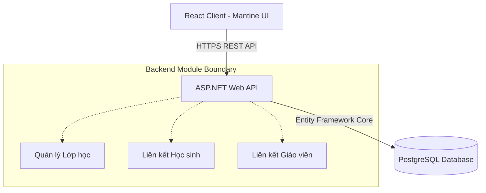
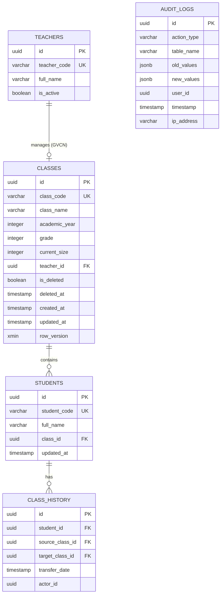
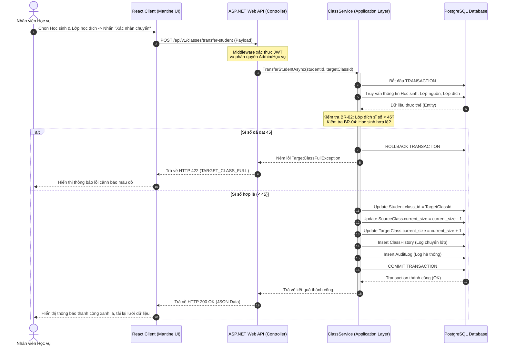

# Software Requirements Specification (SRS)
## Tính năng: Quản lý lớp học (QUAN-20260529-0947)

**Phiên bản:** V1.0  
**Ngày:** 2026-05-29  
**Chuẩn tài liệu:** ONENET Architectural & Requirement Specification Standard  

---

# 1. Introduction

## 1.1 Purpose
Tài liệu này đặc tả chi tiết yêu cầu phần mềm (SRS) và thiết kế kiến trúc hệ thống (SAD) cho phân hệ **Quản lý lớp học** (mã tính năng: `QUAN-20260529-0947`) thuộc hệ thống `quanlyhocsinh` của ONENET. Tài liệu này đóng vai trò là kim chỉ nam kỹ thuật cho đội ngũ Phát triển (Developers), Kiểm thử (QA/QC), Vận hành (DevOps) và các bên liên quan nhằm đảm bảo xây dựng hệ thống đúng nghiệp vụ, bảo mật, hiệu năng cao và có khả năng mở rộng tốt.

## 1.2 Scope
### 1.2.1 In Scope (Trong phạm vi triển khai)
*   **Quản lý thông tin lớp học:** Thực hiện các chức năng CRUD (Create, Read, Update, Delete) đối với lớp học. Áp dụng quy tắc tạo Mã lớp tự động duy nhất (`LH-[TênLớp]-[NiênKhóa]`) và cơ chế xóa mềm (Soft Delete).
*   **Quản lý phân bổ và chuyển lớp:** 
    *   Xếp học sinh mới vào lớp.
    *   Luân chuyển học sinh giữa các lớp học hiện có.
    *   Ràng buộc nghiệp vụ: Sĩ số tối đa không vượt quá 45 học sinh; một học sinh tại một thời điểm chỉ thuộc duy nhất một lớp học đang hoạt động.
*   **Tra cứu và Thống kê:** 
    *   Truy vấn danh sách học sinh theo từng lớp học.
    *   Thống kê trực quan số lượng học sinh theo từng lớp và theo từng khối (Khối 10, Khối 11, Khối 12).
*   **Kiểm soát và Ghi nhật ký (Audit Log):** Lưu trữ lịch sử toàn bộ các tác vụ thay đổi dữ liệu cấu trúc lớp học và phân bổ học sinh.

### 1.2.2 Out of Scope (Ngoài phạm vi triển khai)
*   Quản lý chi tiết hồ sơ nhân sự/lý lịch của giáo viên (chỉ liên kết định danh làm GVCN).
*   Quản lý điểm số, học bạ điện tử, hạnh kiểm hoặc kết quả học tập của học sinh.
*   Quản lý thời khóa biểu, phân phòng học vật lý, lịch thi.

## 1.3 Intended Audience
*   **Đội ngũ Phát triển Phần mềm (Backend & Frontend Developers):** Sử dụng để thiết kế chi tiết các API, UI Components và viết code logic.
*   **Đội ngũ Đảm bảo Chất lượng (QA/QC):** Sử dụng để viết Test Case, Test Scenario và tiến hành kiểm thử kiểm chứng (UAT).
*   **Quản trị Dự án (PM / BA):** Theo dõi tiến độ và đánh giá mức độ hoàn thành tính năng theo KPI.
*   **Bộ phận Vận hành & DevOps:** Cấu hình môi trường triển khai, giám sát hệ thống và thiết lập cơ chế sao lưu dữ liệu.

---

# 2. Overall Description

## 2.1 Product Perspective
Phân hệ **Quản lý Lớp học** là một thành phần cốt lõi trong kiến trúc nguyên khối (Monolithic) của hệ thống `quanlyhocsinh`. Phân hệ này tương tác chặt chẽ với hai phân hệ nền tảng là Phân hệ Quản lý Học sinh và Phân hệ Quản lý Giáo viên thông qua liên kết cơ sở dữ liệu quan hệ PostgreSQL để thực thi các ràng buộc toàn vẹn dữ liệu.



## 2.2 User Roles
Hệ thống phân quyền dựa trên vai trò (RBAC - Role-Based Access Control) quy định chi tiết quyền hạn truy cập các chức năng của phân hệ:

| Vai trò người dùng | Quyền hạn đối với Lớp học | Quyền hạn đối với Phân bổ/Chuyển lớp | Quyền hạn Thống kê/Báo cáo |
| :--- | :--- | :--- | :--- |
| **Quản trị viên / Nhân viên Học vụ** | Toàn quyền (Thêm, Sửa, Xóa mềm) | Toàn quyền thực hiện phân bổ và luân chuyển học sinh | Xem toàn bộ báo cáo và thống kê hệ thống |
| **Ban Giám Hiệu (BGH)** | Chỉ xem danh sách và chi tiết lớp học | Chỉ xem thông tin phân bổ | Xem toàn bộ báo cáo và thống kê hệ thống |
| **Giáo viên Chủ nhiệm (GVCN)** | Chỉ xem thông tin lớp học được phân công | Không có quyền | Chỉ xem báo cáo thống kê của lớp mình chủ nhiệm |

## 2.3 Technology Stack

### Backend
*   **Runtime:** .NET 10 (C# 14)
*   **Framework:** ASP.NET Core Web API
*   **Kiến trúc:** Clean Architecture / Modular Monolith (tách biệt các Layer: Presentation, Application, Domain, Infrastructure).
*   **ORM:** Entity Framework Core 10 (sử dụng Code-First để quản lý Database Migrations).
*   **Đồng bộ hóa & Transactions:** Sử dụng DbContext Transactions để đảm bảo tính Acid (Atomicity, Consistency, Isolation, Durability) khi luân chuyển học sinh.

### Frontend
*   **Library:** ReactJS 19 (TypeScript)
*   **State Management:** TanStack Query (React Query v5) để quản lý cache và đồng bộ dữ liệu API.
*   **UI Library:** Mantine UI v7 (hỗ trợ tối ưu hóa Responsive và khả năng tiếp cận tốt).
*   **Build Tool:** Vite

### Database
*   **RDBMS:** PostgreSQL 16 (Hỗ trợ phân vùng dữ liệu, chỉ mục GIN/BTREE tối ưu truy vấn).
*   **Cơ chế khóa:** Sử dụng Optimistic Concurrency Control (OCC) thông qua cột `xmin` (system columns của Postgres) hoặc thuộc tính `[ConcurrencyCheck]` trong EF Core để ngăn chặn tình trạng ghi đè/vượt quá sĩ số tối đa 45 học sinh dưới tác động của truy cập đồng thời lớn.

### Architecture
*   **Kiến trúc tổng thể:** Monolithic Architecture được mô-đun hóa hóa tốt (Modular Monolith).
*   **Giao thức giao tiếp:** RESTful API chuẩn hóa định dạng JSON.
*   **Authentication & Authorization:** JWT (JSON Web Token) kết hợp cùng Resource-Based Authorization.

---

# 3. Functional Requirements

### QUAN-20260529-0947-SRS01: Thêm mới lớp học
*   **Mô tả:** Hệ thống cho phép Nhân viên Học vụ tạo mới một lớp học. Mã lớp học phải được sinh tự động theo định dạng quy chuẩn và kiểm tra tính duy nhất.
*   **Dữ liệu đầu vào:**
    *   Tên lớp (Ví dụ: `10A1`, `11B2`) - Bắt buộc, chuỗi từ 2-20 ký tự, không chứa ký tự đặc biệt trừ dấu gạch ngang.
    *   Niên khóa (Ví dụ: `2026`) - Bắt buộc, số nguyên dương 4 chữ số, tối thiểu là năm hiện tại.
    *   Khối (Ví dụ: `10`, `11`, `12`) - Chọn từ danh mục dropdown.
    *   Giáo viên chủ nhiệm - Chọn từ danh sách Giáo viên đang hoạt động và chưa chủ nhiệm lớp nào khác trong cùng niên khóa.
*   **Xử lý hệ thống:**
    *   Tự động sinh mã lớp theo quy tắc: `LH-[TênLớp]-[NiênKhóa]` (Ví dụ: `LH-10A1-2026`).
    *   Kiểm tra sự trùng lặp của Mã lớp trong cơ sở dữ liệu (kể cả các lớp đã bị xóa mềm).
    *   Nếu trùng lặp, trả về mã lỗi `CLASS_CODE_ALREADY_EXISTS`.
    *   Nếu hợp lệ, lưu bản ghi mới với trạng thái mặc định là `Active` và Sĩ số khởi tạo là `0`.

### QUAN-20260529-0947-SRS02: Sửa thông tin lớp học
*   **Mô tả:** Cho phép cập nhật các thuộc tính động của lớp học.
*   **Quy tắc nghiệp vụ:**
    *   Cho phép sửa: Tên lớp, Giáo viên chủ nhiệm, Niên khóa, Khối học.
    *   **Tuyệt đối không cho phép sửa Mã lớp học (`ClassCode`)** để bảo toàn tính tham chiếu lịch sử dữ liệu.
    *   Nếu thay đổi Tên lớp hoặc Niên khóa, hệ thống sẽ **không** cập nhật lại Mã lớp cũ đã sinh để bảo toàn tính nhất quán lịch sử. (Hoặc nếu yêu cầu bắt buộc đổi mã lớp, hệ thống sẽ ném lỗi yêu cầu tạo lớp mới để tránh sai lệch dữ liệu liên kết).

### QUAN-20260529-0947-SRS03: Xóa lớp học (Soft Delete)
*   **Mô tả:** Chuyển trạng thái lớp học sang trạng thái ẩn/xóa mà không xóa vật lý bản ghi trong CSDL.
*   **Quy tắc nghiệp vụ:**
    *   Kiểm tra Sĩ số hiện tại của lớp:
        *   Nếu `Sĩ số > 0`: Từ chối thao tác, thông báo lỗi `CLASS_NOT_EMPTY` ("Không thể xóa lớp học do vẫn còn học sinh trong lớp").
        *   Nếu `Sĩ số = 0`: Thực hiện Soft Delete bằng cách cập nhật trường `IsDeleted = true` và `DeletedAt = DateTime.UtcNow`.
    *   Toàn bộ API truy vấn danh sách thông thường sẽ tự động lọc bỏ các lớp có `IsDeleted = true`.

### QUAN-20260529-0947-SRS04: Phân bổ học sinh vào lớp học
*   **Mô tả:** Gán một hoặc nhiều học sinh chưa có lớp vào một lớp học được chỉ định.
*   **Quy tắc nghiệp vụ:**
    *   Đầu vào: Danh sách ID học sinh (`StudentIds`), ID lớp học đích (`ClassId`).
    *   Kiểm tra điều kiện:
        *   Tất cả học sinh trong danh sách phải ở trạng thái chưa được phân lớp (trường `ClassId` đang `NULL` hoặc rỗng).
        *   Lớp học đích phải tồn tại và đang hoạt động (`IsDeleted = false`).
        *   **Kiểm tra giới hạn sĩ số:** `Sĩ số hiện tại + Số học sinh chuẩn bị thêm` phải $\le 45$. Nếu vượt quá, từ chối toàn bộ giao dịch (Transaction rollback) và báo lỗi `CLASS_CAPACITY_EXCEEDED`.
    *   Xử lý: Thực hiện trong một Database Transaction duy nhất để gán `ClassId` cho học sinh và tăng số lượng sĩ số (`CurrentSize`) tương ứng của lớp học.

### QUAN-20260529-0947-SRS05: Chuyển học sinh giữa các lớp
*   **Mô tả:** Di chuyển học sinh từ lớp hiện tại sang lớp học mới.
*   **Quy tắc nghiệp vụ:**
    *   Đầu vào: ID học sinh (`StudentId`), ID lớp đích (`TargetClassId`).
    *   Hệ thống kiểm tra:
        *   Học sinh phải đang thuộc một lớp hoạt động (`SourceClassId` không NULL).
        *   Lớp đích phải có sĩ số hiện tại $< 45$. Nếu sĩ số đã đạt 45, từ chối thao tác với lỗi `TARGET_CLASS_FULL`.
        *   Lớp nguồn và lớp đích phải khác nhau.
    *   Xử lý giao dịch (Atomic Transaction):
        1. Cập nhật `ClassId` của học sinh sang `TargetClassId`.
        2. Giảm sĩ số lớp nguồn: `SourceClass.CurrentSize = SourceClass.CurrentSize - 1`.
        3. Tăng sĩ số lớp đích: `TargetClass.CurrentSize = TargetClass.CurrentSize + 1`.
        4. Ghi nhận thông tin chuyển lớp vào bảng lịch sử `ClassHistory`.

### QUAN-20260529-0947-SRS06: Xem danh sách học sinh theo lớp
*   **Mô tả:** Trả về danh sách học sinh thuộc lớp học đang chọn kèm sĩ số hiện tại của lớp.
*   **Quy tắc nghiệp vụ:**
    *   Hỗ trợ phân trang, tìm kiếm theo tên học sinh, mã học sinh.
    *   Kiểm tra quyền truy cập: GVCN chỉ được xem danh sách của lớp mình làm chủ nhiệm. Nhân viên học vụ và BGH được xem toàn bộ.

### QUAN-20260529-0947-SRS07: Thống kê số lượng học sinh
*   **Mô tả:** Cung cấp số liệu tổng hợp về tình hình phân bổ học sinh.
*   **Quy tắc nghiệp vụ:**
    *   Thống kê tổng số học sinh theo từng lớp học đang hoạt động.
    *   Thống kê tổng số học sinh theo từng khối học (`Khối 10`, `Khối 11`, `Khối 12`).
    *   Hệ thống tự động tính toán từ các bảng liên kết thực tế để đảm bảo số liệu real-time.

### QUAN-20260529-0947-SRS08: Ghi nhật ký hệ thống (Audit Trail)
*   **Mô tả:** Hệ thống tự động ghi lại nhật ký cho mọi hành động tạo, sửa, xóa lớp, phân bổ và chuyển lớp.
*   **Thông tin lưu giữ:** `UserId` thực hiện, `Timestamp`, Loại thao tác (`ActionType`), Giá trị cũ (`OldValue` dạng JSON), Giá trị mới (`NewValue` dạng JSON), Địa chỉ IP của Client.

---

# 4. External Interface Requirements

## 4.1 User Interface
Giao diện được thiết kế hiện đại, tinh gọn bằng ReactJS và Mantine UI, hỗ trợ Responsive (Desktop, Tablet).

### 4.1.1 Màn hình Danh sách lớp học và Thống kê nhanh
*   **Vùng 1 (Dashboard Card):** Hiển thị tổng số lớp học, tổng số học sinh toàn trường, biểu đồ thanh ngang (Bar Chart) thể hiện sĩ số học sinh phân bổ theo khối lớp (10, 11, 12).
*   **Vùng 2 (Bộ lọc & Tìm kiếm):** Thanh tìm kiếm tên lớp, dropdown lọc theo Khối học, dropdown lọc theo Niên khóa.
*   **Vùng 3 (Bảng dữ liệu - Data Grid):** 
    *   Các cột thông tin: Mã lớp, Tên lớp, Khối, Niên khóa, Giáo viên chủ nhiệm, Sĩ số hiện tại (hiển thị dưới dạng Badge màu sắc: Màu xanh nếu $< 40$, Màu cam nếu từ $40 - 44$, Màu đỏ nguy hiểm nếu đạt mốc $45$).
    *   Cột Thao tác: Nút Sửa (Icon bút chì), Nút Xóa (Icon thùng rác - disabled nếu Sĩ số $> 0$), Nút Chi tiết (Icon con mắt).

### 4.1.2 Modal Thêm mới / Cập nhật Lớp học
*   Form nhập liệu chuẩn, hiển thị thông báo lỗi real-time (validation on-the-fly).
*   Giáo viên chủ nhiệm được hiển thị dưới dạng Select Searchable lấy danh sách từ API giáo viên chưa có lớp chủ nhiệm.

### 4.1.3 Màn hình Chuyển lớp và Phân bổ học sinh
*   Thiết kế giao diện dạng 2 bảng song song (Split View) hoặc kéo thả (Drag and Drop):
    *   Bên trái: Danh sách học sinh chưa phân lớp (hoặc học sinh của lớp nguồn).
    *   Bên phải: Lớp học đích được chọn và thông số sĩ số hiện tại của lớp đích.
    *   Nút "Thực hiện chuyển lớp" sẽ yêu cầu xác nhận trước khi thực hiện giao dịch dưới Server.

---

## 4.2 API Interface

Tất cả các API đều trả về Header `Content-Type: application/json` và yêu cầu Bearer Token trong Header `Authorization`.

### 4.2.1 Tạo mới lớp học
*   **Endpoint:** `POST /api/v1/classes`
*   **Request Body:**
```json
{
  "className": "10A1",
  "academicYear": 2026,
  "grade": 10,
  "teacherId": "3fa85f64-5717-4562-b3fc-2c963f66afa6"
}
```
*   **Responses:**
    *   `201 Created`: Thành công.
    ```json
    {
      "id": "89b7201c-ea9b-449e-b2d2-8b3d0cf9fa41",
      "classCode": "LH-10A1-2026",
      "className": "10A1",
      "academicYear": 2026,
      "grade": 10,
      "currentSize": 0,
      "teacherId": "3fa85f64-5717-4562-b3fc-2c963f66afa6",
      "status": "Active"
    }
    ```
    *   `400 Bad Request`: Trùng mã lớp hoặc thiếu thông tin.
    ```json
    {
      "errorCode": "CLASS_CODE_ALREADY_EXISTS",
      "message": "Mã lớp LH-10A1-2026 đã tồn tại trong hệ thống."
    }
    ```

### 4.2.2 Chuyển lớp cho học sinh
*   **Endpoint:** `POST /api/v1/classes/transfer-student`
*   **Request Body:**
```json
{
  "studentId": "019d3f11-72bb-42fa-9a5c-59bc4f3d4dff",
  "targetClassId": "89b7201c-ea9b-449e-b2d2-8b3d0cf9fa41"
}
```
*   **Responses:**
    *   `200 OK`: Chuyển lớp thành công.
    ```json
    {
      "success": true,
      "message": "Đã chuyển học sinh thành công sang lớp LH-10A1-2026.",
      "data": {
        "studentId": "019d3f11-72bb-42fa-9a5c-59bc4f3d4dff",
        "sourceClassId": "9c8a7b6c-d5e4-4f3g-2h1i-0j9k8l7m6n5o",
        "targetClassId": "89b7201c-ea9b-449e-b2d2-8b3d0cf9fa41"
      }
    }
    ```
    *   `422 Unprocessable Entity`: Lớp học đã đạt sĩ số tối đa 45 học sinh.
    ```json
    {
      "errorCode": "TARGET_CLASS_FULL",
      "message": "Lớp học đích đã đạt sĩ số tối đa (45 học sinh). Không thể tiếp nhận thêm."
    }
    ```

### 4.2.3 Xóa lớp học (Soft Delete)
*   **Endpoint:** `DELETE /api/v1/classes/{id}`
*   **Responses:**
    *   `204 No Content`: Xóa mềm thành công.
    *   `400 Bad Request`: Lớp vẫn còn học sinh.
    ```json
    {
      "errorCode": "CLASS_NOT_EMPTY",
      "message": "Không thể xóa lớp học do vẫn còn 32 học sinh trong lớp."
    }
    ```

---

## 4.3 Database Interface
Hệ thống sử dụng cơ sở dữ liệu quan hệ PostgreSQL 16. Dưới đây là mô hình thực thể (ERD) và cấu trúc chi tiết các bảng liên quan đến tính năng `QUAN-20260529-0947`.



### 4.3.1 Bảng `Classes` (Lớp học)
*   `id`: UUID (Primary Key, Auto-generated)
*   `class_code`: VARCHAR(50) (Unique Index, Not Null) - Định dạng `LH-[TênLớp]-[NiênKhóa]`
*   `class_name`: VARCHAR(20) (Not Null)
*   `academic_year`: INTEGER (Not Null)
*   `grade`: INTEGER (Not Null) - Có giá trị trong tập {10, 11, 12}
*   `current_size`: INTEGER (Not Null, Default 0) - Ràng buộc: `CHECK (current_size >= 0 AND current_size <= 45)`
*   `teacher_id`: UUID (Foreign Key trỏ đến `Teachers(id)`, Nullable)
*   `is_deleted`: BOOLEAN (Not Null, Default `false`)
*   `deleted_at`: TIMESTAMP (Nullable)
*   `created_at`: TIMESTAMP (Not Null, Default `CURRENT_TIMESTAMP`)
*   `updated_at`: TIMESTAMP (Not Null, Default `CURRENT_TIMESTAMP`)
*   `row_version`: XMIN (Hỗ trợ Khóa lạc quan - Optimistic Concurrency Control trong Postgres)

### 4.3.2 Bảng `ClassHistory` (Lịch sử chuyển lớp)
*   `id`: UUID (Primary Key)
*   `student_id`: UUID (Foreign Key trỏ đến `Students(id)`, Not Null)
*   `source_class_id`: UUID (Foreign Key trỏ đến `Classes(id)`, Nullable)
*   `target_class_id`: UUID (Foreign Key trỏ đến `Classes(id)`, Not Null)
*   `transfer_date`: TIMESTAMP (Not Null, Default `CURRENT_TIMESTAMP`)
*   `actor_id`: UUID (ID của Nhân viên học vụ thực hiện thao tác)

---

# 5. Non-functional Requirements

## Performance
*   **Tốc độ phản hồi (Response Time):** 
    *   API lấy danh sách học sinh theo lớp và API tải trang Dashboard thống kê phải hoàn thành trong thời gian $< 1.2$ giây với dữ liệu giả lập $10,000$ học sinh.
    *   Các thao tác ghi dữ liệu (Tạo mới lớp học, Chuyển lớp) có thời gian xử lý dưới database $< 500$ ms.
*   **Xử lý đồng thời (Concurrency):** Hệ thống phải đáp ứng tốt ít nhất 200 giao dịch chuyển lớp/phân bổ diễn ra đồng thời tại thời điểm tựu trường cao điểm mà không xảy ra tình trạng Deadlock hoặc vi phạm giới hạn sĩ số nhờ cơ chế Locking ở cấp độ Database Row.
*   **Chỉ mục (Indexing):** Thiết lập B-Tree Index trên các cột tìm kiếm thường xuyên: `classes(class_code)`, `classes(is_deleted)`, `students(class_id)`.

## Security
*   **Authentication & Authorization:** 
    *   Sử dụng JWT mã hóa mạnh (HMAC-SHA512), thời hạn hiệu lực token tối đa 1 giờ.
    *   Áp dụng RBAC nghiêm ngặt: Kiểm tra quyền hạn trực tiếp tại tầng API Middleware. Chỉ tài khoản thuộc nhóm `Admin` hoặc `Học vụ` mới có quyền thực thi các API POST/PUT/DELETE trên lớp học và học sinh.
*   **An toàn dữ liệu truyền tải:** Toàn bộ kết nối API, WebSockets đều bắt buộc chạy trên giao thức HTTPS với chuẩn bảo mật TLS 1.3.
*   **Phòng chống lỗ hổng:**
    *   Sử dụng Parameterized Queries của Entity Framework Core để chống tấn công SQL Injection 100%.
    *   Xử lý Input Validation nghiêm ngặt ở cả 2 đầu (Client-side bằng Zod/Formik và Server-side bằng FluentValidation) để chống XSS (Cross-Site Scripting).

## Availability
*   **Độ sẵn sàng (Uptime):** Đạt tối thiểu **99.9%** hoạt động liên tục (tương đương tổng thời gian downtime ngoài ý muốn không quá 8.76 giờ/năm).
*   **Cơ chế Sao lưu (Backup):** 
    *   Tự động sao lưu dữ liệu (Daily Auto-backup) vào lúc **02:00 AM** hàng ngày.
    *   Dữ liệu backup được lưu trữ trên Cloud Storage độc lập dưới dạng mã hóa và được lưu trữ tối thiểu trong vòng 30 ngày.

## Scalability
*   **Kiến trúc mở rộng:** Cấu trúc Backend dạng Stateless API giúp dễ dàng scale ngang (Horizontal scaling) bằng cách bổ sung thêm các Pods trong hạ tầng Kubernetes (K8s) khi tải lượng tăng cao trong mùa khai giảng.
*   **Cơ sở dữ liệu:** Sẵn sàng cấu hình mô hình Master-Slave (Read-Write Splitting) trong PostgreSQL nếu số lượng truy vấn đọc báo cáo thống kê tăng đột biến.

## Maintainability
*   **Mã nguồn chuẩn hóa:** Tuân thủ quy chuẩn Clean Architecture giúp cô lập hoàn toàn logic nghiệp vụ (Domain Layer) khỏi các framework công nghệ.
*   **Sử dụng ORM (EF Core):** Dễ dàng bảo trì cấu trúc bảng dữ liệu thông qua Code-First Migrations, hạn chế tối đa việc viết SQL thuần thủ công khó kiểm soát.
*   **Mantine Components:** Phía Frontend đóng gói các component bảng biểu, form nhập liệu thành các Component dùng chung (Reusable UI Components) nhằm tăng tốc độ phát triển cho các tính năng tương tự sau này.

---

# 6. Data Requirements

### 6.1 Quy định về lưu trữ và vòng đời dữ liệu (Retention & Lifecycle)
*   **Xóa mềm (Soft Delete):** Tất cả các thao tác xóa lớp học đều là xóa mềm. Bản ghi bị xóa mềm vẫn được lưu giữ trong cơ sở dữ liệu để phục vụ cho mục đích đối chiếu lịch sử học tập của học sinh ở các niên khóa trước.
*   **Dữ liệu lịch sử luân chuyển (ClassHistory):** Tuyệt đối không bao giờ được xóa để bảo đảm tính toàn vẹn của học bạ học sinh qua các năm học.

### 6.2 Kiểm soát truy cập đồng thời (Concurrency Control Spec)
Để giải quyết bài toán $2$ nhân viên học vụ cùng thêm học sinh vào một lớp học có sĩ số $44$:
1. Hệ thống sử dụng cơ chế Khóa lạc quan (Optimistic Concurrency) của EF Core kết hợp trường `row_version` (PostgreSQL `xmin`).
2. Khi tiến hành cập nhật sĩ số lớp học, câu lệnh UPDATE dưới SQL sẽ kiểm tra phiên bản dữ liệu:
   ```sql
   UPDATE classes 
   SET current_size = current_size + 1 
   WHERE id = @ClassId AND row_version = @OldVersion;
   ```
3. Nếu phiên bản đã bị thay đổi bởi một phiên làm việc khác trước đó, EF Core sẽ ném ra ngoại lệ `DbUpdateConcurrencyException`. Hệ thống sẽ bắt ngoại lệ này, tự động tải lại dữ liệu mới nhất để kiểm tra lại điều kiện sĩ số ($< 45$) trước khi cho phép thử lại hoặc trả về thông báo lỗi thân thiện cho người dùng.

---

# 7. Business Rules

| Mã BR | Tên quy định | Chi tiết quy định kỹ thuật | Cấp độ kiểm soát |
| :--- | :--- | :--- | :--- |
| **QUAN-20260529-0947-BR01** | Mã lớp học duy nhất | Định dạng duy nhất: `LH-[TênLớp]-[NiênKhóa]`. Không được trùng lặp ngay cả đối với các bản ghi lớp học đã bị xóa mềm (`is_deleted = true`). | Hệ thống tự động (Database Unique Constraint) |
| **QUAN-20260529-0947-BR02** | Giới hạn sĩ số tối đa | Sĩ số của một lớp không bao giờ vượt quá **45 học sinh**. Mọi hành động gán thêm học sinh làm sĩ số tăng vượt 45 sẽ bị chặn tại tầng Nghiệp vụ (Business Layer) và tầng Cơ sở dữ liệu (Database Check Constraint). | Hệ thống chặn cứng (Hard Block) |
| **QUAN-20260529-0947-BR03** | Điều kiện xóa lớp | Một lớp học chỉ được xóa mềm khi trường `current_size` có giá trị bằng `0` và không còn liên kết học sinh đang hoạt động nào. | Hệ thống chặn cứng (Hard Block) |
| **QUAN-20260529-0947-BR04** | Tính duy nhất của lớp | Tại một thời điểm xác định, trường `class_id` của một học sinh trong bảng `Students` chỉ được trỏ đến duy nhất một ID lớp học đang hoạt động (`is_deleted = false`). | Hệ thống tự động (Foreign Key Constraint) |

---

# 8. Acceptance Criteria

### Kịch bản kiểm thử 1: Tạo lớp học mới thành công và kiểm tra sinh mã lớp tự động
*   **Given:** Người dùng là Nhân viên Học vụ đã đăng nhập thành công vào hệ thống.
*   **When:** Thực hiện thêm mới một lớp học với Tên lớp: `10A1`, Niên khóa: `2026`, Khối: `10`, chọn Giáo viên chủ nhiệm: `Nguyễn Văn A` (chưa chủ nhiệm lớp nào).
*   **Then:**
    *   Hệ thống lưu thành công lớp học vào cơ sở dữ liệu.
    *   Mã lớp học tự động sinh ra và hiển thị chính xác là `LH-10A1-2026`.
    *   Sĩ số khởi tạo hiển thị là `0`.
    *   Lưu lịch sử tác vụ vào Audit Log.

### Kịch bản kiểm thử 2: Ngăn chặn tạo trùng lặp mã lớp
*   **Given:** Hệ thống đã tồn tại một lớp học có mã `LH-10A1-2026` (bất kể đang hoạt động hay đã xóa mềm).
*   **When:** Nhân viên học vụ cố gắng tạo một lớp học mới có Tên lớp là `10A1` và Niên khóa là `2026`.
*   **Then:**
    *   Hệ thống từ chối lưu dữ liệu.
    *   Giao diện hiển thị cảnh báo đỏ: "Mã lớp LH-10A1-2026 đã tồn tại trong hệ thống."
    *   Không có bản ghi mới nào được tạo dưới Database.

### Kịch bản kiểm thử 3: Chặn hành động xếp học sinh vượt quá sĩ số tối đa 45
*   **Given:** Lớp học `LH-10A1-2026` hiện đang có sĩ số là `44` học sinh.
*   **When:** Nhân viên học vụ chọn phân bổ đồng thời $2$ học sinh mới vào lớp học này.
*   **Then:**
    *   Hệ thống chặn thao tác, thực hiện Rollback toàn bộ giao dịch phân bổ.
    *   Hiển thị thông báo: "Không thể thêm học sinh. Sĩ số lớp học sẽ vượt quá giới hạn tối đa 45 học sinh."
    *   Sĩ số lớp `LH-10A1-2026` giữ nguyên là `44`. Trạng thái lớp của 2 học sinh kia vẫn giữ nguyên là chưa phân lớp.

### Kịch bản kiểm thử 4: Chặn xóa lớp học khi sĩ số lớn hơn 0
*   **Given:** Lớp học `LH-11B2-2026` đang có sĩ số là `1` học sinh.
*   **When:** Nhân viên học vụ nhấn nút "Xóa lớp học" trên giao diện quản trị.
*   **Then:**
    *   Hệ thống vô hiệu hóa (hoặc nếu nhấn vào sẽ thông báo lỗi): "Không thể xóa lớp học do vẫn còn học sinh trong lớp."
    *   Bản ghi lớp học vẫn duy trì trạng thái hoạt động bình thường, trường `is_deleted` vẫn là `false`.

---

# 9. Assumptions & Dependencies

*   **Assumptions (Giả định):**
    *   Giả định rằng danh sách dữ liệu đầu vào của học sinh (đầu vào tuyển sinh mới) đã được nhập và chuẩn hóa đầy đủ ở phân hệ Quản lý Học sinh trước khi tiến hành quy trình phân bổ lớp học này.
    *   Giả định rằng danh sách Giáo viên đã được cấu hình hoạt động đầy đủ trên hệ thống và có trạng thái sẵn sàng để phân công chủ nhiệm.
*   **Dependencies (Sự phụ thuộc):**
    *   **Phân hệ Quản lý Học sinh:** Phân hệ Lớp học phụ thuộc hoàn toàn vào cấu trúc thực thể của bảng `Students` nhằm thực hiện liên kết khóa ngoại `class_id`. Bất kỳ thay đổi cấu trúc nào của bảng `Students` đều ảnh hưởng trực tiếp đến quy trình phân lớp.
    *   **Phân hệ Quản lý Giáo viên:** Phụ thuộc vào dữ liệu nhân sự của giáo viên để định danh Giáo viên chủ nhiệm.

---

# 10. Appendix

### 10.1 Thuật ngữ (Glossary)
*   **BA (Business Analyst):** Chuyên viên phân tích nghiệp vụ.
*   **RBAC (Role-Based Access Control):** Kiểm soát truy cập dựa trên vai trò của người dùng.
*   **Soft Delete (Xóa mềm):** Phương pháp đánh dấu bản ghi đã bị xóa bằng cờ trạng thái mà không xóa hoàn toàn dòng dữ liệu đó ra khỏi ổ đĩa cứng vật lý.
*   **OCC (Optimistic Concurrency Control):** Kiểm soát truy cập đồng thời lạc quan, giả định ít xảy ra xung đột và chỉ kiểm tra xung đột trước khi commit dữ liệu.
*   **BGH:** Ban Giám Hiệu nhà trường.
*   **GVCN:** Giáo viên Chủ nhiệm lớp.

### 10.2 Biểu đồ tuần tự nghiệp vụ: Chuyển lớp cho học sinh (Sequence Diagram)
Biểu đồ mô tả chi tiết luồng xử lý kỹ thuật của nghiệp vụ Chuyển lớp học sinh để minh họa cho phần thiết kế kiến trúc hệ thống (SAD):

