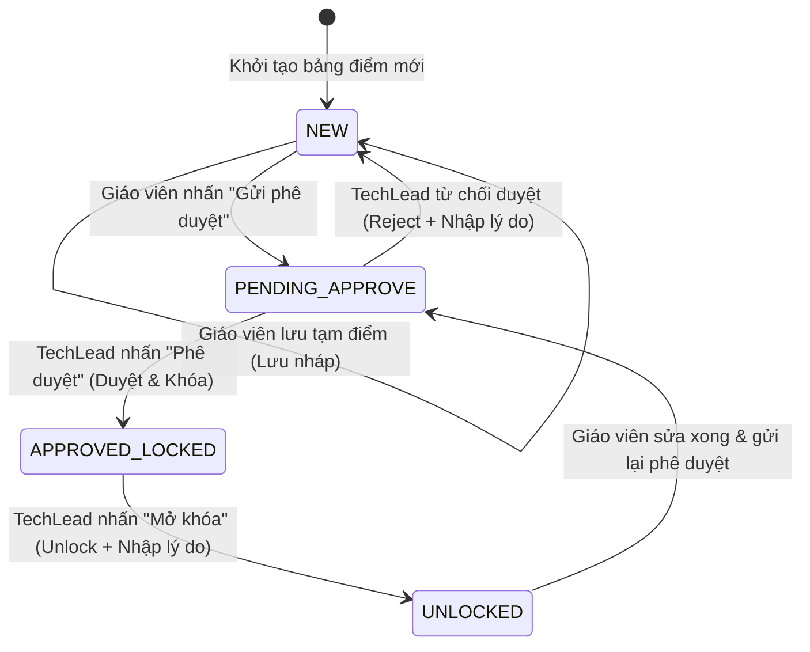

# Software Requirements Specification (SRS)
## Tính năng: QUAN-20260529-0952 - Quản lý điểm thi cuối kỳ

**Phiên bản:** v1.0  
**Ngày:** 2026-05-29  
**Chuẩn tài liệu:** IEEE 830-1998 / ONENET Solution Architecture Standard  

---

# 1. Introduction

## 1.1 Purpose
Tài liệu Đặc tả Yêu cầu Phần mềm (SRS) này mô tả chi tiết các yêu cầu nghiệp vụ, yêu cầu chức năng, phi chức năng, kiến trúc hệ thống và thiết kế dữ liệu cho tính năng **Quản lý điểm thi cuối kỳ** thuộc Dự án Hệ thống quản lý học sinh (`quanlyhocsinh`). 
Tài liệu này đóng vai trò là cơ sở kỹ thuật chính thống để đội ngũ Phát triển (Developers), Kiểm thử (QA/QC), Chuyên viên phân tích nghiệp vụ (BA) và Kiến trúc sư giải pháp (Solution Architect) của ONENET phối hợp triển khai, kiểm thử và bàn giao sản phẩm.

## 1.2 Scope
Tính năng Quản lý điểm thi cuối kỳ (Mã tính năng: `QUAN-20260529-0952`) nằm trong **Phân hệ Quản lý Học tập & Điểm số** của hệ thống `quanlyhocsinh`.

### 1.2.1 Phạm vi áp dụng (In-Scope)
*   **Quản lý nhập liệu:** Cho phép Giáo viên bộ môn nhập điểm thi cuối kỳ trực tiếp dạng bảng lưới (grid) theo Lớp học và Môn học được phân công.
*   **Kiểm soát và Ràng buộc (Validation):** Ràng buộc điểm số thực từ `0.0` đến `10.0`, giới hạn tối đa 1 chữ số thập phân.
*   **Audit Trail (Lưu vết lịch sử):** Bắt buộc nhập lý do khi sửa điểm và tự động ghi nhật ký hệ thống chi tiết (ai sửa, sửa lúc nào, giá trị cũ, giá trị mới, lý do).
*   **Tính toán và Xếp loại tự động:** 
    *   Tự động tính toán Điểm trung bình môn (ĐTB môn) dựa trên điểm thi cuối kỳ.
    *   Tự động tính Điểm trung bình học kỳ (ĐTB học kỳ) dựa trên trung bình cộng có trọng số (hệ số môn học/số tín chỉ) của các ĐTB môn.
    *   Tự động xếp loại học lực học sinh (Giỏi, Khá, Trung bình, Yếu) theo các ngưỡng điểm quy định.
*   **Quy trình phê duyệt (Workflow Approval):** Cơ chế gửi yêu cầu phê duyệt bảng điểm từ Giáo viên lên TechLead. Khóa dữ liệu (Read-only) ngay sau khi TechLead duyệt. Hỗ trợ TechLead mở khóa điểm (Unlock) ghi kèm lý do trong trường hợp đặc biệt.
*   **Báo cáo & Thống kê:**
    *   Xuất file bảng điểm lớp/môn học ra định dạng PDF chuẩn hóa.
    *   Biểu đồ và bảng thống kê phân bố học lực học sinh (Giỏi, Khá, TB, Yếu) theo từng lớp.

### 1.2.2 Ngoài phạm vi áp dụng (Out-of-Scope)
*   Quản lý các loại điểm thành phần khác (miệng, 15 phút, 1 tiết).
*   Quy trình nộp đơn, tiếp nhận và xử lý đơn phúc khảo điểm thi trực tuyến.
*   Gửi thông báo điểm tự động đến phụ huynh/học sinh qua SMS hoặc ứng dụng OTT (Zalo, Viber...).

## 1.3 Intended Audience
Tài liệu này được biên soạn dành cho:
*   **Đội ngũ Phát triển Phần mềm (Developers):** Sử dụng làm tài liệu hướng dẫn xây dựng cấu trúc DB, API Backend (.NET 10) và UI Component (ReactJS/Mantine UI).
*   **Đội ngũ Kiểm thử (QA/QC):** Sử dụng để viết kịch bản kiểm thử (Test Cases), kịch bản tự động hóa (Automation Test) và thực hiện UAT.
*   **TechLead / Quản trị viên hệ thống:** Hiểu rõ luồng xử lý dữ liệu và luồng phê duyệt để vận hành thực tế.
*   **Ban giám hiệu & Khách hàng:** Đánh giá mức độ đáp ứng yêu cầu nghiệp vụ của giải pháp phần mềm được đề xuất.

---

# 2. Overall Description

## 2.1 Product Perspective
Tính năng Quản lý điểm thi cuối kỳ là một module cốt lõi trong Phân hệ Quản lý Học tập & Điểm số, tích hợp chặt chẽ với hai phân hệ nền tảng là **Quản lý Lớp học** (lấy danh sách học sinh, giáo viên chủ nhiệm) và **Quản lý Môn học** (lấy danh mục môn học, số tín chỉ, hệ số môn để tính toán điểm). 

Hệ thống hoạt động theo mô hình Web Application hiện đại, phân tách hoàn toàn giữa Frontend (giao diện người dùng tương tác) và API Backend (nơi thực thi nghiệp vụ, kiểm tra ràng buộc và lưu trữ dữ liệu).

```
┌────────────────────────────────────────────────────────────────────────┐
│                   Hệ thống quản lý học sinh (quanlyhocsinh)             │
│                                                                        │
│ ┌────────────────────────┐  ┌──────────────────────┐  ┌──────────────┐ │
│ │  Phân hệ Quản lý Lớp   │  │ Phân hệ Quản lý Môn  │  │ Phân quyền   │ │
│ └───────────┬────────────┘  └──────────┬───────────┘  └──────┬───────┘ │
│             │                          │                     │         │
│             └─────────────────┐        │        ┌────────────┘         │
│                               ▼        ▼        ▼                      │
│                ┌──────────────────────────────────────┐                │
│                │   Phân hệ Quản lý Học tập & Điểm số  │                │
│                │  (Feature: QUAN-20260529-0952)       │                │
│                └──────────────────┬───────────────────┘                │
│                                   │                                    │
│                                   ▼                                    │
│                         [Báo cáo & Thống kê PDF]                       │
└────────────────────────────────────────────────────────────────────────┘
```

## 2.2 User Roles
Hệ thống phân quyền chi tiết dựa trên các vai trò người dùng sau (RBAC):

| Vai trò | Mô tả chức năng chính trên hệ thống |
| :--- | :--- |
| **Giáo viên bộ môn (Teacher)** | - Chọn lớp học và môn học được phân công giảng dạy.<br>- Nhập điểm, chỉnh sửa điểm (kèm lý do) khi bảng điểm chưa khóa.<br>- Gửi yêu cầu phê duyệt bảng điểm lên TechLead.<br>- Xem bảng điểm lớp và xuất PDF. |
| **TechLead (Tổ trưởng/Admin)** | - Xem danh sách bảng điểm đang chờ phê duyệt.<br>- Thực hiện duyệt bảng điểm (hệ thống sẽ tự động khóa điểm).<br>- Thực hiện mở khóa điểm (Unlock) trong trường hợp đặc biệt (bắt buộc nhập lý do).<br>- Xem báo cáo thống kê phân bổ học lực và xuất PDF. |
| **Học sinh / Phụ huynh** | - Đăng nhập vào cổng thông tin cá nhân.<br>- Xem bảng điểm thi cuối kỳ, ĐTB môn học, ĐTB học kỳ và xếp loại học lực của chính học sinh đó (không được xem điểm của học sinh khác). |
| **Ban giám hiệu (School Board)**| - Xem toàn bộ bảng điểm các lớp học, môn học trong toàn trường.<br>- Xem biểu đồ thống kê chất lượng học lực theo khối/lớp.<br>- Xuất file PDF bảng điểm lưu trữ. |

## 2.3 Technology Stack
Kiến trúc tổng thể của tính năng được thiết kế dựa trên các công nghệ hiện đại, bảo mật cao và tối ưu hiệu năng:

### Backend
*   **Framework:** .NET 10 (C#) Web API.
*   **Kiến trúc:** Clean Architecture (API, Application, Domain, Infrastructure), kết hợp Mediator Pattern (MediatR library) để phân tách Command & Query (CQRS style).
*   **Database Access:** Entity Framework Core (EF Core) sử dụng cơ chế Code-First để quản lý DB Migration.
*   **Ràng buộc nghiệp vụ:** FluentValidation để kiểm tra dữ liệu đầu vào tự động ở tầng Application.

### Frontend
*   **Framework:** ReactJS (TypeScript) phiên bản 18+.
*   **UI Library:** Mantine UI v7 (thư viện component tối ưu, hỗ trợ DataGrid và Responsive Design tốt).
*   **State Management & API Client:** Axios kết hợp React Query (TanStack Query) cho việc caching và quản lý trạng thái API đồng bộ.

### Database
*   **RDBMS:** PostgreSQL v16+ (Hệ quản trị cơ sở dữ liệu quan hệ mã nguồn mở mạnh mẽ, hỗ trợ lưu trữ kiểu dữ liệu JSONB cho logging và đảm bảo tính toàn vẹn dữ liệu cao thông qua các ràng buộc khóa ngoại, transaction).

### Architecture
*   **Monolithic Architecture:** Thiết kế dạng Modular Monolith, đảm bảo việc triển khai và kiểm thử dễ dàng nhưng vẫn tách biệt các module nghiệp vụ thông qua cấu trúc thư mục rõ ràng.
*   **RESTful API:** Các API endpoint được chuẩn hóa theo chuẩn REST, dữ liệu truyền nhận dạng JSON, bảo mật bằng JWT Token (được mã hóa).

---

# 3. Functional Requirements

Hệ thống đáp ứng đầy đủ các yêu cầu chức năng sau đây. Tất cả các yêu cầu được định danh bằng mã duy nhất bắt đầu bằng tiền tố `QUAN-20260529-0952-`.

### QUAN-20260529-0952-SRS01: Nhập điểm thi cuối kỳ
*   **Mô tả:** Hệ thống cung cấp giao diện bảng lưới (Data Grid) cho phép Giáo viên bộ môn chọn Học kỳ, Lớp học và Môn học được phân công để nhập điểm thi trực tiếp cho toàn bộ học sinh trong danh sách.
*   **Tác nhân:** Giáo viên bộ môn (Teacher).
*   **Điều kiện tiên quyết:** Giáo viên đã được phân công dạy môn học đó tại lớp học đó trong phân hệ Quản lý Lớp học. Trạng thái bảng điểm là `NEW` (Mới tạo) hoặc `UNLOCKED` (Mở khóa).
*   **Luồng xử lý chính:**
    1. Giáo viên truy cập màn hình "Nhập điểm thi".
    2. Chọn Học kỳ, Lớp học, Môn học từ danh sách thả xuống (Dropdown).
    3. Hệ thống tải lên danh sách học sinh kèm theo ô nhập điểm cho mỗi học sinh.
    4. Giáo viên thực hiện nhập điểm số và nhấn nút "Lưu tạm".
    5. Hệ thống kiểm tra dữ liệu hợp lệ (Validation). Nếu hợp lệ, lưu vào cơ sở dữ liệu dưới trạng thái `NEW`.
*   **Luồng ngoại lệ:** Nếu Giáo viên chọn lớp/môn không được phân công hoặc bảng điểm đã khóa (`APPROVED_LOCKED`), hệ thống sẽ hiển thị thông báo lỗi "Bạn không có quyền chỉnh sửa bảng điểm này" và chuyển bảng dữ liệu sang trạng thái Read-only.

### QUAN-20260529-0952-SRS02: Sửa điểm & Ghi nhận Audit Trail
*   **Mô tả:** Cho phép Giáo viên chỉnh sửa điểm thi đã nhập của học sinh khi bảng điểm chưa bị khóa. Mỗi hành động chỉnh sửa phải đi kèm lý do bắt buộc và hệ thống phải tự động lưu vết vào nhật ký hệ thống.
*   **Tác nhân:** Giáo viên bộ môn (Teacher).
*   **Điều kiện tiên quyết:** Bảng điểm có trạng thái là `NEW` hoặc `UNLOCKED`.
*   **Luồng xử lý chính:**
    1. Giáo viên kích hoạt chế độ chỉnh sửa trên dòng điểm của học sinh cần sửa.
    2. Giáo viên nhập điểm mới. Hệ thống hiển thị một hộp thoại (Modal popup) yêu cầu nhập "Lý do chỉnh sửa điểm" (Không được để trống và tối thiểu 10 ký tự).
    3. Giáo viên nhập lý do và bấm "Xác nhận".
    4. Hệ thống thực thi đồng thời: cập nhật điểm mới vào bảng điểm và ghi chép 1 dòng log chi tiết vào bảng `AuditTrailLog`.
*   **Luồng ngoại lệ:** Nếu Giáo viên cố tình để trống trường lý do hoặc nhập dưới 10 ký tự, nút "Xác nhận" sẽ bị vô hiệu hóa (Disabled) và hiển thị thông báo "Vui lòng nhập lý do chỉnh sửa chi tiết".

### QUAN-20260529-0952-SRS03: Tra cứu điểm cá nhân
*   **Mô tả:** Cho phép Học sinh và Phụ huynh đăng nhập để xem chi tiết bảng điểm cá nhân gồm điểm thi cuối kỳ, ĐTB môn học, ĐTB học kỳ và xếp loại tương ứng.
*   **Tác nhân:** Học sinh / Phụ huynh (Student/Parent).
*   **Điều kiện tiên quyết:** Bảng điểm của lớp tương ứng đã chuyển sang trạng thái `APPROVED_LOCKED` (Đã được TechLead phê duyệt).
*   **Luồng xử lý chính:**
    1. Người dùng đăng nhập tài khoản học sinh/phụ huynh.
    2. Chọn tab "Kết quả học tập" và chọn Học kỳ/Năm học cần xem.
    3. Hệ thống truy vấn điểm của chính học sinh đó và hiển thị trực quan lên màn hình.
*   **Luồng ngoại lệ:** Nếu bảng điểm của lớp chưa được phê duyệt (trạng thái `NEW` hoặc `PENDING_APPROVE`), điểm thi cuối kỳ của môn học đó sẽ không được hiển thị cho học sinh/phụ huynh (tránh hiển thị điểm chưa chính thức).

### QUAN-20260529-0952-SRS04: Xem bảng điểm lớp học
*   **Mô tả:** Hiển thị danh sách bảng điểm đầy đủ của tất cả học sinh trong một lớp theo môn học được lựa chọn.
*   **Tác nhân:** Giáo viên bộ môn, TechLead, Ban giám hiệu (BGH).
*   **Điều kiện tiên quyết:** Người dùng đã đăng nhập hệ thống với các quyền tương ứng.
*   **Luồng xử lý chính:**
    1. Người dùng chọn Lớp học và Môn học.
    2. Hệ thống tải danh sách học sinh của lớp cùng cột điểm thi cuối kỳ, ĐTB môn tương ứng.
    3. Trạng thái của bảng điểm (`Mới tạo`, `Chờ phê duyệt`, `Đã duyệt & Khóa`) được hiển thị nổi bật ở góc trên màn hình.

### QUAN-20260529-0952-SRS05: Tự động tính điểm trung bình
*   **Mô tả:** Hệ thống tự động tính toán Điểm trung bình môn (ĐTB môn) và Điểm trung bình học kỳ (ĐTB học kỳ) dựa trên công thức quy định.
*   **Tác nhân:** Hệ thống (System).
*   **Luồng xử lý:** 
    *   **Điểm trung bình môn (ĐTB môn):** Do phạm vi dự án chỉ tập trung vào điểm thi cuối kỳ, nên:
        $$\text{ĐTB môn} = \text{Điểm thi cuối kỳ}$$
    *   **Điểm trung bình học kỳ (ĐTB học kỳ):** Tính toán khi toàn bộ các môn học của học sinh trong học kỳ đó đã có điểm thi. Công thức tính trung bình cộng có trọng số theo số tín chỉ/hệ số môn học:
        $$\text{ĐTB học kỳ} = \frac{\sum_{i=1}^{n} (\text{ĐTB môn}_i \times \text{Hệ số môn}_i)}{\sum_{i=1}^{n} \text{Hệ số môn}_i}$$
        *Trong đó:* $n$ là tổng số môn học học sinh đăng ký trong học kỳ, $\text{Hệ số môn}_i$ lấy từ Phân hệ Quản lý Môn học. Kết quả được làm tròn đến 1 chữ số thập phân.

### QUAN-20260529-0952-SRS06: Tự động xếp loại học lực
*   **Mô tả:** Dựa trên Điểm trung bình học kỳ (ĐTB học kỳ) đã tính ở bước trên, hệ thống tự động gán nhãn xếp loại học lực cho từng học sinh.
*   **Tác nhân:** Hệ thống (System).
*   **Luồng xử lý:** Hệ thống áp dụng cấu trúc rẽ nhánh tự động sau:
    *   $\text{ĐTB học kỳ} \ge 8.0 \implies$ Xếp loại: **Giỏi**
    *   $6.5 \le \text{ĐTB học kỳ} < 8.0 \implies$ Xếp loại: **Khá**
    *   $5.0 \le \text{ĐTB học kỳ} < 6.5 \implies$ Xếp loại: **Trung bình**
    *   $\text{ĐTB học kỳ} < 5.0 \implies$ Xếp loại: **Yếu**

### QUAN-20260529-0952-SRS07: Kiểm tra dữ liệu nhập (Validation)
*   **Mô tả:** Hệ thống thực hiện kiểm tra dữ liệu điểm thi ngay tại màn hình nhập điểm (Client-side) và kiểm tra lại một lần nữa tại API Backend (Server-side) trước khi lưu trữ.
*   **Tác nhân:** Hệ thống (System).
*   **Luồng xử lý:** 
    *   Điểm nhập vào phải là kiểu số thực nằm trong đoạn $[0.0, 10.0]$.
    *   Phần thập phân tối đa là 1 chữ số (ví dụ: `7.5` hợp lệ; `7.55` hoặc `11.0` không hợp lệ).
    *   Nếu nhập sai định dạng, ô nhập liệu đổi sang màu đỏ, hiển thị tooltip cảnh báo lỗi và nút "Lưu tạm" bị khóa.

### QUAN-20260529-0952-SRS08: Xuất bảng điểm lớp ra file PDF
*   **Mô tả:** Cho phép người dùng kết xuất và tải xuống bảng điểm của lớp học theo môn học dưới định dạng PDF chuẩn hóa của nhà trường.
*   **Tác nhân:** Giáo viên bộ môn, TechLead, Ban giám hiệu.
*   **Luồng xử lý chính:**
    1. Người dùng bấm nút "Xuất PDF" trên thanh công cụ của bảng điểm lớp.
    2. Hệ thống gọi Service tạo file PDF tại Backend, kết xuất dữ liệu điểm hiện tại thành biểu mẫu bao gồm: Tiêu đề trường học, Tên lớp, Tên môn học, Học kỳ, Danh sách học sinh (STT, Mã học sinh, Họ tên, Điểm thi, ĐTB, Xếp loại) và phần ký tên của Giáo viên & TechLead.
    3. Trình duyệt tự động tải file PDF về máy người dùng trong vòng 3 giây.

### QUAN-20260529-0952-SRS09: Thống kê học lực lớp học
*   **Mô tả:** Hệ thống tổng hợp số liệu và hiển thị biểu đồ phân bố xếp loại học lực (Giỏi, Khá, TB, Yếu) theo từng lớp học phục vụ cho công tác đánh giá của TechLead và Ban giám hiệu.
*   **Tác nhân:** TechLead, Ban giám hiệu.
*   **Luồng xử lý chính:**
    1. Người dùng truy cập menu "Báo cáo thống kê".
    2. Chọn Khối học và Lớp học.
    3. Hệ thống hiển thị:
        *   Biểu đồ hình tròn (Pie Chart) biểu diễn tỷ lệ phần trăm các loại học lực.
        *   Bảng số liệu chi tiết: Số lượng học sinh đạt mỗi loại, tỷ lệ % tương ứng.

### QUAN-20260529-0952-SRS10: Quy trình phê duyệt & Khóa điểm
*   **Mô tả:** Quản lý quy trình luân chuyển trạng thái bảng điểm từ khi tạo mới đến khi được phê duyệt và khóa an toàn.
*   **Tác nhân:** Giáo viên bộ môn, TechLead.
*   **Luồng xử lý chính:**
    1. Giáo viên sau khi hoàn tất nhập điểm, nhấn nút "Gửi phê duyệt". Trạng thái chuyển từ `NEW` sang `PENDING_APPROVE`.
    2. Hệ thống gửi thông báo yêu cầu phê duyệt cho TechLead phụ trách.
    3. TechLead kiểm tra dữ liệu bảng điểm.
        *   **Trường hợp 1 (Từ chối - Reject):** TechLead nhấn "Từ chối", hệ thống yêu cầu nhập lý do từ chối. Trạng thái bảng điểm quay về `NEW`, mở lại quyền sửa cho Giáo viên.
        *   **Trường hợp 2 (Phê duyệt - Approve):** TechLead nhấn "Phê duyệt". Trạng thái chuyển sang `APPROVED_LOCKED`. Toàn bộ dữ liệu điểm của lớp/môn này bị khóa (Read-only đối với tất cả mọi người, trừ TechLead).
    4. **Trường hợp khẩn cấp (Unlock):** Nếu cần sửa điểm sau khi đã khóa, TechLead bấm "Mở khóa điểm", nhập lý do mở khóa bắt buộc. Hệ thống chuyển trạng thái về `UNLOCKED` (tương đương `NEW`), ghi nhận log mở khóa và cho phép Giáo viên sửa lại điểm.

---

# 4. External Interface Requirements

## 4.1 User Interface
Giao diện người dùng được thiết kế hiện đại, tinh gọn và nhất quán theo chuẩn Mantine UI.

### 4.1.1 Màn hình nhập điểm thi cuối kỳ (Giáo viên)
*   **Vùng lọc dữ liệu:** Nằm phía trên cùng gồm 3 Dropdown: Học kỳ, Lớp học, Môn học. Kèm nút "Tìm kiếm" và nút trạng thái bảng điểm (Badge hiển thị: `Mới tạo` - Màu xám, `Chờ duyệt` - Màu cam, `Đã duyệt & Khóa` - Màu xanh lá).
*   **Bảng nhập điểm (Data Grid):**
    *   Các cột: STT, Mã Học Sinh, Họ và Tên, Điểm Thi Cuối Kỳ (ô nhập liệu trực tiếp), Điểm TB Môn (Chỉ xem), Hành động (Xem lịch sử sửa điểm).
    *   Hỗ trợ phím tắt: Nhấn phím `Enter` hoặc phím mũi tên xuống `↓` để chuyển nhanh xuống ô nhập điểm của học sinh tiếp theo.
*   **Thanh công cụ dưới cùng (Action Bar):** Nút "Lưu tạm" (màu xanh dương), nút "Gửi phê duyệt" (màu xanh lá) và nút "Hủy bỏ" (màu đỏ).

### 4.1.2 Màn hình phê duyệt bảng điểm (TechLead)
*   Danh sách các lớp/môn đang chờ duyệt hiển thị dưới dạng thẻ (Cards) hoặc dòng danh sách kèm thông tin Giáo viên gửi, ngày gửi.
*   Nút bấm "Phê duyệt" và "Từ chối" nổi bật ở góc phải mỗi dòng. Khi bấm "Từ chối", hiển thị Modal bắt buộc nhập lý do từ chối.

### 4.1.3 Màn hình báo cáo thống kê (Ban giám hiệu)
*   Tích hợp thư viện biểu đồ trực quan (ví dụ: Chart.js hoặc Recharts được bọc trong Mantine components).
*   Giao diện responsive tương thích hoàn hảo với màn hình máy tính bảng (Tablet) và máy tính để bàn (Desktop).

## 4.2 API Interface
Hệ thống cung cấp các REST API bảo mật cho Frontend gọi dữ liệu. Định dạng dữ liệu trao đổi là JSON. Tất cả API yêu cầu Authorization Header dạng `Bearer <JWT_TOKEN>`.

### 4.2.1 Lấy danh sách học sinh để nhập điểm
*   **Endpoint:** `GET /api/v1/grades/classes/{classId}/subjects/{subjectId}`
*   **Response (200 OK):**
```json
{
  "classId": "CLASS-10A1",
  "className": "Lớp 10A1",
  "subjectId": "SUB-MATH",
  "subjectName": "Toán học",
  "status": "NEW",
  "students": [
    {
      "studentId": "STUD-001",
      "fullName": "Nguyễn Văn A",
      "examScore": 8.5,
      "averageScore": 8.5
    },
    {
      "studentId": "STUD-002",
      "fullName": "Trần Thị B",
      "examScore": null,
      "averageScore": null
    }
  ]
}
```

### 4.2.2 Lưu tạm bảng điểm thi
*   **Endpoint:** `POST /api/v1/grades/save-draft`
*   **Request Payload:**
```json
{
  "classId": "CLASS-10A1",
  "subjectId": "SUB-MATH",
  "semester": "HK1",
  "schoolYear": "2025-2026",
  "grades": [
    {
      "studentId": "STUD-001",
      "examScore": 8.5
    },
    {
      "studentId": "STUD-002",
      "examScore": 6.8
    }
  ]
}
```
*   **Response (200 OK):** `{"success": true, "message": "Lưu tạm bảng điểm thành công."}`

### 4.2.3 Ghi nhận sửa điểm đơn lẻ (Ghi log Audit Trail)
*   **Endpoint:** `PUT /api/v1/grades/update-score`
*   **Request Payload:**
```json
{
  "classId": "CLASS-10A1",
  "subjectId": "SUB-MATH",
  "studentId": "STUD-001",
  "oldScore": 8.0,
  "newScore": 8.5,
  "reason": "Chấm phúc khảo bài thi cuối kỳ"
}
```
*   **Response (200 OK):**
```json
{
  "success": true,
  "auditLogId": "LOG-99120",
  "updatedAt": "2026-05-29T10:15:30Z"
}
```

### 4.2.4 Phê duyệt hoặc Từ chối bảng điểm (TechLead)
*   **Endpoint:** `POST /api/v1/grades/approve-action`
*   **Request Payload:**
```json
{
  "classId": "CLASS-10A1",
  "subjectId": "SUB-MATH",
  "action": "APPROVE", // HOẶC "REJECT", "UNLOCK"
  "reason": "" // Bắt buộc nếu là REJECT hoặc UNLOCK
}
```
*   **Response (200 OK):** `{"success": true, "newStatus": "APPROVED_LOCKED"}`

## 4.3 Database Interface
Hệ thống sử dụng **PostgreSQL** làm cơ sở dữ liệu lưu trữ chính. 
*   **Kết nối dữ liệu:** Backend kết nối thông qua Connection Pool bảo mật cao, cấu hình trong ứng dụng thông qua biến môi trường (Environment Variable) được mã hóa.
*   **Giao dịch dữ liệu (Database Transaction):** Đối với các thao tác cập nhật điểm và ghi log Audit Trail, hệ thống bắt buộc chạy trong một `Transaction` chung. Nếu việc ghi log Audit Trail thất bại, toàn bộ quá trình cập nhật điểm thi phải được `Rollback` ngay lập tức để đảm bảo tính toàn vẹn dữ liệu.
*   **Index:** Đánh chỉ mục (Index) trên các cột thường xuyên tìm kiếm như `student_id`, `class_id`, `subject_id` để tối ưu hiệu năng truy vấn dữ liệu.

---

# 5. Non-functional Requirements

## Performance
*   **Thời gian phản hồi (Response Time):** 
    *   API lưu tạm bảng điểm cho một lớp học (tối đa 50 học sinh) phải hoàn thành trong thời gian dưới **2.0 giây** trong điều kiện mạng bình thường.
    *   Hệ thống thực hiện tính toán Điểm trung bình và Xếp loại học lực của một lớp học hoàn tất dưới **1.0 giây** ngay sau khi người dùng bấm Lưu.
    *   Thời gian tạo và tải xuống file PDF bảng điểm của lớp học không vượt quá **3.0 giây**.
*   **Khả năng chịu tải:** Hệ thống hỗ trợ tối thiểu **200 người dùng đồng thời (Concurrent Users)** thực hiện thao tác nhập điểm tại cùng một thời điểm cao điểm mà không bị sập hay treo hệ thống.

## Security
*   **Mã hóa dữ liệu:** 
    *   Toàn bộ kết nối giữa Client và Server bắt buộc sử dụng giao thức bảo mật mã hóa **HTTPS (TLS 1.3)**.
    *   Dữ liệu nhạy cảm trong Database (mật khẩu người dùng) phải được băm bằng thuật toán **BCrypt** trước khi lưu trữ.
*   **Kiểm soát truy cập (RBAC):**
    *   Phân quyền chi tiết đến từng API Endpoint. Giáo viên chỉ được quyền thao tác trên các lớp học và môn học được phân công theo bảng phân công giảng dạy. Hệ thống chặn đứng (Trả về mã lỗi HTTP 403 Forbidden) đối với mọi hành vi can thiệp trái phép.
    *   Học sinh/Phụ huynh đăng nhập chỉ có quyền gọi API truy vấn dữ liệu điểm của chính mã học sinh đó.

## Availability
*   **Uptime:** Cam kết tính sẵn sàng của hệ thống đạt tối thiểu **99.9%** trong suốt thời gian diễn ra kỳ thi và giai đoạn nhập điểm cuối kỳ.
*   **Backup & Khôi phục dữ liệu:** 
    *   Cơ chế tự động sao lưu dữ liệu điểm (Database Backup) định kỳ hàng ngày vào lúc **23:00** sang hệ thống lưu trữ độc lập (Cloud Storage).
    *   Thời gian khôi phục dữ liệu (RTO) tối đa khi xảy ra sự cố nghiêm trọng là **4 giờ**. Khả năng mất dữ liệu tối đa (RPO) là **24 giờ**.

## Scalability
*   **Khả năng mở rộng:** Hệ thống được thiết kế dạng stateless tại tầng API để dễ dàng mở rộng theo chiều ngang (Horizontal Scaling) bằng cách cấu hình chạy nhiều bản ghi (Pods) trong môi trường Docker/Kubernetes phía sau một Load Balancer (Nginx / AWS ALB).

## Maintainability
*   **Cấu trúc mã nguồn:** Mã nguồn viết theo chuẩn Clean Architecture, phân tách rõ ràng các tầng trách nhiệm. Mỗi hàm chức năng nghiệp vụ có độ dài không quá 100 dòng code để dễ dàng bảo trì và sửa lỗi.
*   **Reusable UI Components:** Tái sử dụng tối đa các thành phần giao diện của Mantine UI (như Table, Button, Notification, Modal) để đảm bảo tính đồng nhất giao diện và dễ dàng nâng cấp giao diện khi cần.
*   **Database Migration:** Mọi thay đổi về cấu trúc cơ sở dữ liệu phải được thực hiện thông qua công cụ Migration của EF Core, tuyệt đối không can thiệp sửa đổi trực tiếp DB bằng tay trên môi trường Production.

---

# 6. Data Requirements

Hệ thống thiết kế cơ sở dữ liệu quan hệ chuẩn hóa cao để lưu trữ dữ liệu điểm thi và lịch sử thay đổi. Dưới đây là mô hình thực thể mối quan hệ (ERD) và định nghĩa các bảng dữ liệu chính thức.

```mermaid
erDiagram
    CLASS ||--o{ STUDENT : "contains"
    CLASS ||--o{ GRADE_REPORT : "has"
    SUBJECT ||--o{ GRADE_REPORT : "has"
    GRADE_REPORT ||--o{ STUDENT_GRADE : "contains"
    STUDENT ||--o{ STUDENT_GRADE : "has"
    STUDENT_GRADE ||--o{ AUDIT_TRAIL_LOG : "logged"
    
    CLASS {
        varchar id PK
        varchar class_name
        varchar grade_level
        varchar school_year
    }

    STUDENT {
        varchar id PK
        varchar first_name
        varchar last_name
        varchar class_id FK
        date date_of_birth
    }

    SUBJECT {
        varchar id PK
        varchar subject_name
        int credit_count
        int factor
    }

    GRADE_REPORT {
        varchar id PK
        varchar class_id FK
        varchar subject_id FK
        varchar status "NEW / PENDING_APPROVE / APPROVED_LOCKED / UNLOCKED"
        varchar approved_by
        timestamp approved_at
        text reason_unlock
    }

    STUDENT_GRADE {
        varchar id PK
        varchar grade_report_id FK
        varchar student_id FK
        numeric final_exam_score
        numeric subject_average_score
        timestamp created_at
        timestamp updated_at
    }

    AUDIT_TRAIL_LOG {
        varchar id PK
        timestamp timestamp
        varchar actor_id
        varchar actor_username
        varchar student_id FK
        varchar student_name
        varchar subject_id
        varchar class_id
        numeric old_value
        numeric new_value
        text modification_reason
    }
```

### 6.1 Bảng Lớp học (classes)
Lưu trữ thông tin danh sách các lớp học trong trường học.
```sql
CREATE TABLE classes (
    id VARCHAR(50) PRIMARY KEY,
    class_name VARCHAR(100) NOT NULL,
    grade_level VARCHAR(20) NOT NULL, -- Khối học (Ví dụ: 10, 11, 12)
    school_year VARCHAR(20) NOT NULL, -- Niên khóa (Ví dụ: 2025-2026)
    created_at TIMESTAMP DEFAULT CURRENT_TIMESTAMP
);
```

### 6.2 Bảng Môn học (subjects)
Lưu trữ danh mục môn học của trường.
```sql
CREATE TABLE subjects (
    id VARCHAR(50) PRIMARY KEY,
    subject_name VARCHAR(100) NOT NULL,
    credit_count INT NOT NULL DEFAULT 1, -- Số tín chỉ hoặc số tiết
    factor INT NOT NULL DEFAULT 1, -- Hệ số môn học dùng để tính ĐTB học kỳ
    created_at TIMESTAMP DEFAULT CURRENT_TIMESTAMP
);
```

### 6.3 Bảng Báo cáo điểm (grade_reports)
Lưu trữ trạng thái phê duyệt bảng điểm thi cuối kỳ của từng lớp học theo môn học.
```sql
CREATE TABLE grade_reports (
    id VARCHAR(50) PRIMARY KEY,
    class_id VARCHAR(50) REFERENCES classes(id) ON DELETE RESTRICT,
    subject_id VARCHAR(50) REFERENCES subjects(id) ON DELETE RESTRICT,
    status VARCHAR(30) NOT NULL DEFAULT 'NEW', -- Trạng thái: NEW, PENDING_APPROVE, APPROVED_LOCKED, UNLOCKED
    approved_by VARCHAR(50), -- Người duyệt (TechLead Username)
    approved_at TIMESTAMP, -- Ngày giờ duyệt
    reason_unlock TEXT, -- Lý do mở khóa (nếu có)
    created_at TIMESTAMP DEFAULT CURRENT_TIMESTAMP
);
```

### 6.4 Bảng Chi tiết điểm học sinh (student_grades)
Lưu trữ điểm thi chi tiết của từng học sinh đối với bảng điểm môn học tương ứng.
```sql
CREATE TABLE student_grades (
    id VARCHAR(50) PRIMARY KEY,
    grade_report_id VARCHAR(50) REFERENCES grade_reports(id) ON DELETE CASCADE,
    student_id VARCHAR(50) REFERENCES students(id) ON DELETE RESTRICT,
    final_exam_score NUMERIC(3, 1), -- Điểm thi cuối kỳ (0.0 đến 10.0)
    subject_average_score NUMERIC(3, 1), -- Điểm trung bình môn
    created_at TIMESTAMP DEFAULT CURRENT_TIMESTAMP,
    updated_at TIMESTAMP DEFAULT CURRENT_TIMESTAMP
);
```

### 6.5 Bảng Nhật ký thay đổi điểm (audit_trail_logs)
Lưu giữ vết lịch sử thay đổi điểm số phục vụ mục đích thanh tra và kiểm soát dữ liệu.
```sql
CREATE TABLE audit_trail_logs (
    id VARCHAR(50) PRIMARY KEY,
    timestamp TIMESTAMP NOT NULL DEFAULT CURRENT_TIMESTAMP,
    actor_id VARCHAR(50) NOT NULL, -- ID của người sửa (Giáo viên hoặc TechLead)
    actor_username VARCHAR(100) NOT NULL, -- Username của người sửa
    student_id VARCHAR(50) NOT NULL,
    student_name VARCHAR(150) NOT NULL,
    subject_id VARCHAR(50) NOT NULL,
    class_id VARCHAR(50) NOT NULL,
    old_value NUMERIC(3, 1), -- Điểm số trước khi sửa (NULL nếu nhập mới)
    new_value NUMERIC(3, 1) NOT NULL, -- Điểm số sau khi sửa
    modification_reason TEXT NOT NULL -- Lý do sửa điểm (Bắt buộc)
);
```

---

# 7. Business Rules

### BR-1: Quy tắc ràng buộc nhập điểm thi
*   Điểm thi cuối kỳ phải là một số thực nằm trong đoạn đóng $[0.0, 10.0]$.
*   Chấp nhận các giá trị có một chữ số thập phân (Ví dụ: `8.5`, `9.0`, `4.3`). Hệ thống tự động báo lỗi và không cho phép lưu nếu nhập các giá trị sai định dạng như `9.25`, `10.5`, `-1.0` hoặc ký tự chữ cái.

### BR-2: Quy tắc xếp loại học lực học sinh
Hệ thống tính toán Điểm trung bình học kỳ (ĐTB HK) làm tròn tới 1 chữ số thập phân và thực hiện xếp loại học lực tự động theo các ngưỡng sau:
*   Nếu $\text{ĐTB HK} \ge 8.0$: Học lực **Giỏi**
*   Nếu $6.5 \le \text{ĐTB HK} < 8.0$: Học lực **Khá**
*   Nếu $5.0 \le \text{ĐTB HK} < 6.5$: Học lực **Trung bình**
*   Nếu $\text{ĐTB HK} < 5.0$: Học lực **Yếu**

### BR-3: Quy tắc luân chuyển trạng thái và Khóa điểm
Quy trình luân chuyển trạng thái bảng điểm bắt buộc tuân theo sơ đồ chuyển trạng thái dưới đây:



*   **Trạng thái APPROVED_LOCKED (Đã duyệt & Khóa):** Toàn bộ giao diện nhập điểm của lớp học/môn học đó sẽ bị khóa hoàn toàn. Chức năng lưu, chỉnh sửa điểm bị vô hiệu hóa (Read-only) đối với Giáo viên bộ môn.
*   **Hành động Mở khóa (Unlock):** Chỉ tài khoản có vai trò **TechLead** mới được thực hiện nút chức năng "Mở khóa". Khi mở khóa, TechLead bắt buộc phải nhập lý do mở khóa chi tiết (lý do này được hệ thống tự động ghi nhận vào log hệ thống). Trạng thái bảng điểm chuyển về `UNLOCKED`, lúc này Giáo viên bộ môn mới có quyền chỉnh sửa lại điểm thi.

---

# 8. Acceptance Criteria

Để tính năng được chấp nhận bàn giao đưa vào vận hành, các kịch bản kiểm thử sau đây bắt buộc phải vượt qua kỳ đánh giá UAT (User Acceptance Testing):

| ID Kịch bản | Tên kịch bản kiểm thử | Dữ liệu đầu vào giả định | Hành động thực hiện | Kết quả mong đợi (Acceptance Criteria) |
| :--- | :--- | :--- | :--- | :--- |
| **UAT-01** | Nhập điểm hợp lệ | Lớp: 10A1, Môn: Toán.<br>Điểm nhập: `8.0`, `7.5`, `10.0`, `0.0` | Giáo viên nhập điểm cho danh sách học sinh và bấm "Lưu tạm". | Hệ thống lưu thành công vào Database. Hiển thị thông báo "Lưu tạm bảng điểm thành công". Điểm TB môn hiển thị đúng bằng điểm thi cuối kỳ. |
| **UAT-02** | Nhập điểm sai định dạng | Lớp: 10A1, Môn: Toán.<br>Điểm nhập: `10.5`, `-1.0`, `8.25`, `abc` | Giáo viên nhập vào các ô tương ứng. | Hệ thống chặn ngay tại giao diện, ô nhập đổi sang viền đỏ cảnh báo lỗi. Nút "Lưu tạm" bị vô hiệu hóa. |
| **UAT-03** | Chỉnh sửa điểm và lưu log | Lớp: 10A1, Môn: Toán.<br>Sửa điểm học sinh Nguyễn Văn A từ `8.0` thành `9.0` | Giáo viên sửa điểm, nhập lý do: "Nhập nhầm điểm thi từ giấy thi" (32 ký tự). Bấm xác nhận. | Hệ thống lưu điểm mới thành công. Bản ghi trong bảng `audit_trail_logs` được tạo chính xác với đầy đủ thông tin cũ, mới và lý do đã nhập. |
| **UAT-04** | Kiểm tra khóa điểm sau duyệt | Bảng điểm Lớp 10A1, Môn Toán đang ở trạng thái `PENDING_APPROVE` | TechLead bấm nút "Phê duyệt". | Trạng thái bảng điểm chuyển sang `APPROVED_LOCKED`. Giáo viên mở giao diện lên thấy toàn bộ bảng điểm bị mờ, không thể gõ hay sửa bất kỳ ô điểm nào. |
| **UAT-05** | TechLead mở khóa bảng điểm | Bảng điểm đang ở trạng thái `APPROVED_LOCKED` | TechLead bấm nút "Mở khóa", nhập lý do: "Phúc khảo bài thi" và bấm xác nhận. | Trạng thái bảng điểm chuyển về `UNLOCKED`. Giáo viên lấy lại quyền sửa điểm. Log hệ thống ghi nhận hành động mở khóa kèm lý do của TechLead. |

---

# 9. Assumptions & Dependencies

## 9.1 Assumptions (Giả định)
*   Mỗi học sinh chỉ thuộc về duy nhất một lớp học chính thức trong một niên khóa/học kỳ.
*   Hệ số của từng môn học (để tính toán Điểm trung bình học kỳ) được thiết lập cố định trước khi kỳ thi diễn ra và không thay đổi giữa chừng trong suốt học kỳ đó.
*   Thiết bị của Giáo viên (máy tính cá nhân, máy tính bảng) chạy các trình duyệt web phổ biến phiên bản mới nhất (Google Chrome, Microsoft Edge, Safari) hỗ trợ tốt thư viện JavaScript ReactJS và CSS của Mantine UI.

## 9.2 Dependencies (Sự phụ thuộc)
*   **Phân hệ Quản lý Lớp học (Core Dependency):** Tính năng này phụ thuộc hoàn toàn vào cơ sở dữ liệu học sinh và lớp học của Phân hệ Lớp học. Nếu phân hệ lớp học gặp sự cố không thể lấy danh sách học sinh, tính năng nhập điểm sẽ bị ngưng trệ.
*   **Phân hệ Quản lý Môn học (Core Dependency):** Phụ thuộc vào API lấy danh sách môn học và hệ số/tín chỉ môn học để tính ĐTB học kỳ.
*   **Dịch vụ Identity / IAM (Authen & Authorize):** Phụ thuộc vào hệ thống SSO/JWT Token dùng chung của dự án `quanlyhocsinh` để giải mã và trích xuất thông tin định danh (User ID, Role, Class Assignment) của người dùng đăng nhập.

---

# 10. Appendix

### 10.1 Giải thích thuật ngữ & Từ viết tắt

| Thuật ngữ / Viết tắt | Ý nghĩa giải thích đầy đủ |
| :--- | :--- |
| **SRS** | Software Requirements Specification (Đặc tả yêu cầu phần mềm). |
| **SAD** | System Architecture Design (Thiết kế kiến trúc hệ thống). |
| **RBAC** | Role-Based Access Control (Kiểm soát truy cập dựa trên vai trò người dùng). |
| **Audit Trail** | Lưu vết lịch sử (Nhật ký hệ thống ghi lại toàn bộ hành động chỉnh sửa dữ liệu để phục vụ hậu kiểm). |
| **ĐTB môn** | Điểm trung bình môn học. |
| **ĐTB học kỳ** | Điểm trung bình học kỳ (Trung bình cộng có trọng số của điểm trung bình tất cả các môn học). |
| **UAT** | User Acceptance Testing (Kiểm thử chấp nhận người dùng). |
| **BGH** | Ban giám hiệu nhà trường. |

### 10.2 Công thức tính toán nghiệp vụ chi tiết
*   **Công thức 1: Tính Điểm trung bình học kỳ ($\text{ĐTB HK}$)**
    $$\text{ĐTB HK} = \frac{\sum_{i=1}^{n} (\text{ĐTB môn}_i \times \text{Hệ số môn}_i)}{\sum_{i=1}^{n} \text{Hệ số môn}_i}$$
    *Trong đó:*
    *   $n$: Tổng số môn học học sinh học trong học kỳ đó.
    *   $\text{ĐTB môn}_i$: Điểm trung bình của môn học thứ $i$ (Lấy từ điểm thi cuối kỳ đã nhập).
    *   $\text{Hệ số môn}_i$: Hệ số trọng số của môn học thứ $i$ (Lấy từ bảng `subjects`, ví dụ: Toán hệ số 2, Giáo dục công dân hệ số 1).
    *   *Quy tắc làm tròn:* Kết quả phép chia được làm tròn số học thông thường về 1 chữ số thập phân (Ví dụ: `7.84` làm tròn thành `7.8`; `7.85` làm tròn thành `7.9`).