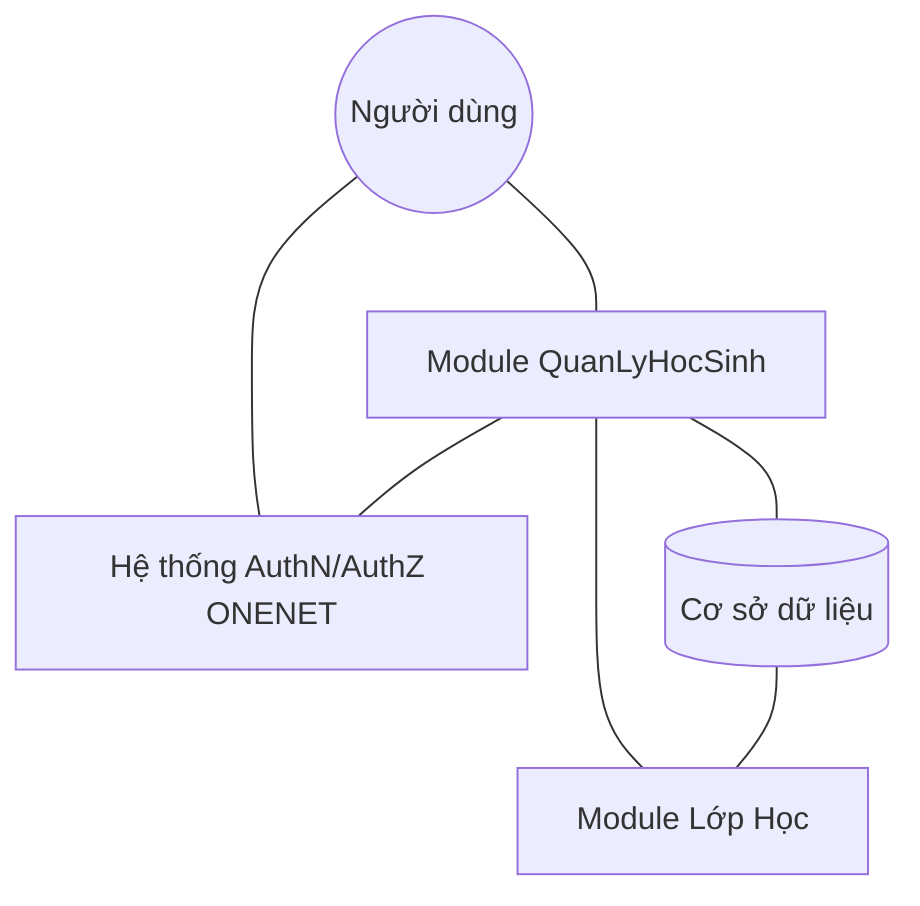
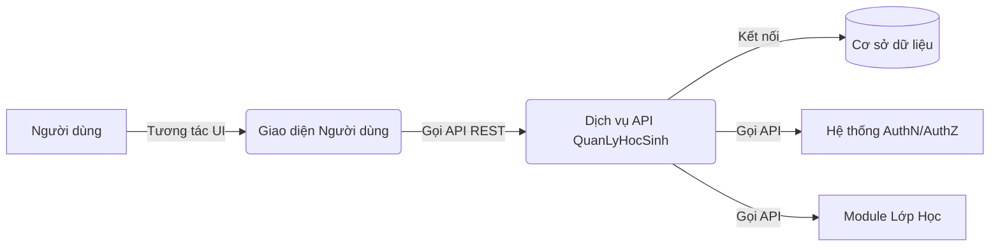
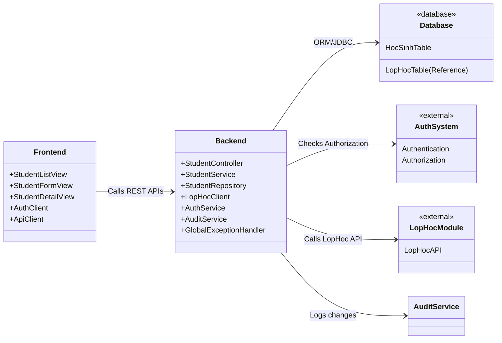
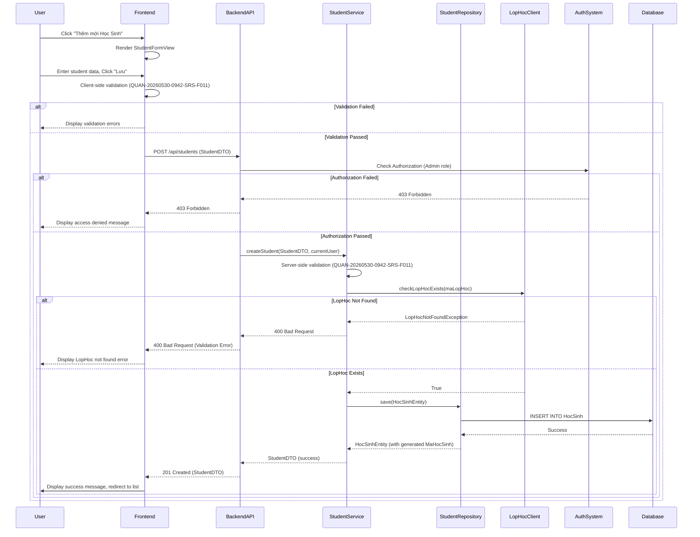

Tuyệt vời! Với vai trò là Solution Architect của ONENET, tôi sẽ phân tích BRD đã cung cấp để xây dựng Tài liệu Yêu cầu Phần mềm (SRS) và Tài liệu Kiến trúc Phần mềm (SAD) cho tính năng "QuanLyHocSinh".

---

## TÀI LIỆU YÊU CẦU PHẦN MỀM (SRS - Software Requirements Specification)

**Mã tài liệu:** QUAN-20260530-0942-SRS-V1.0
**Ngày ban hành:** 2026-05-30
**Phiên bản:** 1.0
**Trạng thái:** Bản nháp
**Dự án:** quanlyhocsinh
**Mã tính năng:** QUAN-20260530-0942
**Tên tính năng:** QuanLyHocSinh
**Người lập:** [Tên Solution Architect] - ONENET

---

### 1. Giới thiệu

#### 1.1. Mục đích
Tài liệu này mô tả các yêu cầu chức năng và phi chức năng cho tính năng "QuanLyHocSinh" trong hệ thống `quanlyhocsinh`. Nó phục vụ như một hướng dẫn cho đội ngũ phát triển, kiểm thử và các bên liên quan để đảm bảo sự hiểu biết chung về các yêu cầu của phần mềm.

#### 1.2. Phạm vi Sản phẩm
Tính năng "QuanLyHocSinh" sẽ cung cấp các công cụ quản lý toàn diện cho thông tin học sinh, bao gồm tạo, đọc, cập nhật, xóa (CRUD), kiểm tra tính hợp lệ dữ liệu (validation), tìm kiếm và phân trang. Đây là một module cốt lõi, cung cấp nền tảng dữ liệu cho các module quản lý khác trong tương lai như quản lý điểm, quản lý lớp học, v.v.

#### 1.3. Định nghĩa, Viết tắt và Thuật ngữ
*   **BRD:** Business Requirements Document (Tài liệu Yêu cầu Nghiệp vụ)
*   **SRS:** Software Requirements Specification (Tài liệu Yêu cầu Phần mềm)
*   **SAD:** Software Architecture Document (Tài liệu Kiến trúc Phần mềm)
*   **CRUD:** Create, Read, Update, Delete (Tạo, Đọc, Cập nhật, Xóa)
*   **UI/UX:** User Interface / User Experience (Giao diện Người dùng / Trải nghiệm Người dùng)
*   **NFR:** Non-Functional Requirement (Yêu cầu Phi chức năng)
*   **PK:** Primary Key (Khóa chính)
*   **FK:** Foreign Key (Khóa ngoại)
*   **API:** Application Programming Interface
*   **HTTP:** Hypertext Transfer Protocol
*   **REST:** Representational State Transfer
*   **Soft Delete:** Xóa mềm (thay đổi trạng thái thay vì xóa vật lý khỏi cơ sở dữ liệu)

#### 1.4. Tài liệu Tham chiếu
*   BRD-QUAN-20260530-0942-V1.0 - Tài liệu Phân tích Yêu cầu Nghiệp vụ cho tính năng QuanLyHocSinh.

### 2. Mô tả Tổng thể

#### 2.1. Quan điểm Sản phẩm
Tính năng QuanLyHocSinh là một module tích hợp trong hệ thống quản lý trường học `quanlyhocsinh`. Nó sẽ tương tác với module quản lý Lớp học để lấy thông tin về các lớp hiện có và hệ thống xác thực/ủy quyền người dùng hiện có của ONENET.

#### 2.2. Các Chức năng Sản phẩm
Các chức năng chính được cung cấp bởi module QuanLyHocSinh bao gồm:
*   Xem danh sách học sinh với khả năng tìm kiếm và phân trang.
*   Thêm mới thông tin học sinh.
*   Xem chi tiết thông tin học sinh.
*   Cập nhật thông tin học sinh.
*   Xóa học sinh (soft delete).
*   Kiểm tra tính hợp lệ của dữ liệu khi nhập/cập nhật.
*   Quản lý quyền truy cập dựa trên vai trò người dùng.

#### 2.3. Đối tượng Người dùng và Đặc điểm
*   **Quản trị viên (Admin):**
    *   Vai trò: Có toàn quyền thực hiện các thao tác CRUD (Thêm, Xem, Cập nhật, Xóa) thông tin học sinh.
    *   Đặc điểm: Người dùng có kiến thức chuyên sâu về hệ thống, chịu trách nhiệm quản lý dữ liệu gốc.
*   **Giáo viên (Teacher):**
    *   Vai trò: Chỉ có quyền xem danh sách học sinh, xem chi tiết học sinh, tìm kiếm và phân trang.
    *   Đặc điểm: Người dùng cần truy cập thông tin học sinh để phục vụ công tác giảng dạy và quản lý lớp học.

#### 2.4. Môi trường Hoạt động
Hệ thống sẽ hoạt động trên môi trường web, có thể truy cập thông qua các trình duyệt hiện đại (Chrome, Firefox, Edge, Safari). Phía backend sẽ được triển khai trên môi trường máy chủ Linux/Windows Server, kết nối với cơ sở dữ liệu quan hệ.

#### 2.5. Các Ràng buộc Chung
*   Phải sử dụng công nghệ và framework đã được ONENET phê duyệt (ví dụ: Spring Boot cho Backend, React/Vue/Angular cho Frontend, PostgreSQL/MySQL cho Database).
*   Tuân thủ các quy định về bảo vệ dữ liệu cá nhân (GDPR, KVKK, v.v. nếu có).
*   Tuân thủ các hướng dẫn về bảo mật của ONENET.
*   Phải tích hợp với hệ thống xác thực và ủy quyền (AuthN/AuthZ) hiện có của ONENET.

#### 2.6. Giả định và Phụ thuộc
*   **Giả định:**
    *   Hệ thống AuthN/AuthZ đã được triển khai và hoạt động ổn định.
    *   Module quản lý Lớp học (LopHoc) đã tồn tại hoặc sẽ được phát triển song song, cung cấp API để tra cứu và xác thực `MaLopHoc`.
    *   Hạ tầng kỹ thuật (máy chủ, cơ sở dữ liệu, mạng) đủ mạnh để đáp ứng yêu cầu hiệu suất.
*   **Phụ thuộc:**
    *   Sự sẵn có của API từ module LopHoc để validate và hiển thị thông tin lớp học.
    *   Sự sẵn có của dịch vụ AuthN/AuthZ.

### 3. Yêu cầu Cụ thể

#### 3.1. Mô hình Dữ liệu (Conceptual Data Model)

**Thực thể: Học Sinh (HocSinh)**

| Trường dữ liệu     | Kiểu dữ liệu   | Mô tả                                        | Ràng buộc          | Ghi chú                                   |
| :----------------- | :------------- | :------------------------------------------- | :----------------- | :---------------------------------------- |
| `MaHocSinh`        | String (PK)    | Mã định danh duy nhất của học sinh           | Bắt buộc, Duy nhất | Tự động sinh hoặc nhập tùy cấu hình      |
| `HoTen`            | String         | Họ và tên đầy đủ của học sinh                | Bắt buộc           |                                           |
| `NgaySinh`         | Date           | Ngày sinh của học sinh                       | Bắt buộc           | Định dạng YYYY-MM-DD                      |
| `GioiTinh`         | String         | Giới tính của học sinh                       | Bắt buộc           | "Nam", "Nữ", "Khác"                       |
| `DiaChi`           | String         | Địa chỉ hiện tại của học sinh                | Tùy chọn           |                                           |
| `SoDienThoaiPH`    | String         | Số điện thoại liên hệ của phụ huynh          | Tùy chọn           | Định dạng số điện thoại Việt Nam          |
| `EmailPH`          | String         | Email liên hệ của phụ huynh                  | Tùy chọn           | Định dạng email hợp lệ                    |
| `MaLopHoc`         | String (FK)    | Mã lớp học mà học sinh đang theo học         | Bắt buộc           | Tham chiếu đến thực thể LớpHoc            |
| `TrangThai`        | String         | Trạng thái học sinh (Đang học, Thôi học...) | Bắt buộc           | Mặc định: "Đang học"                      |
| `NgayTao`          | DateTime       | Ngày học sinh được thêm vào hệ thống         | Tự động            | Ghi nhận thời gian UTC                    |
| `NguoiTao`         | String         | Người dùng đã tạo bản ghi này                | Tự động            | Tên đăng nhập hoặc ID người dùng          |
| `NgayCapNhatCuoi`  | DateTime       | Ngày bản ghi được cập nhật lần cuối          | Tự động            | Ghi nhận thời gian UTC                    |
| `NguoiCapNhatCuoi` | String         | Người dùng đã cập nhật bản ghi này           | Tự động            | Tên đăng nhập hoặc ID người dùng          |

**Thực thể: Lớp Học (LopHoc) - (Tham chiếu từ Module khác)**
*   `MaLopHoc` (PK): Mã định danh duy nhất của lớp học.
*   `TenLopHoc`: Tên của lớp học.

#### 3.2. Yêu cầu Chức năng (Functional Requirements)

##### 3.2.1. QUAN-20260530-0942-SRS-F001: Xem danh sách học sinh
*   **Mô tả:** Hệ thống phải hiển thị danh sách tất cả học sinh (có trạng thái không phải "Đã xóa") dưới dạng bảng.
*   **Điều kiện tiên quyết:** Người dùng đã đăng nhập và có quyền truy cập module QuanLyHocSinh (Admin hoặc Teacher).
*   **Đầu vào:** Yêu cầu tải trang danh sách học sinh.
*   **Đầu ra:** Bảng danh sách học sinh hiển thị các cột: Mã học sinh, Họ và tên, Ngày sinh, Giới tính, Lớp học, Trạng thái.
*   **Hành vi:**
    *   Danh sách phải được phân trang theo yêu cầu QUAN-20260530-0942-SRS-F010.
    *   Danh sách phải hỗ trợ tìm kiếm theo yêu cầu QUAN-20260530-0942-SRS-F009.
    *   Các cột Mã học sinh, Họ và tên có thể sắp xếp được.
    *   Mỗi dòng có các nút "Xem chi tiết", "Chỉnh sửa", "Xóa" (chỉ hiển thị cho Admin).
*   **Liên quan BRD:** QLHS.US.001

##### 3.2.2. QUAN-20260530-0942-SRS-F002: Thêm mới học sinh (Hiển thị Form)
*   **Mô tả:** Hệ thống phải cung cấp một form cho phép Quản trị viên nhập thông tin của một học sinh mới.
*   **Điều kiện tiên quyết:** Người dùng là Quản trị viên và đang ở trang danh sách học sinh hoặc có quyền truy cập vào chức năng thêm mới.
*   **Đầu vào:** Người dùng nhấp vào nút "Thêm mới Học Sinh".
*   **Đầu ra:** Một form nhập liệu trống với các trường theo mô hình dữ liệu HocSinh (trừ MaHocSinh nếu tự động sinh, NgayTao, NguoiTao, NgayCapNhatCuoi, NguoiCapNhatCuoi).
*   **Hành vi:**
    *   Form có các nút "Lưu" và "Hủy".
    *   Dropdown/combobox cho Giới tính, Lớp học (lấy từ module LopHoc), Trạng thái.
    *   Date picker cho Ngày sinh.
*   **Liên quan BRD:** QLHS.US.002

##### 3.2.3. QUAN-20260530-0942-SRS-F003: Thêm mới học sinh (Xử lý Lưu)
*   **Mô tả:** Hệ thống phải lưu thông tin học sinh mới vào cơ sở dữ liệu sau khi được Quản trị viên nhập và xác nhận.
*   **Điều kiện tiên quyết:** Form thêm mới đã được điền thông tin hợp lệ.
*   **Đầu vào:** Người dùng nhấp vào nút "Lưu" trong form thêm mới.
*   **Đầu ra:** Học sinh mới được thêm vào DB.
*   **Hành vi:**
    *   Dữ liệu nhập phải được kiểm tra tính hợp lệ (Client-side và Server-side) theo QUAN-20260530-0942-SRS-F011.
    *   Nếu dữ liệu hợp lệ: Hệ thống tạo bản ghi mới, tự động điền `MaHocSinh` (nếu cấu hình tự động), `NgayTao`, `NguoiTao`, `TrangThai` (mặc định "Đang học"), và `NgayCapNhatCuoi`, `NguoiCapNhatCuoi`.
    *   Sau khi lưu thành công: Hệ thống hiển thị thông báo thành công và chuyển về trang danh sách học sinh, hoặc trang chi tiết học sinh vừa tạo.
    *   Nếu dữ liệu không hợp lệ: Hệ thống hiển thị thông báo lỗi rõ ràng bên cạnh các trường bị lỗi và giữ lại dữ liệu đã nhập.
*   **Liên quan BRD:** QLHS.US.002

##### 3.2.4. QUAN-20260530-0942-SRS-F004: Xem chi tiết học sinh
*   **Mô tả:** Hệ thống phải hiển thị toàn bộ thông tin chi tiết của một học sinh cụ thể ở chế độ chỉ đọc.
*   **Điều kiện tiên quyết:** Người dùng đã đăng nhập và có quyền xem (Admin hoặc Teacher).
*   **Đầu vào:** Người dùng nhấp vào tên/mã học sinh hoặc nút "Xem chi tiết" từ danh sách.
*   **Đầu ra:** Một trang hoặc pop-up hiển thị tất cả các trường dữ liệu của học sinh được chọn.
*   **Hành vi:**
    *   Thông tin hiển thị ở chế độ chỉ đọc.
    *   Có nút "Quay lại" hoặc "Đóng".
*   **Liên quan BRD:** QLHS.US.003

##### 3.2.5. QUAN-20260530-0942-SRS-F005: Cập nhật thông tin học sinh (Hiển thị Form)
*   **Mô tả:** Hệ thống phải cung cấp một form cho phép Quản trị viên chỉnh sửa thông tin của một học sinh hiện có.
*   **Điều kiện tiên quyết:** Người dùng là Quản trị viên.
*   **Đầu vào:** Người dùng nhấp vào nút "Chỉnh sửa" từ danh sách hoặc trang chi tiết.
*   **Đầu ra:** Một form nhập liệu được điền sẵn thông tin hiện tại của học sinh được chọn.
*   **Hành vi:**
    *   Trường `MaHocSinh` phải ở chế độ chỉ đọc và không thể chỉnh sửa.
    *   Form có các nút "Lưu thay đổi" và "Hủy".
    *   Dropdown/combobox cho Giới tính, Lớp học, Trạng thái.
    *   Date picker cho Ngày sinh.
*   **Liên quan BRD:** QLHS.US.004

##### 3.2.6. QUAN-20260530-0942-SRS-F006: Cập nhật thông tin học sinh (Xử lý Lưu)
*   **Mô tả:** Hệ thống phải cập nhật thông tin học sinh vào cơ sở dữ liệu sau khi được Quản trị viên chỉnh sửa và xác nhận.
*   **Điều kiện tiên quyết:** Form chỉnh sửa đã được điền thông tin hợp lệ.
*   **Đầu vào:** Người dùng nhấp vào nút "Lưu thay đổi" trong form chỉnh sửa.
*   **Đầu ra:** Thông tin học sinh được cập nhật trong DB.
*   **Hành vi:**
    *   Dữ liệu nhập phải được kiểm tra tính hợp lệ (Client-side và Server-side) theo QUAN-20260530-0942-SRS-F011.
    *   Nếu dữ liệu hợp lệ: Hệ thống cập nhật bản ghi hiện có, tự động cập nhật `NgayCapNhatCuoi` và `NguoiCapNhatCuoi`.
    *   Sau khi lưu thành công: Hệ thống hiển thị thông báo thành công và chuyển về trang danh sách học sinh, hoặc trang chi tiết học sinh đã cập nhật.
    *   Nếu dữ liệu không hợp lệ: Hệ thống hiển thị thông báo lỗi rõ ràng bên cạnh các trường bị lỗi và giữ lại dữ liệu đã nhập.
*   **Liên quan BRD:** QLHS.US.004

##### 3.2.7. QUAN-20260530-0942-SRS-F007: Xóa học sinh (Xác nhận)
*   **Mô tả:** Hệ thống phải hiển thị hộp thoại xác nhận trước khi thực hiện hành động xóa học sinh.
*   **Điều kiện tiên quyết:** Người dùng là Quản trị viên.
*   **Đầu vào:** Người dùng nhấp vào nút "Xóa" từ danh sách học sinh.
*   **Đầu ra:** Hộp thoại xác nhận với nội dung (ví dụ: "Bạn có chắc chắn muốn xóa học sinh [Tên học sinh] không?") và các nút "Xác nhận" và "Hủy".
*   **Hành vi:**
    *   Nếu người dùng chọn "Hủy", thao tác xóa bị hủy bỏ.
    *   Nếu người dùng chọn "Xác nhận", hệ thống tiến hành xóa học sinh.
*   **Liên quan BRD:** QLHS.US.005

##### 3.2.8. QUAN-20260530-0942-SRS-F008: Xóa học sinh (Xử lý Soft Delete)
*   **Mô tả:** Hệ thống phải thực hiện xóa mềm (soft delete) một học sinh bằng cách cập nhật trường `TrangThai` thành "Thôi học" hoặc "Đã xóa".
*   **Điều kiện tiên quyết:** Người dùng là Quản trị viên và đã xác nhận xóa.
*   **Đầu vào:** Người dùng xác nhận xóa học sinh.
*   **Đầu ra:** Trạng thái của học sinh được cập nhật trong DB.
*   **Hành vi:**
    *   Trường `TrangThai` của học sinh được cập nhật thành một giá trị biểu thị đã xóa (ví dụ: "Thôi học" hoặc "Đã xóa").
    *   Học sinh này sẽ không xuất hiện trong danh sách mặc định khi xem danh sách (QUAN-20260530-0942-SRS-F001).
    *   Hệ thống hiển thị thông báo thành công.
    *   Nếu có lỗi, hiển thị thông báo lỗi.
*   **Liên quan BRD:** QLHS.US.005

##### 3.2.9. QUAN-20260530-0942-SRS-F009: Tìm kiếm học sinh
*   **Mô tả:** Hệ thống phải cho phép người dùng (Admin hoặc Teacher) tìm kiếm học sinh theo các tiêu chí khác nhau.
*   **Điều kiện tiên quyết:** Người dùng đang xem danh sách học sinh.
*   **Đầu vào:** Người dùng nhập chuỗi tìm kiếm vào ô tìm kiếm hoặc chọn bộ lọc.
*   **Đầu ra:** Danh sách học sinh được lọc theo tiêu chí tìm kiếm.
*   **Hành vi:**
    *   Tìm kiếm hỗ trợ các tiêu chí: Mã học sinh (chính xác/một phần), Họ và tên (một phần, không phân biệt chữ hoa/thường), Mã lớp học (chính xác/một phần).
    *   Kết quả tìm kiếm hiển thị trong bảng danh sách và vẫn hỗ trợ phân trang.
    *   Nếu không tìm thấy kết quả, hiển thị thông báo "Không tìm thấy học sinh nào phù hợp."
*   **Liên quan BRD:** QLHS.US.006

##### 3.2.10. QUAN-20260530-0942-SRS-F010: Phân trang danh sách học sinh
*   **Mô tả:** Hệ thống phải phân chia danh sách học sinh thành các trang để cải thiện hiệu suất và trải nghiệm người dùng.
*   **Điều kiện tiên quyết:** Người dùng đang xem danh sách học sinh.
*   **Đầu vào:** Tải trang danh sách, thay đổi số lượng mục trên trang, hoặc nhấp vào điều hướng trang.
*   **Đầu ra:** Danh sách học sinh của trang hiện tại.
*   **Hành vi:**
    *   Người dùng có thể chọn số lượng học sinh hiển thị trên mỗi trang (ví dụ: 10, 25, 50, 100).
    *   Cung cấp các điều khiển điều hướng trang (ví dụ: "Trang trước", "Trang sau", số trang cụ thể).
    *   Hiển thị thông tin về tổng số học sinh và số lượng học sinh trên trang hiện tại (ví dụ: "Hiển thị 1-10 trên tổng số 100 học sinh").
*   **Liên quan BRD:** QLHS.US.007

##### 3.2.11. QUAN-20260530-0942-SRS-F011: Kiểm tra tính hợp lệ dữ liệu (Validation)
*   **Mô tả:** Hệ thống phải kiểm tra tính hợp lệ của dữ liệu học sinh tại cả Client-side và Server-side khi thêm mới hoặc cập nhật.
*   **Điều kiện tiên quyết:** Người dùng gửi form thêm mới hoặc cập nhật.
*   **Đầu vào:** Dữ liệu học sinh từ form nhập liệu.
*   **Đầu ra:** Thông báo lỗi nếu dữ liệu không hợp lệ; hoặc dữ liệu hợp lệ để xử lý tiếp.
*   **Hành vi:**
    *   **MaHocSinh:** Bắt buộc, duy nhất, tối đa 20 ký tự, chỉ chứa chữ cái, số, dấu gạch ngang/dưới.
    *   **HoTen:** Bắt buộc, tối đa 100 ký tự.
    *   **NgaySinh:** Bắt buộc, định dạng YYYY-MM-DD, không được là ngày trong tương lai, tuổi hợp lý (5-20 tuổi).
    *   **GioiTinh:** Bắt buộc, phải là "Nam", "Nữ", hoặc "Khác".
    *   **DiaChi:** Tùy chọn, tối đa 255 ký tự.
    *   **SoDienThoaiPH:** Tùy chọn, nếu nhập phải theo định dạng số điện thoại Việt Nam hợp lệ (ví dụ: 10 chữ số, bắt đầu bằng 0).
    *   **EmailPH:** Tùy chọn, nếu nhập phải theo định dạng email hợp lệ.
    *   **MaLopHoc:** Bắt buộc, phải tồn tại trong danh sách lớp học được cung cấp bởi module LopHoc (thực hiện lookup thông qua API của LopHoc).
    *   **TrangThai:** Bắt buộc, phải là một trong các giá trị cho phép (Đang học, Thôi học, Tạm nghỉ).
    *   Thông báo lỗi phải được hiển thị rõ ràng bên cạnh trường nhập liệu không hợp lệ trên UI.
*   **Liên quan BRD:** QLHS.US.008

##### 3.2.12. QUAN-20260530-0942-SRS-F012: Kiểm soát truy cập theo vai trò
*   **Mô tả:** Hệ thống phải áp dụng kiểm soát truy cập dựa trên vai trò của người dùng.
*   **Điều kiện tiên quyết:** Người dùng đã đăng nhập và hệ thống đã xác định vai trò.
*   **Đầu vào:** Yêu cầu truy cập chức năng.
*   **Đầu ra:** Quyền truy cập được cấp hoặc bị từ chối.
*   **Hành vi:**
    *   **Quản trị viên:** Có toàn quyền truy cập và thực hiện tất cả các chức năng (Xem, Thêm, Sửa, Xóa, Tìm kiếm, Phân trang).
    *   **Giáo viên:** Chỉ có quyền xem danh sách học sinh, xem chi tiết, tìm kiếm và phân trang. Các chức năng Thêm, Sửa, Xóa sẽ không hiển thị hoặc bị vô hiệu hóa đối với vai trò này.
*   **Liên quan BRD:** Mục 5 (Đối tượng sử dụng).

### 4. Yêu cầu Phi chức năng (Non-Functional Requirements)

#### 4.1. QUAN-20260530-0942-SRS-N001: Hiệu suất
*   **Mô tả:** Hệ thống phải đáp ứng nhanh chóng các yêu cầu của người dùng.
*   **Tiêu chí:**
    *   Thời gian tải trang danh sách học sinh không quá 3 giây với 1000 bản ghi.
    *   Thời gian thực hiện thao tác Thêm, Sửa, Xóa (lưu dữ liệu) không quá 2 giây.
    *   Thời gian phản hồi cho các yêu cầu tìm kiếm không quá 2 giây.
*   **Liên quan BRD:** Mục 7 (Hiệu suất).

#### 4.2. QUAN-20260530-0942-SRS-N002: Bảo mật
*   **Mô tả:** Hệ thống phải đảm bảo an toàn và bảo mật thông tin học sinh.
*   **Tiêu chí:**
    *   Phải sử dụng cơ chế AuthN/AuthZ hiện có của ONENET.
    *   Tất cả các API endpoint phải được bảo vệ và yêu cầu xác thực.
    *   Thực hiện validation đầu vào để ngăn chặn các lỗ hổng như SQL Injection, XSS.
    *   Dữ liệu truyền tải giữa Client và Server phải được mã hóa (HTTPS).
    *   Áp dụng nguyên tắc quyền tối thiểu (least privilege).
*   **Liên quan BRD:** Mục 7 (Bảo mật).

#### 4.3. QUAN-20260530-0942-SRS-N003: Khả năng sử dụng
*   **Mô tả:** Giao diện người dùng phải trực quan và dễ sử dụng.
*   **Tiêu chí:**
    *   Thiết kế giao diện phải tuân thủ các nguyên tắc UI/UX của ONENET.
    *   Các thông báo lỗi và thành công phải rõ ràng, dễ hiểu.
    *   Các nút và liên kết phải được đặt ở vị trí hợp lý, dễ tìm.
*   **Liên quan BRD:** Mục 7 (Khả năng sử dụng) và Mục 9 (UI/UX).

#### 4.4. QUAN-20260530-0942-SRS-N004: Độ tin cậy
*   **Mô tả:** Hệ thống phải hoạt động ổn định và có khả năng xử lý lỗi.
*   **Tiêu chí:**
    *   Tỷ lệ lỗi hệ thống không quá 0.01% trong quá trình vận hành bình thường.
    *   Có cơ chế ghi nhật ký lỗi (logging) chi tiết để hỗ trợ điều tra.
    *   Dữ liệu phải được duy trì toàn vẹn ngay cả khi xảy ra lỗi hệ thống (ví dụ: giao dịch cơ sở dữ liệu).
*   **Liên quan BRD:** Mục 7 (Độ tin cậy).

#### 4.5. QUAN-20260530-0942-SRS-N005: Khả năng mở rộng
*   **Mô tả:** Hệ thống phải có khả năng xử lý số lượng học sinh lớn trong tương lai.
*   **Tiêu chí:**
    *   Kiến trúc phải hỗ trợ mở rộng ngang (horizontal scaling) cho các thành phần backend.
    *   Database schema phải được thiết kế để xử lý hàng chục nghìn đến hàng trăm nghìn bản ghi học sinh mà không ảnh hưởng đáng kể đến hiệu suất.
*   **Liên quan BRD:** Mục 7 (Khả năng mở rộng).

#### 4.6. QUAN-20260530-0942-SRS-N006: Tính bảo trì
*   **Mô tả:** Mã nguồn và kiến trúc hệ thống phải dễ dàng bảo trì và cập nhật.
*   **Tiêu chí:**
    *   Mã nguồn phải tuân thủ các tiêu chuẩn mã hóa của ONENET.
    *   Sử dụng các mẫu thiết kế (design patterns) phù hợp.
    *   Có tài liệu kỹ thuật rõ ràng.
    *   Hệ thống phải dễ dàng triển khai và cấu hình.
*   **Liên quan BRD:** Mục 7 (Tính bảo trì).

### 5. Yêu cầu về Giao diện Người dùng (UI/UX - High-level)

*   **QUAN-20260530-0942-SRS-UI001: Trang Danh sách Học sinh:**
    *   Tiêu đề: "Quản lý Học Sinh".
    *   Nút "Thêm mới Học Sinh" ở góc trên bên phải.
    *   Khu vực tìm kiếm và bộ lọc (theo Lớp học, Trạng thái) rõ ràng.
    *   Bảng hiển thị dữ liệu với các cột: Mã học sinh, Họ và tên, Ngày sinh, Giới tính, Lớp học, Trạng thái, Thao tác.
    *   Cột "Thao tác" chứa các nút "Xem chi tiết", "Chỉnh sửa", "Xóa" (phụ thuộc quyền).
    *   Thanh phân trang ở phía dưới bảng với thông tin tổng số bản ghi.

*   **QUAN-20260530-0942-SRS-UI002: Form Thêm mới/Chỉnh sửa Học sinh:**
    *   Tiêu đề: "Thêm mới Học Sinh" hoặc "Chỉnh sửa Học Sinh".
    *   Các trường nhập liệu được sắp xếp logic, có nhãn rõ ràng.
    *   Dropdown/Combobox cho Giới tính, Lớp học, Trạng thái.
    *   Date picker cho Ngày sinh.
    *   Thông báo lỗi hiển thị ngay dưới trường nhập liệu bị lỗi.
    *   Nút "Lưu" (hoặc "Lưu thay đổi") và "Hủy" ở cuối form.

### 6. Phụ lục
#### 6.1. Từ điển thuật ngữ
Xem mục 1.3.

---
---

## TÀI LIỆU KIẾN TRÚC PHẦN MỀM (SAD - Software Architecture Document)

**Mã tài liệu:** QUAN-20260530-0942-SAD-V1.0
**Ngày ban hành:** 2026-05-30
**Phiên bản:** 1.0
**Trạng thái:** Bản nháp
**Dự án:** quanlyhocsinh
**Mã tính năng:** QUAN-20260530-0942
**Tên tính năng:** QuanLyHocSinh
**Người lập:** [Tên Solution Architect] - ONENET

---

### 1. Giới thiệu

#### 1.1. Mục đích
Tài liệu này mô tả kiến trúc phần mềm cho tính năng "QuanLyHocSinh". Nó cung cấp một cái nhìn tổng thể về cấu trúc hệ thống, các thành phần chính, mối quan hệ giữa chúng và các quyết định thiết kế để đáp ứng các yêu cầu nghiệp vụ và phi chức năng.

#### 1.2. Phạm vi Kiến trúc
Kiến trúc này tập trung vào module QuanLyHocSinh, bao gồm cả các thành phần frontend, backend và cơ sở dữ liệu liên quan. Nó cũng định nghĩa các điểm tích hợp với các hệ thống/module bên ngoài như hệ thống xác thực và ủy quyền, và module quản lý Lớp học.

#### 1.3. Đối tượng Độc giả
Tài liệu này dành cho đội ngũ phát triển, kỹ sư QA, DevOps và các kiến trúc sư khác trong ONENET.

#### 1.4. Định nghĩa, Viết tắt và Thuật ngữ
Xem mục 1.3 trong SRS.

#### 1.5. Tài liệu Tham chiếu
*   BRD-QUAN-20260530-0942-V1.0 - BRD QuanLyHocSinh.
*   QUAN-20260530-0942-SRS-V1.0 - SRS QuanLyHocSinh.
*   Tài liệu Kiến trúc Tổng thể của ONENET (Nếu có).

### 2. Mục tiêu và Nguyên tắc Kiến trúc

#### 2.1. Mục tiêu Kiến trúc
*   **Đáp ứng yêu cầu nghiệp vụ:** Đảm bảo tất cả các chức năng CRUD, tìm kiếm, phân trang và validation được triển khai đầy đủ và chính xác.
*   **Hiệu suất cao:** Hệ thống có khả năng xử lý nhanh chóng các tác vụ quản lý học sinh.
*   **Khả năng mở rộng:** Kiến trúc cho phép mở rộng dễ dàng để đáp ứng số lượng học sinh và yêu cầu xử lý tăng lên trong tương lai.
*   **Tính bảo mật:** Đảm bảo dữ liệu học sinh được bảo vệ khỏi truy cập trái phép và các lỗ hổng bảo mật.
*   **Tính bảo trì:** Thiết kế modular, dễ hiểu, và dễ dàng để sửa đổi hoặc mở rộng.
*   **Khả năng tái sử dụng:** Khuyến khích sử dụng lại các thành phần và dịch vụ chung của ONENET.

#### 2.2. Nguyên tắc Kiến trúc
*   **Phân lớp (Layered Architecture):** Tách biệt các lớp logic (presentation, business, data access) để tăng tính modularity và bảo trì.
*   **API-First / Service-Oriented:** Backend được xây dựng dưới dạng các dịch vụ RESTful API, cho phép các frontend khác nhau hoặc hệ thống khác dễ dàng tích hợp.
*   **Không trạng thái (Stateless) cho Backend:** Để hỗ trợ khả năng mở rộng ngang.
*   **Thiết kế hướng miền (Domain-Driven Design - DDD) nhẹ:** Tập trung vào các thực thể nghiệp vụ (`HocSinh`, `LopHoc`).
*   **Tách biệt quan tâm (Separation of Concerns):** Mỗi thành phần hoặc module có một trách nhiệm rõ ràng.
*   **Xác thực và Ủy quyền tập trung:** Sử dụng hệ thống AuthN/AuthZ hiện có của ONENET.

### 3. Tổng quan Hệ thống

#### 3.1. Sơ đồ Ngữ cảnh (Context Diagram)


**Mô tả:**
*   **Người dùng:** Tương tác với Module QuanLyHocSinh thông qua giao diện người dùng.
*   **Hệ thống AuthN/AuthZ ONENET:** Cung cấp dịch vụ xác thực người dùng và ủy quyền truy cập cho Module QuanLyHocSinh.
*   **Module QuanLyHocSinh:** Là hệ thống chính đang được thiết kế.
*   **Cơ sở dữ liệu:** Lưu trữ dữ liệu của học sinh.
*   **Module Lớp Học:** Cung cấp thông tin lớp học cần thiết cho Module QuanLyHocSinh thông qua API hoặc truy vấn DB.

#### 3.2. Sơ đồ Thành phần Cấp cao (High-Level Component Diagram)


**Mô tả:**
*   **Frontend (Giao diện Người dùng):** Ứng dụng web chạy trên trình duyệt, chịu trách nhiệm hiển thị dữ liệu và thu thập đầu vào từ người dùng.
*   **Backend (Dịch vụ API QuanLyHocSinh):** Dịch vụ backend cung cấp các API RESTful để xử lý logic nghiệp vụ, giao tiếp với cơ sở dữ liệu và các dịch vụ bên ngoài.
*   **Database:** Cơ sở dữ liệu quan hệ lưu trữ dữ liệu học sinh.
*   **Hệ thống AuthN/AuthZ:** Dịch vụ tập trung để xác thực người dùng và kiểm tra quyền.
*   **Module Lớp Học:** Dịch vụ/module cung cấp thông tin về các lớp học.

### 4. Các góc nhìn Kiến trúc (Architectural Views)

#### 4.1. Góc nhìn Logic (Logical View)


**Mô tả:**
*   **Frontend:**
    *   **StudentListView:** Component/page để hiển thị danh sách học sinh, bao gồm các điều khiển tìm kiếm, phân trang và sắp xếp.
    *   **StudentFormView:** Component/page cho phép thêm mới hoặc chỉnh sửa thông tin học sinh.
    *   **StudentDetailView:** Component/page để hiển thị chi tiết một học sinh.
    *   **AuthClient:** Module chịu trách nhiệm giao tiếp với hệ thống AuthN/AuthZ để quản lý phiên đăng nhập và token.
    *   **ApiClient:** Module chung để thực hiện các cuộc gọi HTTP đến Backend API.
*   **Backend:**
    *   **StudentController:** Lớp tiếp nhận các yêu cầu HTTP từ frontend, định tuyến chúng đến các dịch vụ phù hợp, và trả về phản hồi HTTP. Chứa các endpoint cho CRUD, tìm kiếm, phân trang.
    *   **StudentService:** Chứa logic nghiệp vụ chính, thực hiện validation, xử lý các giao dịch, và điều phối các thao tác với repository và các dịch vụ bên ngoài.
    *   **StudentRepository:** Lớp truy cập dữ liệu, chịu trách nhiệm giao tiếp với cơ sở dữ liệu (sử dụng ORM) để thực hiện các thao tác CRUD trên thực thể `HocSinh`.
    *   **LopHocClient:** Module giao tiếp với Module Lớp Học để lấy thông tin lớp học và xác thực `MaLopHoc`.
    *   **AuthService:** Lớp thực hiện kiểm tra ủy quyền (RBAC) dựa trên thông tin người dùng từ token.
    *   **AuditService:** Module ghi lại thông tin audit (`NgayTao`, `NguoiTao`, `NgayCapNhatCuoi`, `NguoiCapNhatCuoi`).
    *   **GlobalExceptionHandler:** Xử lý tập trung các ngoại lệ trên toàn bộ backend API để đảm bảo phản hồi lỗi nhất quán.
*   **Database:** `quanlyhocsinh_db` (chứa bảng `HocSinh`).
*   **AuthSystem, LopHocModule:** Các hệ thống/module bên ngoài mà Backend sẽ tích hợp.

#### 4.2. Góc nhìn Quy trình (Process View)

**Ví dụ: Quy trình Thêm Học Sinh Mới**



#### 4.3. Góc nhìn Triển khai (Deployment View)

```mermaid
graph LR
    subgraph Client Tier
        UserDevice[Thiết bị người dùng]
    end

    subgraph Web Tier
        LB(Load Balancer)
        FE_Server[Máy chủ Frontend<br>(Nginx/Apache)]
    end

    subgraph Application Tier
        App_Server_1[Máy chủ Backend API 1<br>(Spring Boot / Node.js)]
        App_Server_2[Máy chủ Backend API 2<br>(Spring Boot / Node.js)]
    end

    subgraph Data Tier
        DB_Master[(Cơ sở dữ liệu Master)]
        DB_Replica[(Cơ sở dữ liệu Replica)]
    end

    subgraph External Services
        Auth_Service[Dịch vụ AuthN/AuthZ]
        LopHoc_Service[Dịch vụ Lớp Học]
    end

    UserDevice -- HTTP/HTTPS --> LB
    LB -- HTTP/HTTPS --> FE_Server
    FE_Server -- HTTP/HTTPS --> LB
    LB -- HTTP/HTTPS --> App_Server_1
    LB -- HTTP/HTTPS --> App_Server_2
    App_Server_1 -- JDBC/Driver --> DB_Master
    App_Server_2 -- JDBC/Driver --> DB_Master
    DB_Master -- Replication --> DB_Replica
    App_Server_1 -- HTTP/gRPC --> Auth_Service
    App_Server_2 -- HTTP/gRPC --> Auth_Service
    App_Server_1 -- HTTP/gRPC --> LopHoc_Service
    App_Server_2 -- HTTP/gRPC --> LopHoc_Service
```
**Mô tả:**
*   **Client Tier:** Các thiết bị của người dùng (máy tính, tablet, smartphone) chạy trình duyệt web.
*   **Web Tier:**
    *   **Load Balancer (LB):** Phân phối yêu cầu đến các máy chủ frontend/backend để đảm bảo hiệu suất và khả năng chịu lỗi.
    *   **FE_Server:** Máy chủ phục vụ các tệp tĩnh của ứng dụng frontend (HTML, CSS, JavaScript).
*   **Application Tier:**
    *   **App_Server_1, App_Server_2:** Các instance của dịch vụ backend API, chạy ứng dụng QuanLyHocSinh (có thể triển khai dưới dạng container Docker trên Kubernetes).
*   **Data Tier:**
    *   **DB_Master:** Cơ sở dữ liệu chính (PostgreSQL/MySQL) cho dữ liệu học sinh.
    *   **DB_Replica:** Các bản sao dữ liệu cho mục đích đọc/tải hoặc phục hồi thảm họa.
*   **External Services:**
    *   **Auth_Service:** Dịch vụ AuthN/AuthZ riêng biệt của ONENET.
    *   **LopHoc_Service:** Dịch vụ cung cấp thông tin lớp học, có thể là một dịch vụ microservice khác hoặc một module trong cùng một ứng dụng lớn hơn.

#### 4.4. Góc nhìn Phát triển (Development View)
*   **Cấu trúc Dự án:**
    *   Frontend: `quanlyhocsinh-frontend` (ví dụ: một ứng dụng React/Vue/Angular riêng biệt).
    *   Backend: `quanlyhocsinh-backend` (ví dụ: một ứng dụng Spring Boot/Node.js).
    *   Cấu trúc module hóa theo tính năng (ví dụ: `com.onenet.quanlyhocsinh.student`, `com.onenet.quanlyhocsinh.common`).
*   **Tiêu chuẩn Mã hóa:** Tuân thủ các hướng dẫn mã hóa của ONENET (ví dụ: Google Java Style Guide, Airbnb JavaScript Style Guide).
*   **Kiểm thử:**
    *   Unit Tests: cho các lớp logic nghiệp vụ, repository.
    *   Integration Tests: cho các controller, service và tương tác với DB.
    *   End-to-End Tests: sử dụng Cypress/Selenium cho luồng người dùng chính.
*   **Hệ thống quản lý phiên bản:** Git (trên GitLab/GitHub/Bitbucket).

### 5. Ngăn xếp Công nghệ (Technical Stack)

*   **Frontend:**
    *   **Framework:** React / Vue.js / Angular (theo chuẩn ONENET).
    *   **Ngôn ngữ:** TypeScript.
    *   **UI Library:** Ant Design / Material UI (hoặc thư viện UI nội bộ của ONENET).
    *   **Build Tool:** Webpack / Vite.
    *   **Package Manager:** npm / yarn.
*   **Backend:**
    *   **Ngôn ngữ:** Java 17+ / Node.js 18+ / .NET 8+ (theo chuẩn ONENET).
    *   **Framework:** Spring Boot (Java) / Express.js (Node.js) / ASP.NET Core (.NET).
    *   **API Style:** RESTful API.
    *   **Dependency Injection:** Spring (Java) / InversifyJS (Node.js).
    *   **ORM:** Hibernate (Java) / Sequelize (Node.js) / Entity Framework (.NET).
*   **Cơ sở dữ liệu:**
    *   **Loại:** PostgreSQL / MySQL.
    *   **Quản lý kết nối:** HikariCP (Java).
*   **Logging:**
    *   **Backend:** Logback / SLF4j (Java) / Winston (Node.js).
    *   **Monitoring:** Prometheus, Grafana.
*   **Công cụ phát triển & triển khai:**
    *   **Containerization:** Docker.
    *   **Orchestration:** Kubernetes.
    *   **CI/CD:** Jenkins / GitLab CI / GitHub Actions.
    *   **Version Control:** Git.

### 6. Kiến trúc Dữ liệu (Data Architecture)

#### 6.1. Thiết kế Cơ sở Dữ liệu
*   **Học Sinh Table (`HocSinh`):**
    *   `MaHocSinh` (VARCHAR(20) PK, NOT NULL, UNIQUE)
    *   `HoTen` (VARCHAR(100) NOT NULL)
    *   `NgaySinh` (DATE NOT NULL)
    *   `GioiTinh` (VARCHAR(10) NOT NULL) - Enum ('Nam', 'Nữ', 'Khác')
    *   `DiaChi` (VARCHAR(255))
    *   `SoDienThoaiPH` (VARCHAR(15)) - Indexed (tùy chọn)
    *   `EmailPH` (VARCHAR(100)) - Indexed (tùy chọn)
    *   `MaLopHoc` (VARCHAR(20) NOT NULL, FK refer LopHoc.MaLopHoc) - Indexed
    *   `TrangThai` (VARCHAR(20) NOT NULL, DEFAULT 'Đang học') - Enum ('Đang học', 'Thôi học', 'Tạm nghỉ', 'Đã xóa')
    *   `NgayTao` (TIMESTAMP WITH TIME ZONE NOT NULL, DEFAULT CURRENT_TIMESTAMP)
    *   `NguoiTao` (VARCHAR(50) NOT NULL)
    *   `NgayCapNhatCuoi` (TIMESTAMP WITH TIME ZONE)
    *   `NguoiCapNhatCuoi` (VARCHAR(50))
*   **Chỉ mục:**
    *   `idx_hocsinh_ma_hocsinh` (UNIQUE) on `MaHocSinh`
    *   `idx_hocsinh_ho_ten` on `HoTen`
    *   `idx_hocsinh_ma_lop_hoc` on `MaLopHoc`
    *   `idx_hocsinh_trang_thai` on `TrangThai`
*   **Quan hệ:** `HocSinh.MaLopHoc` là khóa ngoại tham chiếu đến `LopHoc.MaLopHoc`. (On Delete: RESTRICT hoặc SET NULL nếu business cho phép)

#### 6.2. Lớp Truy cập Dữ liệu (Data Access Layer)
*   Sử dụng Repository Pattern để trừu tượng hóa các thao tác với DB.
*   Sử dụng ORM (Hibernate/Sequelize/Entity Framework) để ánh xạ đối tượng và thực hiện các truy vấn.
*   Các truy vấn được tối ưu hóa để đạt yêu cầu hiệu suất (sử dụng chỉ mục, eager/lazy loading phù hợp).

#### 6.3. Chiến lược Validation
*   **Client-side Validation:** Được thực hiện trên Frontend (Javascript/TypeScript) để cung cấp phản hồi tức thì cho người dùng và giảm tải cho server.
*   **Server-side Validation:** Bắt buộc phải thực hiện trên Backend (trong Service Layer) để đảm bảo tính toàn vẹn và bảo mật của dữ liệu, không phụ thuộc vào client. Sử dụng các thư viện validation (ví dụ: Bean Validation trong Java, Joi trong Node.js).

#### 6.4. Ghi nhận Audit (Auditing)
*   Các trường `NgayTao`, `NguoiTao`, `NgayCapNhatCuoi`, `NguoiCapNhatCuoi` sẽ được tự động điền bởi Backend (Service layer hoặc thông qua ORM listener/interceptor) dựa trên thông tin người dùng đang đăng nhập và thời gian hiện tại.

### 7. Bảo mật

*   **Xác thực & Ủy quyền:**
    *   Tích hợp với hệ thống AuthN/AuthZ hiện có của ONENET (ví dụ: OAuth2/JWT).
    *   Mỗi yêu cầu đến Backend API phải có token hợp lệ.
    *   Middleware/Interceptor trên Backend sẽ kiểm tra vai trò người dùng (Admin/Teacher) và quyền truy cập trước khi cho phép thực hiện hành động.
*   **Bảo mật API:**
    *   Tất cả các API endpoint phải được bảo vệ bằng HTTPS.
    *   Sử dụng Rate Limiting để ngăn chặn các cuộc tấn công Brute-force hoặc DDoS.
*   **Validation đầu vào:** Triển khai validation mạnh mẽ ở cả Client-side và Server-side để ngăn chặn các cuộc tấn công như SQL Injection, XSS, Command Injection.
*   **Ghi nhật ký bảo mật:** Các sự kiện quan trọng (đăng nhập thất bại, truy cập trái phép) sẽ được ghi nhật ký để theo dõi và kiểm toán.
*   **Nguyên tắc quyền tối thiểu:** Người dùng và hệ thống chỉ được cấp các quyền cần thiết để thực hiện công việc của họ.

### 8. Khả năng mở rộng và Hiệu suất

*   **Scalability:**
    *   **Horizontal Scaling:** Kiến trúc Backend stateless cho phép dễ dàng thêm các instance của dịch vụ API phía sau Load Balancer.
    *   **Database Scaling:** Sử dụng Replication (Master-Replica) để tăng khả năng đọc và dự phòng. Có thể xem xét Sharding nếu số lượng học sinh vượt quá hàng triệu.
    *   **Caching:** Có thể triển khai caching (ví dụ: Redis) cho dữ liệu học sinh thường xuyên truy cập hoặc danh sách lớp học để giảm tải cho DB.
*   **Performance:**
    *   **Tối ưu hóa truy vấn DB:** Đảm bảo các truy vấn được sử dụng có hiệu quả và các chỉ mục được thiết lập đúng.
    *   **Phân trang phía Server:** Giảm lượng dữ liệu truyền tải và xử lý.
    *   **Lazy Loading/Eager Loading:** Cấu hình ORM để tải dữ liệu liên quan một cách hiệu quả.
    *   **Nén dữ liệu:** Sử dụng GZIP/Brotli cho phản hồi HTTP.
    *   **CDN:** Sử dụng CDN cho các tài nguyên tĩnh của Frontend.

### 9. Triển khai

*   **Containerization:** Đóng gói ứng dụng Frontend và Backend vào các Docker container.
*   **Orchestration:** Triển khai các container trên nền tảng Kubernetes để quản lý vòng đời, khả năng mở rộng và tự phục hồi.
*   **CI/CD Pipeline:** Tự động hóa quá trình xây dựng, kiểm thử và triển khai thông qua Jenkins, GitLab CI hoặc GitHub Actions.
*   **Quản lý cấu hình:** Sử dụng biến môi trường hoặc dịch vụ cấu hình tập trung (ví dụ: Spring Cloud Config, Consul) cho các thông tin nhạy cảm và cấu hình môi trường.

### 10. Tích hợp

*   **Hệ thống AuthN/AuthZ:** Backend sẽ tích hợp với dịch vụ AuthN/AuthZ của ONENET thông qua các API RESTful/gRPC để xác thực token và kiểm tra quyền.
*   **Module Lớp Học:** Backend sẽ gọi API RESTful/gRPC của Module Lớp Học để:
    *   Lấy danh sách các lớp học hiện có để populate dropdown trong form học sinh.
    *   Xác thực xem `MaLopHoc` nhập vào có tồn tại hay không.
    *   Lấy `TenLopHoc` để hiển thị trong danh sách học sinh.

### 11. Các vấn đề Cần cân nhắc trong Tương lai

*   **Tìm kiếm nâng cao:** Bổ sung các bộ lọc phức tạp hơn (theo khoảng tuổi, ngày nhập học, v.v.).
*   **Import/Export dữ liệu:** Chức năng nhập/xuất danh sách học sinh hàng loạt từ/ra file CSV/Excel.
*   **Tích hợp với các module khác:** Mở rộng tích hợp với module quản lý điểm, chuyên cần, thời khóa biểu, v.v.
*   **API Gateway:** Xem xét triển khai API Gateway nếu số lượng dịch vụ microservice tăng lên để quản lý tập trung các mối lo ngại như AuthN/AuthZ, Rate Limiting, Routing.
*   **Event-Driven Architecture:** Nếu có các yêu cầu về đồng bộ hóa dữ liệu phức tạp hoặc các luồng xử lý không đồng bộ, có thể xem xét sử dụng Message Queue (Kafka/RabbitMQ).

---

**[Ký tên]**
**Solution Architect - ONENET**