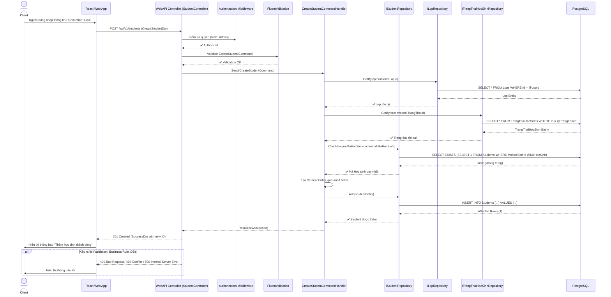
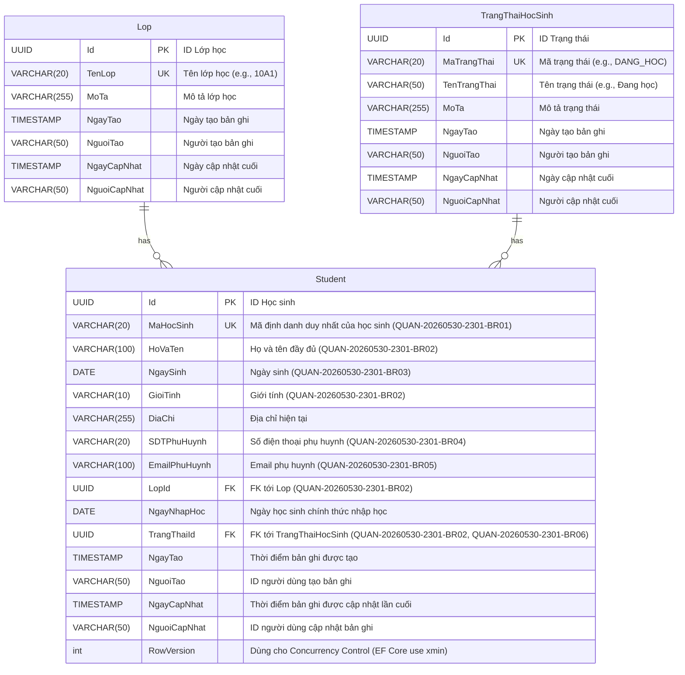

# Software Requirements Specification (SRS) & Solution Architecture Document (SAD)

| Metadata | Giá trị |
|----------|---------|
| **Mã tính năng** | `QUAN-20260530-2301` |
| **Tên tính năng** | Quan Ly Thong Tin Hoc Sinh |
| **Dự án** | quanlyhocsinh |
| **Phiên bản** | 1.0 |
| **Ngày tạo** | 2026-05-31 |
| **Tác giả** | SA Agent (ONENET AgentFactory) |

## Tài liệu liên quan

| Mã tính năng | Loại tài liệu | PR | Trạng thái |
|-------------|---------------|-----|------------|
| `QUAN-20260530-2301` | BRD | #26 | ✅ Đã duyệt |
| `QUAN-20260530-2301` | **SRS/SAD** (tài liệu này) | — | ✅ Hiện tại |
| `QUAN-20260530-2301` | DEV (mã nguồn) | — | ⏳ Chờ SRS duyệt |
| `QUAN-20260530-2301` | TEST (test cases) | — | ⏳ Chờ DEV duyệt |

---

# PHẦN I — SRS (Software Requirements Specification)

## 1. Introduction

### 1.1 Purpose
Tài liệu này cung cấp đặc tả yêu cầu phần mềm (SRS) và tài liệu kiến trúc giải pháp (SAD) chi tiết cho tính năng "Quản lý Thông tin Học sinh" (`QUAN-20260530-2301`) thuộc dự án `quanlyhocsinh`. Nó định nghĩa các yêu cầu chức năng, phi chức năng, quy tắc nghiệp vụ, thiết kế kiến trúc, cấu trúc cơ sở dữ liệu và hợp đồng API cần thiết để phát triển tính năng này. Mục đích là làm tài liệu tham chiếu chung cho đội ngũ phát triển, kiểm thử và quản lý dự án, đảm bảo sản phẩm cuối cùng đáp ứng đúng các yêu cầu nghiệp vụ đã được phê duyệt.

### 1.2 Scope
Phạm vi của tính năng "Quản lý Thông tin Học sinh" bao gồm việc cho phép người dùng có thẩm quyền (Administrator) thực hiện các thao tác CRUD (Create, Read, Update, Delete) đối với thông tin học sinh. Các chức năng hỗ trợ bao gồm xem danh sách, xem chi tiết, thêm mới, chỉnh sửa, xóa, tìm kiếm, lọc và phân trang dữ liệu học sinh. Các quy tắc nghiệp vụ liên quan đến tính hợp lệ và toàn vẹn dữ liệu học sinh cũng sẽ được triển khai.
Các module khác như quản lý giáo viên, lịch học, điểm số, hoặc các tính năng phức tạp hơn về báo cáo không nằm trong phạm vi của tài liệu này.

### 1.3 Intended Audience
*   **Business Analyst (BA)**: Để xác nhận các yêu cầu nghiệp vụ đã được hiểu và chuyển đổi chính xác sang yêu cầu kỹ thuật.
*   **Solution Architect (SA)**: Để đánh giá và phê duyệt thiết kế kiến trúc.
*   **Development Team**: Để hiểu rõ các yêu cầu, thiết kế và tiến hành triển khai.
*   **Quality Assurance (QA) Team**: Để thiết kế các trường hợp kiểm thử dựa trên các yêu cầu chức năng và phi chức năng.
*   **Project Managers**: Để theo dõi tiến độ và phạm vi dự án.

---

## 2. Overall Description

### 2.1 Product Perspective
Tính năng "Quản lý Thông tin Học sinh" là một thành phần cốt lõi của hệ thống `quanlyhocsinh`, cung cấp nền tảng để lưu trữ và quản lý dữ liệu cơ bản về học sinh. Nó là điểm khởi đầu cho các module khác của hệ thống, nơi thông tin học sinh sẽ được sử dụng làm đầu vào (ví dụ: quản lý điểm số, xếp lớp, quản lý chuyên cần). Tính năng này sẽ được tích hợp vào giao diện quản trị chung của hệ thống, đảm bảo tính nhất quán về UI/UX và bảo mật.

### 2.2 User Roles

*   **Người quản trị (Administrator)**:
    *   Quyền hạn: Thực hiện tất cả các thao tác CRUD (Tạo, Đọc, Cập nhật, Xóa) đối với thông tin học sinh.
    *   Tương tác: Truy cập đầy đủ các chức năng xem danh sách, xem chi tiết, thêm mới, chỉnh sửa, xóa, tìm kiếm, lọc và phân trang.
*   **Giáo viên (Teacher)**:
    *   Quyền hạn: Chỉ có thể xem thông tin chi tiết của học sinh được phân công (đọc dữ liệu).
    *   Tương tác: Có thể truy cập chức năng xem danh sách và xem chi tiết học sinh, có thể áp dụng tìm kiếm/lọc nhưng không có quyền chỉnh sửa/thêm/xóa. (Trong phạm vi tính năng này, giáo viên chỉ được phép xem, việc phân quyền chi tiết theo "học sinh được phân công" sẽ được xem xét ở các tính năng sau hoặc được giả định là "xem tất cả" với vai trò giáo viên).
*   **Hệ thống (System)**:
    *   Quyền hạn: Tương tác với cơ sở dữ liệu để lưu trữ, truy xuất và duy trì tính toàn vẹn dữ liệu.
    *   Tương tác: Thực hiện các nghiệp vụ backend như kiểm tra ràng buộc, ghi log, và xử lý dữ liệu.

### 2.3 Technology Stack

| Layer | Công nghệ |
|-------|----------|
| Backend | .NET 10, ASP.NET Web API |
| Architecture | Clean Architecture, CQRS + MediatR |
| ORM | Entity Framework Core |
| Frontend | React + Mantine UI |
| Database | PostgreSQL |
| Validation | FluentValidation |
| Logging | Serilog |

---

## 3. Functional Requirements

> Tham chiếu từ BRD `QUAN-20260530-2301`

| Mã FR (từ BRD) | Mã SRS | Mô tả kỹ thuật (Technical Logic) | Input Validation | Output Mapping |
|----------------|--------|----------------------------------|------------------|----------------|
| `QUAN-20260530-2301-FR01` | `QUAN-20260530-2301-SRS01` | **GetStudentsPagedQuery:** Xây dựng Query để truy vấn danh sách học sinh từ DB, áp dụng phân trang (skip/take), sắp xếp mặc định theo `HoVaTen` (tăng dần), và ánh xạ sang `StudentSummaryDto`. | `pageNumber` (int, >0, default 1), `pageSize` (int, >0, default 10). `sortBy` (string, optional, default `HoVaTen`), `sortOrder` (string, optional, default `asc`). | `PagedList<StudentSummaryDto>` (Mã Học sinh, Họ và Tên, Lớp Học, Trạng Thái). Bao gồm tổng số bản ghi và thông tin phân trang. |
| `QUAN-20260530-2301-FR02` | `QUAN-20260530-2301-SRS02` | **GetStudentByIdQuery:** Xây dựng Query để truy vấn chi tiết một học sinh theo `Id` (UUID) từ DB. Sử dụng `AsNoTracking` cho truy vấn chỉ đọc. Ánh xạ sang `StudentDetailDto`. Nếu không tìm thấy, trả về 404 Not Found. | `id` (UUID, bắt buộc). | `StudentDetailDto` (Tất cả các trường dữ liệu của học sinh). |
| `QUAN-20260530-2301-FR03` | `QUAN-20260530-2301-SRS03` | **CreateStudentCommand:** Xây dựng Command để tạo mới học sinh. <br> 1. Validate `CreateStudentDto`. <br> 2. Kiểm tra `MaHocSinh` duy nhất (`QUAN-20260530-2301-BR01`). <br> 3. Kiểm tra `LopId` và `TrangThaiId` tồn tại trong các bảng lookup tương ứng. <br> 4. Tạo Entity `Student` mới, gán `NgayTao`, `NguoiTao`. <br> 5. Lưu vào DB thông qua Repository. <br> 6. Trả về `Id` của học sinh mới. | `CreateStudentDto` (request body). <br> `HoVaTen`, `NgaySinh`, `GioiTinh`, `LopId`, `TrangThaiId` (bắt buộc - `QUAN-20260530-2301-BR02`). <br> `MaHocSinh` (duy nhất - `QUAN-20260530-2301-BR01`). <br> `NgaySinh` (< ngày hiện tại - `QUAN-20260530-2301-BR03`). <br> `SDTPhuHuynh` (định dạng hợp lệ - `QUAN-20260530-2301-BR04`). <br> `EmailPhuHuynh` (định dạng hợp lệ - `QUAN-20260530-2301-BR05`). <br> `TrangThaiId` (phải tồn tại trong lookup table - `QUAN-20260530-2301-BR06`). <br> `LopId` (phải tồn tại trong lookup table). | `StudentIdDto` (UUID của học sinh vừa tạo). |
| `QUAN-20260530-2301-FR04` | `QUAN-20260530-2301-SRS04` | **UpdateStudentCommand:** Xây dựng Command để cập nhật thông tin học sinh theo `Id`. <br> 1. Validate `UpdateStudentDto`. <br> 2. Tìm học sinh theo `Id`. Nếu không tìm thấy, trả về 404 Not Found. <br> 3. Kiểm tra `MaHocSinh` duy nhất (nếu có thay đổi) (`QUAN-20260530-2301-BR01`). <br> 4. Kiểm tra `LopId` và `TrangThaiId` tồn tại trong các bảng lookup tương ứng. <br> 5. Cập nhật các trường dữ liệu của Entity, gán `NgayCapNhat`, `NguoiCapNhat`. <br> 6. Lưu vào DB thông qua Repository. | `id` (UUID, bắt buộc). <br> `UpdateStudentDto` (request body). <br> Các ràng buộc nghiệp vụ (`QUAN-20260530-2301-BR01` đến `QUAN-20260530-2301-BR06`) tương tự như khi thêm mới, áp dụng cho các trường được cập nhật. | `SuccessDto` (boolean). |
| `QUAN-20260530-2301-FR05` | `QUAN-20260530-2301-SRS05` | **DeleteStudentCommand:** Xây dựng Command để xóa học sinh theo `Id`. <br> 1. Tìm học sinh theo `Id`. Nếu không tìm thấy, trả về 404 Not Found. <br> 2. Thực hiện kiểm tra ràng buộc `QUAN-20260530-2301-FR06`. Nếu có dữ liệu liên quan, trả về 409 Conflict. <br> 3. Xóa Entity khỏi DB thông qua Repository. | `id` (UUID, bắt buộc). | `SuccessDto` (boolean). |
| `QUAN-20260530-2301-FR06` | `QUAN-20260530-2301-SRS06` | **Pre-delete check for related data:** Trước khi xóa học sinh, kiểm tra sự tồn tại của các bản ghi liên quan trong các bảng khác (ví dụ: `DiemSo`, `LichSuHocTap`). Sử dụng `AnyAsync()` trên các collection liên quan. Nếu có, trả về lỗi. <br> _(Ghi chú: Giả định hiện tại chỉ kiểm tra và ngăn chặn. Chính sách xử lý dữ liệu liên quan (soft delete, cascade) sẽ được cân nhắc ở các phase sau nếu yêu cầu rõ ràng hơn)._ | `id` của học sinh cần xóa. | Trả về lỗi 409 Conflict nếu có dữ liệu liên quan. |
| `QUAN-20260530-2301-FR07` | `QUAN-20260530-2301-SRS07` | **GetStudentsPagedQuery (with Search/Filter):** Mở rộng Query `QUAN-20260530-2301-SRS01`. <br> 1. Áp dụng điều kiện tìm kiếm chung (global search) trên `MaHocSinh` hoặc `HoVaTen` (không phân biệt hoa/thường, dùng `ILike` cho PostgreSQL). <br> 2. Áp dụng điều kiện lọc theo `LopId` và `TrangThaiId`. <br> 3. Kết hợp với phân trang và sắp xếp. | `searchQuery` (string, optional). <br> `lopId` (UUID, optional). <br> `trangThaiId` (UUID, optional). <br> Các query param khác của phân trang/sắp xếp. | `PagedList<StudentSummaryDto>` (danh sách học sinh đã được tìm kiếm/lọc). |
| `QUAN-20260530-2301-FR08` | `QUAN-20260530-2301-SRS08` | **GetStudentsPagedQuery (Pagination):** Đã tích hợp vào `QUAN-20260530-2301-SRS01` và `QUAN-20260530-2301-SRS07`. <br> Sử dụng `pageNumber`, `pageSize` để thực hiện `Skip()` và `Take()`. Tính toán `TotalCount` để trả về metadata phân trang. | `pageNumber` (int, >0, default 1), `pageSize` (int, >0, default 10). | `PagedList<StudentSummaryDto>` với metadata phân trang (CurrentPage, PageSize, TotalCount, TotalPages, HasNextPage, HasPreviousPage). |

---

## 4. API Interface Contract

> Đặc tả chi tiết từng API Endpoint dùng trong hệ thống.
> Tất cả các API yêu cầu xác thực bằng `Bearer Token`.
> Authorization: Role `Admin` có toàn quyền CRUD. Role `Teacher` chỉ có quyền GET.

### 4.1 API: Lấy danh sách Học sinh (View List, Search, Filter, Pagination) (`QUAN-20260530-2301-SRS01`, `QUAN-20260530-2301-SRS07`, `QUAN-20260530-2301-SRS08`)

- **Method**: `GET`
- **Endpoint**: `/api/v1/students`
- **Authorization**: `Bearer Token` (Role: `Admin`, `Teacher`)
- **Mô tả**: Lấy danh sách học sinh có hỗ trợ tìm kiếm, lọc và phân trang.

**Request Query Parameters:**
| Parameter | Type | Description | Required | Default | Example |
|---|---|---|---|---|---|
| `pageNumber` | `int` | Số trang hiện tại | `false` | `1` | `1` |
| `pageSize` | `int` | Số lượng bản ghi trên mỗi trang | `false` | `10` | `20` |
| `searchQuery` | `string` | Từ khóa tìm kiếm (Mã HS, Họ Tên) | `false` | `null` | `nguyen van` |
| `lopId` | `string` (UUID) | ID lớp học để lọc | `false` | `null` | `b6f2d5e8-1a2b-4c3d-5e6f-7a8b9c0d1e2f` |
| `trangThaiId` | `string` (UUID) | ID trạng thái học sinh để lọc | `false` | `null` | `a1b2c3d4-e5f6-7a8b-9c0d-1e2f3a4b5c6d` |
| `sortBy` | `string` | Tên trường để sắp xếp (`maHocSinh`, `hoVaTen`, `lopHoc`, `trangThai`) | `false` | `hoVaTen` | `maHocSinh` |
| `sortOrder` | `string` | Thứ tự sắp xếp (`asc` hoặc `desc`) | `false` | `asc` | `desc` |

**Response (200 OK):**
```json
{
  "success": true,
  "message": "Danh sách học sinh",
  "data": {
    "items": [
      {
        "id": "b0a1b2c3-d4e5-6f7a-8b9c-0d1e2f3a4b5c",
        "maHocSinh": "HS2024001",
        "hoVaTen": "Nguyễn Văn A",
        "lopHoc": "10A1",
        "trangThai": "Đang học"
      },
      {
        "id": "c1d2e3f4-a5b6-7c8d-9e0f-1a2b3c4d5e6f",
        "maHocSinh": "HS2024002",
        "hoVaTen": "Trần Thị B",
        "lopHoc": "10A1",
        "trangThai": "Đang học"
      }
    ],
    "pageNumber": 1,
    "pageSize": 10,
    "totalCount": 25,
    "totalPages": 3,
    "hasNextPage": true,
    "hasPreviousPage": false
  }
}
```

**Response (400 Bad Request):** (e.g., invalid `pageNumber`, `pageSize`, `sortBy`, `sortOrder`)
```json
{
  "success": false,
  "message": "Yêu cầu không hợp lệ",
  "errors": [
    { "field": "pageNumber", "message": "Số trang phải lớn hơn 0." }
  ]
}
```

### 4.2 API: Lấy chi tiết Học sinh (View Details) (`QUAN-20260530-2301-SRS02`)

- **Method**: `GET`
- **Endpoint**: `/api/v1/students/{id}`
- **Authorization**: `Bearer Token` (Role: `Admin`, `Teacher`)
- **Mô tả**: Lấy thông tin chi tiết của một học sinh theo ID.

**Request Path Parameters:**
| Parameter | Type | Description | Required | Example |
|---|---|---|---|---|
| `id` | `string` (UUID) | ID của học sinh | `true` | `b0a1b2c3-d4e5-6f7a-8b9c-0d1e2f3a4b5c` |

**Response (200 OK):**
```json
{
  "success": true,
  "message": "Chi tiết học sinh",
  "data": {
    "id": "b0a1b2c3-d4e5-6f7a-8b9c-0d1e2f3a4b5c",
    "maHocSinh": "HS2024001",
    "hoVaTen": "Nguyễn Văn A",
    "ngaySinh": "2008-01-15T00:00:00Z",
    "gioiTinh": "Nam",
    "diaChi": "123 Đường ABC, Quận 1, TP.HCM",
    "sdtPhuHuynh": "0901234567",
    "emailPhuHuynh": "phuhuynh.a@example.com",
    "lopId": "b6f2d5e8-1a2b-4c3d-5e6f-7a8b9c0d1e2f",
    "tenLop": "10A1",
    "ngayNhapHoc": "2023-09-01T00:00:00Z",
    "trangThaiId": "a1b2c3d4-e5f6-7a8b-9c0d-1e2f3a4b5c6d",
    "tenTrangThai": "Đang học",
    "ngayTao": "2024-05-31T10:00:00Z",
    "nguoiTao": "admin_user",
    "ngayCapNhat": "2024-05-31T10:30:00Z",
    "nguoiCapNhat": "admin_user"
  }
}
```

**Response (404 Not Found):**
```json
{
  "success": false,
  "message": "Học sinh không tìm thấy với ID: b0a1b2c3-d4e5-6f7a-8b9c-0d1e2f3a4b5c",
  "errors": []
}
```

### 4.3 API: Thêm mới Học sinh (Create) (`QUAN-20260530-2301-SRS03`)

- **Method**: `POST`
- **Endpoint**: `/api/v1/students`
- **Authorization**: `Bearer Token` (Role: `Admin`)
- **Mô tả**: Thêm mới thông tin một học sinh vào hệ thống.

**Request Body (`CreateStudentDto`):**
```json
{
  "maHocSinh": "HS2024005",                       // string (required, max 20) - QUAN-20260530-2301-BR01
  "hoVaTen": "Phạm Văn C",                         // string (required, min 3, max 100) - QUAN-20260530-2301-BR02
  "ngaySinh": "2009-03-20T00:00:00Z",              // date (required, < current date) - QUAN-20260530-2301-BR02, QUAN-20260530-2301-BR03
  "gioiTinh": "Nam",                               // string (required, enum: "Nam", "Nữ", "Khác") - QUAN-20260530-2301-BR02
  "diaChi": "456 Đường XYZ, Quận 2, TP.HCM",      // string (optional, max 255)
  "sdtPhuHuynh": "0987654321",                     // string (optional, format phone number) - QUAN-20260530-2301-BR04
  "emailPhuHuynh": "phuhuynh.c@example.com",       // string (optional, format email) - QUAN-20260530-2301-BR05
  "lopId": "b6f2d5e8-1a2b-4c3d-5e6f-7a8b9c0d1e2f", // string (UUID, required, must exist) - QUAN-20260530-2301-BR02
  "ngayNhapHoc": "2024-09-05T00:00:00Z",           // date (required, <= current date)
  "trangThaiId": "a1b2c3d4-e5f6-7a8b-9c0d-1e2f3a4b5c6d" // string (UUID, required, must exist) - QUAN-20260530-2301-BR02, QUAN-20260530-2301-BR06
}
```

**Response (201 Created):**
```json
{
  "success": true,
  "message": "Thêm học sinh thành công",
  "data": { "id": "b1c2d3e4-f5a6-7b8c-9d0e-1f2a3b4c5d6e" }
}
```

**Response (400 Bad Request):** (Validation errors for `CreateStudentDto` or business rules)
```json
{
  "success": false,
  "message": "Validation Error",
  "errors": [
    { "field": "maHocSinh", "message": "Mã Học sinh 'HS2024005' đã tồn tại. Vui lòng chọn mã khác." }, // QUAN-20260530-2301-BR01
    { "field": "hoVaTen", "message": "Họ và Tên không được để trống." } // QUAN-20260530-2301-BR02
  ]
}
```
**Response (404 Not Found):** (e.g. `lopId` or `trangThaiId` not found in lookup tables)
```json
{
  "success": false,
  "message": "Không tìm thấy Lớp hoặc Trạng thái học sinh.",
  "errors": [
    { "field": "lopId", "message": "Lớp học với ID '...' không tồn tại." }
  ]
}
```

### 4.4 API: Cập nhật thông tin Học sinh (Update) (`QUAN-20260530-2301-SRS04`)

- **Method**: `PUT`
- **Endpoint**: `/api/v1/students/{id}`
- **Authorization**: `Bearer Token` (Role: `Admin`)
- **Mô tả**: Cập nhật thông tin của một học sinh hiện có.

**Request Path Parameters:**
| Parameter | Type | Description | Required | Example |
|---|---|---|---|---|
| `id` | `string` (UUID) | ID của học sinh cần cập nhật | `true` | `b0a1b2c3-d4e5-6f7a-8b9c-0d1e2f3a4b5c` |

**Request Body (`UpdateStudentDto`):**
```json
{
  "maHocSinh": "HS2024001",                       // string (optional, max 20) - QUAN-20260530-2301-BR01
  "hoVaTen": "Nguyễn Văn A (Đã Sửa)",             // string (optional, min 3, max 100)
  "ngaySinh": "2008-01-15T00:00:00Z",              // date (optional, < current date)
  "gioiTinh": "Nam",                               // string (optional, enum: "Nam", "Nữ", "Khác")
  "diaChi": "123 Đường ABC Mới, Quận 1, TP.HCM",  // string (optional, max 255)
  "sdtPhuHuynh": "0901111111",                     // string (optional, format phone number)
  "emailPhuHuynh": "phuhuynh.a.new@example.com",   // string (optional, format email)
  "lopId": "b6f2d5e8-1a2b-4c3d-5e6f-7a8b9c0d1e2f", // string (UUID, optional, must exist)
  "ngayNhapHoc": "2023-09-01T00:00:00Z",           // date (optional, <= current date)
  "trangThaiId": "a1b2c3d4-e5f6-7a8b-9c0d-1e2f3a4b5c6d" // string (UUID, optional, must exist)
}
```
_Ghi chú: Các trường trong `UpdateStudentDto` đều là `optional` để cho phép cập nhật từng phần (PATCH-like behavior). Tuy nhiên, nếu một trường được gửi đi, nó phải thỏa mãn các ràng buộc nghiệp vụ tương ứng._

**Response (200 OK):**
```json
{
  "success": true,
  "message": "Cập nhật học sinh thành công",
  "data": null
}
```

**Response (400 Bad Request):** (Validation errors for `UpdateStudentDto` or business rules)
```json
{
  "success": false,
  "message": "Validation Error",
  "errors": [
    { "field": "maHocSinh", "message": "Mã Học sinh 'HS2024001' đã được sử dụng bởi học sinh khác." }, // QUAN-20260530-2301-BR01 (nếu cố tình sửa trùng mã của người khác)
    { "field": "ngaySinh", "message": "Ngày Sinh không hợp lệ, không thể lớn hơn hoặc bằng ngày hiện tại." } // QUAN-20260530-2301-BR03
  ]
}
```

**Response (404 Not Found):** (e.g., student with given ID not found)
```json
{
  "success": false,
  "message": "Học sinh không tìm thấy với ID: b0a1b2c3-d4e5-6f7a-8b9c-0d1e2f3a4b5c",
  "errors": []
}
```

### 4.5 API: Xóa Học sinh (Delete) (`QUAN-20260530-2301-SRS05`, `QUAN-20260530-2301-SRS06`)

- **Method**: `DELETE`
- **Endpoint**: `/api/v1/students/{id}`
- **Authorization**: `Bearer Token` (Role: `Admin`)
- **Mô tả**: Xóa một học sinh khỏi hệ thống.

**Request Path Parameters:**
| Parameter | Type | Description | Required | Example |
|---|---|---|---|---|
| `id` | `string` (UUID) | ID của học sinh cần xóa | `true` | `b0a1b2c3-d4e5-6f7a-8b9c-0d1e2f3a4b5c` |

**Response (200 OK):**
```json
{
  "success": true,
  "message": "Xóa học sinh thành công",
  "data": null
}
```

**Response (404 Not Found):**
```json
{
  "success": false,
  "message": "Học sinh không tìm thấy với ID: b0a1b2c3-d4e5-6f7a-8b9c-0d1e2f3a4b5c",
  "errors": []
}
```

**Response (409 Conflict):** (Khi có dữ liệu liên quan, theo `QUAN-20260530-2301-FR06`)
```json
{
  "success": false,
  "message": "Không thể xóa học sinh vì có dữ liệu liên quan. Vui lòng xử lý dữ liệu liên quan trước.",
  "errors": [
    { "code": "STUDENT_HAS_RELATED_DATA", "message": "Học sinh có điểm số hoặc lịch sử học tập liên quan." }
  ]
}
```

---

## 5. Non-functional Requirements & Security

### 5.1 Authentication & Authorization
-   **Authentication (AuthN):** Tất cả các API endpoint trong tính năng "Quản lý Thông tin Học sinh" đều yêu cầu người dùng phải được xác thực thông qua `Bearer Token` (JWT). Token phải hợp lệ, không hết hạn và được phát hành bởi hệ thống xác thực của ONENET.
-   **Authorization (AuthZ):**
    -   **Role `Admin`**: Có toàn quyền truy cập (CRUD) vào tất cả các API endpoint của tính năng này.
    -   **Role `Teacher`**: Chỉ có quyền `GET` (xem danh sách, xem chi tiết, tìm kiếm/lọc) đối với thông tin học sinh. Không có quyền `POST`, `PUT`, `DELETE`.
    -   Việc kiểm tra quyền sẽ được thực hiện ở tầng Controller (ví dụ: sử dụng `[Authorize(Roles = "Admin,Teacher")]` và `[Authorize(Roles = "Admin")]` trên các phương thức tương ứng) và được củng cố ở tầng Application (ví dụ: thông qua MediatR pipeline behaviors hoặc service layer checks).

### 5.2 Performance & Caching
-   **Hiệu năng (`QUAN-20260530-2301-NFR`):**
    -   **Query Optimization:**
        -   Sử dụng các chỉ mục (indexes) hiệu quả trên các trường `MaHocSinh`, `HoVaTen`, `LopId`, `TrangThaiId` để tối ưu hóa truy vấn danh sách, tìm kiếm và lọc.
        -   Sử dụng `AsNoTracking()` cho các truy vấn chỉ đọc để cải thiện hiệu suất bằng cách không theo dõi các thực thể trong DbContext.
        -   Tối ưu hóa các câu truy vấn SQL được tạo bởi EF Core, tránh N+1 query.
    -   **CRUD Operations:** Đảm bảo các thao tác thêm/sửa/xóa không khóa bảng hoặc gây deadlock, đặc biệt trong môi trường đa người dùng.
-   **Caching:**
    -   Chưa có yêu cầu caching rõ ràng. Tuy nhiên, nếu sau này hiệu năng của các truy vấn danh mục (`Lop`, `TrangThaiHocSinh`) trở thành nút thắt cổ chai, có thể áp dụng caching (ví dụ: In-memory Cache hoặc Distributed Cache như Redis) cho các danh mục ít thay đổi này.
-   **Scalability (`QUAN-20260530-2301-NFR`):** Thiết kế CSDL và API theo hướng tối ưu hóa cho lượng dữ liệu lớn. Việc sử dụng phân trang (Pagination) là một biện pháp quan trọng để đảm bảo khả năng mở rộng khi số lượng bản ghi tăng lên.

---

# PHẦN II — SAD (Solution Architecture Document)

## 6. Kiến trúc tổng thể (C4 Container Level)

### 6.1 Architecture Diagram

```mermaid
graph TD
    User([User]) -- HTTPS --> WebUI[React Web App]
    WebUI -- REST API --> API[ASP.NET Web API]
    API -- CQRS/MediatR --> Application[Application Layer]
    Application -- Repository --> Infrastructure[Infrastructure Layer]
    Infrastructure -- EF Core/Npgsql --> Database[(PostgreSQL)]

    subgraph External Services
        AuthService(Authentication Service)
        LoggingService(Centralized Logging)
    end

    API --> AuthService: Validate JWT
    API --> LoggingService: Log API requests/responses
    Application --> LoggingService: Log business logic
    Infrastructure --> LoggingService: Log DB operations
```
**Mô tả:**
- **User:** Người dùng cuối tương tác với hệ thống.
- **Web UI (React Web App):** Giao diện người dùng được xây dựng bằng React và Mantine UI, gửi các yêu cầu REST API tới Backend.
- **API (ASP.NET Web API):** Backend chính, tiếp nhận các yêu cầu HTTP. Đây là điểm vào của hệ thống, xử lý xác thực, ủy quyền, và định tuyến yêu cầu tới tầng Application thông qua MediatR.
- **Application Layer:** Chứa logic nghiệp vụ chính (Commands/Queries/Handlers). Nó phối hợp các hoạt động, kiểm tra quy tắc nghiệp vụ và ánh xạ dữ liệu.
- **Infrastructure Layer:** Chứa các chi tiết triển khai như truy cập cơ sở dữ liệu (sử dụng EF Core và Npgsql cho PostgreSQL), tích hợp các dịch vụ bên ngoài (như Authentication, Logging).
- **Database (PostgreSQL):** Cơ sở dữ liệu lưu trữ tất cả dữ liệu của hệ thống.
- **Authentication Service:** Dịch vụ bên ngoài (hoặc module tích hợp) quản lý xác thực người dùng và phát hành JWT.
- **Centralized Logging:** Dịch vụ ghi log tập trung (ví dụ: ELK Stack) để thu thập log từ tất cả các tầng của ứng dụng.

### 6.2 Sequence Diagram (Luồng nghiệp vụ chính: Thêm mới Học sinh)

> Sơ đồ tuần tự minh họa tương tác giữa Client, Controller, Handler, và Database cho nghiệp vụ thêm mới học sinh.



---

## 7. Thiết kế chi tiết Database (Tham chiếu ERD)

### 7.1 Entity Relationship

> (Chi tiết vui lòng xem tài liệu ERD riêng biệt đính kèm PR này. Dưới đây là ERD dạng Mermaid)



-   **Danh sách bảng chính:**
    -   `Students`: Chứa thông tin chi tiết của học sinh.
    -   `Lops`: Bảng lookup chứa danh sách các lớp học.
    -   `TrangThaiHocSinhs`: Bảng lookup chứa các trạng thái học tập của học sinh.

-   **Chiến lược Indexing:**
    -   `Students.MaHocSinh`: Unique Index (đảm bảo tính duy nhất, `QUAN-20260530-2301-BR01`).
    -   `Students.HoVaTen`: Index (để hỗ trợ tìm kiếm và sắp xếp).
    -   `Students.LopId`: Index (FK index, hỗ trợ lọc).
    -   `Students.TrangThaiId`: Index (FK index, hỗ trợ lọc).
    -   `Lops.TenLop`: Unique Index.
    -   `TrangThaiHocSinhs.MaTrangThai`: Unique Index.

-   **EF Core Configuration / Migration Logic:**
    -   Sử dụng `HasColumnType("uuid")` cho các trường `Id` và `FKs`.
    -   Sử dụng `IsRequired()` cho các trường bắt buộc (`MaHocSinh`, `HoVaTen`, `NgaySinh`, `GioiTinh`, `LopId`, `TrangThaiId`, `NgayNhapHoc`, `NgayTao`, `NguoiTao`).
    -   Sử dụng `HasMaxLength()` cho các trường chuỗi có giới hạn độ dài.
    -   `Student.MaHocSinh`: `HasMaxLength(20).IsUnique()`.
    -   `Student.NgaySinh`: `HasColumnType("date")`.
    -   `Student.NgayNhapHoc`: `HasColumnType("date")`.
    -   Các trường `NgayTao`, `NgayCapNhat` sẽ được cấu hình `HasDefaultValueSql("now()")` hoặc được gán trong code.
    -   Concurrency Token: `Student.RowVersion` sẽ được cấu hình `IsConcurrencyToken().UseXminAsConcurrencyToken()` để EF Core sử dụng cột `xmin` của PostgreSQL.

### 7.2 Data Seeding (Dữ liệu mẫu)
-   Yêu cầu tạo script data migration (seed data) cho các bảng lookup:
    -   `Lops`: Ví dụ: `10A1`, `10A2`, `11B1`, `12C`.
    -   `TrangThaiHocSinhs`: Ví dụ: `DANG_HOC` ("Đang học"), `DA_TOT_NGHIEP` ("Đã tốt nghiệp"), `DA_CHUYEN_TRUONG` ("Đã chuyển trường"), `TAM_DUNG` ("Tạm dừng").
-   Các dữ liệu này là cần thiết để đảm bảo tính toàn vẹn dữ liệu cho trường `LopId` và `TrangThaiId` của bảng `Students` theo `QUAN-20260530-2301-BR06`.

---

## 8. Application Layer Details (Commands/Queries)

Tầng Application sẽ chứa các `Commands` (cho các hành động ghi/thay đổi trạng thái) và `Queries` (cho các hành động đọc dữ liệu), được xử lý bởi các `Handlers` tương ứng thông qua MediatR.

| # | Type | Class Name | Mã SRS | Ý nghĩa & Logic chính |
|---|------|-----------|--------|-----------------------|
| 1 | Query | `GetStudentsPagedQuery` | `QUAN-20260530-2301-SRS01`, `QUAN-20260530-2301-SRS07`, `QUAN-20260530-2301-SRS08` | Truy vấn danh sách học sinh có phân trang, tìm kiếm, lọc. Sử dụng `AsNoTracking()`. |
| 2 | Query | `GetStudentByIdQuery` | `QUAN-20260530-2301-SRS02` | Truy vấn chi tiết một học sinh theo ID. Sử dụng `AsNoTracking()`. |
| 3 | Command | `CreateStudentCommand` | `QUAN-20260530-2301-SRS03` | Xử lý việc tạo mới học sinh. Validate DTO, kiểm tra `MaHocSinh` duy nhất, kiểm tra tồn tại `LopId`/`TrangThaiId`, tạo Entity, gán audit fields, gọi Repository để lưu. |
| 4 | Command | `UpdateStudentCommand` | `QUAN-20260530-2301-SRS04` | Xử lý việc cập nhật học sinh. Validate DTO, tìm Entity, kiểm tra `MaHocSinh` duy nhất (nếu thay đổi), cập nhật các trường, gán audit fields, gọi Repository để lưu. |
| 5 | Command | `DeleteStudentCommand` | `QUAN-20260530-2301-SRS05`, `QUAN-20260530-2301-SRS06` | Xử lý việc xóa học sinh. Tìm Entity, thực hiện kiểm tra dữ liệu liên quan (`QUAN-20260530-2301-FR06`), nếu không có, gọi Repository để xóa. |

---

## 9. Rủi ro và giảm thiểu

| # | Rủi ro | Mức độ | Giảm thiểu |
|---|--------|--------|-----------|
| 1 | Concurrency Issue (Vấn đề đồng thời khi nhiều người dùng cập nhật cùng một bản ghi) | High | Sử dụng `RowVersion` (xmin của PostgreSQL) và EF Core's `IsConcurrencyToken()` để phát hiện và xử lý optimistic concurrency conflicts. Thông báo lỗi cho người dùng khi có xung đột. |
| 2 | Data Inconsistency (Dữ liệu không nhất quán do lỗi nghiệp vụ hoặc thiếu validation) | Medium | Áp dụng FluentValidation ở tầng Application cho tất cả Commands/DTOs. Triển khai các quy tắc nghiệp vụ (BRs) trong Command Handlers. Sử dụng Foreign Keys và constraints ở cấp độ Database. |
| 3 | Performance Degradation (Giảm hiệu suất khi dữ liệu tăng trưởng) | Medium | Tối ưu hóa các truy vấn SQL (sử dụng Indexing). Áp dụng phân trang cho tất cả các truy vấn danh sách lớn. Cân nhắc lazy loading / eager loading phù hợp trong EF Core. |
| 4 | Security Vulnerabilities (Lỗ hổng bảo mật: SQL Injection, Broken Access Control) | High | Sử dụng ORM (EF Core) để ngăn chặn SQL Injection. Thực hiện xác thực (AuthN) và ủy quyền (AuthZ) mạnh mẽ dựa trên JWT và Role-Based Access Control (RBAC) ở cả tầng API và Application. |
| 5 | Complex Business Logic (Logic nghiệp vụ phức tạp khó bảo trì/mở rộng) | Low | Áp dụng Clean Architecture và CQRS/MediatR để tách biệt concerns, giúp code dễ đọc, dễ kiểm thử và mở rộng. |

---

## 10. Danh sách Files cần tạo/sửa (Implementation Plan)

Dựa trên cấu trúc Clean Architecture và CQRS:

| # | File Path | Loại | Mã SRS | Ghi chú |
|---|----------|------|--------|---------|
| 1 | `src/ONENET.Domain/Entities/Student.cs` | New | `QUAN-20260530-2301-SRS03` | Định nghĩa Entity Học sinh |
| 2 | `src/ONENET.Domain/Entities/Lop.cs` | New | `QUAN-20260530-2301-SRS03` | Định nghĩa Entity Lớp học (lookup) |
| 3 | `src/ONENET.Domain/Entities/TrangThaiHocSinh.cs` | New | `QUAN-20260530-2301-SRS03` | Định nghĩa Entity Trạng thái học sinh (lookup) |
| 4 | `src/ONENET.Application/Features/Students/Commands/CreateStudentCommand.cs` | New | `QUAN-20260530-2301-SRS03` | Command tạo học sinh |
| 5 | `src/ONENET.Application/Features/Students/Commands/CreateStudentCommandValidator.cs` | New | `QUAN-20260530-2301-SRS03` | FluentValidation cho CreateStudentCommand |
| 6 | `src/ONENET.Application/Features/Students/Commands/UpdateStudentCommand.cs` | New | `QUAN-20260530-2301-SRS04` | Command cập nhật học sinh |
| 7 | `src/ONENET.Application/Features/Students/Commands/UpdateStudentCommandValidator.cs` | New | `QUAN-20260530-2301-SRS04` | FluentValidation cho UpdateStudentCommand |
| 8 | `src/ONENET.Application/Features/Students/Commands/DeleteStudentCommand.cs` | New | `QUAN-20260530-2301-SRS05` | Command xóa học sinh |
| 9 | `src/ONENET.Application/Features/Students/Queries/GetStudentByIdQuery.cs` | New | `QUAN-20260530-2301-SRS02` | Query lấy chi tiết học sinh |
| 10 | `src/ONENET.Application/Features/Students/Queries/GetStudentsPagedQuery.cs` | New | `QUAN-20260530-2301-SRS01` | Query lấy danh sách học sinh có phân trang/lọc/tìm kiếm |
| 11 | `src/ONENET.Application/Features/Students/Dtos/StudentDto.cs` | New | N/A | DTO cơ sở, summary, detail cho học sinh |
| 12 | `src/ONENET.Application/Interfaces/IStudentRepository.cs` | New | N/A | Interface Repository cho Student |
| 13 | `src/ONENET.Application/Interfaces/ILopRepository.cs` | New | N/A | Interface Repository cho Lop |
| 14 | `src/ONENET.Application/Interfaces/ITrangThaiHocSinhRepository.cs` | New | N/A | Interface Repository cho TrangThaiHocSinh |
| 15 | `src/ONENET.Infrastructure/Persistence/Configurations/StudentConfiguration.cs` | New | N/A | Cấu hình Entity Student cho EF Core |
| 16 | `src/ONENET.Infrastructure/Persistence/Configurations/LopConfiguration.cs` | New | N/A | Cấu hình Entity Lop cho EF Core |
| 17 | `src/ONENET.Infrastructure/Persistence/Configurations/TrangThaiHocSinhConfiguration.cs` | New | N/A | Cấu hình Entity TrangThaiHocSinh cho EF Core |
| 18 | `src/ONENET.Infrastructure/Persistence/Repositories/StudentRepository.cs` | New | N/A | Triển khai Repository cho Student |
| 19 | `src/ONENET.Infrastructure/Persistence/Repositories/LopRepository.cs` | New | N/A | Triển khai Repository cho Lop |
| 20 | `src/ONENET.Infrastructure/Persistence/Repositories/TrangThaiHocSinhRepository.cs` | New | N/A | Triển khai Repository cho TrangThaiHocSinh |
| 21 | `src/ONENET.WebAPI/Controllers/StudentsController.cs` | New | `QUAN-20260530-2301-SRS01`...`SRS05` | API Controller cho các hoạt động quản lý học sinh |
| 22 | `src/ONENET.Infrastructure/Persistence/ApplicationDbContext.cs` | Update | N/A | Thêm `DbSet<Student>`, `DbSet<Lop>`, `DbSet<TrangThaiHocSinh>` |
| 23 | `src/ONENET.Infrastructure/Migrations/..._AddStudentManagement.cs` | New | N/A | Migration script để tạo bảng Students, Lops, TrangThaiHocSinhs và seed data. |

---

_Mã tính năng `QUAN-20260530-2301` — Tài liệu SRS/SAD được sinh tự động bởi ONENET AgentFactory._