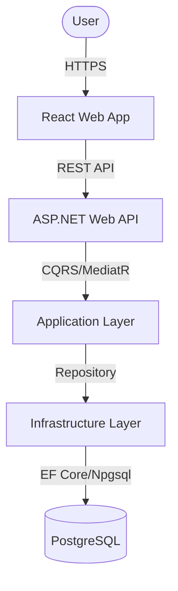
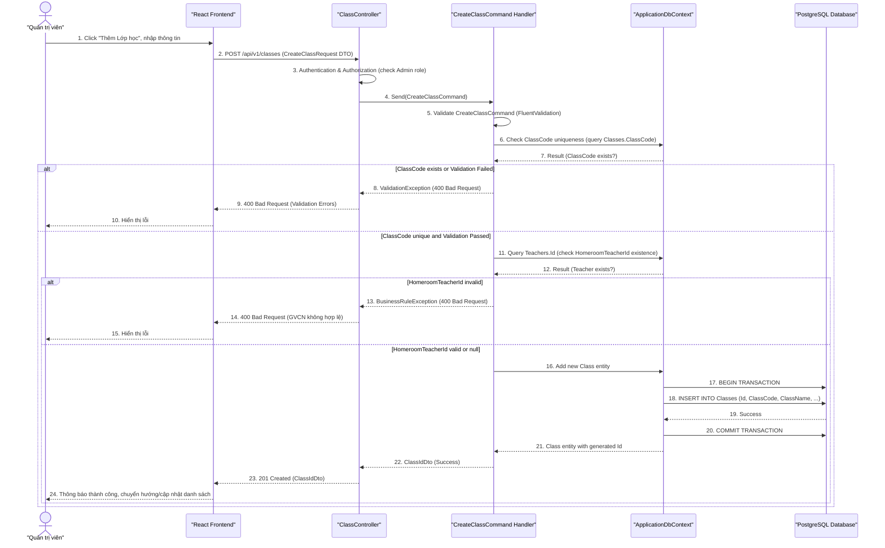

# Software Requirements Specification (SRS) & Solution Architecture Document (SAD)

| Metadata | Giá trị |
|----------|---------|
| **Mã tính năng** | `QUAN-20260530-2302` |
| **Tên tính năng** | Quản lý Lớp học |
| **Dự án** | quanlyhocsinh |
| **Phiên bản** | 1.0 |
| **Ngày tạo** | 2026-05-31 |
| **Tác giả** | SA Agent (ONENET AgentFactory) |

## Tài liệu liên quan

| Mã tính năng | Loại tài liệu | PR | Trạng thái |
|-------------|---------------|-----|------------|
| `QUAN-20260530-2302` | BRD | #27 | ✅ Đã duyệt |
| `QUAN-20260530-2302` | **SRS/SAD** (tài liệu này) | — | ✅ Hiện tại |
| `QUAN-20260530-2302` | DEV (mã nguồn) | — | ⏳ Chờ SRS duyệt |
| `QUAN-20260530-2302` | TEST (test cases) | — | ⏳ Chờ DEV duyệt |

---

# PHẦN I — SRS (Software Requirements Specification)

## 1. Introduction

### 1.1 Purpose
Tài liệu này mô tả chi tiết các yêu cầu kỹ thuật và kiến trúc giải pháp cho tính năng "Quản lý Lớp học" (QUAN-20260530-2302) trong hệ thống `quanlyhocsinh`. Mục đích là làm cơ sở cho quá trình thiết kế, phát triển, kiểm thử và triển khai tính năng này, đảm bảo đáp ứng đầy đủ các yêu cầu nghiệp vụ đã được định nghĩa trong BRD.

### 1.2 Scope
Tính năng "Quản lý Lớp học" sẽ cung cấp các khả năng CRUD (Create, Read, Update, Delete) cho thông tin lớp học. Cụ thể, bao gồm:
*   Xem, tìm kiếm, và phân trang danh sách lớp học.
*   Thêm mới, cập nhật, xóa một lớp học.
*   Áp dụng các quy tắc nghiệp vụ (validation) cho dữ liệu lớp học.
Phạm vi **không** bao gồm: quản lý thời khóa biểu, quản lý điểm số học sinh theo lớp, hoặc phân công học sinh vào lớp (chỉ xem sĩ số hiện tại).

### 1.3 Intended Audience
*   **Nhóm phát triển (Development Team):** Để hiểu rõ yêu cầu và thiết kế kỹ thuật, từ đó triển khai tính năng.
*   **Nhóm kiểm thử (QA Team):** Để xây dựng kịch bản kiểm thử và đảm bảo chất lượng.
*   **Quản trị viên hệ thống (System Administrators):** Để hiểu cách tính năng hoạt động và hỗ trợ người dùng.
*   **Quản lý dự án (Project Managers):** Để theo dõi tiến độ và phạm vi dự án.

---

## 2. Overall Description

### 2.1 Product Perspective
Tính năng "Quản lý Lớp học" là một module cốt lõi trong hệ thống `quanlyhocsinh`, cung cấp nền tảng dữ liệu cho việc tổ chức và quản lý các đơn vị học tập. Nó tích hợp với module quản lý "Học sinh" để lấy thông tin sĩ số và module "Giáo viên" để gán giáo viên chủ nhiệm. Module này sẽ nằm trong phân hệ quản lý hành chính, hỗ trợ các tác vụ nghiệp vụ hàng ngày của nhà trường.

### 2.2 User Roles

| Vai trò người dùng | Mô tả quyền hạn |
| :----------------- | :-------------- |
| **Quản trị viên hệ thống** | Có quyền thực hiện tất cả các thao tác CRUD (thêm, xem, sửa, xóa) đối với lớp học. |
| **Giáo viên**           | Có quyền xem danh sách lớp học và thông tin chi tiết các lớp mình phụ trách (nếu có). (Chỉ xem, không sửa đổi). |
| **Ban giám hiệu**      | Có quyền xem danh sách lớp học và thông tin chi tiết. (Chỉ xem, không sửa đổi). |

### 2.3 Technology Stack

| Layer | Công nghệ |
|-------|----------|
| Backend | .NET 10, ASP.NET Web API |
| Architecture | Clean Architecture, CQRS + MediatR |
| ORM | Entity Framework Core |
| Frontend | React + Mantine UI |
| Database | PostgreSQL |

---

## 3. Functional Requirements

> Tham chiếu từ BRD `QUAN-20260530-2302`

| Mã FR (từ BRD) | Mã SRS | Mô tả kỹ thuật (Technical Logic) | Input Validation | Output Mapping |
|----------------|--------|----------------------------------|------------------|----------------|
| `QUAN-20260530-2302-FR01` | `QUAN-20260530-2302-SRS01` | **Xem danh sách Lớp học** <br/> - Endpoint: GET `/api/v1/classes` <br/> - Truy vấn từ bảng `Classes`, JOIN `Teachers` để lấy tên GVCN. <br/> - Tính `CurrentStudentCount` bằng cách COUNT `Students` WHERE `ClassId = class.Id`. <br/> - Mặc định sắp xếp theo `ClassCode` ASC. <br/> - Các hành động (Xem chi tiết, Chỉnh sửa, Xóa) sẽ là các link/button gọi các API khác. | Không có | `List<ClassDetailDto>`: `{ Id, ClassCode, ClassName, SchoolYear, CurrentStudentCount, HomeroomTeacherId, HomeroomTeacherName }` |
| `QUAN-20260530-2302-FR02` | `QUAN-20260530-2302-SRS02` | **Phân trang danh sách Lớp học** <br/> - Endpoint: GET `/api/v1/classes?page={pageNumber}&pageSize={pageSize}` <br/> - Áp dụng `Skip()` và `Take()` sau khi sắp xếp trên tập dữ liệu đã lọc (nếu có tìm kiếm). <br/> - Trả về tổng số bản ghi và thông tin phân trang cùng với danh sách. | `pageNumber` >= 1, `pageSize` (10, 25, 50, 100) | `PaginatedListDto<ClassDetailDto>`: `{ Items, PageNumber, PageSize, TotalCount, TotalPages }` |
| `QUAN-20260530-2302-FR03` | `QUAN-20260530-2302-SRS03` | **Tìm kiếm Lớp học** <br/> - Endpoint: GET `/api/v1/classes?search={keyword}&schoolYear={year}&homeroomTeacherName={name}` <br/> - Áp dụng điều kiện `WHERE` trên các trường `ClassCode`, `ClassName`, `SchoolYear`, `HomeroomTeacher.FullName` (sử dụng LIKE %keyword% cho tìm kiếm chung). <br/> - Sử dụng `ToLower()` hoặc `ToUpper()` cho tìm kiếm không phân biệt chữ hoa, chữ thường. <br/> - Kết quả được phân trang theo `QUAN-20260530-2302-SRS02`. | Không có | `PaginatedListDto<ClassDetailDto>`: `{ Items, PageNumber, PageSize, TotalCount, TotalPages }` |
| `QUAN-20260530-2302-FR04` | `QUAN-20260530-2302-SRS04` | **Tạo Lớp học mới** <br/> - Endpoint: POST `/api/v1/classes` <br/> - Tạo đối tượng `Class` từ `CreateClassCommand` DTO. <br/> - Kiểm tra `HomeroomTeacherId` có tồn tại trong bảng `Teachers` không. <br/> - Lưu vào DB. | - `QUAN-20260530-2302-BR01`: `ClassCode` bắt buộc, duy nhất, max 20. <br/> - `QUAN-20260530-2302-BR02`: `ClassName` bắt buộc, max 50. <br/> - `QUAN-20260530-2302-BR03`: `SchoolYear` bắt buộc, định dạng YYYY/YYYY-YYYY, max 9. <br/> - `QUAN-20260530-2302-BR04`: `HomeroomTeacherId` (nếu có) phải là giáo viên tồn tại. | `ClassIdDto`: `{ Id }` của lớp học mới tạo. |
| `QUAN-20260530-2302-FR05` | `QUAN-20260530-2302-SRS05` | **Cập nhật thông tin Lớp học** <br/> - Endpoint: PUT `/api/v1/classes/{id}` <br/> - Tìm lớp học theo `id`. Nếu không tìm thấy, trả về 404. <br/> - Cập nhật `ClassName`, `SchoolYear`, `HomeroomTeacherId`. <br/> - Trường `ClassCode` không được thay đổi. <br/> - Kiểm tra `HomeroomTeacherId` nếu được cung cấp. <br/> - Lưu vào DB. | - `QUAN-20260530-2302-BR02`: `ClassName` bắt buộc, max 50. <br/> - `QUAN-20260530-2302-BR03`: `SchoolYear` bắt buộc, định dạng YYYY/YYYY-YYYY, max 9. <br/> - `QUAN-20260530-2302-BR04`: `HomeroomTeacherId` (nếu có) phải là giáo viên tồn tại. | `SuccessMessageDto`: `{ success: true, message: "Cập nhật thành công." }` |
| `QUAN-20260530-2302-FR06` | `QUAN-20260530-2302-SRS06` | **Xóa Lớp học** <br/> - Endpoint: DELETE `/api/v1/classes/{id}` <br/> - Tìm lớp học theo `id`. Nếu không tìm thấy, trả về 404. <br/> - Trước khi xóa, kiểm tra các ràng buộc theo `QUAN-20260530-2302-SRS07`. <br/> - Nếu không có ràng buộc, thực hiện xóa mềm (soft delete bằng cách cập nhật `IsDeleted = true` và `DeletedAt = DateTime.UtcNow`) hoặc xóa cứng (hard delete) tùy theo policy hệ thống (Ưu tiên soft delete nếu có thể mở rộng khôi phục). Đối với yêu cầu này, sẽ thực hiện xóa cứng nếu không có ràng buộc. <br/> - Lưu vào DB. | Không có | `SuccessMessageDto`: `{ success: true, message: "Xóa thành công." }` |
| `QUAN-20260530-2302-FR07` | `QUAN-20260530-2302-SRS07` | **Ngăn chặn xóa Lớp học có liên kết dữ liệu** <br/> - Trước khi xóa (`QUAN-20260530-2302-SRS06`), thực hiện kiểm tra: <br/>   1. Đếm số học sinh thuộc lớp: `COUNT(Students.Id) WHERE ClassId = {id}`. Nếu > 0, trả về 409 Conflict. <br/>   2. Kiểm tra GVCN: Nếu `Classes.HomeroomTeacherId` của lớp đang xóa `IS NOT NULL`, trả về 409 Conflict. | Không có | `ErrorMessageDto`: `{ success: false, message: "Không thể xóa lớp học vì..." }` (409 Conflict) |

---

## 4. API Interface Contract

> Đặc tả chi tiết từng API Endpoint dùng trong hệ thống

### 4.1 API: Lấy danh sách lớp học (`QUAN-20260530-2302-SRS01`, `SRS02`, `SRS03`)

- **Method**: `GET`
- **Endpoint**: `/api/v1/classes`
- **Authorization**: `Bearer Token` (Role: `Admin`, `Teacher`, `Manager`)
- **Mô tả**: Lấy danh sách lớp học với các tùy chọn tìm kiếm và phân trang.

**Request (Query Parameters):**
- `pageNumber`: `int` (optional, default 1, min 1)
- `pageSize`: `int` (optional, default 10, allowed values: 10, 25, 50, 100)
- `search`: `string` (optional, tìm kiếm chung theo Mã lớp, Tên lớp, Niên khóa, Tên GVCN)
- `schoolYear`: `string` (optional, tìm kiếm chính xác theo Niên khóa)
- `homeroomTeacherName`: `string` (optional, tìm kiếm theo Tên GVCN)

**Response (200 OK):**
```json
{
  "success": true,
  "data": {
    "items": [
      {
        "id": "3fa85f64-5717-4562-b3fc-2c963f66afa6",
        "classCode": "10A1",
        "className": "Lớp 10A1",
        "schoolYear": "2023-2024",
        "currentStudentCount": 35,
        "homeroomTeacherId": "a1b2c3d4-e5f6-7890-1234-567890abcdef",
        "homeroomTeacherName": "Nguyễn Văn A"
      }
    ],
    "pageNumber": 1,
    "pageSize": 10,
    "totalCount": 120,
    "totalPages": 12
  }
}
```

**Response (400 Bad Request - Invalid Query Parameters):**
```json
{
  "success": false,
  "message": "Invalid query parameters",
  "errors": [
    { "field": "pageSize", "message": "pageSize must be one of 10, 25, 50, 100." }
  ]
}
```

### 4.2 API: Lấy thông tin lớp học theo ID (`QUAN-20260530-2302-SRS01` - Chi tiết)

- **Method**: `GET`
- **Endpoint**: `/api/v1/classes/{id}`
- **Authorization**: `Bearer Token` (Role: `Admin`, `Teacher`, `Manager`)
- **Mô tả**: Lấy thông tin chi tiết của một lớp học.

**Request:**
- `id`: `uuid` (path parameter)

**Response (200 OK):**
```json
{
  "success": true,
  "data": {
    "id": "3fa85f64-5717-4562-b3fc-2c963f66afa6",
    "classCode": "10A1",
    "className": "Lớp 10A1",
    "schoolYear": "2023-2024",
    "currentStudentCount": 35,
    "homeroomTeacherId": "a1b2c3d4-e5f6-7890-1234-567890abcdef",
    "homeroomTeacherName": "Nguyễn Văn A"
  }
}
```

**Response (404 Not Found):**
```json
{
  "success": false,
  "message": "Lớp học không tìm thấy."
}
```

### 4.3 API: Tạo lớp học mới (`QUAN-20260530-2302-SRS04`)

- **Method**: `POST`
- **Endpoint**: `/api/v1/classes`
- **Authorization**: `Bearer Token` (Role: `Admin`)
- **Mô tả**: Tạo một lớp học mới trong hệ thống.

**Request Body:**
```json
{
  "classCode": "string (required, max 20, unique)",
  "className": "string (required, max 50)",
  "schoolYear": "string (required, max 9, format YYYY or YYYY-YYYY)",
  "homeroomTeacherId": "uuid (optional, must be an existing teacher ID)"
}
```

**Response (201 Created):**
```json
{
  "success": true,
  "data": { "id": "3fa85f64-5717-4562-b3fc-2c963f66afa6" }
}
```

**Response (400 Bad Request - Validation Errors):**
```json
{
  "success": false,
  "message": "Validation Error",
  "errors": [
    { "field": "classCode", "message": "Mã lớp không được để trống." },
    { "field": "classCode", "message": "Mã lớp '10A1' đã tồn tại." },
    { "field": "className", "message": "Tên lớp không được vượt quá 50 ký tự." },
    { "field": "schoolYear", "message": "Niên khóa không đúng định dạng YYYY hoặc YYYY-YYYY." },
    { "field": "homeroomTeacherId", "message": "Giáo viên chủ nhiệm không hợp lệ." }
  ]
}
```

**Response (403 Forbidden - Not Authorized):**
```json
{
  "success": false,
  "message": "Access Denied."
}
```

### 4.4 API: Cập nhật thông tin lớp học (`QUAN-20260530-2302-SRS05`)

- **Method**: `PUT`
- **Endpoint**: `/api/v1/classes/{id}`
- **Authorization**: `Bearer Token` (Role: `Admin`)
- **Mô tả**: Cập nhật thông tin của một lớp học hiện có.

**Request (Path Parameter):**
- `id`: `uuid` (ID của lớp học cần cập nhật)

**Request Body:**
```json
{
  "className": "string (required, max 50)",
  "schoolYear": "string (required, max 9, format YYYY or YYYY-YYYY)",
  "homeroomTeacherId": "uuid (optional, must be an existing teacher ID)"
}
```

**Response (200 OK):**
```json
{
  "success": true,
  "message": "Cập nhật lớp học thành công."
}
```

**Response (400 Bad Request - Validation Errors):**
```json
{
  "success": false,
  "message": "Validation Error",
  "errors": [
    { "field": "className", "message": "Tên lớp không được để trống." },
    // ... other validation errors as in POST ...
  ]
}
```

**Response (404 Not Found):**
```json
{
  "success": false,
  "message": "Lớp học không tìm thấy."
}
```

**Response (403 Forbidden - Not Authorized):**
```json
{
  "success": false,
  "message": "Access Denied."
}
```

### 4.5 API: Xóa lớp học (`QUAN-20260530-2302-SRS06`, `SRS07`)

- **Method**: `DELETE`
- **Endpoint**: `/api/v1/classes/{id}`
- **Authorization**: `Bearer Token` (Role: `Admin`)
- **Mô tả**: Xóa một lớp học khỏi hệ thống sau khi kiểm tra các ràng buộc dữ liệu.

**Request (Path Parameter):**
- `id`: `uuid` (ID của lớp học cần xóa)

**Response (200 OK):**
```json
{
  "success": true,
  "message": "Xóa lớp học thành công."
}
```

**Response (404 Not Found):**
```json
{
  "success": false,
  "message": "Lớp học không tìm thấy."
}
```

**Response (409 Conflict - Business Rule Violation):**
```json
{
  "success": false,
  "message": "Không thể xóa lớp học '10A1' vì hiện có 25 học sinh đang theo học. Vui lòng chuyển hoặc xóa học sinh trước khi thực hiện."
}
```
**Hoặc:**
```json
{
  "success": false,
  "message": "Không thể xóa lớp học '12C3' vì đang được phân công cho Giáo viên Nguyễn Văn A. Vui lòng thay đổi Giáo viên chủ nhiệm trước khi xóa."
}
```

**Response (403 Forbidden - Not Authorized):**
```json
{
  "success": false,
  "message": "Access Denied."
}
```

---

## 5. Non-functional Requirements & Security

### 5.1 Authentication & Authorization
- **AuthN:** Tất cả các API endpoint yêu cầu token JWT hợp lệ trong header `Authorization: Bearer <token>`. Hệ thống sẽ xác thực tính hợp lệ của token.
- **AuthZ:**
    - Role `Admin` có quyền truy cập đầy đủ (CRUD) vào tất cả các API của module Quản lý Lớp học.
    - Role `Teacher` và `Manager` (Ban giám hiệu) chỉ có quyền `GET` (xem) danh sách và chi tiết lớp học.
    - Phân quyền được thực hiện thông qua ASP.NET Core Policy-based Authorization hoặc Role-based Authorization, kiểm tra vai trò người dùng trước khi thực thi logic nghiệp vụ.

### 5.2 Performance & Caching
- **Hiệu suất truy vấn:**
    - Sử dụng `AsNoTracking()` cho các truy vấn đọc để tối ưu hiệu suất.
    - Đảm bảo các chỉ mục (indexes) được tạo trên các trường tìm kiếm và khóa ngoại (`ClassCode`, `SchoolYear`, `HomeroomTeacherId` trên bảng `Classes`; `ClassId` trên bảng `Students`, `Id` trên `Teachers`).
    - Các API lấy danh sách sẽ được tối ưu bằng cách chỉ trả về các trường cần thiết (`Select` projection).
- **Tải danh sách:** Danh sách lớp học (tối đa 1000 bản ghi) phải tải trong vòng không quá 3 giây. Điều này được đảm bảo bằng phân trang và tối ưu truy vấn.
- **Thao tác CRUD:** Thêm, cập nhật, xóa lớp học phải hoàn thành trong vòng không quá 2 giây.

---

# PHẦN II — SAD (Solution Architecture Document)

## 6. Kiến trúc tổng thể (C4 Container Level)

### 6.1 Architecture Diagram



### 6.2 Sequence Diagram (Luồng nghiệp vụ chính: Tạo Lớp học mới)

> Sơ đồ tuần tự minh họa tương tác giữa Client, Controller, Handler, và Database



## 7. Thiết kế chi tiết Database (Tham chiếu ERD)

### 7.1 Entity Relationship
> (Chi tiết vui lòng xem tài liệu ERD riêng biệt đính kèm PR này)

```mermaid
erDiagram
    CLASSES {
        UUID Id PK "Unique identifier for the class"
        VARCHAR(20) ClassCode UK "Unique code for the class (e.g., 10A1)"
        VARCHAR(50) ClassName "Full name of the class"
        VARCHAR(9) SchoolYear "Academic year (e.g., 2023-2024)"
        UUID HomeroomTeacherId FK "Foreign key to the assigned homeroom teacher (nullable)"
        TIMESTAMP CreatedAt "Timestamp when the class was created"
        TIMESTAMP UpdatedAt "Timestamp when the class was last updated"
        INT Version "Optimistic concurrency token (EF Core RowVersion)"
    }

    TEACHERS {
        UUID Id PK "Unique identifier for the teacher"
        VARCHAR(100) FullName "Full name of the teacher"
        -- other teacher fields
    }

    STUDENTS {
        UUID Id PK "Unique identifier for the student"
        VARCHAR(100) FullName "Full name of the student"
        UUID ClassId FK "Foreign key to the class the student belongs to (nullable)"
        -- other student fields
    }

    CLASSES ||--o{ TEACHERS : "has a homeroom teacher"
    CLASSES ||--o{ STUDENTS : "has many students"
```

**Indexing Strategy & EF Core Config/Migration Logic:**

*   **Indexes:**
    *   `Classes`:
        *   `ClassCode`: Unique index for fast lookup and uniqueness enforcement.
        *   `HomeroomTeacherId`: Non-unique index for efficient joins and lookups by teacher.
        *   `SchoolYear`: Non-unique index for filtering by academic year.
    *   `Students`:
        *   `ClassId`: Non-unique index for efficient count/lookup of students in a class.
    *   `Teachers`:
        *   `Id`: Primary key index (default).
*   **EF Core Configuration:**
    *   `Class` Entity:
        *   `Id`: Configured as `Guid` Primary Key.
        *   `ClassCode`: `IsRequired().HasMaxLength(20)`. `HasIndex(c => c.ClassCode).IsUnique()`.
        *   `ClassName`: `IsRequired().HasMaxLength(50)`.
        *   `SchoolYear`: `IsRequired().HasMaxLength(9)`.
        *   `HomeroomTeacherId`: `IsRequired(false)`.
        *   `Version`: Configured as `IsRowVersion()` for optimistic concurrency.
        *   `HomeroomTeacher`: `HasOne(c => c.HomeroomTeacher).WithMany().HasForeignKey(c => c.HomeroomTeacherId).OnDelete(DeleteBehavior.SetNull)`. (Note: `WithMany()` because a teacher can be homeroom teacher for multiple classes). For the business rule (`BR07.2`), `SetNull` is okay, but `DeleteBehavior.Restrict` could also be considered if `HomeroomTeacherId` should not be nullified implicitly. The BRD states "Vui lòng thay đổi Giáo viên chủ nhiệm trước khi xóa" which implies an explicit action, so `Restrict` (or preventing deletion at application level as per SRS) is more aligned than `SetNull` on cascade delete. My SRS handles this at the application level; `OnDelete(DeleteBehavior.Restrict)` would enforce this at DB level.
    *   `Student` Entity:
        *   `ClassId`: `IsRequired(false)`.
        *   `Class`: `HasOne(s => s.Class).WithMany(c => c.Students).HasForeignKey(s => s.ClassId).OnDelete(DeleteBehavior.Restrict)`. (To prevent deleting a class with students, per `BR07.1`).
*   **Migration Logic:**
    *   Initial migration (`Add-Migration InitialCreateClassModule`) will create `Classes` table with defined columns, constraints (PK, UK for ClassCode), and FK to `Teachers`. It will also add FK from `Students` to `Classes`.
    *   Subsequent migrations for any schema changes.

### 7.2 Data Seeding (Dữ liệu mẫu)
- Yêu cầu tạo script data migration (seed data) cho các bảng Lookup / Cấu hình ban đầu. Đối với `Classes`, không có dữ liệu seed cố định, nhưng có thể tạo một vài lớp học mẫu cho môi trường phát triển/kiểm thử. Đảm bảo tồn tại ít nhất 2-3 `Teachers` để có thể gán làm GVCN.

---

## 8. Application Layer Details (Commands/Queries)

| # | Type | Class Name | Mã SRS | Ý nghĩa & Logic chính |
|---|------|-----------|--------|-----------------------|
| 1 | Command | `CreateClassCommand` | `QUAN-20260530-2302-SRS04` | Chứa DTO đầu vào để tạo lớp học. Validator kiểm tra BR01, BR02, BR03. Handler kiểm tra GVCN tồn tại, lưu Entity. |
| 2 | Command | `UpdateClassCommand` | `QUAN-20260530-2302-SRS05` | Chứa DTO đầu vào để cập nhật lớp học. Validator kiểm tra BR02, BR03. Handler kiểm tra GVCN tồn tại, cập nhật Entity. |
| 3 | Command | `DeleteClassCommand` | `QUAN-20260530-2302-SRS06` | Chứa ID lớp học cần xóa. Handler kiểm tra ràng buộc BR07.1 (số học sinh) và BR07.2 (GVCN), sau đó xóa Entity. |
| 4 | Query | `GetClassesQuery` | `QUAN-20260530-2302-SRS01`, `SRS02`, `SRS03` | Chứa các tham số phân trang và tìm kiếm. Handler truy vấn DB, JOIN `Teachers`, COUNT `Students`, trả về `PaginatedListDto<ClassDetailDto>`. |
| 5 | Query | `GetClassByIdQuery` | `QUAN-20260530-2302-SRS01` | Chứa ID lớp học. Handler truy vấn DB, JOIN `Teachers`, COUNT `Students`, trả về `ClassDetailDto`. |
| 6 | Validator | `CreateClassCommandValidator` | `QUAN-20260530-2302-SRS04` | Thực hiện các validation cho `CreateClassCommand` (ClassCode, ClassName, SchoolYear). |
| 7 | Validator | `UpdateClassCommandValidator` | `QUAN-20260530-2302-SRS05` | Thực hiện các validation cho `UpdateClassCommand` (ClassName, SchoolYear). |

---

## 9. Rủi ro và giảm thiểu

| # | Rủi ro | Mức độ | Giảm thiểu |
|---|--------|--------|-----------|
| 1 | Concurrency Issue (trường hợp 2 người dùng sửa cùng một lớp) | Medium | Áp dụng Optimistic Concurrency Control bằng cách sử dụng cột `Version` (rowversion) trong bảng `Classes` và EF Core. Khi cập nhật, kiểm tra `Version` để phát hiện xung đột. |
| 2 | Dữ liệu không nhất quán khi xóa lớp có liên kết | High | Áp dụng các quy tắc kiểm tra ràng buộc nghiệp vụ (BR07.1, BR07.2) tại Application Layer trước khi thực hiện thao tác xóa. Sử dụng `DeleteBehavior.Restrict` cho các khóa ngoại ở tầng DB. |
| 3 | Hiệu suất kém khi tải danh sách lớp học lớn | Medium | Phân trang bắt buộc, sử dụng `AsNoTracking()` cho các truy vấn đọc, tạo chỉ mục hợp lý trên các cột tìm kiếm và khóa ngoại. Chỉ `SELECT` các cột cần thiết. |
| 4 | Lỗi bảo mật (Unauthorized Access) | High | Triển khai Authentication (JWT) và Authorization (Role-based / Policy-based) chặt chẽ cho mọi API endpoint. Đảm bảo mọi request đều qua middleware kiểm tra quyền trước khi đến controller. |

---

## 10. Danh sách Files cần tạo/sửa (Implementation Plan)

| # | File Path | Loại | Mã SRS | Ghi chú |
|---|----------|------|--------|--------|
| 1 | `src/ONENET.Domain/Entities/Class.cs` | New | `QUAN-20260530-2302-SRS04` | Định nghĩa Entity Lớp học, mối quan hệ |
| 2 | `src/ONENET.Domain/Entities/Student.cs` | Modify | `QUAN-20260530-2302-SRS07` | Thêm `ClassId` (FK), `Class` Navigation Property |
| 3 | `src/ONENET.Domain/Entities/Teacher.cs` | Modify | `QUAN-20260530-2302-SRS04` | Thêm `Classes` Navigation Property (nếu cần cho `WithMany`) |
| 4 | `src/ONENET.Application/Classes/Commands/CreateClassCommand.cs` | New | `QUAN-20260530-2302-SRS04` | Command DTO cho tạo lớp |
| 5 | `src/ONENET.Application/Classes/Commands/CreateClassCommandValidator.cs` | New | `QUAN-20260530-2302-SRS04` | Validator cho CreateClassCommand |
| 6 | `src/ONENET.Application/Classes/Commands/CreateClassCommandHandler.cs` | New | `QUAN-20260530-2302-SRS04` | Logic xử lý tạo lớp |
| 7 | `src/ONENET.Application/Classes/Commands/UpdateClassCommand.cs` | New | `QUAN-20260530-2302-SRS05` | Command DTO cho cập nhật lớp |
| 8 | `src/ONENET.Application/Classes/Commands/UpdateClassCommandValidator.cs` | New | `QUAN-20260530-2302-SRS05` | Validator cho UpdateClassCommand |
| 9 | `src/ONENET.Application/Classes/Commands/UpdateClassCommandHandler.cs` | New | `QUAN-20260530-2302-SRS05` | Logic xử lý cập nhật lớp |
| 10 | `src/ONENET.Application/Classes/Commands/DeleteClassCommand.cs` | New | `QUAN-20260530-2302-SRS06` | Command DTO cho xóa lớp |
| 11 | `src/ONENET.Application/Classes/Commands/DeleteClassCommandHandler.cs` | New | `QUAN-20260530-2302-SRS06`, `SRS07` | Logic xử lý xóa lớp, kiểm tra ràng buộc |
| 12 | `src/ONENET.Application/Classes/Queries/GetClassesQuery.cs` | New | `QUAN-20260530-2302-SRS01`, `SRS02`, `SRS03` | Query DTO cho danh sách lớp |
| 13 | `src/ONENET.Application/Classes/Queries/GetClassesQueryHandler.cs` | New | `QUAN-20260530-2302-SRS01`, `SRS02`, `SRS03` | Logic xử lý truy vấn danh sách lớp |
| 14 | `src/ONENET.Application/Classes/Queries/GetClassByIdQuery.cs` | New | `QUAN-20260530-2302-SRS01` | Query DTO cho chi tiết lớp |
| 15 | `src/ONENET.Application/Classes/Queries/GetClassByIdQueryHandler.cs` | New | `QUAN-20260530-2302-SRS01` | Logic xử lý truy vấn chi tiết lớp |
| 16 | `src/ONENET.Application/Classes/Dtos/ClassDetailDto.cs` | New | `QUAN-20260530-2302-SRS01` | DTO trả về cho chi tiết/danh sách lớp |
| 17 | `src/ONENET.Application/Common/Models/PaginatedListDto.cs` | New/Modify | `QUAN-20260530-2302-SRS02` | Generic DTO cho kết quả phân trang |
| 18 | `src/ONENET.Infrastructure/Persistence/ApplicationDbContext.cs` | Modify | `QUAN-20260530-2302-SRS01` | Thêm `DbSet<Class>`, cấu hình `OnModelCreating` cho `Class`, `Student`, `Teacher` |
| 19 | `src/ONENET.WebAPI/Controllers/ClassesController.cs` | New | `QUAN-20260530-2302-SRS01` - `SRS07` | API Controller xử lý các request CRUD |
| 20 | `src/ONENET.WebAPI/Program.cs` | Modify | `QUAN-20260530-2302-SRS01` | Thêm Authentication, Authorization, MediatR, FluentValidation |
| 21 | `src/ONENET.Infrastructure/Migrations/...` | New | `QUAN-20260530-2302-SRS01` | EF Core Migration files |

---

_Mã tính năng `QUAN-20260530-2302` — Tài liệu SRS/SAD được sinh tự động bởi ONENET AgentFactory._