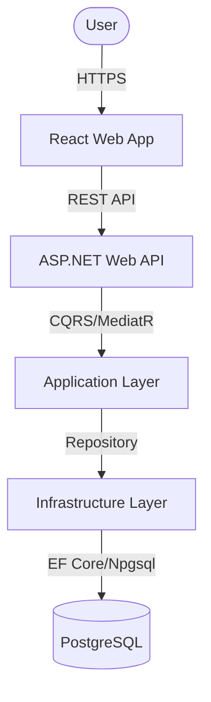
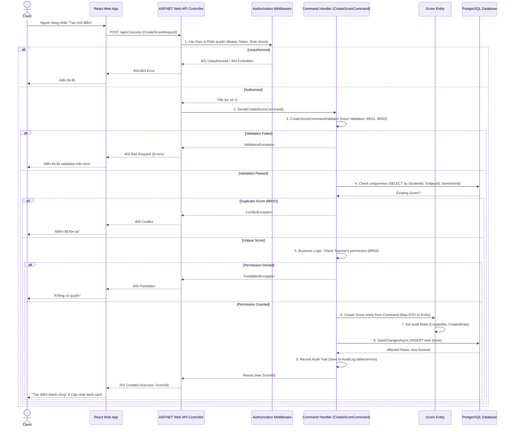

# Software Requirements Specification (SRS) & Solution Architecture Document (SAD)

| Metadata | Giá trị |
|----------|---------|
| **Mã tính năng** | `QUAN-20260531-154643` |
| **Tên tính năng** | Quan Ly Diem Hoc Ky |
| **Dự án** | quanlyhocsinh |
| **Phiên bản** | 1.0 |
| **Ngày tạo** | 2026-05-31 |
| **Tác giả** | SA Agent (ONENET AgentFactory) |

## Tài liệu liên quan

| Mã tính năng | Loại tài liệu | PR | Trạng thái |
|-------------|---------------|-----|------------|
| `QUAN-20260531-154643` | BRD | #40 | ✅ Đã duyệt |
| `QUAN-20260531-154643` | **SRS/SAD** (tài liệu này) | — | ✅ Hiện tại |
| `QUAN-20260531-154643` | DEV (mã nguồn) | — | ⏳ Chờ SRS duyệt |
| `QUAN-20260531-154643` | TEST (test cases) | — | ⏳ Chờ DEV duyệt |

---

# PHẦN I — SRS (Software Requirements Specification)

## 1. Introduction

### 1.1 Purpose
Tài liệu này đặc tả các yêu cầu phần mềm (SRS) và thiết kế kiến trúc giải pháp (SAD) cho tính năng "Quản lý Điểm Học Kỳ" (Feature ID: `QUAN-20260531-154643`) thuộc hệ thống ONENET. Mục tiêu chính là cung cấp một hệ thống cho phép Giáo viên và Quản trị viên nhà trường quản lý (tạo, xem, cập nhật, xóa) điểm học kỳ của học sinh một cách chính xác, hiệu quả và có tổ chức. Mục tiêu phụ bao gồm đảm bảo tính chính xác, toàn vẹn dữ liệu, nâng cao hiệu suất, giảm thiểu sai sót, hỗ trợ truy xuất thông tin nhanh chóng và linh hoạt, đồng thời làm nền tảng cho việc phát triển các chức năng báo cáo, phân tích kết quả học tập trong tương lai.

### 1.2 Scope
**Trong phạm vi (In Scope):**
- Tạo mới bản ghi điểm học kỳ cho từng học sinh theo môn học và học kỳ.
- Xem danh sách điểm học kỳ đã nhập, bao gồm thông tin học sinh, môn học, học kỳ và điểm số.
- Xem chi tiết thông tin của một bản ghi điểm học kỳ cụ thể.
- Chỉnh sửa thông tin điểm học kỳ hiện có.
- Xóa bản ghi điểm học kỳ.
- Xác thực dữ liệu đầu vào cho các trường thông tin điểm (định dạng, giá trị).
- Tìm kiếm điểm học kỳ theo các tiêu chí như tên học sinh, mã học sinh, tên môn học, hoặc học kỳ.
- Phân trang danh sách điểm học kỳ.

**Ngoài phạm vi (Out of Scope):**
- Tự động tính toán điểm trung bình môn, điểm trung bình học kỳ, hoặc điểm tổng kết năm học.
- Chức năng in hoặc xuất báo cáo bảng điểm, học bạ.
- Tích hợp với các hệ thống bên ngoài (ví dụ: cổng thông tin phụ huynh, hệ thống gửi thông báo).
- Quản lý các thành phần điểm chi tiết (điểm miệng, điểm 15 phút, điểm giữa kỳ, ...), chỉ tập trung vào điểm học kỳ cuối cùng.
- Chức năng nhập/xuất dữ liệu điểm hàng loạt từ/ra file (Excel, CSV).

### 1.3 Intended Audience
Tài liệu này dành cho:
- **Nhóm phát triển (Development Team):** Cung cấp các yêu cầu kỹ thuật chi tiết để xây dựng tính năng.
- **Nhóm kiểm thử (QA Team):** Cung cấp cơ sở để xây dựng các kịch bản và trường hợp kiểm thử.
- **Quản lý dự án (Project Managers):** Để hiểu phạm vi, tiến độ và tài nguyên cần thiết.
- **Chuyên viên phân tích nghiệp vụ (Business Analysts):** Để xác nhận rằng các yêu cầu nghiệp vụ đã được chuyển hóa thành các yêu cầu kỹ thuật một cách chính xác.
- **Các bên liên quan (Stakeholders):** Để có cái nhìn tổng quan về giải pháp và các khả năng của hệ thống.

---

## 2. Overall Description

### 2.1 Product Perspective
Tính năng "Quản lý Điểm Học Kỳ" là một phần cấu thành của hệ thống quản lý trường học ONENET. Nó được thiết kế để hoạt động độc lập nhưng có sự phụ thuộc chặt chẽ vào các module hiện có để truy xuất dữ liệu liên quan.
- **Giả định:**
    - Dữ liệu về học sinh, môn học, lớp học và học kỳ đã tồn tại và được quản lý trong hệ thống ONENET thông qua các module tương ứng.
    - Người dùng có quyền truy cập tính năng Quản lý Điểm Học Kỳ đã được xác thực và phân quyền phù hợp.
    - Điểm học kỳ được nhập là điểm cuối cùng của môn học trong học kỳ, không phải điểm thành phần.
- **Phụ thuộc:**
    - **Module Quản lý Học sinh:** Cung cấp `StudentId` và thông tin chi tiết về học sinh (`StudentCode`, `FullName`).
    - **Module Quản lý Môn học:** Cung cấp `SubjectId` và thông tin về môn học (`SubjectName`).
    - **Module Quản lý Học kỳ:** Cung cấp `SemesterId` và thông tin về học kỳ (`SemesterName`, `SchoolYear`).
    - **Hệ thống Xác thực và Phân quyền:** Đảm bảo người dùng có quyền hợp lệ để thực hiện các thao tác quản lý điểm.

### 2.2 User Roles
Hệ thống sẽ hỗ trợ các vai trò người dùng sau với các quyền hạn được định nghĩa:

| Vai trò | Mô tả | Quyền hạn kỹ thuật |
|---------|-------|--------------------|
| **Giáo viên** | Giáo viên Bộ môn/Chủ nhiệm | - `CREATE`, `READ`, `UPDATE`, `DELETE` điểm của học sinh trong các lớp và môn học được phân công. <br> - Quyền hạn này sẽ được kiểm tra chi tiết theo `StudentId` và `SubjectId` dựa trên phân công giảng dạy. |
| **Quản trị viên Nhà trường** | Quản lý hệ thống/Trợ lý giáo vụ | - Toàn quyền `CREATE`, `READ`, `UPDATE`, `DELETE` điểm của tất cả học sinh trong trường. <br> - Có thể quản lý phân công cho giáo viên. |

### 2.3 Technology Stack

| Layer | Công nghệ |
|-------|----------|
| Backend | .NET 10, ASP.NET Web API |
| Architecture | Clean Architecture, CQRS + MediatR |
| ORM | Entity Framework Core |
| Frontend | React + Mantine UI |
| Database | PostgreSQL |

---

## 3. Functional Requirements

> Tham chiếu từ BRD `QUAN-20260531-154643`

| Mã FR (từ BRD) | Mã SRS | Mô tả kỹ thuật (Technical Logic) | Input Validation | Output Mapping |
|----------------|--------|----------------------------------|------------------|----------------|
| `QUAN-20260531-154643-FR01` | `QUAN-20260531-154643-SRS01` | **Tạo mới bản ghi điểm học kỳ:**<br>1. Nhận `CreateScoreCommand` (DTO) từ API.<br>2. Thực hiện validation dữ liệu đầu vào.<br>3. Kiểm tra `StudentId`, `SubjectId`, `SemesterId` có tồn tại trong các module tương ứng không.<br>4. **BR02:** Kiểm tra tính duy nhất: Không cho phép tạo bản ghi điểm nếu đã tồn tại điểm cho cùng một `StudentId`, `SubjectId`, `SemesterId`.<br>5. **BR04:** Kiểm tra quyền hạn người dùng: Nếu là Giáo viên, xác minh người dùng có quyền tạo điểm cho học sinh này, môn học này và học kỳ này.<br>6. Map DTO sang `Score` entity.<br>7. Gán `CreatedBy`, `CreatedDate` (Audit Trail).<br>8. Lưu entity vào database.<br>9. Ghi log audit cho thao tác tạo. | **BR01:** `Value` là số thực từ 0.0 đến 10.0 (tối đa 2 chữ số thập phân).<br>**BR03:** `StudentId`, `SubjectId`, `SemesterId`, `Value` là bắt buộc.<br> `StudentId`, `SubjectId`, `SemesterId` phải là UUID hợp lệ và tồn tại trong hệ thống. | Trả về `ScoreId` của bản ghi vừa tạo thành công. |
| `QUAN-20260531-154643-FR02` | `QUAN-20260531-154643-SRS02` | **Xem danh sách điểm học kỳ (có tìm kiếm, phân trang):**<br>1. Nhận `GetScoresQuery` (DTO) với các tham số tìm kiếm (`StudentName`, `StudentCode`, `SubjectName`, `SemesterName`, `SchoolYear`), phân trang (`PageNumber`, `PageSize`), và sắp xếp.<br>2. **BR04:** Kiểm tra quyền hạn người dùng: Nếu là Giáo viên, chỉ truy vấn các bản ghi điểm mà giáo viên đó có quyền xem (dựa trên phân công).<br>3. Xây dựng truy vấn LINQ: `INNER JOIN` với `Students`, `Subjects`, `Semesters`.<br>4. Áp dụng các bộ lọc tìm kiếm.<br>5. Áp dụng phân trang và sắp xếp.<br>6. Truy vấn database (dùng `AsNoTracking` để tối ưu đọc).<br>7. Map kết quả sang danh sách `ScoreListDto`. | `PageNumber` >= 1, `PageSize` >= 1.<br>Các tham số tìm kiếm là chuỗi, có thể trống. | Trả về đối tượng `PaginatedList<ScoreListDto>` bao gồm danh sách điểm, tổng số bản ghi, số trang hiện tại, tổng số trang. |
| `QUAN-20260531-154643-FR03` | `QUAN-20260531-154643-SRS03` | **Xem chi tiết một bản ghi điểm học kỳ:**<br>1. Nhận `GetScoreDetailQuery` (ID của bản ghi điểm).<br>2. Truy vấn `Score` entity từ database bằng ID.<br>3. **BR04:** Kiểm tra quyền hạn người dùng: Nếu là Giáo viên, xác minh người dùng có quyền xem bản ghi điểm này.<br>4. Nếu không tìm thấy, trả về lỗi 404 Not Found.<br>5. `INNER JOIN` với `Students`, `Subjects`, `Semesters` để lấy thông tin liên quan.<br>6. Map entity sang `ScoreDetailDto`. | `ScoreId` là UUID hợp lệ. | Trả về đối tượng `ScoreDetailDto` chứa tất cả thông tin chi tiết của bản ghi điểm. |
| `QUAN-20260531-154643-FR04` | `QUAN-20260531-154643-SRS04` | **Cập nhật thông tin điểm học kỳ:**<br>1. Nhận `UpdateScoreCommand` (ID bản ghi và DTO chứa `Value` mới).<br>2. Thực hiện validation dữ liệu đầu vào.<br>3. Tìm `Score` entity trong database bằng ID.<br>4. Nếu không tìm thấy, trả về lỗi 404 Not Found.<br>5. **BR04:** Kiểm tra quyền hạn người dùng: Nếu là Giáo viên, xác minh người dùng có quyền cập nhật bản ghi điểm này.<br>6. Cập nhật trường `Value` của entity.<br>7. Cập nhật `LastModifiedBy`, `LastModifiedDate` (Audit Trail).<br>8. Ghi log audit với giá trị trước và sau khi thay đổi.<br>9. Lưu thay đổi vào database. | **BR01:** `Value` là số thực từ 0.0 đến 10.0 (tối đa 2 chữ số thập phân).<br>`ScoreId` là UUID hợp lệ và tồn tại. | Trả về thông báo thành công. |
| `QUAN-20260531-154643-FR05` | `QUAN-20260531-154643-SRS05` | **Xóa một bản ghi điểm học kỳ:**<br>1. Nhận `DeleteScoreCommand` (ID của bản ghi điểm).<br>2. Tìm `Score` entity từ database bằng ID.<br>3. Nếu không tìm thấy, trả về lỗi 404 Not Found.<br>4. **BR04:** Kiểm tra quyền hạn người dùng: Nếu là Giáo viên, xác minh người dùng có quyền xóa bản ghi điểm này.<br>5. Ghi log audit bản ghi đã bị xóa.<br>6. Xóa entity khỏi database.<br>7. Lưu thay đổi vào database. | `ScoreId` là UUID hợp lệ và tồn tại. | Trả về thông báo thành công. |

---

## 4. API Interface Contract

### 4.1 API: Create Score (`QUAN-20260531-154643-SRS01`)

- **Method**: `POST`
- **Endpoint**: `/api/v1/scores`
- **Authorization**: `Bearer Token` (Role: `Admin`, `Teacher`)
- **Mô tả**: Tạo mới một bản ghi điểm học kỳ cho học sinh.

**Request:**
```json
{
  "studentId": "uuid (required)",
  "subjectId": "uuid (required)",
  "semesterId": "uuid (required)",
  "value": "decimal (required, min: 0.0, max: 10.0, max 2 decimal places)"
}
```

**Response (201 Created):**
```json
{
  "success": true,
  "message": "Score created successfully.",
  "data": { 
    "id": "uuid" 
  }
}
```

**Response (400 Bad Request):**
```json
{
  "success": false,
  "message": "Validation Error",
  "errors": [
    { "field": "studentId", "message": "Student ID is required." },
    { "field": "value", "message": "Score value must be between 0.0 and 10.0." }
  ]
}
```

**Response (403 Forbidden):**
```json
{
  "success": false,
  "message": "Forbidden. You do not have permission to create scores for this student, subject, or semester."
}
```

**Response (409 Conflict):**
```json
{
  "success": false,
  "message": "A score for this student, subject, and semester already exists."
}
```

### 4.2 API: Get List Scores (`QUAN-20260531-154643-SRS02`)

- **Method**: `GET`
- **Endpoint**: `/api/v1/scores`
- **Authorization**: `Bearer Token` (Role: `Admin`, `Teacher`)
- **Mô tả**: Lấy danh sách các bản ghi điểm học kỳ, hỗ trợ tìm kiếm, phân trang và sắp xếp.

**Request (Query Parameters):**
- `pageNumber`: `int` (optional, default: 1, min: 1)
- `pageSize`: `int` (optional, default: 10, min: 1, max: 100)
- `searchKeyword`: `string` (optional, tìm kiếm theo tên học sinh, mã học sinh, tên môn học)
- `semesterId`: `uuid` (optional, lọc theo học kỳ)
- `subjectId`: `uuid` (optional, lọc theo môn học)
- `studentId`: `uuid` (optional, lọc theo học sinh)
- `sortBy`: `string` (optional, ví dụ: `StudentName`, `Value`, `CreatedDate`)
- `sortOrder`: `string` (optional, `asc` hoặc `desc`, default: `asc`)

**Response (200 OK):**
```json
{
  "success": true,
  "message": "Scores retrieved successfully.",
  "data": {
    "items": [
      {
        "id": "uuid",
        "studentId": "uuid",
        "studentCode": "string",
        "studentFullName": "string",
        "subjectId": "uuid",
        "subjectName": "string",
        "semesterId": "uuid",
        "semesterName": "string",
        "schoolYear": "string",
        "value": "decimal (8.5)",
        "lastModifiedDate": "datetime (nullable)",
        "lastModifiedBy": "string (nullable)"
      }
    ],
    "pageNumber": 1,
    "pageSize": 10,
    "totalCount": 100,
    "totalPages": 10
  }
}
```

**Response (403 Forbidden):**
```json
{
  "success": false,
  "message": "Forbidden. You do not have permission to view this list of scores."
}
```

### 4.3 API: Get Score Detail (`QUAN-20260531-154643-SRS03`)

- **Method**: `GET`
- **Endpoint**: `/api/v1/scores/{id}`
- **Authorization**: `Bearer Token` (Role: `Admin`, `Teacher`)
- **Mô tả**: Lấy thông tin chi tiết của một bản ghi điểm học kỳ.

**Request (URL Parameters):**
- `id`: `uuid` (required, Score ID)

**Response (200 OK):**
```json
{
  "success": true,
  "message": "Score detail retrieved successfully.",
  "data": {
    "id": "uuid",
    "studentId": "uuid",
    "studentCode": "string",
    "studentFullName": "string",
    "subjectId": "uuid",
    "subjectName": "string",
    "semesterId": "uuid",
    "semesterName": "string",
    "schoolYear": "string",
    "value": "decimal (8.5)",
    "createdBy": "string",
    "createdDate": "datetime",
    "lastModifiedBy": "string (nullable)",
    "lastModifiedDate": "datetime (nullable)"
  }
}
```

**Response (403 Forbidden):**
```json
{
  "success": false,
  "message": "Forbidden. You do not have permission to view this score."
}
```

**Response (404 Not Found):**
```json
{
  "success": false,
  "message": "Score not found."
}
```

### 4.4 API: Update Score (`QUAN-20260531-154643-SRS04`)

- **Method**: `PUT`
- **Endpoint**: `/api/v1/scores/{id}`
- **Authorization**: `Bearer Token` (Role: `Admin`, `Teacher`)
- **Mô tả**: Cập nhật thông tin điểm học kỳ của một bản ghi cụ thể.

**Request (URL Parameters):**
- `id`: `uuid` (required, Score ID)

**Request Body:**
```json
{
  "value": "decimal (required, min: 0.0, max: 10.0, max 2 decimal places)"
}
```

**Response (200 OK):**
```json
{
  "success": true,
  "message": "Score updated successfully."
}
```

**Response (400 Bad Request):**
```json
{
  "success": false,
  "message": "Validation Error",
  "errors": [
    { "field": "value", "message": "Score value must be between 0.0 and 10.0." }
  ]
}
```

**Response (403 Forbidden):**
```json
{
  "success": false,
  "message": "Forbidden. You do not have permission to update this score."
}
```

**Response (404 Not Found):**
```json
{
  "success": false,
  "message": "Score not found."
}
```

### 4.5 API: Delete Score (`QUAN-20260531-154643-SRS05`)

- **Method**: `DELETE`
- **Endpoint**: `/api/v1/scores/{id}`
- **Authorization**: `Bearer Token` (Role: `Admin`, `Teacher`)
- **Mô tả**: Xóa một bản ghi điểm học kỳ.

**Request (URL Parameters):**
- `id`: `uuid` (required, Score ID)

**Response (200 OK):**
```json
{
  "success": true,
  "message": "Score deleted successfully."
}
```

**Response (403 Forbidden):**
```json
{
  "success": false,
  "message": "Forbidden. You do not have permission to delete this score."
}
```

**Response (404 Not Found):**
```json
{
  "success": false,
  "message": "Score not found."
}
```

---

## 5. Non-functional Requirements & Security

### 5.1 Authentication & Authorization
- **Authentication (AuthN):** Tất cả các API endpoint trong tính năng này đều yêu cầu `Bearer Token` hợp lệ (JWT) được cấp phát sau khi người dùng đăng nhập thành công vào hệ thống ONENET. Token này sẽ được kiểm tra tính hợp lệ và thời hạn sử dụng.
- **Authorization (AuthZ):**
    - **Policy-based Authorization:** Hệ thống sẽ áp dụng chính sách phân quyền dựa trên vai trò (`Role`) và các yêu cầu nghiệp vụ (`Claim`).
    - **Vai trò:**
        - `Admin`: Có toàn quyền (CRUD) trên tất cả các bản ghi điểm học kỳ.
        - `Teacher`: Có quyền CRUD trên các bản ghi điểm mà mình được phân công giảng dạy (dựa trên `StudentId`, `SubjectId`, `SemesterId` tương ứng với phân công của giáo viên).
    - **Kiểm tra quyền hạn chi tiết (BR04):** Đối với vai trò `Teacher`, mỗi yêu cầu tạo, sửa, xóa hoặc xem chi tiết một bản ghi điểm cần phải trải qua một quy trình kiểm tra quyền hạn nghiệp vụ cụ thể.
        - Khi `CREATE/UPDATE/DELETE/GET` một điểm, hệ thống sẽ kiểm tra xem `Teacher` hiện tại có được phép thao tác với `StudentId`, `SubjectId`, `SemesterId` tương ứng hay không. Điều này đòi hỏi việc truy vấn dữ liệu phân công giảng dạy của giáo viên từ các module liên quan hoặc một dịch vụ phân quyền tập trung.
        - Nếu không có quyền, hệ thống sẽ trả về mã lỗi `403 Forbidden`.

### 5.2 Performance & Caching
- **Database Indexing:**
    - Các khóa chính (`Id`) và khóa ngoại (`StudentId`, `SubjectId`, `SemesterId`) sẽ được đánh index mặc định.
    - Một index `UNIQUE` sẽ được tạo trên tập hợp các trường (`StudentId`, `SubjectId`, `SemesterId`) để đảm bảo **BR02: Tính duy nhất của bản ghi điểm**.
    - Các trường dùng để tìm kiếm (`StudentCode`, `StudentFullName`, `SubjectName`, `SemesterName`) sẽ được đánh index (hoặc sử dụng Full-Text Search nếu cần) để tối ưu hóa truy vấn tìm kiếm.
    - Các trường `CreatedDate`, `LastModifiedDate` có thể được đánh index nếu có yêu cầu truy vấn hoặc sắp xếp thường xuyên theo thời gian.
- **Query Optimization:** Sử dụng `AsNoTracking()` cho các truy vấn chỉ đọc (GET) để tối ưu hóa hiệu suất và giảm tải cho bộ nhớ.
- **Phân trang và sắp xếp phía server:** Đảm bảo các API danh sách luôn sử dụng phân trang và sắp xếp để tránh tải về lượng dữ liệu lớn không cần thiết.
- **Load Testing:** Thực hiện kiểm thử tải để đảm bảo các NFR về thời gian phản hồi (3 giây cho tải trang/tìm kiếm, 2 giây cho CRUD) được đáp ứng với số lượng bản ghi lớn (500-10,000).

---

# PHẦN II — SAD (Solution Architecture Document)

## 6. Kiến trúc tổng thể (C4 Container Level)

### 6.1 Architecture Diagram



### 6.2 Sequence Diagram (Luồng nghiệp vụ chính: Tạo mới Điểm Học Kỳ)

> Sơ đồ tuần tự minh họa tương tác giữa Client, Controller, Handler, và Database cho luồng tạo mới điểm.



---

## 7. Thiết kế chi tiết Database (Tham chiếu ERD)

### 7.1 Entity Relationship
- Danh sách bảng chính:
    - `Students` (External, assumed to exist)
    - `Subjects` (External, assumed to exist)
    - `Semesters` (External, assumed to exist)
    - `Scores` (New entity)
    - `AuditLogs` (Generic Audit Trail, shared)

```mermaid
erDiagram
    Students {
        UUID Id PK "Mã học sinh"
        VARCHAR(20) Code UNIQUE "Mã học sinh"
        VARCHAR(255) FullName "Họ và tên học sinh"
    }

    Subjects {
        UUID Id PK "Mã môn học"
        VARCHAR(100) Name UNIQUE "Tên môn học"
    }

    Semesters {
        UUID Id PK "Mã học kỳ"
        VARCHAR(50) Name "Tên học kỳ (VD: HK1)"
        VARCHAR(10) SchoolYear "Năm học (VD: 2023-2024)"
    }

    Scores {
        UUID Id PK "Mã điểm học kỳ"
        UUID StudentId FK "Mã học sinh"
        UUID SubjectId FK "Mã môn học"
        UUID SemesterId FK "Mã học kỳ"
        DECIMAL(4,2) Value "Điểm số (0.00-10.00)"
        VARCHAR(255) CreatedBy "Người tạo"
        TIMESTAMP CreatedDate "Thời gian tạo"
        VARCHAR(255) LastModifiedBy NULL "Người cập nhật cuối cùng"
        TIMESTAMP LastModifiedDate NULL "Thời gian cập nhật cuối cùng"
    }

    AuditLogs {
        UUID Id PK
        VARCHAR(50) EntityType
        UUID EntityId
        VARCHAR(50) Action
        JSON OldValues NULL
        JSON NewValues NULL
        VARCHAR(255) Actor
        TIMESTAMP Timestamp
    }

    Students ||--o{ Scores : "has"
    Subjects ||--o{ Scores : "has"
    Semesters ||--o{ Scores : "has"
    Scores }o--|| AuditLogs : "logs events for"
```

**EF Core Configuration / Migration Logic for `Scores` table:**

```csharp
// Trong DbContext hoặc cấu hình Entity
public class ScoreConfiguration : IEntityTypeConfiguration<Score>
{
    public void Configure(EntityTypeBuilder<Score> builder)
    {
        builder.ToTable("Scores"); // Tên bảng

        builder.HasKey(s => s.Id); // Khóa chính
        builder.Property(s => s.Id).ValueGeneratedOnAdd(); // Tự động sinh ID

        builder.Property(s => s.Value)
            .HasColumnType("decimal(4,2)") // Kiểu dữ liệu DECIMAL với 2 chữ số thập phân
            .IsRequired(); // Bắt buộc

        builder.Property(s => s.CreatedBy).HasMaxLength(255).IsRequired();
        builder.Property(s => s.CreatedDate).IsRequired();
        builder.Property(s => s.LastModifiedBy).HasMaxLength(255).IsRequired(false); // Nullable
        builder.Property(s => s.LastModifiedDate).IsRequired(false); // Nullable

        // Thiết lập mối quan hệ với các bảng ngoài
        builder.HasOne<Student>()
            .WithMany()
            .HasForeignKey(s => s.StudentId)
            .IsRequired()
            .OnDelete(DeleteBehavior.Restrict); // Ngăn xóa học sinh nếu có điểm

        builder.HasOne<Subject>()
            .WithMany()
            .HasForeignKey(s => s.SubjectId)
            .IsRequired()
            .OnDelete(DeleteBehavior.Restrict); // Ngăn xóa môn học nếu có điểm

        builder.HasOne<Semester>()
            .WithMany()
            .HasForeignKey(s => s.SemesterId)
            .IsRequired()
            .OnDelete(DeleteBehavior.Restrict); // Ngăn xóa học kỳ nếu có điểm

        // Đảm bảo tính duy nhất của bản ghi điểm (BR02)
        builder.HasIndex(s => new { s.StudentId, s.SubjectId, s.SemesterId })
            .IsUnique()
            .HasName("IX_Scores_UniqueStudentSubjectSemester");

        // Các index khác để tối ưu tìm kiếm và lọc
        builder.HasIndex(s => s.StudentId);
        builder.HasIndex(s => s.SubjectId);
        builder.HasIndex(s => s.SemesterId);
        // Có thể thêm index trên Value nếu thường xuyên lọc theo điểm số.
    }
}

// Đối với AuditLogs (tùy thuộc vào thiết kế chung của hệ thống, có thể là bảng chung)
public class AuditLogConfiguration : IEntityTypeConfiguration<AuditLog>
{
    public void Configure(EntityTypeBuilder<AuditLog> builder)
    {
        builder.ToTable("AuditLogs");
        builder.HasKey(a => a.Id);
        builder.Property(a => a.EntityType).HasMaxLength(50).IsRequired();
        builder.Property(a => a.EntityId).IsRequired();
        builder.Property(a => a.Action).HasMaxLength(50).IsRequired();
        builder.Property(a => a.OldValues).HasColumnType("jsonb").IsRequired(false);
        builder.Property(a => a.NewValues).HasColumnType("jsonb").IsRequired(false);
        builder.Property(a => a.Actor).HasMaxLength(255).IsRequired();
        builder.Property(a => a.Timestamp).IsRequired();

        builder.HasIndex(a => new { a.EntityType, a.EntityId });
        builder.HasIndex(a => a.Actor);
        builder.HasIndex(a => a.Timestamp);
    }
}
```

### 7.2 Data Seeding (Dữ liệu mẫu)
- Không có yêu cầu data seeding cụ thể cho bảng `Scores` vì dữ liệu này được tạo trong quá trình nghiệp vụ.
- Yêu cầu tạo script data migration (seed data) cho các bảng Lookup / Cấu hình ban đầu của `Students`, `Subjects`, `Semesters` là cần thiết cho môi trường phát triển/kiểm thử, nhưng đây là nhiệm vụ của các module tương ứng.
- Đảm bảo có ít nhất 1 `Admin` user và vài `Teacher` users với phân công cụ thể để kiểm thử quyền hạn.

---

## 8. Application Layer Details (Commands/Queries)

Sử dụng kiến trúc CQRS với MediatR để tách biệt logic đọc và ghi.

| # | Type | Class Name | Mã SRS | Ý nghĩa & Logic chính |
|---|------|-----------|--------|-----------------------|
| 1 | Command | `CreateScoreCommand` | `QUAN-20260531-154643-SRS01` | Chứa `StudentId`, `SubjectId`, `SemesterId`, `Value`. Xử lý validation, kiểm tra tính duy nhất, kiểm tra quyền hạn giáo viên, ánh xạ sang entity `Score` và lưu vào DB. |
| 2 | Query | `GetScoresQuery` | `QUAN-20260531-154643-SRS02` | Chứa các tham số `PageNumber`, `PageSize`, `SearchKeyword`, `SemesterId`, `SubjectId`, `StudentId`, `SortBy`, `SortOrder`. Xử lý logic tìm kiếm, phân trang, sắp xếp và kiểm tra quyền hạn giáo viên để trả về danh sách `ScoreListDto`. |
| 3 | Query | `GetScoreDetailQuery` | `QUAN-20260531-154643-SRS03` | Chứa `ScoreId`. Xử lý logic truy vấn chi tiết một bản ghi điểm và kiểm tra quyền hạn giáo viên để trả về `ScoreDetailDto`. |
| 4 | Command | `UpdateScoreCommand` | `QUAN-20260531-154643-SRS04` | Chứa `ScoreId` và `Value` mới. Xử lý validation, tìm kiếm bản ghi, kiểm tra quyền hạn giáo viên, cập nhật `Value` và lưu vào DB. |
| 5 | Command | `DeleteScoreCommand` | `QUAN-20260531-154643-SRS05` | Chứa `ScoreId`. Xử lý logic tìm kiếm bản ghi, kiểm tra quyền hạn giáo viên, xóa bản ghi và lưu vào DB. |
| 6 | Validator | `CreateScoreCommandValidator` | `QUAN-20260531-154643-SRS01` | Validate các trường trong `CreateScoreCommand` theo BR01, BR03. |
| 7 | Validator | `UpdateScoreCommandValidator` | `QUAN-20260531-154643-SRS04` | Validate trường `Value` trong `UpdateScoreCommand` theo BR01. |

---

## 9. Rủi ro và giảm thiểu

| # | Rủi ro | Mức độ | Giảm thiểu |
|---|--------|--------|-----------|
| 1 | **Concurrency Issue (Lỗi đồng thời)** | Medium | - **Cơ chế Optimistic Concurrency:** Sử dụng `RowVersion` hoặc `xmin` (PostgreSQL) để phát hiện và xử lý xung đột khi hai người dùng cố gắng cập nhật cùng một bản ghi đồng thời. EF Core hỗ trợ `ConcurrencyToken`. <br> - **Transaction:** Đảm bảo các thao tác ghi (create, update, delete) được thực hiện trong một transaction để duy trì tính nhất quán của dữ liệu. |
| 2 | **Data Integrity Violation (Vi phạm toàn vẹn dữ liệu)** | High | - **Database Constraints:** Áp dụng các ràng buộc khóa ngoại (FK), ràng buộc duy nhất (Unique Index trên `StudentId, SubjectId, SemesterId`), và ràng buộc kiểm tra (Check Constraint cho `Value` 0.0-10.0) trực tiếp trên database. <br> - **Application-level Validation:** Sử dụng FluentValidation trong Application Layer để kiểm tra dữ liệu đầu vào sớm và cung cấp phản hồi rõ ràng cho người dùng (BR01, BR03). |
| 3 | **Authorization Bypass (Vượt quyền)** | High | - **Policy-based Authorization:** Thực thi các chính sách phân quyền chi tiết (Admin vs. Teacher) ở `Authorization Middleware` và trong `Command/Query Handlers` để kiểm tra quyền hạn nghiệp vụ (BR04). <br> - **Mã hóa truyền tải:** Bắt buộc sử dụng HTTPS cho tất cả các giao tiếp client-server để ngăn chặn nghe lén và giả mạo token. |
| 4 | **Performance Degradation (Suy giảm hiệu suất)** | Medium | - **Database Indexing:** Tạo các chỉ mục thích hợp trên các cột thường xuyên được dùng trong `WHERE` clauses và `JOIN` conditions. <br> - **Tối ưu hóa truy vấn:** Sử dụng `AsNoTracking()` cho các truy vấn chỉ đọc. Hạn chế N+1 query bằng cách sử dụng `Include` hoặc `Projection`. <br> - **Phân trang & Tìm kiếm phía Server:** Luôn áp dụng phân trang và lọc dữ liệu phía server để tránh tải toàn bộ dữ liệu. |
| 5 | **Audit Trail Inconsistency (Lỗi nhật ký kiểm toán)** | Low | - Đảm bảo cơ chế ghi nhật ký kiểm toán được tích hợp chặt chẽ với các thao tác CRUD và được thực hiện trong cùng một transaction nếu có thể, hoặc sử dụng một dịch vụ message queue đáng tin cậy để ghi log bất đồng bộ. <br> - Xử lý lỗi khi ghi log để tránh mất thông tin audit. |

---

## 10. Danh sách Files cần tạo/sửa (Implementation Plan)

Dựa trên cấu trúc Clean Architecture và CQRS + MediatR của ONENET, các file sau đây dự kiến sẽ được tạo hoặc sửa đổi:

| # | File Path | Loại | Mã SRS | Mô tả |
|---|----------|------|--------|-------|
| 1 | `src/ONENET.Domain/Entities/Score.cs` | New | `QUAN-20260531-154643-SRS01` | Định nghĩa entity `Score` với các thuộc tính và kế thừa từ `AuditableEntity`. |
| 2 | `src/ONENET.Domain/Events/ScoreCreatedEvent.cs` | New | `QUAN-20260531-154643-SRS01` | Domain event cho việc tạo điểm (nếu cần xử lý thêm sau khi tạo). |
| 3 | `src/ONENET.Application/Scores/Commands/CreateScore/CreateScoreCommand.cs` | New | `QUAN-20260531-154643-SRS01` | Command để tạo mới điểm. |
| 4 | `src/ONENET.Application/Scores/Commands/CreateScore/CreateScoreCommandHandler.cs` | New | `QUAN-20260531-154643-SRS01` | Handler xử lý `CreateScoreCommand`. |
| 5 | `src/ONENET.Application/Scores/Commands/CreateScore/CreateScoreCommandValidator.cs` | New | `QUAN-20260531-154643-SRS01` | Validator cho `CreateScoreCommand`. |
| 6 | `src/ONENET.Application/Scores/Commands/UpdateScore/UpdateScoreCommand.cs` | New | `QUAN-20260531-154643-SRS04` | Command để cập nhật điểm. |
| 7 | `src/ONENET.Application/Scores/Commands/UpdateScore/UpdateScoreCommandHandler.cs` | New | `QUAN-20260531-154643-SRS04` | Handler xử lý `UpdateScoreCommand`. |
| 8 | `src/ONENET.Application/Scores/Commands/UpdateScore/UpdateScoreCommandValidator.cs` | New | `QUAN-20260531-154643-SRS04` | Validator cho `UpdateScoreCommand`. |
| 9 | `src/ONENET.Application/Scores/Commands/DeleteScore/DeleteScoreCommand.cs` | New | `QUAN-20260531-154643-SRS05` | Command để xóa điểm. |
| 10 | `src/ONENET.Application/Scores/Commands/DeleteScore/DeleteScoreCommandHandler.cs` | New | `QUAN-20260531-154643-SRS05` | Handler xử lý `DeleteScoreCommand`. |
| 11 | `src/ONENET.Application/Scores/Queries/GetScores/GetScoresQuery.cs` | New | `QUAN-20260531-154643-SRS02` | Query để lấy danh sách điểm. |
| 12 | `src/ONENET.Application/Scores/Queries/GetScores/GetScoresQueryHandler.cs` | New | `QUAN-20260531-154643-SRS02` | Handler xử lý `GetScoresQuery`. |
| 13 | `src/ONENET.Application/Scores/Queries/GetScores/ScoreListDto.cs` | New | `QUAN-20260531-154643-SRS02` | DTO cho danh sách điểm. |
| 14 | `src/ONENET.Application/Scores/Queries/GetScoreDetail/GetScoreDetailQuery.cs` | New | `QUAN-20260531-154643-SRS03` | Query để lấy chi tiết điểm. |
| 15 | `src/ONENET.Application/Scores/Queries/GetScoreDetail/GetScoreDetailQueryHandler.cs` | New | `QUAN-20260531-154643-SRS03` | Handler xử lý `GetScoreDetailQuery`. |
| 16 | `src/ONENET.Application/Scores/Queries/GetScoreDetail/ScoreDetailDto.cs` | New | `QUAN-20260531-154643-SRS03` | DTO cho chi tiết điểm. |
| 17 | `src/ONENET.Application/Common/Interfaces/IScoreRepository.cs` | New | N/A | Interface repository cho Score. |
| 18 | `src/ONENET.Infrastructure/Persistence/Repositories/ScoreRepository.cs` | New | N/A | Triển khai repository cho Score. |
| 19 | `src/ONENET.Infrastructure/Persistence/Configuration/ScoreConfiguration.cs` | New | N/A | Cấu hình Entity Framework Core cho `Score` entity. |
| 20 | `src/ONENET.WebAPI/Controllers/ScoresController.cs` | New | All SRS | API Controller cho các thao tác quản lý điểm học kỳ. |
| 21 | `src/ONENET.Infrastructure/Migrations/{timestamp}_AddScoresTable.cs` | New | N/A | File migration để tạo bảng `Scores` và các chỉ mục. |
| 22 | `src/ONENET.Application/Common/Security/ScoreAuthorizationService.cs` | New | `QUAN-20260531-154643-SRS01`, `SRS02`, `SRS03`, `SRS04`, `SRS05` | Dịch vụ kiểm tra quyền hạn cụ thể của giáo viên (BR04). |
| 23 | `src/ONENET.Infrastructure/Persistence/Configuration/AuditLogConfiguration.cs` | New/Modified | N/A | Cấu hình EF Core cho `AuditLog` entity (nếu chưa có hoặc cần sửa đổi). |
| 24 | `src/ONENET.Infrastructure/Services/AuditTrailService.cs` | New/Modified | N/A | Dịch vụ ghi nhật ký kiểm toán. |

---

_Mã tính năng `QUAN-20260531-154643` — Tài liệu SRS/SAD được sinh tự động bởi ONENET AgentFactory._