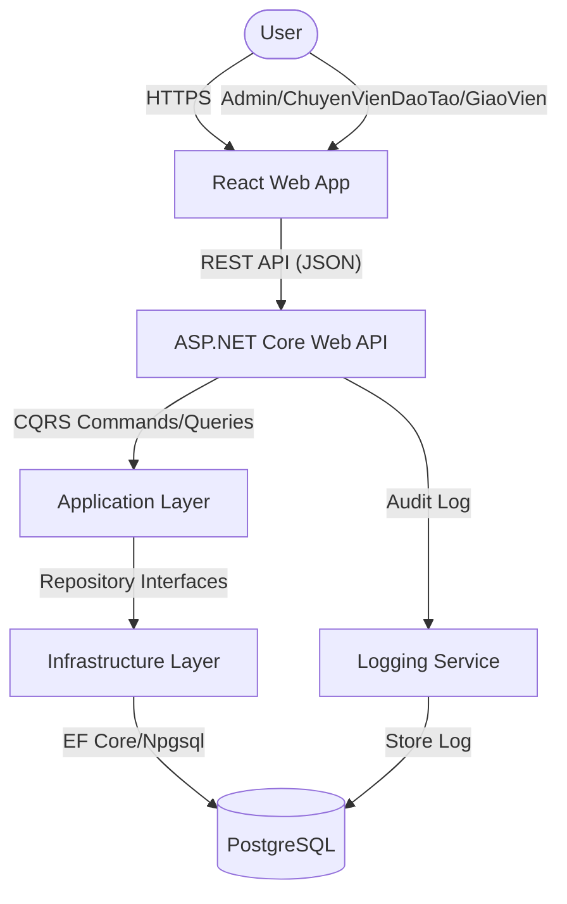
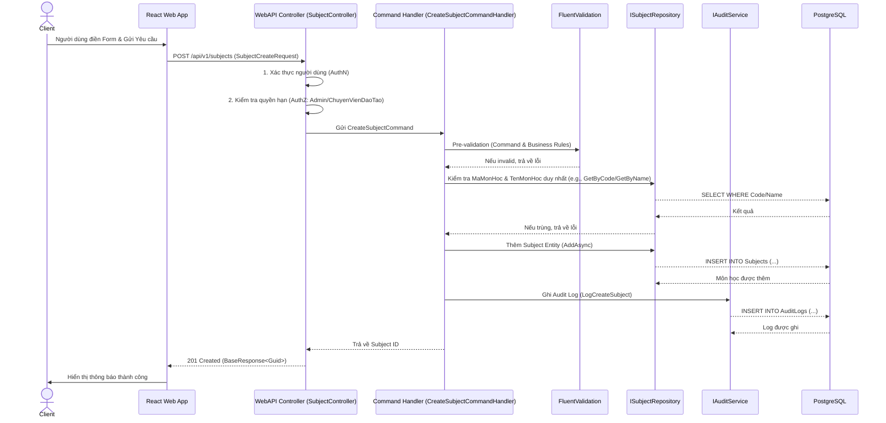

# Software Requirements Specification (SRS) & Solution Architecture Document (SAD)

| Metadata | Giá trị |
|----------|---------|
| **Mã tính năng** | `QUAN-20260531-154643` |
| **Tên tính năng** | Quan Ly Mon Hoc |
| **Dự án** | quanlyhocsinh |
| **Phiên bản** | 1.0 |
| **Ngày tạo** | 2026-05-31 |
| **Tác giả** | SA Agent (ONENET AgentFactory) |

## Tài liệu liên quan

| Mã tính năng | Loại tài liệu | PR | Trạng thái |
|-------------|---------------|-----|------------|
| `QUAN-20260531-154643` | BRD | #41 | ✅ Đã duyệt |
| `QUAN-20260531-154643` | **SRS/SAD** (tài liệu này) | — | ✅ Hiện tại |
| `QUAN-20260531-154643` | DEV (mã nguồn) | — | ⏳ Chờ SRS duyệt |
| `QUAN-20260531-154643` | TEST (test cases) | — | ⏳ Chờ DEV duyệt |

---

# PHẦN I — SRS (Software Requirements Specification)

## 1. Introduction

### 1.1 Purpose
Tài liệu này đặc tả các yêu cầu phần mềm và thiết kế kiến trúc giải pháp cho tính năng "Quản lý Môn học" thuộc dự án `quanlyhocsinh`. Mục tiêu là cung cấp các chức năng CRUD (Tạo, Đọc, Cập nhật, Xóa) cho thông tin môn học, đảm bảo tính toàn vẹn và nhất quán của dữ liệu, phục vụ cho các nghiệp vụ đào tạo.

### 1.2 Scope
Tính năng này tập trung vào việc quản lý thông tin cốt lõi của môn học, bao gồm Mã môn học, Tên môn học, Mô tả, Số tín chỉ, và Trạng thái (Hoạt động/Không hoạt động). Các chức năng chính bao gồm tạo mới, xem danh sách (có phân trang và tìm kiếm), xem chi tiết, cập nhật và xóa mềm môn học. Dữ liệu đầu vào sẽ được xác thực chặt chẽ theo các quy tắc nghiệp vụ.

**Trong phạm vi:**
- Tạo mới, xem danh sách (phân trang, sắp xếp, tìm kiếm), xem chi tiết, cập nhật, xóa mềm môn học.
- Xác thực dữ liệu đầu vào.
- Ghi nhận lịch sử thao tác (Audit Trail) cho các thay đổi quan trọng.

**Ngoài phạm vi:**
- Quản lý học liệu, phân công giảng viên, tích hợp với hệ thống xếp thời khóa biểu tự động, quản lý điểm số.
- Chức năng nhập/xuất dữ liệu hàng loạt.

### 1.3 Intended Audience
Tài liệu này hướng đến các đối tượng sau:
- **Product Owners/Business Analysts:** Để đảm bảo các yêu cầu nghiệp vụ được hiểu và chuyển đổi chính xác.
- **Development Team:** Để làm cơ sở cho việc phát triển phần mềm (thiết kế CSDL, API, logic nghiệp vụ).
- **QA/Testing Team:** Để xây dựng các kịch bản kiểm thử và đảm bảo chất lượng.
- **Solution Architects/Technical Leads:** Để đánh giá và phê duyệt thiết kế kiến trúc.

---

## 2. Overall Description

### 2.1 Product Perspective
Tính năng "Quản lý Môn học" là một module cốt lõi trong hệ thống `quanlyhocsinh`, đóng vai trò là danh mục trung tâm cho tất cả các môn học được cung cấp. Nó cung cấp dữ liệu đầu vào cho các module khác của hệ thống như quản lý đăng ký học, quản lý lớp học (trong tương lai), và báo cáo thống kê. Module này sẽ được triển khai như một tập hợp các API RESTful trên nền tảng .NET Web API, phục vụ cho giao diện người dùng frontend (React Web App).

### 2.2 User Roles

| Persona | Vai trò | Quyền hạn chính |
|---------|-------|-----------------|
| **Quản trị viên hệ thống** | Admin | Toàn quyền CRUD môn học, cấu hình hệ thống |
| **Chuyên viên phòng Đào tạo** | Quản lý nghiệp vụ | Toàn quyền CRUD môn học, tra cứu, báo cáo |
| **Giáo viên** | Người dùng cuối | Xem danh sách và chi tiết môn học |

### 2.3 Technology Stack

| Layer | Công nghệ |
|-------|----------|
| Backend | .NET 8 (LTS), ASP.NET Web API |
| Architecture | Clean Architecture, CQRS + MediatR |
| ORM | Entity Framework Core |
| Frontend | React + Mantine UI |
| Database | PostgreSQL |
| Validation | FluentValidation |
| Logging | Serilog |

---

## 3. Functional Requirements

> Tham chiếu từ BRD `QUAN-20260531-154643`

| Mã FR (từ BRD) | Mã SRS | Mô tả kỹ thuật (Technical Logic) | Input Validation | Output Mapping |
|----------------|--------|----------------------------------|------------------|----------------|
| `QUAN-20260531-154643-FR01` | `QUAN-20260531-154643-SRS01` | **Tạo mới Môn học:**<br>1. Nhận `SubjectCreateCommand` từ API.<br>2. Thực hiện validation cho `SubjectCreateCommand` (xem cột Validation).<br>3. Kiểm tra tính duy nhất của `MaMonHoc` và `TenMonHoc` trong DB.<br>4. Map `SubjectCreateCommand` thành `Subject` Entity.<br>5. Lưu `Subject` Entity vào CSDL thông qua Repository.<br>6. Ghi log Audit Trail cho thao tác tạo mới.<br>7. Trả về ID của môn học vừa tạo. | `BR06`: Mã môn học, Tên môn học, Số tín chỉ là bắt buộc.<br>`BR05`: Mã môn học (max 20), Tên môn học (max 100), Mô tả (max 500).<br>`BR03`: Số tín chỉ là số nguyên dương từ 1-10.<br>`BR01`: Mã môn học phải duy nhất (kiểm tra trước khi lưu).<br>`BR02`: Tên môn học phải duy nhất (kiểm tra trước khi lưu). | Trả về `BaseResponse<Guid>` chứa ID của môn học mới. |
| `QUAN-20260531-154643-FR02` | `QUAN-20260531-154643-SRS02` | **Xem danh sách Môn học:**<br>1. Nhận `GetSubjectsQuery` từ API với các tham số phân trang, sắp xếp, tìm kiếm.<br>2. Xây dựng truy vấn LINQ dựa trên các tham số đầu vào.<br>3. Lọc các môn học có `IsActive = true` theo mặc định (nếu không có tham số `includeInactive`).<br>4. Thực hiện tìm kiếm theo `MaMonHoc` hoặc `TenMonHoc` nếu `searchQuery` được cung cấp.<br>5. Áp dụng phân trang và sắp xếp.<br>6. Map kết quả từ Entity sang DTO `SubjectListDto` và trả về danh sách có phân trang. | `pageIndex` >= 1, `pageSize` >= 1.<br>`sortBy` phải là tên trường hợp lệ.<br>`sortOrder` là "asc" hoặc "desc". | Trả về `BaseResponse<PaginatedList<SubjectListDto>>` chứa danh sách môn học, thông tin phân trang. |
| `QUAN-20260531-154643-FR03` | `QUAN-20260531-154643-SRS03` | **Xem chi tiết Môn học:**<br>1. Nhận `GetSubjectByIdQuery` với ID môn học.<br>2. Truy vấn CSDL để lấy `Subject` Entity theo ID.<br>3. Nếu không tìm thấy, trả về lỗi 404.<br>4. Map `Subject` Entity sang DTO `SubjectDetailDto` và trả về.<br>5. Dùng `AsNoTracking()` để tối ưu truy vấn. | ID môn học là UUID hợp lệ. | Trả về `BaseResponse<SubjectDetailDto>` chứa toàn bộ thông tin môn học. |
| `QUAN-20260531-154643-FR04` | `QUAN-20260531-154643-SRS04` | **Cập nhật Môn học:**<br>1. Nhận `UpdateSubjectCommand` từ API (bao gồm ID và các trường cập nhật).<br>2. Thực hiện validation cho `UpdateSubjectCommand` (xem cột Validation).<br>3. Tìm `Subject` Entity trong CSDL bằng ID.<br>4. Nếu không tìm thấy, trả về lỗi 404.<br>5. Kiểm tra tính duy nhất của `MaMonHoc` và `TenMonHoc` với các môn học khác (loại trừ chính nó).<br>6. Cập nhật các trường thông tin của Entity từ Command.<br>7. Ghi log Audit Trail chi tiết các thay đổi.<br>8. Lưu thay đổi vào CSDL thông qua Repository.<br>9. Trả về thông báo thành công. | `BR06`: Tên môn học, Số tín chỉ là bắt buộc.<br>`BR05`: Mã môn học (max 20), Tên môn học (max 100), Mô tả (max 500).<br>`BR03`: Số tín chỉ là số nguyên dương từ 1-10.<br>`BR01`: Mã môn học phải duy nhất (trừ chính nó).<br>`BR02`: Tên môn học phải duy nhất (trừ chính nó). | Trả về `BaseResponse<Guid>` chứa ID của môn học đã cập nhật. |
| `QUAN-20260531-154643-FR05` | `QUAN-20260531-154643-SRS05` | **Xóa mềm Môn học:**<br>1. Nhận `DeleteSubjectCommand` với ID môn học.<br>2. Tìm `Subject` Entity trong CSDL bằng ID.<br>3. Nếu không tìm thấy, trả về lỗi 404.<br>4. Cập nhật trường `IsActive` của Entity thành `false` (`BR04`).<br>5. Ghi log Audit Trail cho thao tác xóa mềm.<br>6. Lưu thay đổi vào CSDL thông qua Repository.<br>7. Trả về thông báo thành công. | ID môn học là UUID hợp lệ. | Trả về `BaseResponse<bool>` chỉ ra thành công/thất bại. |
| `QUAN-20260531-154643-FR06` | `QUAN-20260531-154643-SRS06` | (Đã tích hợp vào `QUAN-20260531-154643-SRS02`) | (Đã tích hợp vào `QUAN-20260531-154643-SRS02`) | (Đã tích hợp vào `QUAN-20260531-154643-SRS02`) |
| `QUAN-20260531-154643-FR07` | `QUAN-20260531-154643-SRS07` | (Đã tích hợp vào `QUAN-20260531-154643-SRS02`) | (Đã tích hợp vào `QUAN-20260531-154643-SRS02`) | (Đã tích hợp vào `QUAN-20260531-154643-SRS02`) |
| `QUAN-20260531-154643-FR08` | `QUAN-20260531-154643-SRS08` | **Validate dữ liệu Môn học:**<br>1. Sử dụng FluentValidation để định nghĩa các quy tắc validation cho các Command/Query DTO.<br>2. Validation sẽ chạy tự động thông qua MediatR pipeline.<br>3. Các quy tắc validation sẽ phản ánh chính xác các Business Rules (BR01-BR06). | `BR01`, `BR02`, `BR03`, `BR05`, `BR06` được thực thi dưới dạng validation.<br>Thêm các validation cơ bản như `NotEmpty`, `NotNull`, `GreaterThan`, `Length`. | Khi validation thất bại, trả về `400 Bad Request` với danh sách lỗi chi tiết cho từng trường. |

---

## 4. API Interface Contract

> Đặc tả chi tiết từng API Endpoint dùng trong hệ thống

### Base Response Object
```json
{
  "success": true,
  "message": "string | null",
  "data": "object | array | string | number | boolean | null",
  "errors": [{ "field": "string", "message": "string" }] | null
}
```

### 4.1 API: Create Subject (`QUAN-20260531-154643-SRS01`)

- **Method**: `POST`
- **Endpoint**: `/api/v1/subjects`
- **Authorization**: `Bearer Token` (Role: `Admin`, `ChuyenVienDaoTao`)
- **Mô tả**: Tạo mới một môn học với thông tin chi tiết.

**Request:**
```json
{
  "code": "string (required, max 20, unique)",
  "name": "string (required, max 100, unique)",
  "description": "string (optional, max 500)",
  "credits": "int (required, min 1, max 10)",
  "isActive": "boolean (optional, default true)" 
}
```

**Response (201 Created):**
```json
{
  "success": true,
  "message": "Môn học được tạo thành công.",
  "data": { "id": "78a9c0b1-2e3f-4a5b-6c7d-8e9f0a1b2c3d" }
}
```

**Response (400 Bad Request - Validation Error):**
```json
{
  "success": false,
  "message": "Một hoặc nhiều lỗi xác thực đã xảy ra.",
  "errors": [
    { "field": "code", "message": "Mã môn học đã tồn tại." },
    { "field": "name", "message": "Tên môn học không được để trống." },
    { "field": "credits", "message": "Số tín chỉ phải là số nguyên dương từ 1 đến 10." }
  ]
}
```

**Response (401 Unauthorized):** `{ "success": false, "message": "Authentication failed." }`
**Response (403 Forbidden):** `{ "success": false, "message": "You do not have permission to perform this action." }`

### 4.2 API: Get Subjects List (`QUAN-20260531-154643-SRS02`, `QUAN-20260531-154643-SRS06`, `QUAN-20260531-154643-SRS07`)

- **Method**: `GET`
- **Endpoint**: `/api/v1/subjects`
- **Authorization**: `Bearer Token` (Role: `Admin`, `ChuyenVienDaoTao`, `GiaoVien`)
- **Mô tả**: Lấy danh sách môn học có phân trang, sắp xếp và tìm kiếm. Mặc định chỉ trả về các môn học đang hoạt động (`isActive = true`).

**Query Parameters:**
- `pageIndex`: `int` (optional, default `1`, min `1`)
- `pageSize`: `int` (optional, default `20`, min `1`, max `100`)
- `sortBy`: `string` (optional, e.g., `"code"`, `"name"`, `"credits"`. Default `"name"`)
- `sortOrder`: `string` (optional, `"asc"` or `"desc"`. Default `"asc"`)
- `searchQuery`: `string` (optional, tìm kiếm gần đúng trong `code` và `name`)
- `includeInactive`: `boolean` (optional, default `false`. Nếu `true` sẽ bao gồm cả môn học không hoạt động. Chỉ `Admin`/`ChuyenVienDaoTao` mới có quyền sử dụng.)

**Response (200 OK):**
```json
{
  "success": true,
  "data": {
    "items": [
      {
        "id": "78a9c0b1-2e3f-4a5b-6c7d-8e9f0a1b2c3d",
        "code": "CS101",
        "name": "Lập trình cơ bản",
        "credits": 3,
        "isActive": true
      },
      {
        "id": "1a2b3c4d-5e6f-7a8b-9c0d-1e2f3a4b5c6d",
        "code": "MATH201",
        "name": "Giải tích 1",
        "credits": 4,
        "isActive": true
      }
    ],
    "pageIndex": 1,
    "pageSize": 20,
    "totalCount": 50,
    "totalPages": 3
  }
}
```

**Response (400 Bad Request - Invalid Query Params):**
```json
{
  "success": false,
  "message": "Một hoặc nhiều lỗi xác thực đã xảy ra.",
  "errors": [
    { "field": "pageIndex", "message": "pageIndex phải lớn hơn hoặc bằng 1." }
  ]
}
```

### 4.3 API: Get Subject By ID (`QUAN-20260531-154643-SRS03`)

- **Method**: `GET`
- **Endpoint**: `/api/v1/subjects/{id}`
- **Authorization**: `Bearer Token` (Role: `Admin`, `ChuyenVienDaoTao`, `GiaoVien`)
- **Mô tả**: Lấy thông tin chi tiết của một môn học theo ID.

**Path Parameters:**
- `id`: `Guid` (required, ID của môn học)

**Response (200 OK):**
```json
{
  "success": true,
  "data": {
    "id": "78a9c0b1-2e3f-4a5b-6c7d-8e9f0a1b2c3d",
    "code": "CS101",
    "name": "Lập trình cơ bản",
    "description": "Giới thiệu các khái niệm và kỹ thuật lập trình cơ bản sử dụng ngôn ngữ C#.",
    "credits": 3,
    "isActive": true,
    "createdAt": "2026-05-31T10:00:00Z",
    "createdBy": "admin_user",
    "lastModifiedAt": "2026-06-01T15:30:00Z",
    "lastModifiedBy": "admin_user"
  }
}
```

**Response (404 Not Found):**
```json
{
  "success": false,
  "message": "Môn học với ID '78a9c0b1-2e3f-4a5b-6c7d-000000000000' không tìm thấy."
}
```

### 4.4 API: Update Subject (`QUAN-20260531-154643-SRS04`)

- **Method**: `PUT`
- **Endpoint**: `/api/v1/subjects/{id}`
- **Authorization**: `Bearer Token` (Role: `Admin`, `ChuyenVienDaoTao`)
- **Mô tả**: Cập nhật thông tin chi tiết của một môn học hiện có.

**Path Parameters:**
- `id`: `Guid` (required, ID của môn học cần cập nhật)

**Request:**
```json
{
  "code": "string (optional, max 20, unique)",
  "name": "string (required, max 100, unique)",
  "description": "string (optional, max 500)",
  "credits": "int (required, min 1, max 10)",
  "isActive": "boolean (optional, default current value)"
}
```

**Response (200 OK):**
```json
{
  "success": true,
  "message": "Môn học được cập nhật thành công.",
  "data": { "id": "78a9c0b1-2e3f-4a5b-6c7d-8e9f0a1b2c3d" }
}
```

**Response (400 Bad Request - Validation Error):** (Tương tự Create Subject, nhưng kiểm tra trùng lặp sẽ bỏ qua chính ID đang cập nhật)
**Response (404 Not Found):** (Tương tự Get Subject By ID)
**Response (401 Unauthorized/403 Forbidden):** (Tương tự Create Subject)

### 4.5 API: Soft Delete Subject (`QUAN-20260531-154643-SRS05`)

- **Method**: `DELETE`
- **Endpoint**: `/api/v1/subjects/{id}`
- **Authorization**: `Bearer Token` (Role: `Admin`, `ChuyenVienDaoTao`)
- **Mô tả**: Thực hiện xóa mềm một môn học bằng cách đặt trạng thái `isActive` thành `false`.

**Path Parameters:**
- `id`: `Guid` (required, ID của môn học cần xóa)

**Response (200 OK):**
```json
{
  "success": true,
  "message": "Môn học được xóa thành công."
}
```

**Response (404 Not Found):** (Tương tự Get Subject By ID)
**Response (401 Unauthorized/403 Forbidden):** (Tương tự Create Subject)

---

## 5. Non-functional Requirements & Security

### 5.1 Authentication & Authorization
- **AuthN (Authentication):** Tất cả các API endpoint phải yêu cầu xác thực bằng Bearer Token (JWT). Token phải hợp lệ (không hết hạn, chữ ký đúng, được cấp bởi Authorization Server đáng tin cậy).
- **AuthZ (Authorization):**
    - Các API `POST /api/v1/subjects`, `PUT /api/v1/subjects/{id}`, `DELETE /api/v1/subjects/{id}` yêu cầu người dùng có vai trò `Admin` hoặc `ChuyenVienDaoTao`.
    - Các API `GET /api/v1/subjects` và `GET /api/v1/subjects/{id}` yêu cầu người dùng có vai trò `Admin`, `ChuyenVienDaoTao` hoặc `GiaoVien`.
    - Khi `includeInactive=true` được sử dụng trong `GET /api/v1/subjects`, chỉ vai trò `Admin` hoặc `ChuyenVienDaoTao` mới được phép.
- Triển khai Authorization Policy trong ASP.NET Core để quản lý quyền.
- Ngăn chặn SQL Injection bằng cách sử dụng ORM (Entity Framework Core) với parameterized queries.
- Ngăn chặn XSS bằng cách mã hóa output HTML trên Frontend và validation đầu vào trên Backend.

### 5.2 Performance & Caching
- **Indexing:** Để đáp ứng yêu cầu hiệu năng, các trường sau sẽ được đánh index trong CSDL PostgreSQL:
    - `Code`: Unique Index
    - `Name`: Unique Index
    - `IsActive`: Non-clustered Index (để tối ưu lọc danh sách mặc định)
    - `CreatedAt`: Index (cho sắp xếp và truy vấn lịch sử)
- **Lazy Loading:** Sẽ bị vô hiệu hóa để tránh N+1 query. Thay vào đó, sử dụng Eager Loading (`.Include()`) khi cần thiết.
- **AsNoTracking():** Sử dụng cho các truy vấn chỉ đọc dữ liệu (`GET /api/v1/subjects`, `GET /api/v1/subjects/{id}`) để cải thiện hiệu năng bằng cách không theo dõi các thực thể trong DbContext.
- **Performance Thresholds:**
    - Tải trang danh sách môn học (1.000 bản ghi, 20 bản ghi/trang): < 2 giây.
    - Thao tác CRUD (Tạo, Xem chi tiết, Cập nhật, Xóa): < 1 giây.
    - Xử lý đồng thời 50 người dùng: Giảm hiệu năng không quá 20%.

### 5.3 Audit Trail
- Mọi thao tác tạo mới, cập nhật, và xóa mềm môn học (`QUAN-20260531-154643-SRS01`, `QUAN-20260531-154643-SRS04`, `QUAN-20260531-154643-SRS05`) sẽ được ghi lại vào một hệ thống nhật ký riêng biệt hoặc một bảng Audit Log.
- Thông tin ghi log bao gồm:
    - `UserId`: ID của người dùng thực hiện thao tác.
    - `UserName`: Tên người dùng.
    - `Timestamp`: Thời điểm thực hiện.
    - `ActionType`: (e.g., `Create`, `Update`, `SoftDelete`).
    - `EntityName`: (e.g., `Subject`).
    - `EntityId`: ID của môn học bị tác động.
    - `Changes`: JSON string mô tả các thay đổi (giá trị cũ và mới) cho các trường `Code`, `Name`, `Description`, `Credits`, `IsActive`.

---

# PHẦN II — SAD (Solution Architecture Document)

## 6. Kiến trúc tổng thể (C4 Container Level)

### 6.1 Architecture Diagram



### 6.2 Sequence Diagram (Luồng nghiệp vụ chính - Tạo mới Môn học)

> Sơ đồ tuần tự minh họa tương tác giữa Client, Controller, Handler, và Database cho tác vụ tạo mới môn học.



## 7. Thiết kế chi tiết Database (Tham chiếu ERD)

### 7.1 Entity Relationship

```mermaid
erDiagram
    SUBJECT {
        UUID Id PK "ID duy nhất của môn học"
        VARCHAR(20) Code UK "Mã môn học (duy nhất)"
        NVARCHAR(100) Name UK "Tên môn học (duy nhất)"
        NVARCHAR(500) Description NULL "Mô tả môn học"
        INTEGER Credits "Số tín chỉ (1-10)"
        BOOLEAN IsActive "Trạng thái hoạt động (true/false - xóa mềm)"
        TIMESTAMP CreatedAt "Thời gian tạo bản ghi"
        NVARCHAR(100) CreatedBy "Người tạo bản ghi"
        TIMESTAMP LastModifiedAt NULL "Thời gian sửa đổi cuối cùng"
        NVARCHAR(100) LastModifiedBy NULL "Người sửa đổi cuối cùng"
    }

    AUDIT_LOG {
        UUID Id PK "ID duy nhất của log"
        NVARCHAR(100) UserName "Người dùng thực hiện"
        TIMESTAMP Timestamp "Thời gian thao tác"
        NVARCHAR(50) ActionType "Loại hành động (Create, Update, SoftDelete)"
        NVARCHAR(100) EntityName "Tên thực thể bị tác động"
        UUID EntityId "ID của thực thể bị tác động"
        JSONB Changes "Chi tiết thay đổi (JSON diff)"
    }
```

**EF Core Configuration / Migration Logic:**

- **Subject Entity:**
    - `Id`: Primary Key, mặc định là `Guid.NewGuid()` khi thêm.
    - `Code`: Required, tối đa 20 ký tự. Có Unique Index.
    - `Name`: Required, tối đa 100 ký tự. Có Unique Index.
    - `Description`: Tối đa 500 ký tự.
    - `Credits`: Required, giá trị integer.
    - `IsActive`: Required, mặc định `true`.
    - `CreatedAt`: Required, mặc định `DateTimeOffset.UtcNow`.
    - `CreatedBy`: Required.
    - `LastModifiedAt`, `LastModifiedBy`: Optional.
- **Audit_Log Entity:**
    - `Id`: Primary Key, mặc định là `Guid.NewGuid()`.
    - Các trường khác là bắt buộc, `Changes` lưu dưới dạng JSONB trong PostgreSQL.

**Indexing Strategy:**
- `SUBJECT.Code`: `CREATE UNIQUE INDEX IX_Subjects_Code ON SUBJECT (Code);`
- `SUBJECT.Name`: `CREATE UNIQUE INDEX IX_Subjects_Name ON SUBJECT (Name);`
- `SUBJECT.IsActive`: `CREATE INDEX IX_Subjects_IsActive ON SUBJECT (IsActive);`
- `SUBJECT.CreatedAt`: `CREATE INDEX IX_Subjects_CreatedAt ON SUBJECT (CreatedAt DESC);`
- `AUDIT_LOG.EntityId`: `CREATE INDEX IX_AuditLogs_EntityId ON AUDIT_LOG (EntityId);`
- `AUDIT_LOG.Timestamp`: `CREATE INDEX IX_AuditLogs_Timestamp ON AUDIT_LOG (Timestamp DESC);`

### 7.2 Data Seeding (Dữ liệu mẫu)
- Yêu cầu tạo script data migration (seed data) ban đầu cho một số môn học mẫu (ví dụ: "Toán Cao Cấp 1", "Vật Lý Đại Cương") để tiện cho việc kiểm thử và demo.
- Không có bảng lookup/cấu hình ban đầu đặc biệt cho tính năng này.

---

## 8. Application Layer Details (Commands/Queries)

| # | Type | Class Name | Mã SRS | Ý nghĩa & Logic chính |
|---|------|-----------|--------|-----------------------|
| 1 | Command | `CreateSubjectCommand` | `QUAN-20260531-154643-SRS01` | Chứa DTO đầu vào cho tạo mới môn học. Validator: `CreateSubjectCommandValidator` kiểm tra `BR01`, `BR02`, `BR03`, `BR05`, `BR06`. Handler: Tạo Entity, kiểm tra trùng, lưu DB, ghi Audit. |
| 2 | Query | `GetSubjectsQuery` | `QUAN-20260531-154643-SRS02` | Chứa tham số phân trang, sắp xếp, tìm kiếm, `includeInactive`. Validator: `GetSubjectsQueryValidator`. Handler: Xây dựng truy vấn LINQ, lọc, phân trang, map sang DTO, trả về `PaginatedList`. |
| 3 | Query | `GetSubjectByIdQuery` | `QUAN-20260531-154643-SRS03` | Chứa ID môn học. Validator: `GetSubjectByIdQueryValidator`. Handler: Truy vấn DB bằng ID (AsNoTracking), map sang DTO. |
| 4 | Command | `UpdateSubjectCommand` | `QUAN-20260531-154643-SRS04` | Chứa ID và các DTO cập nhật. Validator: `UpdateSubjectCommandValidator` kiểm tra `BR01`, `BR02`, `BR03`, `BR05`, `BR06` (loại trừ ID hiện tại). Handler: Tìm Entity, kiểm tra trùng (trừ chính nó), cập nhật Entity, lưu DB, ghi Audit với chi tiết thay đổi. |
| 5 | Command | `DeleteSubjectCommand` | `QUAN-20260531-154643-SRS05` | Chứa ID môn học. Validator: `DeleteSubjectCommandValidator`. Handler: Tìm Entity, cập nhật `IsActive = false` (`BR04`), lưu DB, ghi Audit. |

---

## 9. Rủi ro và giảm thiểu

| # | Rủi ro | Mức độ | Giảm thiểu |
|---|--------|--------|-----------|
| 1 | **Concurrency Issue:** Hai người dùng cùng lúc cố gắng tạo môn học với cùng `Code` hoặc `Name`, hoặc cập nhật cùng một môn học. | High | - **Database Unique Constraints:** Đảm bảo `UNIQUE INDEX` trên `Code` và `Name` trong CSDL để DB tự động ngăn chặn trùng lặp. <br> - **Application Layer Checks:** Thêm logic kiểm tra `Code` và `Name` duy nhất tại tầng Application trước khi lưu để cung cấp thông báo lỗi thân thiện hơn cho người dùng. <br> - **Optimistic Concurrency Control (OCC):** Sử dụng cột `xmin` (hoặc `RowVersion` trong EF Core) cho các thao tác cập nhật để phát hiện và xử lý xung đột. |
| 2 | **Performance Degradation:** Danh sách môn học chậm khi số lượng bản ghi lớn hoặc nhiều người dùng truy cập đồng thời. | Medium | - **Indexing:** Đảm bảo các trường lọc, sắp xếp (`Code`, `Name`, `IsActive`, `CreatedAt`) được đánh index thích hợp. <br> - **AsNoTracking()**: Sử dụng cho các truy vấn chỉ đọc để tối ưu hiệu năng của EF Core. <br> - **Phân trang hiệu quả:** Đảm bảo sử dụng `OFFSET/LIMIT` (hoặc `SKIP/TAKE` trong LINQ) hiệu quả. <br> - **Query Optimization:** Phân tích và tối ưu các truy vấn SQL phát sinh từ EF Core. |
| 3 | **Data Inconsistency:** Dữ liệu môn học không hợp lệ hoặc thiếu. | Medium | - **FluentValidation:** Áp dụng validation chặt chẽ cho tất cả các Command/Query DTO ở tầng Application, dựa trên `BR01` - `BR06`. <br> - **Required Fields (DB Level):** Đặt các trường bắt buộc (`Code`, `Name`, `Credits`, `IsActive`, `CreatedAt`, `CreatedBy`) là `NOT NULL` ở cấp độ CSDL. |
| 4 | **Security Vulnerabilities:** SQL Injection, XSS, truy cập trái phép. | High | - **Parameterised Queries (EF Core):** Sử dụng Entity Framework Core để tự động xử lý các tham số truy vấn, ngăn chặn SQL Injection. <br> - **Input Sanitization/Validation:** Validate và sanitize tất cả input từ người dùng ở Backend. <br> - **Authentication & Authorization:** Triển khai AuthN/AuthZ mạnh mẽ với JWT và policy-based authorization trong ASP.NET Core, đảm bảo chỉ các vai trò được cấp quyền mới có thể thực hiện thao tác tương ứng. <br> - **HTTPS:** Bắt buộc sử dụng HTTPS cho tất cả giao tiếp API để bảo vệ dữ liệu trên đường truyền. |

---

## 10. Danh sách Files cần tạo/sửa (Implementation Plan)

| # | File Path | Loại | Mã SRS |
|---|----------|------|--------|
| 1 | `src/ONENET.Domain/Entities/Subject.cs` | New | `QUAN-20260531-154643-SRS01` |
| 2 | `src/ONENET.Domain/Entities/AuditLog.cs` | New | `QUAN-20260531-154643-SRS01` |
| 3 | `src/ONENET.Application/Subjects/Commands/CreateSubjectCommand.cs` | New | `QUAN-20260531-154643-SRS01` |
| 4 | `src/ONENET.Application/Subjects/Commands/CreateSubjectCommandValidator.cs` | New | `QUAN-20260531-154643-SRS01` |
| 5 | `src/ONENET.Application/Subjects/Queries/GetSubjectsQuery.cs` | New | `QUAN-20260531-154643-SRS02` |
| 6 | `src/ONENET.Application/Subjects/Queries/GetSubjectsQueryValidator.cs` | New | `QUAN-20260531-154643-SRS02` |
| 7 | `src/ONENET.Application/Subjects/Queries/GetSubjectByIdQuery.cs` | New | `QUAN-20260531-154643-SRS03` |
| 8 | `src/ONENET.Application/Subjects/Queries/GetSubjectByIdQueryValidator.cs` | New | `QUAN-20260531-154643-SRS03` |
| 9 | `src/ONENET.Application/Subjects/Commands/UpdateSubjectCommand.cs` | New | `QUAN-20260531-154643-SRS04` |
| 10 | `src/ONENET.Application/Subjects/Commands/UpdateSubjectCommandValidator.cs` | New | `QUAN-20260531-154643-SRS04` |
| 11 | `src/ONENET.Application/Subjects/Commands/DeleteSubjectCommand.cs` | New | `QUAN-20260531-154643-SRS05` |
| 12 | `src/ONENET.Application/Subjects/Commands/DeleteSubjectCommandValidator.cs` | New | `QUAN-20260531-154643-SRS05` |
| 13 | `src/ONENET.Application/Common/Interfaces/ISubjectRepository.cs` | New | `QUAN-20260531-154643-SRS01` |
| 14 | `src/ONENET.Application/Common/Interfaces/IAuditService.cs` | New | `QUAN-20260531-154643-SRS01` |
| 15 | `src/ONENET.Infrastructure/Persistence/Configurations/SubjectConfiguration.cs` | New | `QUAN-20260531-154643-SRS01` |
| 16 | `src/ONENET.Infrastructure/Persistence/Repositories/SubjectRepository.cs` | New | `QUAN-20260531-154643-SRS01` |
| 17 | `src/ONENET.Infrastructure/Services/AuditService.cs` | New | `QUAN-20260531-154643-SRS01` |
| 18 | `src/ONENET.WebAPI/Controllers/SubjectsController.cs` | New | `QUAN-20260531-154643-SRS01` |
| 19 | `src/ONENET.Infrastructure/Migrations/{timestamp}_AddSubjectModule.cs` | New | `QUAN-20260531-154643-SRS01` |
| 20 | `src/ONENET.Application/Common/Models/PaginatedList.cs` | New/Existing | `QUAN-20260531-154643-SRS02` |

---

_Mã tính năng `QUAN-20260531-154643` — Tài liệu SRS/SAD được sinh tự động bởi ONENET AgentFactory._