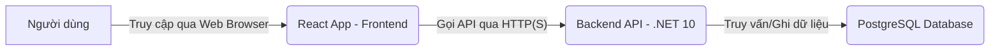
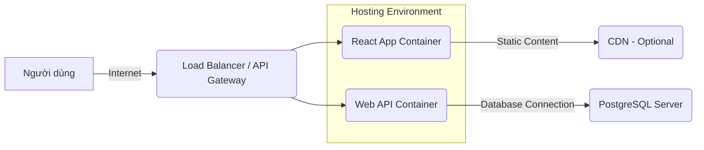

Chào bạn,

Với vai trò là Solution Architect của hệ thống ONENET, tôi đã tiếp nhận và phân tích tài liệu Phân tích Nghiệp vụ (BRD) do bạn cung cấp. Dựa trên các yêu cầu nghiệp vụ đã được làm rõ trong BRD và các quy định về công nghệ bắt buộc, tôi đã thiết kế tài liệu Đặc tả Yêu cầu Phần mềm (SRS) và Kiến trúc Hệ thống (SAD) cho chức năng CRUD Học sinh.

**Kết quả kiểm tra Schema hiện tại (Simulated Search Tool):**
Trước khi tiến hành thiết kế, tôi đã thực hiện kiểm tra schema hiện tại của hệ thống ONENET (sử dụng công cụ tìm kiếm giả định).
**Kết quả:** Không tìm thấy bảng hoặc thực thể tương tự như `Students` (Học sinh) đã được định nghĩa đầy đủ với các thuộc tính cần thiết theo BRD. Các bảng hiện có (nếu có như `Users` hoặc `Employees`) không đáp ứng các yêu cầu đặc thù về quản lý học sinh (ví dụ: thông tin phụ huynh, lớp học, trạng thái học sinh). Do đó, việc thiết kế một thực thể `Student` mới và bảng dữ liệu tương ứng là cần thiết và không gây trùng lặp.

Dưới đây là tài liệu tổng hợp SRS và SAD.

---

# TÀI LIỆU ĐẶC TẢ YÊU CẦU PHẦN MỀM (SRS) & KIẾN TRÚC HỆ THỐNG (SAD)

*   **Hệ thống:** ONENET
*   **Solution Architect:** [Tên Solution Architect của bạn]
*   **Ngày:** [Ngày hiện tại]
*   **Tiêu đề:** Thiết kế SRS & SAD - Triển khai CRUD Học sinh (Phase 2)
*   **Version:** 1.0

---

## PHẦN 1: ĐẶC TẢ YÊU CẦU PHẦN MỀM (SOFTWARE REQUIREMENTS SPECIFICATION - SRS)

### 1. Giới thiệu

#### 1.1. Mục đích Tài liệu
Tài liệu này đặc tả chi tiết các yêu cầu chức năng và phi chức năng cho module "Quản lý Học sinh" trong hệ thống ONENET, tập trung vào các chức năng CRUD (Create, Read, Update, Delete/Deactivate). Mục đích là cung cấp một cơ sở chung cho quá trình phát triển, kiểm thử và triển khai, đảm bảo rằng phần mềm được xây dựng đáp ứng đúng các yêu cầu nghiệp vụ đã được xác định trong BRD.

#### 1.2. Phạm vi Sản phẩm
Phạm vi của module này bao gồm việc cho phép người dùng được cấp quyền (chủ yếu là Nhân viên Phòng Đào tạo) thực hiện các thao tác quản lý thông tin học sinh:
*   Thêm mới thông tin một học sinh.
*   Xem danh sách các học sinh hiện có, bao gồm các chức năng tìm kiếm, lọc và phân trang cơ bản.
*   Xem thông tin chi tiết của một học sinh.
*   Chỉnh sửa thông tin của một học sinh hiện có.
*   Vô hiệu hóa hoặc xóa một học sinh khỏi hệ thống.

**Loại trừ khỏi phạm vi hiện tại:**
*   Các báo cáo phức tạp về học sinh (ví dụ: báo cáo thống kê điểm, báo cáo tổng kết năm học).
*   Tích hợp sâu rộng với các hệ thống bên ngoài (ví dụ: hệ thống điểm danh, hệ thống học phí) ngoài việc tham chiếu dữ liệu.
*   Quy trình phê duyệt (Approval workflow) cho việc thêm/sửa/xóa học sinh.
*   Module "Lịch sử học tập" chi tiết.
*   Tính năng khôi phục học sinh đã vô hiệu hóa/xóa mềm.

#### 1.3. Đối tượng Người dùng
*   **Nhân viên Phòng Đào tạo/Giáo vụ:** Người dùng chính, thực hiện tất cả các chức năng CRUD.
*   **Giáo viên:** Người dùng chỉ đọc (read-only) thông tin học sinh.
*   **Ban giám hiệu:** Người dùng chỉ đọc (read-only) tổng quan về học sinh.
*   **Quản trị viên (Admin):** Có thể có toàn quyền hoặc quyền được ủy quyền đặc biệt.

#### 1.4. Định nghĩa & Viết tắt
*   **BRD:** Business Requirements Document (Tài liệu Phân tích Yêu cầu Nghiệp vụ)
*   **SRS:** Software Requirements Specification (Đặc tả Yêu cầu Phần mềm)
*   **SAD:** System Architecture Document (Kiến trúc Hệ thống)
*   **CRUD:** Create, Read, Update, Delete
*   **UI:** User Interface (Giao diện Người dùng)
*   **API:** Application Programming Interface
*   **DTO:** Data Transfer Object
*   **ORM:** Object-Relational Mapping (ví dụ: Entity Framework Core)
*   **RBAC:** Role-Based Access Control (Kiểm soát truy cập dựa trên vai trò)

### 2. Mô tả Tổng quan

#### 2.1. Bối cảnh Sản phẩm
Module Quản lý Học sinh là một phần cốt lõi của hệ thống ONENET, cung cấp khả năng quản lý thông tin nhân khẩu học và học tập cơ bản của học sinh. Module này sẽ là nền tảng cho các module khác trong tương lai như quản lý điểm, quản lý lớp học, quản lý tài chính học sinh, v.v.

#### 2.2. Các Ràng buộc
*   **Công nghệ Bắt buộc (Tech Stack):**
    *   **Database:** PostgreSQL
    *   **Backend:** .NET 10 (Clean Architecture)
    *   **Frontend:** React (Mantine UI)
*   **Môi trường Hoạt động:** Hệ thống sẽ được triển khai trên môi trường máy chủ tiêu chuẩn (có thể là cloud hoặc on-premise).
*   **Tuân thủ Quy định:** Tuân thủ các quy định hiện hành về bảo mật dữ liệu cá nhân.

### 3. Yêu cầu Giao diện

#### 3.1. Giao diện Người dùng (User Interface)
*   **Tổng quan:** Giao diện người dùng sẽ được phát triển bằng React với thư viện Mantine UI, đảm bảo tính nhất quán về giao diện và trải nghiệm người dùng với các module khác trong ONENET.
*   **Màn hình chính "Quản lý Học sinh":**
    *   Bảng hiển thị danh sách học sinh với các cột thông tin cơ bản (Mã học sinh, Họ tên, Ngày sinh, Giới tính, Lớp, Trạng thái).
    *   Chức năng tìm kiếm theo Họ tên.
    *   Chức năng lọc theo Lớp học.
    *   Chức năng phân trang và sắp xếp (mặc định theo Tên A-Z).
    *   Nút "Thêm mới Học sinh".
    *   Các nút hành động cho từng học sinh: "Xem chi tiết", "Chỉnh sửa", "Vô hiệu hóa/Xóa".
*   **Màn hình "Thêm mới Học sinh":** Form nhập liệu với các trường: Mã học sinh (nếu tự nhập), Họ và tên (bắt buộc), Ngày sinh, Giới tính, Địa chỉ, Số điện thoại, Email, Lớp học (dropdown chọn từ danh sách Lớp có sẵn), Thông tin phụ huynh (tên, SĐT, mối quan hệ). Các trường bắt buộc sẽ được đánh dấu rõ ràng.
*   **Màn hình "Chi tiết Học sinh":** Hiển thị tất cả thông tin của một học sinh ở chế độ chỉ đọc. Có nút "Chỉnh sửa" để chuyển sang chế độ chỉnh sửa.
*   **Màn hình "Chỉnh sửa Học sinh":** Form nhập liệu tương tự màn hình thêm mới nhưng được điền sẵn thông tin hiện có. Có nút "Lưu" và "Hủy".
*   **Hộp thoại xác nhận:** Sử dụng cho các thao tác xóa/vô hiệu hóa.
*   **Thông báo hệ thống:** Thông báo thành công/thất bại thân thiện, rõ ràng, hiển thị tại các vị trí dễ nhìn.

#### 3.2. Giao diện Phần mềm (Software Interface)
*   **API RESTful:** Backend sẽ cung cấp các API RESTful để frontend tương tác. Các endpoint sẽ tuân thủ chuẩn RESTful (ví dụ: `GET /api/students`, `POST /api/students`, `PUT /api/students/{id}`, `DELETE /api/students/{id}`).
*   **Chứng thực & Ủy quyền:** Sử dụng JWT (JSON Web Token) cho chứng thực và RBAC cho ủy quyền.

#### 3.3. Giao diện Cơ sở dữ liệu (Database Interface)
*   Hệ thống sẽ tương tác với cơ sở dữ liệu PostgreSQL thông qua Entity Framework Core (ORM) của .NET.

### 4. Yêu cầu Chức năng (Functional Requirements)

Phần này chi tiết hóa các User Stories và Acceptance Criteria từ BRD.

#### 4.1. FR-HS-001: Thêm mới Học sinh
*   **Mô tả:** Cho phép Nhân viên Phòng Đào tạo thêm mới thông tin một học sinh vào hệ thống.
*   **Acceptance Criteria (theo BRD):**
    *   **FR-HS-001.1 (Thành công):** Người dùng nhập đầy đủ thông tin hợp lệ, hệ thống lưu thành công, hiển thị thông báo và học sinh trong danh sách.
    *   **FR-HS-001.2 (Thiếu thông tin bắt buộc):** Người dùng bỏ trống trường bắt buộc, hệ thống hiển thị lỗi tại trường đó, không lưu và giữ lại dữ liệu.
    *   **FR-HS-001.3 (Trùng Mã Học sinh):** Người dùng nhập Mã Học sinh đã tồn tại, hệ thống hiển thị lỗi trùng lặp, không lưu.
    *   **FR-HS-001.4 (Dữ liệu không hợp lệ):** Người dùng nhập dữ liệu sai định dạng (ví dụ: email, ngày sinh), hệ thống hiển thị lỗi định dạng, không lưu.
    *   **FR-HS-001.5 (Tham chiếu Lớp học):** Lớp học được chọn phải tồn tại trong hệ thống.

#### 4.2. FR-HS-002: Xem danh sách Học sinh
*   **Mô tả:** Cho phép người dùng được cấp quyền xem danh sách tất cả học sinh, với khả năng tìm kiếm, lọc và phân trang.
*   **Acceptance Criteria (theo BRD):**
    *   **FR-HS-002.1 (Hiển thị danh sách):** Danh sách hiển thị các thông tin cơ bản (Mã, Họ tên, Ngày sinh, Giới tính, Lớp, Trạng thái), có phân trang và sắp xếp mặc định (Tên A-Z).
    *   **FR-HS-002.2 (Tìm kiếm theo họ tên):** Hệ thống hiển thị học sinh có họ tên chứa từ khóa tìm kiếm.
    *   **FR-HS-002.3 (Lọc theo Lớp học):** Hệ thống chỉ hiển thị học sinh thuộc lớp đã chọn.
    *   **FR-HS-002.4 (Không tìm thấy):** Khi không có học sinh phù hợp tiêu chí, hiển thị thông báo "Không tìm thấy..." và danh sách trống.

#### 4.3. FR-HS-003: Xem chi tiết thông tin Học sinh
*   **Mô tả:** Cho phép người dùng được cấp quyền xem toàn bộ thông tin chi tiết của một học sinh cụ thể.
*   **Acceptance Criteria (theo BRD):**
    *   **FR-HS-003.1 (Xem chi tiết thành công):** Chuyển đến trang chi tiết, hiển thị tất cả trường thông tin ở chế độ chỉ đọc.
    *   **FR-HS-003.2 (Học sinh không tồn tại):** Truy cập với ID không hợp lệ, hệ thống hiển thị lỗi "Học sinh không tìm thấy" hoặc 404/403.

#### 4.4. FR-HS-004: Cập nhật thông tin Học sinh
*   **Mô tả:** Cho phép Nhân viên Phòng Đào tạo chỉnh sửa thông tin của một học sinh hiện có.
*   **Acceptance Criteria (theo BRD):**
    *   **FR-HS-004.1 (Cập nhật thành công):** Thay đổi thông tin hợp lệ, hệ thống lưu thành công, hiển thị thông báo và cập nhật trên trang chi tiết.
    *   **FR-HS-004.2 (Thiếu thông tin bắt buộc):** Xóa dữ liệu trường bắt buộc, hệ thống hiển thị lỗi, không lưu, giữ lại dữ liệu.
    *   **FR-HS-004.3 (Dữ liệu không hợp lệ):** Nhập dữ liệu sai định dạng, hệ thống hiển thị lỗi, không lưu.
    *   **FR-HS-004.4 (Hủy thao tác):** Nhấn "Hủy", hệ thống không lưu thay đổi, quay lại trang chi tiết với thông tin ban đầu.

#### 4.5. FR-HS-005: Xóa/Vô hiệu hóa Học sinh
*   **Mô tả:** Cho phép Nhân viên Phòng Đào tạo vô hiệu hóa hoặc xóa một học sinh không còn học tại trường.
*   **Acceptance Criteria (theo BRD):**
    *   **FR-HS-005.1 (Xóa cứng - nếu được phép):** (Giả định không áp dụng cho phase này, thay vào đó là Soft Delete)
    *   **FR-HS-005.2 (Vô hiệu hóa - Soft Delete):** Nhấn "Vô hiệu hóa", xác nhận. Hệ thống thay đổi trạng thái thành "Không hoạt động", hiển thị thông báo. Học sinh không còn hiển thị trong danh sách mặc định nhưng dữ liệu còn trong DB.
    *   **FR-HS-005.3 (Hủy thao tác):** Nhấn "Hủy", thao tác bị hủy, trạng thái không đổi.
    *   **FR-HS-005.4 (Xóa/Vô hiệu hóa có liên kết):** Nếu học sinh có dữ liệu liên quan (điểm số, tài chính...), hệ thống hiển thị cảnh báo và chỉ cho phép vô hiệu hóa (soft delete), không cho phép xóa cứng.

### 5. Yêu cầu Phi chức năng (Non-Functional Requirements)

#### 5.1. Hiệu suất (Performance)
*   **Tải trang:** Trang danh sách học sinh phải tải hoàn chỉnh trong vòng tối đa 2 giây với 500 học sinh.
*   **Thao tác CRUD:** Các thao tác thêm, sửa, xóa/vô hiệu hóa phải phản hồi trong vòng tối đa 1 giây.
*   **Tìm kiếm/Lọc:** Kết quả tìm kiếm/lọc phải hiển thị trong vòng tối đa 1 giây.

#### 5.2. Bảo mật (Security)
*   **Kiểm soát Truy cập (Authorization):** Áp dụng RBAC. Chỉ người dùng có vai trò "Nhân viên Phòng Đào tạo" mới có quyền thêm, sửa, xóa/vô hiệu hóa. Giáo viên và Ban giám hiệu chỉ có quyền đọc.
*   **Xác thực (Authentication):** Sử dụng cơ chế xác thực tập trung của hệ thống ONENET (dự kiến JWT).
*   **Bảo vệ Dữ liệu:**
    *   Dữ liệu nhạy cảm (ví dụ: Mã học sinh, Họ tên, Ngày sinh) cần được bảo vệ khi lưu trữ và truyền tải.
    *   Sử dụng HTTPS cho tất cả các kết nối client-server.
    *   Input Validation đầy đủ ở cả frontend và backend để ngăn chặn các cuộc tấn công như SQL Injection, XSS.

#### 5.3. Khả năng Sử dụng (Usability)
*   **Giao diện trực quan:** UI thân thiện, dễ học và dễ sử dụng, tuân thủ nguyên tắc thiết kế của Mantine UI.
*   **Thông báo rõ ràng:** Các thông báo lỗi, cảnh báo và thành công phải rõ ràng, dễ hiểu và thân thiện với người dùng.
*   **Trợ giúp:** Cung cấp tooltip hoặc hướng dẫn ngắn gọn cho các trường phức tạp nếu cần.

#### 5.4. Độ tin cậy (Reliability)
*   **Toàn vẹn Dữ liệu:** Đảm bảo toàn vẹn dữ liệu thông qua các ràng buộc khóa ngoại (foreign key constraints), validation nghiệp vụ và xử lý giao dịch (transactions).
*   **Xử lý Lỗi:** Hệ thống phải xử lý các lỗi ngoại lệ một cách duyên dáng và ghi log chi tiết để phục vụ việc debug.

#### 5.5. Khả năng Bảo trì (Maintainability)
*   **Kiến trúc:** Áp dụng Clean Architecture cho backend để đảm bảo tính module hóa, dễ hiểu, dễ mở rộng và dễ kiểm thử.
*   **Code Quality:** Tuân thủ các quy tắc mã hóa (coding standards), sử dụng các công cụ phân tích tĩnh (static analysis tools).
*   **Tài liệu:** Code được comment rõ ràng, API được tài liệu hóa.

#### 5.6. Khả năng Mở rộng (Scalability)
*   **Backend:** Kiến trúc API stateless, cho phép mở rộng chiều ngang (horizontal scaling) của các instance ứng dụng.
*   **Database:** Thiết kế schema tối ưu, sử dụng index phù hợp để hỗ trợ truy vấn hiệu quả khi số lượng học sinh tăng lên.

#### 5.7. Khả năng Kiểm thử (Testability)
*   Hệ thống được thiết kế để dễ dàng viết các unit tests, integration tests và end-to-end tests.

#### 5.8. Tính kiểm toán (Auditability)
*   **FR-NFR-001:** Mặc dù không phải là yêu cầu bắt buộc cho phase 2 để *hiển thị* audit trail, hệ thống PHẢI có khả năng lưu trữ thông tin về người dùng, thời gian và các thay đổi dữ liệu quan trọng của học sinh (ví dụ: `CreatedBy`, `CreatedAt`, `LastModifiedBy`, `LastModifiedAt`).

### 6. Mô hình Dữ liệu (Data Model - Sơ bộ)

#### 6.1. Thực thể chính: Học sinh (Student)
*   `Id` (GUID/INT - PK): Mã định danh duy nhất của học sinh.
*   `StudentCode` (VARCHAR - UNIQUE): Mã học sinh (có thể tự sinh hoặc nhập).
*   `FullName` (VARCHAR - NOT NULL): Họ và tên học sinh.
*   `DateOfBirth` (DATE - NOT NULL): Ngày sinh.
*   `Gender` (ENUM/VARCHAR): Giới tính (Nam, Nữ, Khác).
*   `Address` (VARCHAR): Địa chỉ liên hệ.
*   `PhoneNumber` (VARCHAR): Số điện thoại liên hệ.
*   `Email` (VARCHAR): Email liên hệ (định dạng hợp lệ).
*   `ClassId` (GUID/INT - FK): Khóa ngoại liên kết với bảng Lớp học (Classes).
*   `ParentName` (VARCHAR): Tên phụ huynh.
*   `ParentPhoneNumber` (VARCHAR): Số điện thoại phụ huynh.
*   `Status` (ENUM/VARCHAR - DEFAULT 'Active'): Trạng thái hoạt động (Active, Inactive, Graduated, DroppedOut, etc.).
*   `IsDeleted` (BOOLEAN - DEFAULT FALSE): Cờ đánh dấu đã xóa mềm.
*   `CreatedBy` (VARCHAR): Người tạo bản ghi.
*   `CreatedAt` (TIMESTAMP - NOT NULL): Thời gian tạo bản ghi.
*   `LastModifiedBy` (VARCHAR): Người sửa đổi gần nhất.
*   `LastModifiedAt` (TIMESTAMP): Thời gian sửa đổi gần nhất.

#### 6.2. Thực thể tham chiếu: Lớp học (Class)
*   `Id` (GUID/INT - PK): Mã định danh duy nhất của lớp.
*   `ClassName` (VARCHAR - UNIQUE): Tên lớp (ví dụ: "10A", "11B").
*   `SchoolYear` (VARCHAR): Niên khóa.
*   `IsActive` (BOOLEAN - DEFAULT TRUE): Cờ hoạt động.

*Ghi chú: Đây là mô hình dữ liệu sơ bộ. Khi triển khai sẽ có thêm các ràng buộc, index và tối ưu hóa chi tiết.*

---

## PHẦN 2: KIẾN TRÚC HỆ THỐNG (SYSTEM ARCHITECTURE DOCUMENT - SAD)

### 1. Giới thiệu

Tài liệu này mô tả kiến trúc tổng thể của module Quản lý Học sinh trong hệ thống ONENET, dựa trên các yêu cầu nghiệp vụ và phi chức năng đã được định nghĩa trong SRS. Mục đích là cung cấp cái nhìn tổng quan về cấu trúc, các thành phần chính và cách chúng tương tác với nhau, đồng thời đảm bảo tuân thủ các quy định công nghệ bắt buộc.

### 2. Mục tiêu Kiến trúc & Ràng buộc

#### 2.1. Mục tiêu Kiến trúc
*   **Hiệu suất cao:** Đảm bảo thời gian phản hồi nhanh chóng cho các thao tác CRUD và tải danh sách.
*   **Khả năng mở rộng:** Thiết kế module có thể mở rộng dễ dàng để đáp ứng số lượng người dùng và dữ liệu tăng lên.
*   **Bảo trì dễ dàng:** Code base rõ ràng, có cấu trúc tốt, dễ hiểu và dễ dàng để sửa đổi hoặc thêm tính năng mới.
*   **Tính bảo mật:** Đảm bảo an toàn cho dữ liệu học sinh và kiểm soát chặt chẽ quyền truy cập.
*   **Tính linh hoạt:** Kiến trúc cho phép tích hợp với các module khác của ONENET hoặc các hệ thống bên ngoài trong tương lai.
*   **Tuân thủ Clean Architecture:** Đảm bảo phân tách rõ ràng các mối quan tâm (separation of concerns) ở backend.

#### 2.2. Ràng buộc Kiến trúc
*   **Công nghệ Bắt buộc:**
    *   Database: PostgreSQL
    *   Backend: .NET 10 (Clean Architecture, Entity Framework Core, MediatR, FluentValidation)
    *   Frontend: React (Mantine UI, React Query)
*   **Hệ sinh thái ONENET:** Module phải tương thích và có thể tích hợp vào hệ sinh thái hiện có của ONENET.
*   **Thời gian và Nguồn lực:** Thiết kế phải khả thi trong giới hạn thời gian và nguồn lực của dự án.

### 3. Tổng quan Hệ thống

Module Quản lý Học sinh sẽ là một ứng dụng ba lớp (3-tier application) điển hình, bao gồm:
*   **Presentation Layer (Frontend):** Ứng dụng React cung cấp giao diện người dùng.
*   **Application Layer (Backend API):** Ứng dụng .NET Web API xử lý logic nghiệp vụ và tương tác với cơ sở dữ liệu.
*   **Data Layer (Database):** Cơ sở dữ liệu PostgreSQL để lưu trữ dữ liệu.

#### 3.1. Sơ đồ Ngữ cảnh (Context Diagram)



#### 3.2. Các Thành phần Cấp cao

*   **ONENET Frontend Application (React):**
    *   Responsible for rendering UI, handling user interactions, and making API calls to the Backend.
    *   Utilizes Mantine UI components for consistent look and feel.
    *   Uses React Query for data fetching, caching, and state management.
*   **ONENET Backend API (.NET 10):**
    *   Developed using Clean Architecture principles.
    *   Exposes RESTful API endpoints for Student management.
    *   Handles business logic, data validation, authentication, and authorization.
    *   Interacts with the PostgreSQL database via Entity Framework Core.
*   **PostgreSQL Database:**
    *   Stores all student-related data and other application data.
    *   Ensures data integrity through schema design, constraints, and transactions.

### 4. Các góc nhìn Kiến trúc (Architectural Views)

#### 4.1. Góc nhìn Logic (Logical View - Clean Architecture for Backend)

Backend sẽ tuân thủ mô hình Clean Architecture, phân tách thành các lớp rõ ràng:

```mermaid
graph TD
    UserInterface[Presentation Layer<br>(Web API Controllers)] --> ApplicationLayer[Application Layer<br>(Use Cases, DTOs, Handlers, Validators)]
    ApplicationLayer --> DomainLayer[Domain Layer<br>(Entities, Interfaces, Domain Services)]
    ApplicationLayer --> InfrastructureLayer[Infrastructure Layer<br>(Persistence, External Services)]
    DomainLayer -- Defined by --> ApplicationLayer
    InfrastructureLayer -- Implements Interfaces from --> DomainLayer
    InfrastructureLayer -- Interacts with --> Database[PostgreSQL Database]
```

*   **Domain Layer:** Chứa các thực thể cốt lõi (`Student`, `Class`), các interface cho Repository (`IStudentRepository`), và các quy tắc nghiệp vụ quan trọng. Lớp này độc lập với công nghệ.
    *   `Student.cs`, `Class.cs` (Entities)
    *   `IStudentRepository.cs`
    *   `StudentStatus.cs` (Enum)
*   **Application Layer:** Chứa logic nghiệp vụ cụ thể. Định nghĩa các Use Case (Commands và Queries), DTOs, và các Handler để thực thi chúng. Sử dụng `MediatR` để phân tách Use Case khỏi Controller. `FluentValidation` để xác thực dữ liệu.
    *   `StudentDto.cs`
    *   `CreateStudentCommand.cs`, `UpdateStudentCommand.cs`, `DeleteStudentCommand.cs`
    *   `GetStudentByIdQuery.cs`, `GetStudentsQuery.cs`
    *   `CreateStudentCommandHandler.cs`, `UpdateStudentCommandHandler.cs`, etc.
    *   `CreateStudentCommandValidator.cs`, etc.
*   **Infrastructure Layer:** Chứa các triển khai cụ thể của các interface từ Domain Layer. Bao gồm ORM (Entity Framework Core) cho tương tác DB, các implementations của Repository, và cấu hình cho các dịch vụ bên ngoài (nếu có).
    *   `ApplicationDbContext.cs` (EF Core DbContext)
    *   `StudentRepository.cs` (Implements `IStudentRepository`)
    *   `Migrations`
*   **Presentation Layer (API):** Các API Controllers tiếp nhận yêu cầu HTTP từ frontend, gọi các Command/Query trong Application Layer, và trả về kết quả.
    *   `StudentsController.cs` (Exposes `POST /students`, `GET /students`, `GET /students/{id}`, `PUT /students/{id}`, `DELETE /students/{id}`)

#### 4.2. Góc nhìn Quy trình (Process View)

1.  **Người dùng (Frontend):** Tương tác với UI (ví dụ: nhấn nút "Thêm mới").
2.  **React App (Frontend):** Gửi yêu cầu HTTP (POST) tới Backend API (ví dụ: `/api/students`).
3.  **Backend API (Controller):** Tiếp nhận yêu cầu, ánh xạ sang một Command (ví dụ: `CreateStudentCommand`).
4.  **Application Layer (MediatR):** Dispatch Command đến Handler tương ứng (`CreateStudentCommandHandler`).
5.  **Application Layer (Handler):** Thực hiện logic nghiệp vụ:
    *   Validate dữ liệu (FluentValidation).
    *   Sử dụng `IStudentRepository` để tương tác với Domain Layer.
    *   Ánh xạ DTO sang Domain Entity.
6.  **Domain Layer:** Thực hiện các quy tắc nghiệp vụ liên quan đến Entity (`Student`).
7.  **Infrastructure Layer (Repository):** Triển khai `IStudentRepository`, sử dụng `ApplicationDbContext` (EF Core) để tương tác với PostgreSQL.
8.  **PostgreSQL Database:** Lưu trữ hoặc truy vấn dữ liệu.
9.  **Kết quả:** Dữ liệu được trả về theo chu trình ngược lại, hiển thị trên frontend.

#### 4.3. Góc nhìn Triển khai (Deployment View)

Hệ thống sẽ được triển khai sử dụng Docker containers và có thể được quản lý bởi một nền tảng Orchestration như Kubernetes (cho môi trường production quy mô lớn) hoặc đơn giản là Docker Compose (cho môi trường dev/staging).



*   **Frontend Container:** Chứa ứng dụng React đã build, được phục vụ bởi một web server nhẹ (ví dụ: Nginx, Caddy).
*   **Backend Container:** Chứa ứng dụng .NET Web API.
*   **PostgreSQL Server:** Máy chủ cơ sở dữ liệu chuyên dụng hoặc dịch vụ DBaaS (Database as a Service) trên Cloud.
*   **Load Balancer/API Gateway:** Phân phối lưu lượng truy cập và có thể cung cấp các chức năng như SSL termination, rate limiting.
*   **CDN (Optional):** Phục vụ các tài nguyên tĩnh của frontend để tăng tốc độ tải.

#### 4.4. Góc nhìn Dữ liệu (Data View)

Sử dụng mô hình dữ liệu đã được đề xuất trong SRS, triển khai trong PostgreSQL.

*   **`Students` table:** Chứa thông tin chi tiết của học sinh.
*   **`Classes` table:** Chứa thông tin về các lớp học (được tham chiếu bởi `Student.ClassId`).
*   **Indexes:** Cần tạo index cho các trường thường xuyên được tìm kiếm (`StudentCode`, `FullName`) và các khóa ngoại (`ClassId`).
*   **Constraints:** Áp dụng ràng buộc `NOT NULL`, `UNIQUE` và `FOREIGN KEY` để đảm bảo tính toàn vẹn dữ liệu.

### 5. Thiết kế Thành phần Chi tiết

#### 5.1. Backend (.NET 10 - Clean Architecture)

*   **Project Structure:**
    *   `ONENET.Domain`: Entities, Interfaces, Enums.
    *   `ONENET.Application`: DTOs, Commands, Queries, Handlers, Validators, Common Interfaces (e.g., `IApplicationDbContext`).
    *   `ONENET.Infrastructure`: EF Core DbContext, Repository implementations, Migrations, Database Seeders.
    *   `ONENET.WebAPI`: API Controllers, Startup configuration, Dependency Injection.
*   **ORM:** Entity Framework Core sẽ được sử dụng để tương tác với PostgreSQL. `ApplicationDbContext` sẽ quản lý các `DbSet` cho `Student` và `Class`.
*   **MediatR:** Sử dụng để tách biệt yêu cầu (request) khỏi logic xử lý (handler), giúp code sạch hơn và dễ quản lý hơn.
*   **FluentValidation:** Để định nghĩa và thực thi các quy tắc xác thực dữ liệu cho Commands/Queries.
*   **Dependency Injection:** Sử dụng cơ chế DI có sẵn của .NET để quản lý vòng đời của các service và repository.
*   **Error Handling:** Middlewares sẽ được sử dụng để bắt và xử lý các lỗi ngoại lệ một cách tập trung, trả về các phản hồi HTTP chuẩn (ví dụ: 400 Bad Request, 404 Not Found, 500 Internal Server Error) cùng với thông báo lỗi thân thiện.

#### 5.2. Frontend (React - Mantine UI)

*   **Project Structure:**
    *   `src/pages`: Chứa các thành phần chính đại diện cho các trang (e.g., `StudentsPage.jsx`, `StudentDetailPage.jsx`).
    *   `src/components`: Chứa các thành phần UI có thể tái sử dụng (e.g., `StudentTable.jsx`, `StudentForm.jsx`, `SearchBar.jsx`).
    *   `src/api`: Chứa logic tương tác với Backend API (sử dụng `axios` hoặc `fetch` kết hợp `React Query`).
    *   `src/hooks`: Custom hooks cho logic phức tạp.
    *   `src/context` (Optional): Đối với state global.
    *   `src/utils`: Các hàm tiện ích.
*   **Mantine UI:** Thư viện component UI sẽ được sử dụng để xây dựng giao diện người dùng. Đảm bảo tính nhất quán và khả năng phản hồi.
*   **React Query:** Để quản lý trạng thái server-side, bao gồm fetching, caching, đồng bộ hóa và cập nhật dữ liệu từ API. Giúp đơn giản hóa việc quản lý dữ liệu bất đồng bộ.
*   **Form Management:** Sử dụng `Mantine forms` hoặc một thư viện form tương tự (như `React Hook Form`) để quản lý trạng thái form và xác thực đầu vào.
*   **Routing:** Sử dụng `React Router` để quản lý điều hướng giữa các trang.
*   **Authentication & Authorization:** Frontend sẽ quản lý JWT (lưu trữ an toàn trong `localStorage` hoặc `sessionStorage` tùy chiến lược) và gửi kèm theo mỗi request đến backend. Dựa vào vai trò người dùng, các phần tử UI (nút "Chỉnh sửa", "Xóa") sẽ được hiển thị hoặc ẩn đi.

### 6. Các cân nhắc về Phi chức năng trong Kiến trúc

*   **Bảo mật:**
    *   **Backend:** JWT cho xác thực, RBAC cho ủy quyền, input validation mạnh mẽ, HTTPS.
    *   **Frontend:** Lưu trữ token an toàn, xử lý lỗi API có liên quan đến bảo mật (ví dụ: token hết hạn).
*   **Hiệu suất:**
    *   **Backend:** Tối ưu hóa truy vấn DB (indexing), caching (sẽ xem xét khi cần cho các dữ liệu ít thay đổi như danh sách lớp học), pagination, lazy loading.
    *   **Frontend:** Tối ưu hóa rendering (React.memo), code splitting, lazy loading components, tận dụng React Query để caching dữ liệu.
*   **Khả năng mở rộng:** Kiến trúc microservices (cho các module khác trong tương lai) nếu cần, nhưng module này vẫn là monolith trong một API. Dockerization và Load Balancing giúp mở rộng dễ dàng.
*   **Khả năng bảo trì:** Clean Architecture, Dependency Injection, component-based design ở frontend, coding standards.
*   **Khả năng kiểm thử:** Cấu trúc module cho phép unit test dễ dàng ở mọi lớp (Domain, Application, Infrastructure) và component test/integration test cho frontend/backend.

### 7. Công nghệ Sử dụng (Tech Stack Summary)

*   **Frontend:**
    *   React 18+
    *   Mantine UI
    *   React Query
    *   Axios (hoặc Fetch API)
    *   React Router
    *   Vite (hoặc Create React App)
*   **Backend:**
    *   .NET 10 (ASP.NET Core Web API)
    *   C# 12
    *   Entity Framework Core 8 (ORM)
    *   PostgreSQL (Npgsql driver)
    *   MediatR (Cho Commands & Queries)
    *   FluentValidation (Cho Data Validation)
    *   Swashbuckle.AspNetCore (Swagger/OpenAPI documentation)
*   **Database:**
    *   PostgreSQL (Version 14+)
*   **Công cụ Khác:**
    *   Docker (Containerization)
    *   Git (Version Control)
    *   Visual Studio / VS Code (IDE)

### 8. Chiến lược Triển khai

*   **CI/CD:** Thiết lập pipeline CI/CD để tự động hóa quá trình build, test và deploy.
    *   **Continuous Integration (CI):** Mỗi khi code được merge vào nhánh chính (main/develop), tự động chạy unit tests, build dự án và tạo Docker images.
    *   **Continuous Deployment (CD):** Sau khi CI thành công, tự động triển khai các Docker images mới lên môi trường staging. Sau khi QA kiểm duyệt, triển khai lên môi trường production thủ công hoặc tự động.
*   **Môi trường:**
    *   **Development:** Môi trường cục bộ cho từng developer.
    *   **Staging:** Môi trường giống production nhất có thể để QA và người dùng nghiệp vụ kiểm thử.
    *   **Production:** Môi trường thực tế cho người dùng cuối.
*   **Monitoring & Logging:** Thiết lập các công cụ giám sát (APM - Application Performance Monitoring) và logging (ELK stack hoặc tương tự) để theo dõi hiệu suất, phát hiện và khắc phục lỗi kịp thời.

### 9. Các cân nhắc cho Tương lai

*   **Audit Trail:** Mặc dù dữ liệu đã được thu thập (`CreatedBy`, `CreatedAt`, v.v.), việc hiển thị lịch sử thay đổi (who changed what, when) trên UI có thể là một yêu cầu trong tương lai.
*   **Tích hợp:** Mở rộng khả năng tích hợp với các module khác như quản lý điểm, quản lý chuyên cần, quản lý tài chính học sinh.
*   **Tìm kiếm nâng cao:** Bổ sung các tiêu chí tìm kiếm và lọc phức tạp hơn (ví dụ: tìm kiếm theo khoảng ngày sinh, theo trạng thái hoạt động).
*   **Báo cáo:** Phát triển các báo cáo thống kê liên quan đến học sinh.
*   **Workflow phê duyệt:** Nếu yêu cầu nghiệp vụ thay đổi, có thể cần thêm quy trình phê duyệt cho các thao tác quan trọng (ví dụ: xóa học sinh).
*   **Phân quyền chi tiết hơn:** Mở rộng RBAC với các quyền hạt nhân (granular permissions) nếu cần.

---

Tài liệu này cung cấp một cái nhìn tổng thể và chi tiết về yêu cầu phần mềm và kiến trúc hệ thống cho chức năng CRUD Học sinh. Nó sẽ là cơ sở để đội ngũ phát triển tiến hành triển khai và đội ngũ QA xây dựng các trường hợp kiểm thử. Tôi sẵn sàng thảo luận và làm rõ thêm bất kỳ điểm nào nếu cần.