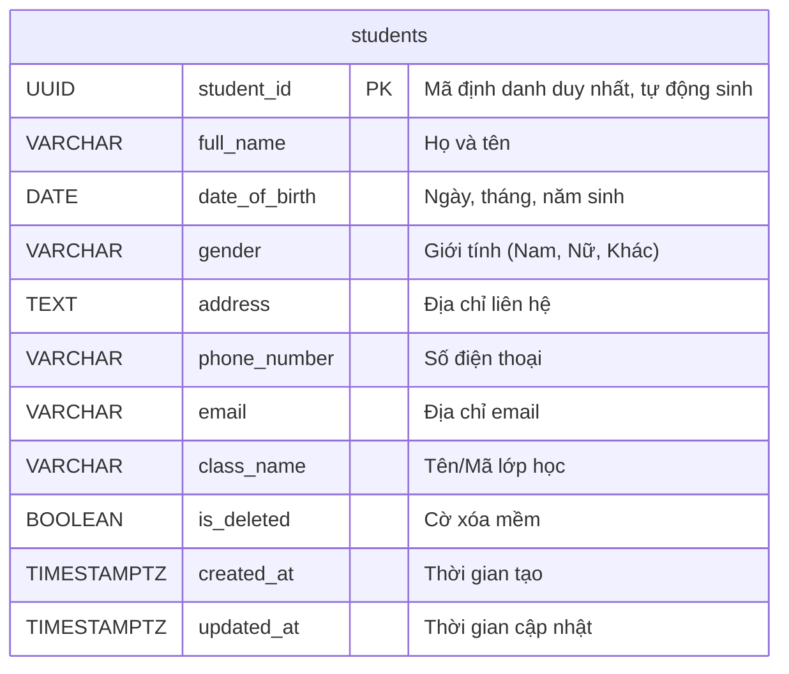

Tuyệt vời! Với vai trò là Solution Architect của hệ thống ONENET, tôi đã tiếp nhận tài liệu Phân tích Nghiệp vụ (BRD) do bạn, Senior Business Analyst, cung cấp. Tôi hiểu rõ yêu cầu về CRUD cho đối tượng "Học sinh" trong Phase 2, cùng với các ràng buộc về công nghệ.

Dưới đây là tài liệu tổng hợp bao gồm Đặc tả Yêu cầu Phần mềm (SRS) và Kiến trúc Hệ thống (SAD) cho chức năng Quản lý Học sinh, tuân thủ các quy định về công nghệ đã nêu.

---

# TÀI LIỆU ĐẶC TẢ YÊU CẦU PHẦN MỀM (SRS) VÀ KIẾN TRÚC HỆ THỐNG (SAD)

**Dự án:** ONENET - Phase 2: Quản lý Học sinh
**Phiên bản:** 1.0
**Ngày:** 2023-10-27
**Tác giả:** [Tên Solution Architect]

---

## MỤC LỤC

**Phần 1: Đặc tả Yêu cầu Phần mềm (SRS)**
1.  Giới thiệu
    1.1.  Mục đích
    1.2.  Đối tượng người đọc
    1.3.  Phạm vi sản phẩm
    1.4.  Tổng quan tài liệu
2.  Mô tả tổng thể hệ thống
    2.1.  Quan điểm sản phẩm
    2.2.  Chức năng sản phẩm
    2.3.  Đối tượng người dùng và đặc điểm
    2.4.  Các ràng buộc tổng thể
    2.5.  Giả định và Phụ thuộc
3.  Yêu cầu chức năng (Functional Requirements)
    3.1.  Quản lý Học sinh
        3.1.1.  UC-STU-001: Thêm mới Học sinh
        3.1.2.  UC-STU-002: Xem Danh sách Học sinh
        3.1.3.  UC-STU-003: Tìm kiếm Học sinh
        3.1.4.  UC-STU-004: Xem chi tiết Học sinh
        3.1.5.  UC-STU-005: Cập nhật thông tin Học sinh
        3.1.6.  UC-STU-006: Xóa Học sinh
4.  Yêu cầu phi chức năng (Non-Functional Requirements)
    4.1.  Hiệu năng (Performance)
    4.2.  Khả năng bảo mật (Security)
    4.3.  Khả năng sử dụng (Usability)
    4.4.  Khả năng bảo trì (Maintainability)
    4.5.  Khả năng tương thích (Compatibility)
    4.6.  Khả năng mở rộng (Scalability)
5.  Yêu cầu khác
    5.1.  Quy tắc nghiệp vụ (Business Rules)
    5.2.  Yêu cầu về dữ liệu (Data Requirements)

**Phần 2: Kiến trúc Hệ thống (SAD)**
1.  Giới thiệu
    1.1.  Mục đích
    1.2.  Đối tượng người đọc
    1.3.  Phạm vi kiến trúc
    1.4.  Thuật ngữ và viết tắt
2.  Tổng quan kiến trúc
    2.1.  Các thành phần chính của hệ thống
    2.2.  Biểu đồ kiến trúc tổng thể (High-Level Architecture Diagram)
3.  Thiết kế kiến trúc chi tiết
    3.1.  Kiến trúc phân lớp (Layered Architecture - .NET Clean Architecture)
        3.1.1.  Tầng Domain (Domain Layer)
        3.1.2.  Tầng Application (Application Layer)
        3.1.3.  Tầng Infrastructure (Infrastructure Layer)
        3.1.4.  Tầng Presentation/API (Presentation/API Layer)
    3.2.  Thiết kế Database (PostgreSQL)
        3.2.1.  Kiểm tra Schema hiện tại (Simulated Check)
        3.2.2.  Sơ đồ thực thể quan hệ (ERD) cho Student
        3.2.3.  Đặc tả bảng `students`
    3.3.  Thiết kế API (RESTful API)
        3.3.1.  Các Endpoint
        3.3.2.  Cấu trúc dữ liệu (Request/Response Models)
    3.4.  Thiết kế giao diện người dùng (Frontend - React with Mantine UI)
    3.5.  Công nghệ sử dụng (Technology Stack)
4.  Quyết định kiến trúc quan trọng (Key Architectural Decisions)
    4.1.  Cơ chế xóa dữ liệu (Soft Delete vs. Hard Delete)
    4.2.  Chiến lược xử lý lỗi (Error Handling Strategy)
    4.3.  Xác thực và phân quyền (Authentication & Authorization)
    4.4.  Thiết kế đa tầng (Clean Architecture)
5.  Triển khai (Deployment Considerations)
6.  Bảo mật (Security Considerations)
7.  Khả năng mở rộng và hiệu năng (Scalability & Performance)

---

## Phần 1: Đặc tả Yêu cầu Phần mềm (SRS)

### 1. Giới thiệu

#### 1.1. Mục đích
Tài liệu này đặc tả chi tiết các yêu cầu phần mềm cho Phase 2 của hệ thống ONENET, tập trung vào các chức năng CRUD (Create, Read, Update, Delete) cho đối tượng "Học sinh". Mục đích là cung cấp một bản mô tả rõ ràng, đầy đủ và nhất quán về các chức năng và phi chức năng để nhóm phát triển, kiểm thử và các bên liên quan có thể tham chiếu.

#### 1.2. Đối tượng người đọc
Tài liệu này dành cho:
*   Nhóm phát triển (Development Team)
*   Nhóm kiểm thử (QA Team)
*   Business Analyst (BA)
*   Quản lý dự án (Project Manager)
*   Solution Architect (SA)

#### 1.3. Phạm vi sản phẩm
Phạm vi của tài liệu này bao gồm việc phát triển các chức năng chính để quản lý thông tin học sinh trong hệ thống ONENET, bao gồm:
*   Thêm mới thông tin học sinh.
*   Xem danh sách học sinh.
*   Tìm kiếm học sinh theo các tiêu chí cơ bản.
*   Xem chi tiết thông tin của một học sinh.
*   Cập nhật các thông tin của học sinh.
*   Xóa thông tin học sinh khỏi hệ thống.

#### 1.4. Tổng quan tài liệu
Phần 1 của tài liệu này mô tả các yêu cầu chức năng dưới dạng Use Case và các yêu cầu phi chức năng. Phần 2 sẽ trình bày kiến trúc hệ thống tổng thể và chi tiết, bao gồm thiết kế database, API và các quyết định kiến trúc quan trọng.

### 2. Mô tả tổng thể hệ thống

#### 2.1. Quan điểm sản phẩm
Hệ thống ONENET là một nền tảng quản lý giáo dục toàn diện. Chức năng quản lý học sinh này là một phân hệ cốt lõi, nằm trong giai đoạn phát triển Phase 2, nhằm cung cấp khả năng quản lý hồ sơ học sinh một cách hiệu quả. Phân hệ này sẽ tích hợp với các phân hệ khác của ONENET trong tương lai (ví dụ: quản lý điểm, quản lý lớp học).

#### 2.2. Chức năng sản phẩm
Các chức năng chính của phân hệ này xoay quanh việc quản lý vòng đời của một học sinh trong hệ thống:
*   **Thêm mới:** Tạo hồ sơ học sinh mới.
*   **Xem:** Hiển thị danh sách, tìm kiếm và xem chi tiết học sinh.
*   **Cập nhật:** Chỉnh sửa thông tin hiện có của học sinh.
*   **Xóa:** Loại bỏ hồ sơ học sinh.

#### 2.3. Đối tượng người dùng và đặc điểm
*   **Đối tượng:** Cán bộ quản lý học sinh.
*   **Đặc điểm:** Người dùng có quyền truy cập vào các chức năng quản lý học sinh, có khả năng nhập liệu, xem và chỉnh sửa thông tin. Họ cần một giao diện trực quan, dễ sử dụng và có khả năng phản hồi nhanh chóng.

#### 2.4. Các ràng buộc tổng thể
*   **Công nghệ bắt buộc (Tech Stack):**
    *   Database: PostgreSQL
    *   Backend: .NET 10 (Clean Architecture)
    *   Frontend: React (Mantine UI)
*   **Hiệu năng:** Các thao tác CRUD phải có thời gian phản hồi nhanh (dưới 3 giây cho các tác vụ đơn lẻ, dưới 5 giây cho việc tải danh sách lớn).
*   **Bảo mật:** Dữ liệu học sinh là thông tin cá nhân, cần được bảo mật chặt chẽ. Yêu cầu xác thực và phân quyền cho người dùng.
*   **Khả năng mở rộng:** Hệ thống cần có khả năng xử lý số lượng học sinh lớn trong tương lai mà không ảnh hưởng đáng kể đến hiệu năng.

#### 2.5. Giả định và Phụ thuộc
*   **Giả định:**
    *   Người dùng (Cán bộ quản lý học sinh) đã được xác thực và có quyền truy cập vào các chức năng quản lý học sinh.
    *   Hệ thống cơ sở hạ tầng (server, mạng) đã sẵn sàng.
    *   Các yêu cầu nghiệp vụ trong BRD là đầy đủ và chính xác cho Phase 2.
    *   Đối với "Lớp học", trong Phase 2, chúng ta sẽ quản lý dưới dạng trường văn bản (string) đơn giản. Việc liên kết với một thực thể "Lớp học" riêng biệt (có thể có mã lớp, giáo viên chủ nhiệm, v.v.) sẽ được xem xét trong các phase sau.
    *   **Về việc xóa học sinh:** Theo BRD, có lưu ý về "xóa mềm" (soft delete) so với "xóa cứng" (hard delete). **Giả định ban đầu là hệ thống sẽ thực hiện "xóa mềm"** để đảm bảo tính toàn vẹn dữ liệu và khả năng khôi phục, cũng như duy trì lịch sử. Việc xác nhận cuối cùng về cơ chế xóa sẽ được làm rõ trong các cuộc họp nghiệp vụ tiếp theo.
*   **Phụ thuộc:**
    *   Sự ổn định của cơ sở dữ liệu PostgreSQL.
    *   Các thành phần hệ thống khác của ONENET (nếu có) cung cấp các dịch vụ nền tảng (ví dụ: dịch vụ xác thực).

### 3. Yêu cầu chức năng (Functional Requirements)

Phần này mô tả các yêu cầu chức năng chi tiết dựa trên các User Stories và Acceptance Criteria được cung cấp trong BRD. Mỗi User Story sẽ được chuyển đổi thành một Use Case với các luồng chính và luồng thay thế/lỗi tương ứng.

#### 3.1. Quản lý Học sinh

##### 3.1.1. UC-STU-001: Thêm mới Học sinh
*   **Tên Use Case:** Thêm thông tin học sinh mới
*   **Mô tả:** Cho phép cán bộ quản lý học sinh thêm một hồ sơ học sinh mới vào hệ thống.
*   **Đối tượng thực hiện:** Cán bộ quản lý học sinh.
*   **Điều kiện tiên quyết:** Người dùng đã đăng nhập và truy cập chức năng "Thêm học sinh mới".
*   **Luồng chính:**
    1.  Người dùng truy cập chức năng "Thêm học sinh mới".
    2.  Hệ thống hiển thị form nhập liệu.
    3.  Người dùng nhập đầy đủ thông tin bắt buộc và tùy chọn.
    4.  Người dùng nhấn nút "Lưu".
    5.  Hệ thống kiểm tra tính hợp lệ của dữ liệu.
    6.  Hệ thống lưu thông tin học sinh vào cơ sở dữ liệu, tự động sinh Mã học sinh.
    7.  Hệ thống hiển thị thông báo thành công và chuyển hướng về danh sách học sinh hoặc trang chi tiết học sinh vừa tạo.
*   **Luồng thay thế/Lỗi (Acceptance Criteria):**
    *   **Scenario: Thêm học sinh thành công (AC 1.1)**
        *   **Given** Cán bộ quản lý học sinh truy cập chức năng "Thêm học sinh mới".
        *   **When** Cán bộ quản lý học sinh nhập đầy đủ các thông tin bắt buộc (Họ và tên, Ngày sinh, Giới tính, Lớp học) và các thông tin tùy chọn (nếu có), sau đó nhấn nút "Lưu".
        *   **Then** Hệ thống sẽ lưu thành công thông tin học sinh vào cơ sở dữ liệu.
        *   **And** Học sinh mới sẽ được hiển thị trong danh sách học sinh.
        *   **And** Hệ thống sẽ hiển thị thông báo "Thêm học sinh thành công".
        *   **And** Hệ thống sẽ tự động gán một Mã học sinh duy nhất cho học sinh đó.
    *   **Scenario: Thêm học sinh thất bại do thiếu thông tin bắt buộc (AC 1.1)**
        *   **Given** Cán bộ quản lý học sinh truy cập chức năng "Thêm học sinh mới".
        *   **When** Cán bộ quản lý học sinh bỏ trống một hoặc nhiều trường thông tin bắt buộc (ví dụ: Họ và tên, Lớp học) và nhấn nút "Lưu".
        *   **Then** Hệ thống sẽ hiển thị thông báo lỗi yêu cầu nhập đầy đủ các trường thông tin bắt buộc còn thiếu.
        *   **And** Hệ thống sẽ không lưu thông tin học sinh vào cơ sở dữ liệu.
    *   **Scenario: Thêm học sinh thất bại do nhập liệu sai định dạng (AC 1.1)**
        *   **Given** Cán bộ quản lý học sinh truy cập chức năng "Thêm học sinh mới".
        *   **When** Cán bộ quản lý học sinh nhập thông tin vào một trường với định dạng không hợp lệ (ví dụ: "Ngày sinh" nhập là "abc", "Số điện thoại" nhập chữ cái).
        *   **Then** Hệ thống sẽ hiển thị thông báo lỗi "Định dạng [tên trường] không hợp lệ" tương ứng.
        *   **And** Hệ thống sẽ không cho phép lưu thông tin cho đến khi dữ liệu được nhập đúng định dạng.
*   **Điều kiện kết thúc:** Học sinh mới được thêm vào hệ thống hoặc quá trình thêm bị hủy bỏ/thất bại với thông báo lỗi rõ ràng.

##### 3.1.2. UC-STU-002: Xem Danh sách Học sinh
*   **Tên Use Case:** Xem danh sách học sinh
*   **Mô tả:** Cho phép cán bộ quản lý học sinh xem danh sách tất cả các học sinh hiện có trong hệ thống.
*   **Đối tượng thực hiện:** Cán bộ quản lý học sinh.
*   **Điều kiện tiên quyết:** Người dùng đã đăng nhập và truy cập chức năng "Quản lý học sinh".
*   **Luồng chính:**
    1.  Người dùng truy cập chức năng "Quản lý học sinh".
    2.  Hệ thống tải và hiển thị danh sách các học sinh.
    3.  Người dùng có thể xem các thông tin cơ bản của mỗi học sinh.
*   **Luồng thay thế/Lỗi (Acceptance Criteria):**
    *   **Scenario: Hiển thị danh sách học sinh thành công (AC 2.1)**
        *   **Given** Cán bộ quản lý học sinh truy cập chức năng "Quản lý học sinh".
        *   **When** Trang quản lý học sinh được tải thành công.
        *   **Then** Hệ thống sẽ hiển thị một danh sách tất cả học sinh hiện có trong hệ thống.
        *   **And** Mỗi học sinh trong danh sách sẽ hiển thị các thông tin cơ bản như: Mã học sinh, Họ và tên, Ngày sinh, Giới tính, Lớp học.
        *   **And** Danh sách có thể được phân trang (pagination) nếu số lượng học sinh lớn.
        *   **And** Danh sách có thể được sắp xếp theo các tiêu chí mặc định (ví dụ: theo Tên A-Z, theo Mã học sinh).
    *   **Scenario: Không có học sinh nào trong hệ thống (AC 2.1)**
        *   **Given** Cán bộ quản lý học sinh truy cập chức năng "Quản lý học sinh".
        *   **When** Không có học sinh nào được ghi nhận trong hệ thống.
        *   **Then** Hệ thống sẽ hiển thị thông báo "Không có học sinh nào trong hệ thống" hoặc tương tự.
*   **Điều kiện kết thúc:** Danh sách học sinh được hiển thị hoặc thông báo không có học sinh được hiển thị.

##### 3.1.3. UC-STU-003: Tìm kiếm Học sinh
*   **Tên Use Case:** Tìm kiếm học sinh
*   **Mô tả:** Cho phép cán bộ quản lý học sinh tìm kiếm học sinh dựa trên Họ và tên hoặc Mã học sinh.
*   **Đối tượng thực hiện:** Cán bộ quản lý học sinh.
*   **Điều kiện tiên quyết:** Người dùng đang xem danh sách học sinh.
*   **Luồng chính:**
    1.  Người dùng nhập tiêu chí tìm kiếm (Họ và tên hoặc Mã học sinh) vào ô tìm kiếm.
    2.  Người dùng nhấn nút "Tìm kiếm".
    3.  Hệ thống lọc danh sách học sinh theo tiêu chí và hiển thị kết quả.
*   **Luồng thay thế/Lỗi (Acceptance Criteria):**
    *   **Scenario: Tìm kiếm học sinh theo Họ và tên hoặc Mã học sinh (AC 2.2)**
        *   **Given** Cán bộ quản lý học sinh đang xem danh sách học sinh.
        *   **When** Cán bộ quản lý học sinh nhập một phần hoặc toàn bộ Họ và tên hoặc Mã học sinh vào trường tìm kiếm và nhấn "Tìm kiếm".
        *   **Then** Hệ thống sẽ hiển thị danh sách các học sinh khớp với tiêu chí tìm kiếm.
        *   **And** Nếu không tìm thấy học sinh nào, hệ thống sẽ hiển thị thông báo "Không tìm thấy học sinh nào phù hợp với tiêu chí tìm kiếm".
*   **Điều kiện kết thúc:** Danh sách học sinh đã lọc được hiển thị hoặc thông báo không tìm thấy kết quả.

##### 3.1.4. UC-STU-004: Xem chi tiết Học sinh
*   **Tên Use Case:** Xem chi tiết thông tin học sinh
*   **Mô tả:** Cho phép cán bộ quản lý học sinh xem toàn bộ thông tin chi tiết của một học sinh cụ thể.
*   **Đối tượng thực hiện:** Cán bộ quản lý học sinh.
*   **Điều kiện tiên quyết:** Người dùng đang xem danh sách học sinh hoặc kết quả tìm kiếm.
*   **Luồng chính:**
    1.  Người dùng chọn một học sinh từ danh sách hoặc kết quả tìm kiếm.
    2.  Hệ thống hiển thị trang/cửa sổ chứa tất cả thông tin chi tiết của học sinh đó.
*   **Luồng thay thế/Lỗi (Acceptance Criteria):**
    *   **Scenario: Xem chi tiết học sinh thành công (AC 2.3)**
        *   **Given** Cán bộ quản lý học sinh đang xem danh sách học sinh hoặc kết quả tìm kiếm.
        *   **When** Cán bộ quản lý học sinh chọn một học sinh (ví dụ: nhấn vào tên hoặc biểu tượng "Xem chi tiết").
        *   **Then** Hệ thống sẽ hiển thị một trang hoặc cửa sổ chứa tất cả thông tin chi tiết của học sinh đó (Mã học sinh, Họ và tên, Ngày sinh, Giới tính, Địa chỉ, Số điện thoại, Email, Lớp học).
        *   **And** Các thông tin được hiển thị rõ ràng, dễ đọc.
    *   **Scenario: Xem chi tiết học sinh không tồn tại (AC 2.3)**
        *   **Given** Cán bộ quản lý học sinh cố gắng truy cập chi tiết một học sinh không tồn tại.
        *   **When** Hệ thống nhận yêu cầu xem chi tiết của một Mã học sinh không hợp lệ hoặc không có trong cơ sở dữ liệu.
        *   **Then** Hệ thống sẽ hiển thị thông báo lỗi "Học sinh không tồn tại" hoặc tương tự.
*   **Điều kiện kết thúc:** Thông tin chi tiết học sinh được hiển thị hoặc thông báo lỗi nếu học sinh không tồn tại.

##### 3.1.5. UC-STU-005: Cập nhật thông tin Học sinh
*   **Tên Use Case:** Cập nhật thông tin học sinh
*   **Mô tả:** Cho phép cán bộ quản lý học sinh chỉnh sửa các thông tin của một học sinh hiện có trong hệ thống.
*   **Đối tượng thực hiện:** Cán bộ quản lý học sinh.
*   **Điều kiện tiên quyết:** Người dùng đang xem trang chi tiết của một học sinh.
*   **Luồng chính:**
    1.  Người dùng nhấn nút "Chỉnh sửa" trên trang chi tiết học sinh.
    2.  Hệ thống chuyển sang chế độ chỉnh sửa với các trường thông tin có thể chỉnh sửa được.
    3.  Người dùng sửa đổi một hoặc nhiều thông tin.
    4.  Người dùng nhấn nút "Lưu".
    5.  Hệ thống kiểm tra tính hợp lệ của dữ liệu.
    6.  Hệ thống cập nhật thông tin học sinh vào cơ sở dữ liệu.
    7.  Hệ thống hiển thị thông báo thành công và cập nhật lại trang chi tiết.
*   **Luồng thay thế/Lỗi (Acceptance Criteria):**
    *   **Scenario: Cập nhật thông tin thành công (AC 3.1)**
        *   **Given** Cán bộ quản lý học sinh đang xem trang chi tiết của một học sinh.
        *   **When** Cán bộ quản lý học sinh nhấn nút "Chỉnh sửa", sửa đổi một hoặc nhiều thông tin (ví dụ: Địa chỉ, Số điện thoại, Lớp học), sau đó nhấn nút "Lưu".
        *   **Then** Hệ thống sẽ cập nhật thành công thông tin học sinh vào cơ sở dữ liệu.
        *   **And** Hệ thống sẽ hiển thị thông báo "Cập nhật học sinh thành công".
        *   **And** Trang chi tiết học sinh sẽ hiển thị thông tin đã được cập nhật.
    *   **Scenario: Cập nhật thất bại do thiếu thông tin bắt buộc (AC 3.1)**
        *   **Given** Cán bộ quản lý học sinh đang ở chế độ chỉnh sửa thông tin học sinh.
        *   **When** Cán bộ quản lý học sinh xóa nội dung của một trường thông tin bắt buộc (ví dụ: Họ và tên) và nhấn nút "Lưu".
        *   **Then** Hệ thống sẽ hiển thị thông báo lỗi yêu cầu nhập đầy đủ các trường thông tin bắt buộc.
        *   **And** Hệ thống sẽ không lưu các thay đổi đã thực hiện.
    *   **Scenario: Cập nhật thất bại do nhập liệu sai định dạng (AC 3.1)**
        *   **Given** Cán bộ quản lý học sinh đang ở chế độ chỉnh sửa thông tin học sinh.
        *   **When** Cán bộ quản lý học sinh nhập thông tin vào một trường với định dạng không hợp lệ (ví dụ: "Ngày sinh" nhập là "xyz").
        *   **Then** Hệ thống sẽ hiển thị thông báo lỗi "Định dạng [tên trường] không hợp lệ".
        *   **And** Hệ thống sẽ không cho phép lưu thông tin cho đến khi dữ liệu được nhập đúng định dạng.
    *   **Scenario: Hủy bỏ thao tác cập nhật (AC 3.1)**
        *   **Given** Cán bộ quản lý học sinh đang ở chế độ chỉnh sửa thông tin học sinh.
        *   **When** Cán bộ quản lý học sinh nhấn nút "Hủy".
        *   **Then** Hệ thống sẽ quay lại trang chi tiết học sinh mà không lưu bất kỳ thay đổi nào.
        *   **And** Dữ liệu học sinh vẫn giữ nguyên như trước khi chỉnh sửa.
*   **Điều kiện kết thúc:** Thông tin học sinh được cập nhật hoặc không có thay đổi nào được lưu.

##### 3.1.6. UC-STU-006: Xóa Học sinh
*   **Tên Use Case:** Xóa thông tin học sinh
*   **Mô tả:** Cho phép cán bộ quản lý học sinh xóa thông tin của một học sinh khỏi hệ thống.
*   **Đối tượng thực hiện:** Cán bộ quản lý học sinh.
*   **Điều kiện tiên quyết:** Người dùng đang xem danh sách học sinh hoặc trang chi tiết học sinh.
*   **Luồng chính:**
    1.  Người dùng chọn một học sinh và nhấn nút "Xóa".
    2.  Hệ thống hiển thị hộp thoại xác nhận xóa.
    3.  Người dùng xác nhận hành động xóa.
    4.  Hệ thống thực hiện "xóa mềm" học sinh trong cơ sở dữ liệu (đánh dấu học sinh là không hoạt động/đã xóa).
    5.  Hệ thống hiển thị thông báo thành công và cập nhật lại danh sách/trang chi tiết.
*   **Luồng thay thế/Lỗi (Acceptance Criteria):**
    *   **Scenario: Xóa học sinh thành công (AC 4.1)**
        *   **Given** Cán bộ quản lý học sinh đang xem danh sách học sinh hoặc trang chi tiết học sinh.
        *   **When** Cán bộ quản lý học sinh chọn một học sinh và nhấn nút "Xóa", sau đó xác nhận hành động xóa trong hộp thoại cảnh báo.
        *   **Then** Hệ thống sẽ xóa thành công (xóa mềm) thông tin học sinh khỏi cơ sở dữ liệu.
        *   **And** Hệ thống sẽ hiển thị thông báo "Xóa học sinh thành công".
        *   **And** Học sinh đó sẽ không còn xuất hiện trong danh sách học sinh mặc định (nếu không lọc các học sinh đã xóa mềm).
    *   **Scenario: Hủy bỏ thao tác xóa (AC 4.1)**
        *   **Given** Cán bộ quản lý học sinh nhấn nút "Xóa" cho một học sinh.
        *   **When** Cán bộ quản lý học sinh nhấn "Hủy" hoặc đóng hộp thoại xác nhận xóa.
        *   **Then** Hệ thống sẽ không xóa học sinh đó.
        *   **And** Học sinh đó vẫn sẽ xuất hiện trong danh sách.
    *   **Scenario: Xóa học sinh không tồn tại (AC 4.1)**
        *   **Given** Cán bộ quản lý học sinh cố gắng xóa một học sinh không tồn tại trong hệ thống.
        *   **When** Hệ thống nhận yêu cầu xóa một học sinh có Mã học sinh không có trong cơ sở dữ liệu.
        *   **Then** Hệ thống sẽ hiển thị thông báo lỗi "Học sinh không tồn tại" hoặc tương tự.
        *   **And** Không có dữ liệu nào khác bị ảnh hưởng.
*   **Điều kiện kết thúc:** Học sinh được đánh dấu là đã xóa mềm trong hệ thống hoặc hành động xóa bị hủy bỏ/thất bại.

### 4. Yêu cầu phi chức năng (Non-Functional Requirements)

#### 4.1. Hiệu năng (Performance)
*   Thời gian phản hồi cho các thao tác thêm, cập nhật, xóa học sinh đơn lẻ không quá 2 giây.
*   Thời gian tải danh sách học sinh (tối đa 100 bản ghi/trang) không quá 3 giây.
*   Thời gian tìm kiếm học sinh không quá 2 giây.
*   Hệ thống có khả năng xử lý đồng thời 50 request/giây cho các thao tác xem mà không bị suy giảm hiệu năng đáng kể.

#### 4.2. Khả năng bảo mật (Security)
*   Tất cả các endpoint API phải yêu cầu xác thực người dùng (Authentication) và kiểm tra quyền truy cập (Authorization) dựa trên vai trò "Cán bộ quản lý học sinh".
*   Dữ liệu nhạy cảm (như Họ và tên, Ngày sinh, Địa chỉ, SĐT, Email) phải được mã hóa khi truyền tải (HTTPS).
*   Thực hiện Input Validation nghiêm ngặt cả ở client-side và server-side để ngăn chặn các cuộc tấn công injection (SQL Injection, XSS).
*   Mã học sinh không được dễ dàng đoán được (ví dụ: sử dụng GUID/UUID hoặc chuỗi ký tự ngẫu nhiên).
*   Chỉ các trường thông tin cần thiết mới được hiển thị cho người dùng có quyền.

#### 4.3. Khả năng sử dụng (Usability)
*   Giao diện người dùng phải trực quan, dễ hiểu và dễ sử dụng, tuân thủ các nguyên tắc thiết kế của Mantine UI.
*   Các form nhập liệu phải có các trường bắt buộc được đánh dấu rõ ràng.
*   Thông báo lỗi và thông báo thành công phải rõ ràng, dễ hiểu và hướng dẫn người dùng cách khắc phục (nếu có).
*   Các thao tác quan trọng như xóa phải có hộp thoại xác nhận.
*   Hỗ trợ tương thích trên các trình duyệt web phổ biến (Chrome, Firefox, Edge) và độ phân giải màn hình khác nhau (responsive design ở mức độ cơ bản).

#### 4.4. Khả năng bảo trì (Maintainability)
*   Codebase được viết theo Clean Architecture, rõ ràng, modular và dễ hiểu.
*   Mã nguồn phải tuân thủ các tiêu chuẩn mã hóa và style guide của dự án.
*   Tài liệu hóa code đầy đủ (comments, README).
*   Hệ thống phải dễ dàng debug và sửa lỗi.
*   Có khả năng dễ dàng thêm các thuộc tính mới cho học sinh hoặc các chức năng liên quan trong tương lai.

#### 4.5. Khả năng tương thích (Compatibility)
*   Hệ thống phải hoạt động ổn định trên các phiên bản trình duyệt web hiện đại (trong vòng 2 năm gần nhất) của Chrome, Firefox, Edge, Safari.
*   Backend API phải tương thích với các ứng dụng client khác có thể được phát triển trong tương lai.

#### 4.6. Khả năng mở rộng (Scalability)
*   Kiến trúc backend cho phép mở rộng theo chiều ngang (horizontal scaling) thông qua việc thêm các instance của dịch vụ.
*   Thiết kế database phải hỗ trợ tăng trưởng dữ liệu lớn (ví dụ: sử dụng Index, Partitioning nếu cần trong các giai đoạn sau).
*   Frontend được phát triển với React, cho phép phát triển các module độc lập và dễ dàng mở rộng giao diện.

### 5. Yêu cầu khác

#### 5.1. Quy tắc nghiệp vụ (Business Rules)
*   **BR-STU-001:** Mã học sinh phải là duy nhất và được hệ thống tự động sinh khi thêm mới.
*   **BR-STU-002:** Các trường "Họ và tên", "Ngày sinh", "Giới tính", "Lớp học" là bắt buộc và không được để trống khi thêm mới hoặc cập nhật.
*   **BR-STU-003:** "Ngày sinh" phải là một ngày hợp lệ và không được trong tương lai.
*   **BR-STU-004:** "Giới tính" phải thuộc một trong các giá trị đã định nghĩa (ví dụ: Nam, Nữ, Khác).
*   **BR-STU-005:** "Email" (nếu có) phải đúng định dạng email.
*   **BR-STU-006:** "Số điện thoại" (nếu có) phải đúng định dạng số điện thoại.
*   **BR-STU-007:** Khi hiển thị danh sách, các học sinh đã được "xóa mềm" sẽ không được hiển thị theo mặc định. Cần có tùy chọn riêng để xem các học sinh đã xóa.
*   **BR-STU-008:** Các học sinh đã "xóa mềm" không thể cập nhật thông tin ngoại trừ việc khôi phục (restore) lại trạng thái hoạt động.

#### 5.2. Yêu cầu về dữ liệu (Data Requirements)

**Thực thể Học sinh (Student Entity)**
Dựa trên định nghĩa thực thể trong BRD, các thuộc tính sẽ được ánh xạ như sau:

| Tên thuộc tính (BRD) | Tên trường (Schema đề xuất) | Kiểu dữ liệu (PostgreSQL) | Bắt buộc (NOT NULL) | Ghi chú |
| :------------------ | :-------------------------- | :------------------------ | :------------------ | :------ |
| Mã học sinh         | `student_id`                | `UUID`                    | CÓ                  | Khóa chính, tự động sinh. Sử dụng UUID để đảm bảo tính duy nhất và không dễ đoán. |
| Họ và tên           | `full_name`                 | `VARCHAR(255)`            | CÓ                  | |
| Ngày sinh           | `date_of_birth`             | `DATE`                    | CÓ                  | |
| Giới tính           | `gender`                    | `VARCHAR(50)`             | CÓ                  | Giá trị dự kiến: 'Nam', 'Nữ', 'Khác' |
| Địa chỉ             | `address`                   | `TEXT`                    | KHÔNG               | |
| Số điện thoại       | `phone_number`              | `VARCHAR(20)`             | KHÔNG               | |
| Email               | `email`                     | `VARCHAR(255)`            | KHÔNG               | |
| Lớp học             | `class_name`                | `VARCHAR(100)`            | CÓ                  | Tên lớp học. |
| (Thêm cho quản lý)  | `created_at`                | `TIMESTAMPTZ`             | CÓ                  | Thời gian tạo bản ghi, tự động. |
| (Thêm cho quản lý)  | `updated_at`                | `TIMESTAMPTZ`             | CÓ                  | Thời gian cập nhật bản ghi gần nhất, tự động. |
| (Thêm cho Xóa mềm)  | `is_deleted`                | `BOOLEAN`                 | CÓ (DEFAULT FALSE)  | Cờ đánh dấu đã xóa mềm. |

---

## Phần 2: Kiến trúc Hệ thống (SAD)

### 1. Giới thiệu

#### 1.1. Mục đích
Tài liệu Kiến trúc Hệ thống (SAD) này mô tả thiết kế kiến trúc kỹ thuật của phân hệ Quản lý Học sinh trong hệ thống ONENET, dựa trên các yêu cầu nghiệp vụ từ BRD và các yêu cầu phần mềm từ SRS. Mục đích là để cung cấp hướng dẫn cho đội ngũ phát triển, đảm bảo tính nhất quán, hiệu suất, bảo mật và khả năng mở rộng của hệ thống.

#### 1.2. Đối tượng người đọc
Tài liệu này dành cho:
*   Nhóm phát triển (Development Team)
*   DevOps Engineers
*   Kiến trúc sư phần mềm (Software Architects)
*   Quản lý dự án (Project Manager)
*   Kiểm thử viên (QA Team)

#### 1.3. Phạm vi kiến trúc
Phạm vi của tài liệu này bao gồm kiến trúc tổng thể của giải pháp, thiết kế chi tiết các thành phần backend (API, business logic, data access), thiết kế database, các quyết định kiến trúc quan trọng và công nghệ sử dụng cho chức năng CRUD Học sinh.

#### 1.4. Thuật ngữ và viết tắt
*   **BRD:** Business Requirements Document
*   **SRS:** Software Requirements Specification
*   **SAD:** System Architecture Document
*   **CRUD:** Create, Read, Update, Delete
*   **API:** Application Programming Interface
*   **DTO:** Data Transfer Object
*   **ORM:** Object-Relational Mapping (ví dụ: Entity Framework Core)
*   **UI:** User Interface
*   **DDD:** Domain-Driven Design (liên quan đến Clean Architecture)

### 2. Tổng quan kiến trúc

#### 2.1. Các thành phần chính của hệ thống
Hệ thống ONENET - phân hệ Quản lý Học sinh sẽ được xây dựng theo kiến trúc Microservices (hoặc một Module trong một Monolith lớn hơn, tùy vào kiến trúc tổng thể của ONENET nhưng theo nguyên tắc tách biệt rõ ràng) với 3 thành phần chính:
1.  **Frontend (Client):** Ứng dụng web được xây dựng với React và Mantine UI.
2.  **Backend (API Server):** API được xây dựng với .NET 10, tuân thủ Clean Architecture, chịu trách nhiệm xử lý logic nghiệp vụ và tương tác với cơ sở dữ liệu.
3.  **Database:** Cơ sở dữ liệu quan hệ PostgreSQL để lưu trữ dữ liệu học sinh.

#### 2.2. Biểu đồ kiến trúc tổng thể (High-Level Architecture Diagram)

```mermaid
graph TD
    A[Cán bộ quản lý học sinh] -->|Truy cập| B(Trình duyệt Web);
    B -->|Request HTTP/S| C[Frontend: React App];
    C -->|API Calls (HTTP/S)| D[Backend: .NET 10 API];
    D -->|ORM (Entity Framework Core)| E[Database: PostgreSQL];
    E -->|Dữ liệu học sinh| D;
    D -->|Dữ liệu API| C;
    C -->|Giao diện người dùng| B;
```

**Mô tả:**
*   Người dùng (Cán bộ quản lý học sinh) tương tác với hệ thống thông qua trình duyệt web.
*   Ứng dụng React (Frontend) chạy trên trình duyệt, cung cấp giao diện người dùng.
*   Frontend gửi các yêu cầu API (GET, POST, PUT, DELETE) đến Backend API.
*   Backend API (.NET 10) xử lý các yêu cầu, thực thi logic nghiệp vụ và tương tác với cơ sở dữ liệu PostgreSQL thông qua một ORM (ví dụ: Entity Framework Core).
*   Dữ liệu được truy xuất/lưu trữ trong PostgreSQL.
*   Backend API trả về dữ liệu cho Frontend, sau đó Frontend cập nhật giao diện người dùng.

### 3. Thiết kế kiến trúc chi tiết

#### 3.1. Kiến trúc phân lớp (Layered Architecture - .NET Clean Architecture)
Backend sẽ được thiết kế theo nguyên tắc Clean Architecture, đảm bảo sự tách biệt rõ ràng giữa các mối quan tâm (separation of concerns), tính độc lập với Framework và cơ sở dữ liệu.

```mermaid
graph TD
    UI[Presentation Layer: <br/>- ASP.NET Core Web API (Controllers)] -->|Uses| App[Application Layer: <br/>- Commands/Queries <br/>- Handlers <br/>- Services <br/>- Interfaces];
    App -->|Uses| Domain[Domain Layer: <br/>- Entities (Student) <br/>- Value Objects <br/>- Domain Events];
    App -->|Uses| Infra[Infrastructure Layer: <br/>- Implementations of Interfaces <br/>- ORM (EF Core) <br/>- Database Context <br/>- External Services];
    Infra --> DB[Database: <br/>- PostgreSQL];

    style UI fill:#F9F,stroke:#333,stroke-width:2px;
    style App fill:#CCF,stroke:#333,stroke-width:2px;
    style Domain fill:#CFC,stroke:#333,stroke-width:2px;
    style Infra fill:#FFC,stroke:#333,stroke-width:2px;
    style DB fill:#FCC,stroke:#333,stroke-width:2px;
```

*   **3.1.1. Tầng Domain (Domain Layer):**
    *   Chứa các thực thể cốt lõi của nghiệp vụ (ví dụ: `Student`), các giá trị đối tượng (Value Objects), các quy tắc nghiệp vụ (Domain Rules) và các Domain Events.
    *   Đây là trung tâm của ứng dụng, hoàn toàn độc lập với các tầng khác.
    *   **Thành phần chính:** `Student` (Entity), `Gender` (có thể là Enum hoặc Value Object).

*   **3.1.2. Tầng Application (Application Layer):**
    *   Chứa logic ứng dụng (Use Case logic) và điều phối các tương tác giữa Domain Layer và Infrastructure Layer.
    *   Chứa các Commands (cho các thao tác thay đổi trạng thái như Create, Update, Delete) và Queries (cho các thao tác đọc dữ liệu).
    *   Sử dụng các Interfaces được định nghĩa trong Domain/Application để giao tiếp với Infrastructure.
    *   **Thành phần chính:**
        *   `IStudentRepository` (Interface định nghĩa các thao tác CRUD với `Student`).
        *   `CreateStudentCommand`, `UpdateStudentCommand`, `DeleteStudentCommand`.
        *   `GetStudentListQuery`, `GetStudentDetailQuery`, `SearchStudentsQuery`.
        *   Các Handler tương ứng cho Commands và Queries (sử dụng MediatR hoặc tương tự).
        *   `StudentDto` (Data Transfer Objects để truyền dữ liệu giữa các tầng, ẩn đi chi tiết của Domain Entity).
        *   Các Validator (ví dụ: FluentValidation) để kiểm tra tính hợp lệ của Commands/Queries.

*   **3.1.3. Tầng Infrastructure (Infrastructure Layer):**
    *   Chứa các triển khai cụ thể của các Interface được định nghĩa trong Application Layer (ví dụ: `IStudentRepository`).
    *   Là nơi chứa các chi tiết kỹ thuật như tương tác với cơ sở dữ liệu (Entity Framework Core), gọi các dịch vụ bên ngoài, logging, v.v.
    *   **Thành phần chính:**
        *   `StudentRepository` (Triển khai `IStudentRepository` sử dụng Entity Framework Core).
        *   `AppDbContext` (DBContext cho Entity Framework Core, ánh xạ các Entity tới PostgreSQL).
        *   Cấu hình PostgreSQL.

*   **3.1.4. Tầng Presentation/API (Presentation/API Layer):**
    *   Là lớp ngoài cùng, chịu trách nhiệm nhận yêu cầu từ client (Frontend) và gửi phản hồi.
    *   Chứa các ASP.NET Core Controllers, ánh xạ các HTTP requests tới các Commands/Queries trong Application Layer.
    *   Thực hiện xác thực (Authentication) và phân quyền (Authorization).
    *   **Thành phần chính:** `StudentController` (ASP.NET Core Controller).

#### 3.2. Thiết kế Database (PostgreSQL)

##### 3.2.1. Kiểm tra Schema hiện tại (Simulated Check)
Trong môi trường thực tế, trước khi thiết kế schema cho `Student`, chúng tôi sẽ kiểm tra các bảng `Person`, `User`, `Member` hoặc các bảng liên quan đến thông tin cá nhân hiện có trong CSDL ONENET. Mục tiêu là để xác định liệu đã có các trường dữ liệu tương tự như `Họ và tên`, `Ngày sinh`, `Địa chỉ`, `Số điện thoại`, `Email` được định nghĩa hay chưa, nhằm tránh trùng lặp và đảm bảo tính nhất quán. Điều này sẽ bao gồm việc:
1.  Truy vấn `pg_tables` để liệt kê các bảng hiện có.
2.  Kiểm tra `information_schema.columns` để xem các cột trong các bảng liên quan.
3.  Tham khảo các tài liệu thiết kế schema hiện có của ONENET.

**Đối với yêu cầu này, giả định rằng không có bảng `Student` nào tồn tại và chúng tôi sẽ tạo mới dựa trên các thuộc tính của BRD, đồng thời bổ sung các trường phục vụ quản lý hệ thống và cơ chế soft-delete.**

##### 3.2.2. Sơ đồ thực thể quan hệ (ERD) cho Student



##### 3.2.3. Đặc tả bảng `students`

**Tên bảng:** `students`

| Tên cột             | Kiểu dữ liệu (PostgreSQL) | Ràng buộc           | Mô tả                                                          |
| :------------------ | :------------------------ | :------------------ | :------------------------------------------------------------- |
| `student_id`        | `UUID`                    | `PRIMARY KEY`, `NOT NULL` | Mã định danh duy nhất cho học sinh. Tự động sinh.                 |
| `full_name`         | `VARCHAR(255)`            | `NOT NULL`          | Họ và tên đầy đủ của học sinh.                                 |
| `date_of_birth`     | `DATE`                    | `NOT NULL`          | Ngày, tháng, năm sinh của học sinh.                            |
| `gender`            | `VARCHAR(50)`             | `NOT NULL`          | Giới tính của học sinh (e.g., 'Nam', 'Nữ', 'Khác').           |
| `address`           | `TEXT`                    | `NULL`              | Địa chỉ liên hệ hiện tại của học sinh.                         |
| `phone_number`      | `VARCHAR(20)`             | `NULL`              | Số điện thoại liên hệ.                                         |
| `email`             | `VARCHAR(255)`            | `NULL`              | Địa chỉ email liên hệ.                                         |
| `class_name`        | `VARCHAR(100)`            | `NOT NULL`          | Tên/Mã lớp học mà học sinh đang theo học.                     |
| `is_deleted`        | `BOOLEAN`                 | `NOT NULL`, `DEFAULT FALSE` | Cờ đánh dấu học sinh đã bị xóa mềm (true = đã xóa, false = hoạt động). |
| `created_at`        | `TIMESTAMPTZ`             | `NOT NULL`          | Thời điểm bản ghi được tạo. Tự động cập nhật.                 |
| `updated_at`        | `TIMESTAMPTZ`             | `NOT NULL`          | Thời điểm bản ghi được cập nhật lần cuối. Tự động cập nhật. |

**Indexes (Chỉ mục):**
*   `idx_students_full_name` on `full_name` (for searching)
*   `idx_students_is_deleted` on `is_deleted` (for filtering active/deleted students)
*   `idx_students_class_name` on `class_name` (for filtering by class)

#### 3.3. Thiết kế API (RESTful API)
Backend sẽ cung cấp các API RESTful để Frontend tương tác. Dữ liệu sẽ được trao đổi dưới định dạng JSON.

##### 3.3.1. Các Endpoint

| HTTP Method | Endpoint                       | Mô tả                                    |
| :---------- | :----------------------------- | :--------------------------------------- |
| `POST`      | `/api/students`                | Thêm mới một học sinh.                   |
| `GET`       | `/api/students`                | Lấy danh sách tất cả học sinh (có phân trang, tìm kiếm, sắp xếp). |
| `GET`       | `/api/students/{id}`           | Lấy thông tin chi tiết của một học sinh theo ID. |
| `PUT`       | `/api/students/{id}`           | Cập nhật thông tin của một học sinh theo ID. |
| `DELETE`    | `/api/students/{id}`           | Xóa mềm một học sinh theo ID.            |

##### 3.3.2. Cấu trúc dữ liệu (Request/Response Models)

**Request: `CreateStudentRequest` (POST /api/students)**
```json
{
  "fullName": "Nguyễn Văn A",
  "dateOfBirth": "2008-01-15",
  "gender": "Nam",
  "className": "10A1",
  "address": "123 Đường ABC, Quận XYZ",
  "phoneNumber": "0901234567",
  "email": "nguyenvana@example.com"
}
```

**Request: `UpdateStudentRequest` (PUT /api/students/{id})**
```json
{
  "fullName": "Nguyễn Văn An",
  "dateOfBirth": "2008-01-15",
  "gender": "Nam",
  "className": "10A2",
  "address": "456 Đường DEF, Quận UVW",
  "phoneNumber": "0901234567",
  "email": "nguyenvana@example.com"
}
```
*(Lưu ý: Các trường không được gửi hoặc gửi giá trị null sẽ không được cập nhật nếu không phải là trường bắt buộc.)*

**Response: `StudentDto` (GET /api/students/{id}, POST /api/students, PUT /api/students/{id})**
```json
{
  "studentId": "a1b2c3d4-e5f6-7890-1234-567890abcdef",
  "fullName": "Nguyễn Văn An",
  "dateOfBirth": "2008-01-15",
  "gender": "Nam",
  "className": "10A2",
  "address": "456 Đường DEF, Quận UVW",
  "phoneNumber": "0901234567",
  "email": "nguyenvana@example.com",
  "createdAt": "2023-10-27T10:00:00Z",
  "updatedAt": "2023-10-27T11:30:00Z"
}
```

**Response: `StudentListDto` (GET /api/students)**
```json
{
  "totalCount": 500,
  "pageSize": 10,
  "pageNumber": 1,
  "items": [
    {
      "studentId": "a1b2c3d4-e5f6-7890-1234-567890abcdef",
      "fullName": "Nguyễn Văn An",
      "dateOfBirth": "2008-01-15",
      "gender": "Nam",
      "className": "10A2"
    },
    // ... more students
  ]
}
```
*(Lưu ý: Danh sách chỉ trả về các thông tin cơ bản để tối ưu hiệu năng. Chi tiết đầy đủ sẽ lấy ở endpoint GET /api/students/{id}.)*

**Response: `ErrorResponse` (cho các lỗi)**
```json
{
  "statusCode": 400,
  "message": "Thiếu thông tin bắt buộc: Họ và tên",
  "errors": {
    "fullName": [ "Họ và tên không được để trống." ]
  }
}
```

#### 3.4. Thiết kế giao diện người dùng (Frontend - React with Mantine UI)
*   Sử dụng React làm thư viện UI chính.
*   Sử dụng Mantine UI làm thư viện component để đảm bảo tính nhất quán về giao diện và trải nghiệm người dùng, cũng như tăng tốc độ phát triển.
*   Các trang/components chính:
    *   `StudentListPage`: Hiển thị danh sách học sinh, có chức năng phân trang, sắp xếp, tìm kiếm.
    *   `StudentDetailForm`: Hiển thị chi tiết học sinh, có thể chuyển sang chế độ chỉnh sửa.
    *   `StudentCreateForm`: Form để thêm mới học sinh.
    *   `ConfirmationDialog`: Hộp thoại xác nhận cho các thao tác xóa.
*   Quản lý trạng thái (State Management): Sử dụng React Context API hoặc Redux Toolkit (nếu ứng dụng lớn hơn) để quản lý trạng thái global.
*   Routing: Sử dụng React Router DOM để điều hướng giữa các trang.
*   Form Handling: Sử dụng Formik/React Hook Form kết hợp với các component của Mantine UI để quản lý form và validation.

#### 3.5. Công nghệ sử dụng (Technology Stack)
*   **Backend:**
    *   Ngôn ngữ: C# (.NET 10)
    *   Framework: ASP.NET Core Web API
    *   Kiến trúc: Clean Architecture
    *   ORM: Entity Framework Core
    *   DI Container: Tích hợp sẵn của .NET Core
    *   MediatR: Để triển khai Command/Query pattern.
    *   FluentValidation: Để kiểm tra dữ liệu đầu vào.
*   **Frontend:**
    *   Ngôn ngữ: TypeScript (với React)
    *   Framework/Thư viện: React
    *   UI Library: Mantine UI
    *   State Management: React Context API (hoặc Redux Toolkit)
    *   Routing: React Router DOM
    *   Form Handling: Formik / React Hook Form
    *   HTTP Client: Axios
*   **Database:**
    *   Hệ quản trị CSDL: PostgreSQL

### 4. Quyết định kiến trúc quan trọng (Key Architectural Decisions)

#### 4.1. Cơ chế xóa dữ liệu (Soft Delete vs. Hard Delete)
*   **Quyết định:** Áp dụng **Soft Delete** cho thực thể `Student`.
*   **Lý do:**
    *   Duy trì tính toàn vẹn dữ liệu: Tránh mất thông tin lịch sử của học sinh nếu có các dữ liệu liên quan khác trong tương lai (điểm số, khóa học, tài khoản người dùng, v.v.).
    *   Khả năng khôi phục: Cho phép phục hồi học sinh đã xóa một cách dễ dàng nếu có lỗi hoặc thay đổi nghiệp vụ.
    *   Tuân thủ các yêu cầu nghiệp vụ tiềm năng về lưu trữ dữ liệu.
*   **Triển khai:** Thêm cột `is_deleted` kiểu `BOOLEAN` vào bảng `students` với giá trị mặc định là `FALSE`. Khi xóa, thay vì xóa bản ghi, cột `is_deleted` sẽ được đặt thành `TRUE`. Các thao tác đọc danh sách mặc định sẽ chỉ lấy các bản ghi có `is_deleted = FALSE`.

#### 4.2. Chiến lược xử lý lỗi (Error Handling Strategy)
*   **Quyết định:** Triển khai Global Error Handling và trả về các phản hồi lỗi tiêu chuẩn theo API.
*   **Lý do:**
    *   Đảm bảo tính nhất quán của phản hồi lỗi trên toàn bộ API.
    *   Đơn giản hóa việc xử lý lỗi ở phía client.
    *   Nâng cao trải nghiệm người dùng với các thông báo lỗi rõ ràng.
*   **Triển khai:**
    *   Sử dụng Middleware trong ASP.NET Core để bắt các ngoại lệ chưa được xử lý và chuyển đổi chúng thành các `ProblemDetails` theo chuẩn RFC 7807 hoặc một định dạng JSON tùy chỉnh nhất quán.
    *   Sử dụng FluentValidation để cung cấp các thông báo lỗi xác thực chi tiết cho từng trường.
    *   Backend trả về các mã trạng thái HTTP thích hợp (ví dụ: 200 OK, 201 Created, 204 No Content, 400 Bad Request, 401 Unauthorized, 403 Forbidden, 404 Not Found, 500 Internal Server Error).

#### 4.3. Xác thực và phân quyền (Authentication & Authorization)
*   **Quyết định:** Sử dụng JSON Web Tokens (JWT) cho xác thực và Role-Based Access Control (RBAC) cho phân quyền.
*   **Lý do:**
    *   JWT là tiêu chuẩn phổ biến, không trạng thái (stateless), phù hợp cho API RESTful.
    *   RBAC cung cấp cách quản lý quyền linh hoạt và có cấu trúc.
*   **Triển khai:**
    *   Người dùng (Cán bộ quản lý học sinh) sẽ được xác thực thông qua một hệ thống Authentication/Authorization riêng của ONENET (ngoài phạm vi Phase 2 này).
    *   Sau khi xác thực, một JWT sẽ được cấp phát, chứa thông tin về người dùng và các vai trò của họ.
    *   Mỗi API endpoint sẽ được bảo vệ bằng các thuộc tính Authorization để kiểm tra JWT và vai trò cần thiết (ví dụ: `[Authorize(Roles = "StudentManager")]`).

#### 4.4. Thiết kế đa tầng (Clean Architecture)
*   **Quyết định:** Áp dụng Clean Architecture cho phần Backend.
*   **Lý do:**
    *   **Độc lập với Framework:** Giúp dễ dàng thay đổi framework/công nghệ cơ bản mà không ảnh hưởng đến logic nghiệp vụ cốt lõi.
    *   **Khả năng kiểm thử:** Các tầng logic nghiệp vụ có thể được kiểm thử độc lập mà không cần phụ thuộc vào database hay UI.
    *   **Tách biệt mối quan tâm:** Giúp mã nguồn dễ hiểu, dễ bảo trì và dễ mở rộng.
    *   **Dễ mở rộng:** Khi có các yêu cầu nghiệp vụ phức tạp hơn hoặc tích hợp thêm dịch vụ, kiến trúc này sẽ thể hiện sự linh hoạt.

### 5. Triển khai (Deployment Considerations)
*   Ứng dụng Backend (.NET 10) và Frontend (React) nên được đóng gói thành các Docker containers.
*   Các container này có thể được triển khai trên môi trường Kubernetes hoặc Docker Compose (cho môi trường phát triển/staging nhỏ).
*   Sử dụng công cụ CI/CD (ví dụ: Azure DevOps, GitHub Actions, GitLab CI) để tự động hóa quá trình xây dựng, kiểm thử và triển khai.
*   PostgreSQL Database sẽ được triển khai độc lập, có thể là dịch vụ Managed Database (ví dụ: Azure Database for PostgreSQL, AWS RDS) hoặc trên server riêng.

### 6. Bảo mật (Security Considerations)
*   **HTTPS Everywhere:** Bắt buộc sử dụng HTTPS cho tất cả giao tiếp giữa client và server.
*   **Input Validation:** Thực hiện xác thực đầu vào nghiêm ngặt ở cả Frontend và Backend để ngăn chặn các lỗ hổng như SQL Injection, XSS, Buffer Overflow.
*   **Parameterize Queries:** Sử dụng ORM (Entity Framework Core) để tự động hóa việc này và ngăn chặn SQL Injection.
*   **Least Privilege:** Cấp quyền truy cập database ở mức tối thiểu cần thiết cho ứng dụng.
*   **Data Protection:** Mã hóa các dữ liệu nhạy cảm nếu cần thiết (ví dụ: password, nhưng trong trường hợp này không có).
*   **Logging:** Ghi lại các sự kiện bảo mật quan trọng (đăng nhập, thay đổi dữ liệu) để phục vụ việc kiểm tra và audit.

### 7. Khả năng mở rộng và hiệu năng (Scalability & Performance)
*   **Backend:**
    *   Triển khai nhiều instance của dịch vụ Backend API sau một Load Balancer để xử lý tăng tải (horizontal scaling).
    *   Sử dụng caching (ví dụ: Redis) cho dữ liệu ít thay đổi hoặc các query tốn kém (nếu có trong tương lai).
*   **Database:**
    *   Tối ưu hóa query bằng cách sử dụng Index phù hợp (đã đề xuất ở mục 3.2.3).
    *   Xem xét các chiến lược như Read Replicas (cho các thao tác đọc nhiều) hoặc database sharding/partitioning trong các giai đoạn sau nếu dữ liệu tăng trưởng cực lớn.
*   **Frontend:**
    *   Sử dụng Code Splitting và Lazy Loading để giảm kích thước bundle ban đầu và cải thiện thời gian tải trang.
    *   Tối ưu hóa các request API (ví dụ: giảm số lượng request, nén dữ liệu).
    *   Sử dụng CDN cho các tài nguyên tĩnh.

---

Chúc bạn và đội ngũ phát triển thành công với Phase 2 của ONENET! Tôi sẵn sàng làm rõ thêm bất kỳ điểm nào nếu cần thiết.